## Timestamp

*Timestamp*

7/13/2025 1:52:21

## Team Name

*What is your team's name?*

Apex

## League

*What league do you participate in?*

Lightweight League

## Country

*Where are you from?*

Taiwan

## Contact

*If other teams have questions about your robot, now or in the future, what email address(es) can we publish along with this document for people to reach you?

(You can put in multiple email addresses, like multiple team members, an email for the whole team or both. Feel free to share other ways of communication like Discord handles)*

im.terry0802@gmail.com

## Social Media

*Team Social Media Links (if you have any)*

## Team Photo

*Upload a photo of your whole team with your mentor and robots

Note: This is not mandatory and will be published along with your TDP if you choose to upload something*

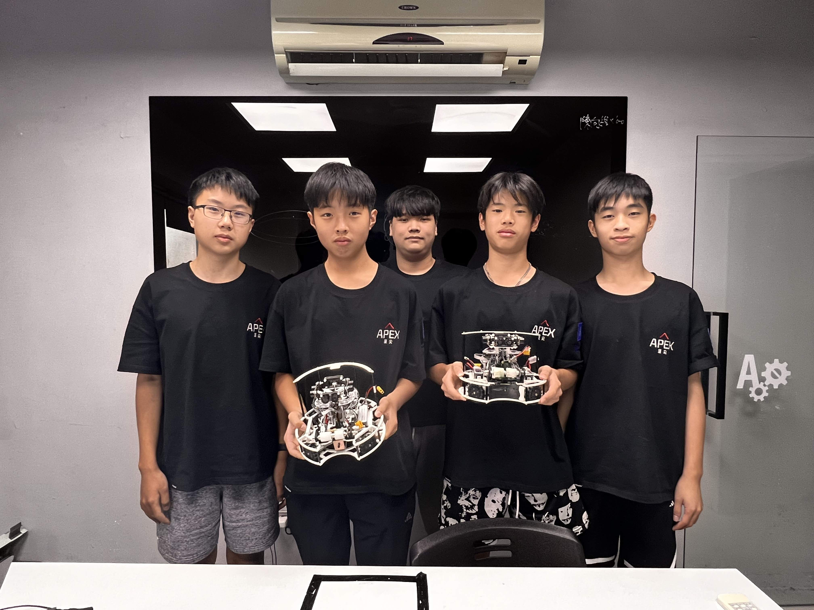

## Members & Roles

*What are the names of the team members and their role(s)?*

Abiel: Programming, Board design
Halston: Circuit and PCB design, Engineering 
Terry: Board design, Engineering, Circuit design
Ryder: Programming, Engineering

## Meeting Frequency

*How often did your team meet?
(e.g. 90 minutes once per week or a day every weekend.)*

Every weekend at least 4 hours(weekday if have time)

## Meeting Place

*Where did you meet to work on your robot?
(e.g. a robotics room at school, at some other place, one of your homes, school library etc.)*

No. 191, Section 3, Roosevelt Rd, Da’an District, Taipei City, 106

## Start Date

*When did your team start working on this year's robot?*

2025/3/30

## Past Competitions

*Which RoboCupJunior competitions have you competed in and in which leagues?*

RoboCup Japan Open 2025 (Nagoya)
RoboCup Taiwan 2025

## Mentor Contribution

*Which parts of your work received the most contribution from your mentor?*

Mental health support and technical guidance

## Workload Management

*How did you manage the workload?*

The team manages its workload by assigning daily tasks and dividing responsibilities based on each member’s capability. Meetings and discussions occur to ensure the team has efficient development and prevent ongoing setbacks.

## AI Tools

*Which AI tools did you use?*

The team collaborates with ChatGPT as a research assistance, because ChatGPT can recommend  suitable electronic parts in a few seconds and guide the team through complex programming bottlenecks.

## Robot1 Overall

*Robot 1 Overall View*

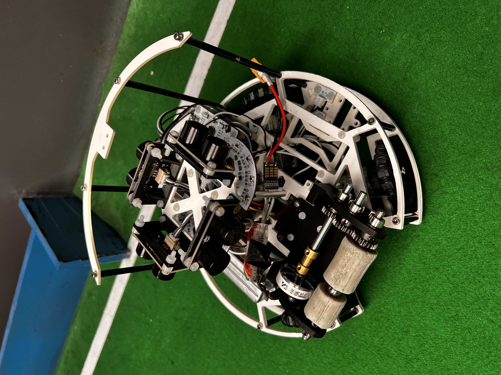

## Robot1 Front

*Robot 1 Front view*

## Robot1 Back

*Robot 1 Back view*

## Robot1 Top

*Robot 1 Top View*

## Robot1 Bottom

*Robot 1 Bottom View*

## Robot1 Right

*Robot 1 Right View*

## Robot1 Left

*Robot 1 Left View*

## Positioning & Movement

*How do you find your position inside the field and how do you use that position to move your robots around?*

The team incorporates ultrasonic sensors and light sensors, or light ray detector to position the robot inside the field. In order to let the robot identify its position, ultrasonic assist the robot to determine the distance between the field wall and itself. Moreover, light ray detectors detect the border line to prevent the robot from venturing outside the court.

## Robot2 Overall

*Robot 2 Overall View*

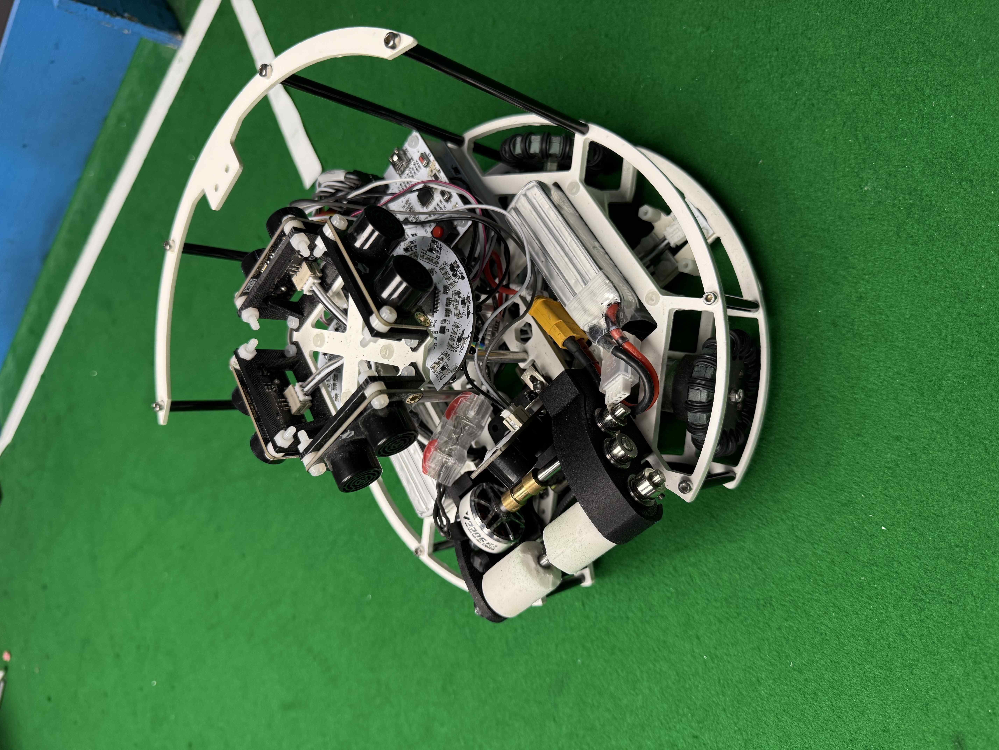

## Robot2 Front

*Robot 2 Front view*

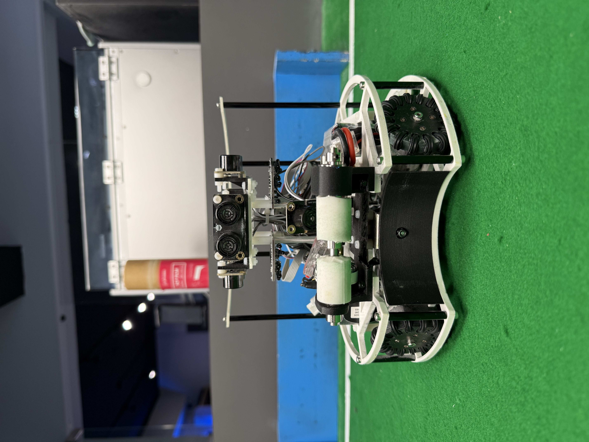

## Robot2 Back

*Robot 2 Back view*

## Robot2 Top

*Robot 2 Top View*

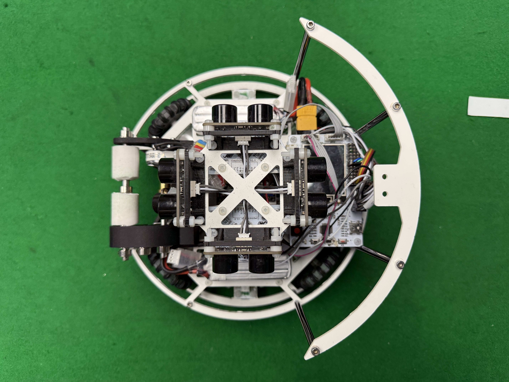

## Robot2 Bottom

*Robot 2 Bottom View*

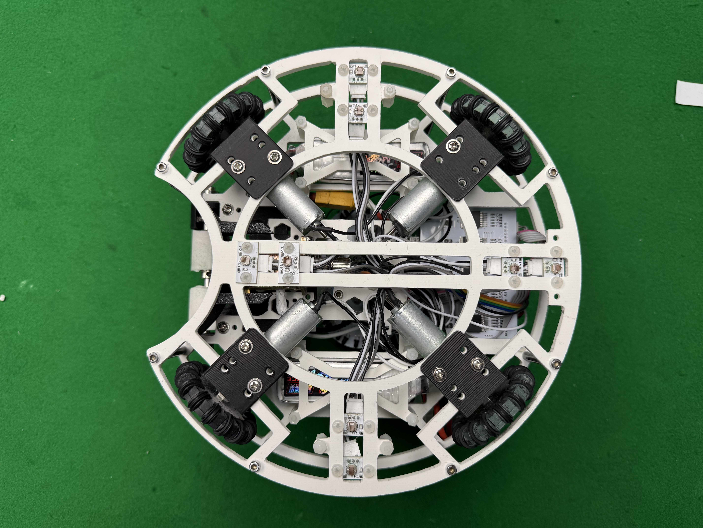

## Robot2 Right

*Robot 2 Right View*

## Robot2 Left

*Robot 2 Left View*

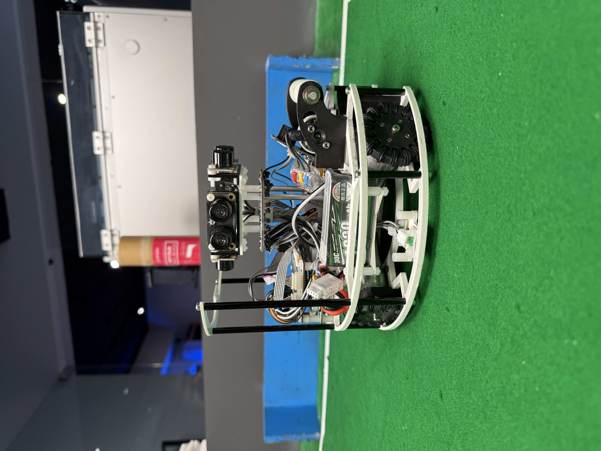

## Mechanical Design

*How did you design the mechanical parts of your robots?*

The team uses Fusion 360  to design the chassis and the layout of the robot. Fusion 360 is an online platform possessing powerful cloud-based CAD, CAM, and CAE by Autodesk. The team decided to use the following platform due to its high adaptability with complex mechanical parts, and the platform can simply convert the design into suitable manufacturing files. Moreover, the team decided to include both dribbler and kicker to our design and elevated the ultrasonic. Essentially, the team expects the robot to obtain high durability, mobility, and accuracy to express the best performance throughout the competition. The team wants high durability, so the robot can resist continuous impact from opponent robots, mobility to outrun the opponent, and outstanding accuracy to successfully shoot in goals from various angles. Eventually, the team started to create more one-piece molding equipment, like the holder for both kicker and dribbler, and more PCB for better organization to improve our overall design.

## Build Method

*How did you build your design?*

The team uses 5 motors, 1 solenoid, 4 ultrasonic, 8 light sensors(offense), 11 light sensors(defense), 2 IR receivers, 2 driver boards, and 1 processor. Specifically, 4 of the motors(IG220019) are used for locomotion and use V2306 V2 motor for the dribbler, while the solenoid serves as the kicker. Also ultrasonic sensors are utilized to measure the distance between the border and the robot. Additionally, using light sensors to avoid out of bound, while IR receivers are essential for ball tracking. Lastly, the driver boards and processor are both the core of the robot. Additionally, the team used JLC PCB to manufacture the driver board and mother board of the robot, since JLC PCB is one of the largest PCB manufactory and the collaboration with easyEda allows the user to customize their own PCB with decent quality, low-cost rapid prototype. For changes, the team utilized Infrared (IR) sensors instead of relying on multiple lines, as IR detection provided a more consistent and stable experiment result under various conditions, including lighting environment and surface materials. Therefore, the decision significantly reduced environmental variability, including changes in brightness or glare. This often affects the traditional line detection systems. By simplifying the input system, the team minimized potential sources of error, allowing more reliable navigation and easier debugging. Furthermore, it simplified the process of cable organization, provided efficiency to the team.

## Motors & Reason

*How many motors have you used and why?*

The team uses at a total 5 motors in each robot for basic moving and dribbling purposes. The team uses 4 IG220019 motors to operate basic moving for the robot, because the motor acquires fierce torque power, low voltage, and lightweight. Moreover the motors are manufactured in Taiwan, hence the motor also represents Taiwan’s strength in mechanical development. Furthermore, the team uses V2306 V2 motor for the dribbler, due to its powerful torque, lightweight, ability to do precise control, and minimal size. Additionally, the motor contains an optimized winding and magnet layout to prevent overheating. The team once attempted to design the wheels with silicon tubes and custom POM(polyoxymethylene) chassis to form a wheel with higher friction to gain more resistance against the impact from opponent robots.  Eventhough the wheels are not our own design, it is still optimal for the overall structure of the robot. By using an omnidirectional-wheel, it fits the design of the robot with four diagonally aligned motors for it to move smoothly on the x and y axis even if the wheel is not parallel to the direction it is moving.

## Kicker Design

*If your robot has a kicker, explain how you designed and built the mechanics of the kicker*

The team achieves accurate shooting by working with a kicker. Essentially, the kicker is developed around a solenoid-based mechanism, including a solenoid, relay, and processor’s signal. This combination lets the solenoid produce powerful strength for ejection. In particular, when the processor sends a signal to activate the relay. The relay serves as a high current switch to charge up the solenoid, so as the relay closes, the potential charges are released and create a strong magnetic field. The magnetic field accelerates the plunger inside the solenoid to make it move forward forcefully and strike the ball to its destination.

## Dribbler Design

*If your robot has a dribbler, explain how you designed and built the mechanics of the dribbler.*

Our robot's dribbler mechanism was carefully designed to optimize ball control and precision during gameplay. We used a compact, high-torque motor to drive the dribbler roller, ensuring consistent spin speed and reliable torque output. Additionally, the roller itself needs to be made from a high-friction material, allowing it to securely grip the ball without slipping during fast movements. The dribbler's chassis was built with lightweight and durable materials to minimize overall weight while maintaining structural integrity.

## CAD Files

*CAD design files*

## Mechanical Innovation

*Mechanical Innovation*

Out of all of our innovations and mechanical system, as a team we are most proud of our dribbler design. The measurements for the dribbler are extremely accurate, using all available space as declared in the rules, “Robots may weigh up to 1.4 kg, may have a ball-capturing zone of up to 3.0 cm” (Soccer League Committee 2025). Because of the careful measurement of the capture area, the ball can comfortably fit the semi-circle area with the dribbler perfectly lying on the surface of the ball, providing the most friction to push the ball towards the robot and secure it while following the rule. Other than the perfect measurement of the dribbler, there is one more aspect that makes this dribbler perfect. The whole dribbler is assembled on a piece of well designed holder, being assembled isolated from the main board of the robot, providing more efficient repairment and maintenance when any part is damaged.

## Mechanical Photos

*Photos of your mechanical designs highlights*

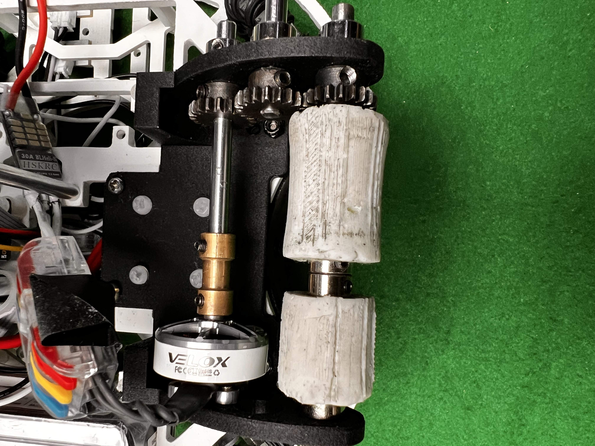

## Electronics Block Diagram

*Provide us with a block diagram of your robot's electronics*

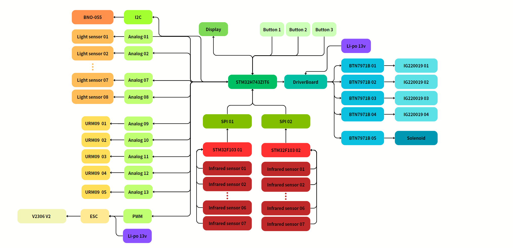

## Power Circuit

*How does your power circuits work?*

Our robot has a 12V battery pack that is regulated down to 5V using a buck converter to ensure a stable and safe power supply for our microcontroller. The 12V output is connected to the motor driver, which will control our 4 motors.

## Motor Drive Circuit

*How do you drive your motors? Explain the circuits you use for that*

The team uses 4 IG220019 motors to operate basic moving for the robot, while using V2306 V2 motor for the dribbler. Specifically, the team directly connects IG220019 to the driver board and uses 4 pin cable to connect to the processor. Moreover, the team connects the V2306 V2 motor to an ESC, which assists to manipulate the speed of the rotation. Then the ESC will be connected to the power and the processor.

## Microcontroller & Reason

*What kind of micro controller or board do you use for your robot? Why did you decide to use this part for your robot? If you have more than 1 processor, explain each one separately.*

We use the STM32H743ZIT6 microcontroller as the main processor of our robot. We decided to use this part for our robot for its high efficiency, capacity, and excellent performance for precise locomotion and can still retain stability when multitasking.

## Ball Detection

*How does your ball detection sensors and/or camera[s] work?*

Our robot uses infrared sensors to detect the IR light emitted by the IR ball. Then, by comparing the signal strength of multiple sensors, we can estimate the direction of the IR ball. Once the direction is determined, the microcontroller can use it to calculate the robot's movement.

## Line Detection

*How does your line detection circuits work?*

The team uses light sensors, which is a light sensor for line detection. Light sensors detect the light’s reflection ratio, which when the ratio is above a certain level. The sensor will transcript the ratio to the controller, preventing the robot from venturing out the court. All the light sensors will be connected directly to the processor’s analog pin.

## Navigation/Position Sensors

*What sensors do you use for navigation and how are these sensors connected to your processor? What sensors do you use to find your position in the field? What about the direction your robot faces?*

We use light sensors for border navigation and ultrasonic sensors for determining where the robot’s position is on the field. Both sensors use analog data transfer, using 3-pin Dupont line to transfer GND, 5V vcc to the sensor, and an analog signal to the processor motherboard. We can adjust the robot's positioning accordingly with the signals from the sensors. For example, with the use of light sensor, we first scan the white border line at multiple position and record the numbers, later we average the sensor reading to acquire the number when the light sensor is on the white border line, so when the robot is running on court, it can detect when the sensor touches the border and move at the opposite direction to prevent getting out of bounds.

## Kicker Circuit

*How do you drive your kicker system? How does the circuit make the kicker work?*

We utilized the solenoid kicker with a relay to perform kicking action. When the processor motherboard sends a high signal to the relay, it completes the circuit, allowing current to flow to the solenoid.. The solenoid then extends, delivering a quick and powerful kick to the ball. This system allows for precise timing and control over each kick.

## Dribbler Circuit

*How does your dribbler system work? What components and circuits did you use to drive it?*

The team connects the dribbler with the processor, as the processor sends a high signal to the dribbler’s motor, the motor will begin rotating. The rotated motor will connect with a rod with gears to deliver the kinetic energy to the silicon roll to perform dribbling.

## Schematics

*Schematics of your robot*

## PCB

*PCB of your robot*

## Innovation

*Innovations*

We are most proud of our customized motherboard, it is designed by the team to fulfill every type of signal the robot needs. With the use of the powerful chip STM32H743ZIT6, we can use keil uvision to program our robot efficiently and use all the available pin to connect to various sensors in order to ensure smooth robot movement on the court. Since the motherboard is designed by us, we are able to decide what function it should include to make our programming easier and robot stronger. For example, our motherboard includes EEPROM to store important information like the average light sensor reading on white border line, so instead of manually keying all the numbers into the program and load it into the robot, we can use the robot to directly scan the border lines to get all the numbers stored  and ready to be implemented into the algorithm. Although we are most proud of the motherboard, since it is designed by the team and not official technical companies, some small problems can still occur while running the program, like motherboard resetting or the lack of pins to connect to sensors. This could be a major problem for other teams, but for us, we can just change the design of the board, like changing the capacitor to be able to hold larger voltage or changing the chip to allow it to connect to more sensors, and this is why we have multiple generations of motherboard. With each times improvement, we are more proud of our newest design and our robot will become better and better.

## Circuit Photos

*Photo of your circuit boards highlights*

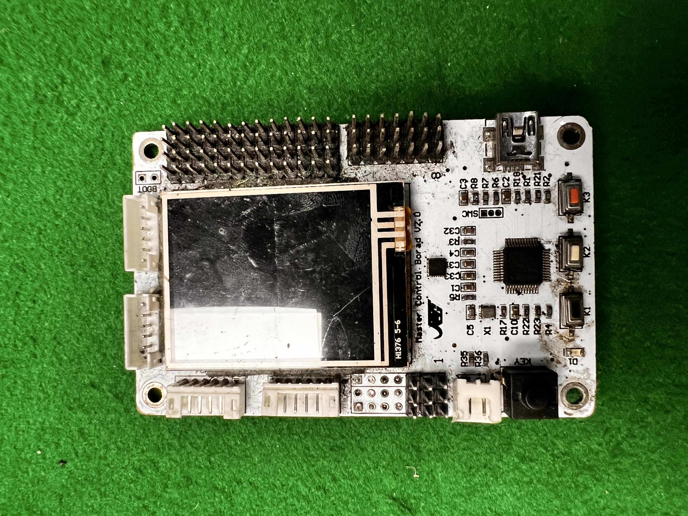
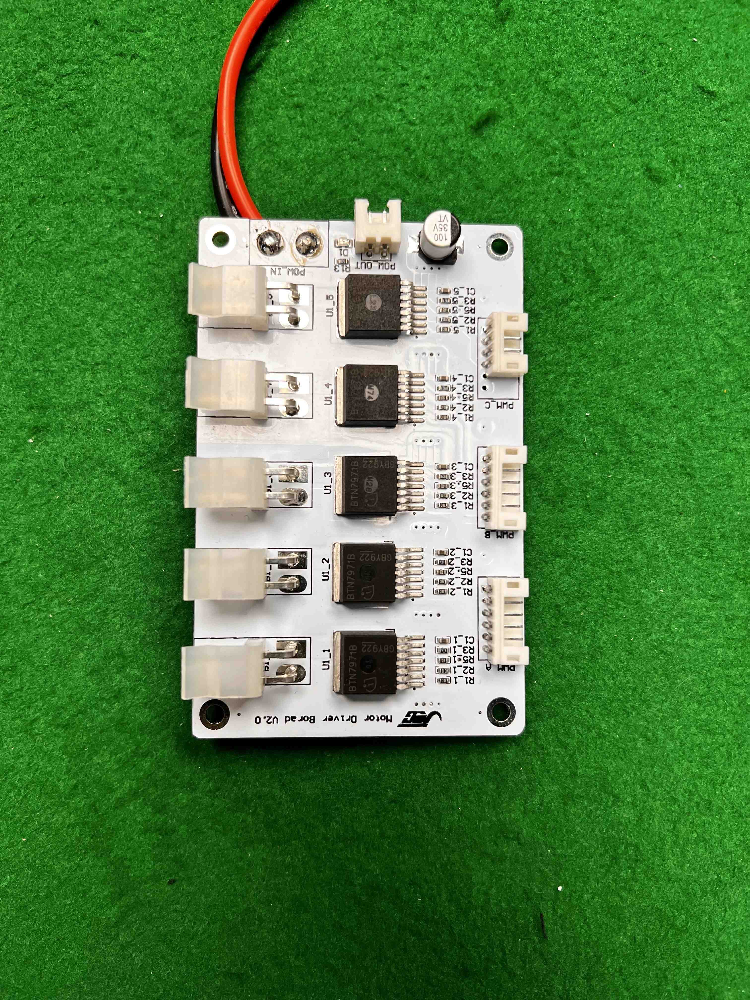

## Motor Control

*How do you use your processor to move your motors?*

The processor manipulates the motors steering direction and their speed through the driver board.

## Ball Detection Method

*How do you find where the ball is? How do you read the data from the ball detection sensors or camera?*

The robots use Infrared board (IR) to detect the ball, which plays an essential role. The ball itself will emit its signal, as a receiver the IR can easily detect the location of the ball. Which will be converted into signals to command the processor to operate commands.

## Ball Catch Algorithm

*How does your algorithm work to catch the ball? Is there a difference between your robots in how they move towards the ball? Explain the differences.*

The team uses different algorithms in both offense and defense robots. For instance, the offense robot uses Pythagorean theorem to find the nearest path to reach the ball and perfectly capture the ball into the dribbler. Additionally, the defense robot uses the degree of the ball to the robot to identify the ball’s location and maneuver to the degree where the ball cannot reach the goal in a straight line.

## Line Algorithm

*How does your robot find the lines to stay inside the field? What algorithms do you use to avoid going out of bounds?*

Our robot uses light sensors to detect the boundary lines of the field. The light sensor emits pulses and measures the reflections to create a detailed detect of the surroundings. The robot identifies the contrast between the playing field(Green) and the border lines(white). These readings are processed in real time to determine the robot position relative to the edges. If it gets close to the boundaries, the system automatically adjusts its path to maintain its safety inside the field.

## Goal Algorithm

*What algorithms do you use to score goals? How do you use your kicker and dribbler to handle the ball?*

For offense side, the robots detect the ball’s position using onboard sensors and strategically find the shortest path to reach the ball at full speed. After the robot reaches the ball, the dribbler will be activated and grasp the ball into the kicker. Eventually the processor will command the kicker to launch the ball into the opponent’s goal with high efficiency. Although the strategy might be simple and straightforward, the team believes the offense side should require high mobility, strength, and accuracy. Furthermore, the team developed a spin kick, which may trick the opponent’s defense algorithm and successfully score in an unexpected angle.

## Defense Algorithm

*What algorithms do you use to avoid the opponent team scoring? How do your robots defend your own goal?*

For defending, the robots detect the ball’s position using onboard sensors and strategically move to the ball. They constantly monitor the ball to prevent it from crossing the field’s white line, effectively maintaining control. By adjusting their position, the robots block opponents and reduce scoring opportunities, showing quick response times during defensive conditions.

## Robot Communication

*Do your robots communicate with each other? How do you use this communication to your advantage?*

The robots don’t technically communicate with each other, however by serving their own role in the game, the robots can ensure consistency of scoring and preventing opponents from scoring.

## Innovation2

*Innovations*

Spin kick, side kick, and corner kick are the part that we are most proud of. Based on previous competitions of Robocup lightweight we attended, most of the time our robot is stuck with opponent robot at the corner. Although our motor and chase ball algorithm is better than the opponent, the powerful motor will push the opponent robot to the corner, leading to lack of progress or out of bounds, which is not an effective strategy. By implementing spin kick, side kick, and corner kick in to our algorithm, we are now able to score from corners with ease and also accordingly to the situation. When our robot is at the corner alone with the ball, it will preform a corner kick, which the robot will turn towards the goal and shoot at a well calculated angle. The whole action will be preformed under 5 seconds, leaving short reaction time for opponent defense robot and with the precise shooting angle, it can bypass the opponent's defense system and score. If our robot is at the corner but enable to preform a side kick to score, the side kick action will be skipped and the robot will preform a spin kick. A spin kick is done by spinning the ball in extreme speed and kicking the ball in a tilted angle looking at the opposite side of the target goal, because of the speed the ball is spinning towards the robot and the target goal, after it is kicked out, the ball will roll back against the shooting trajectory, creating a curved path for the ball to roll towards the goal. The robot will preform a spin kick when it is stuck with opponent robot or the defense robot is directing blocking the path for side kick, the curved path done by spin kick will go around both robot and score effectively. With these two strategies, our robot will have more chances to score and hopefully win us the game.

## GitHub Link

*GitHub link*

## BOM

*Bill of Materials (BOM)*

[https://drive.google.com/open?id=1Fnj2HgHgjIftVR5B3s-hHQrhGuegatCx](https://drive.google.com/open?id=1Fnj2HgHgjIftVR5B3s-hHQrhGuegatCx)

## Cost

*How much did it cost you to build your robots?*

Robots: 98198.36 NTD
Experiments: 56280.78 NTD
Environment: 250000 NTD(already use 6 years)
1 NTD = 0.034 USD

## Funding

*How did you gathered the funds to build the robots?*

100% parents

## Affordability

*How affordable was it to compete in RoboCupJunior Soccer?*

5

## Answer Check

*Have you checked all of your answers?*

Yes!

## Publication Consent

*We publish TDPs and posters during or after the competition as described in the beginning*

Yes, we acknowledge everything submitted in the above form can be published.

## Email Address

*Email Address*

halstonchen1119@gmail.com

## TDP File

*TDP File Upload (Not required)*

## Extra Column

*Column 67*

