## Timestamp

*Timestamp*

7/18/2025 13:43:46

## Team Name

*What is your team's name?*

Crestwood Lions

## League

*What league do you participate in?*

Lightweight League

## Country

*Where are you from?*

Toronto, Canada

## Contact

*If other teams have questions about your robot, now or in the future, what email address(es) can we publish along with this document for people to reach you?

(You can put in multiple email addresses, like multiple team members, an email for the whole team or both. Feel free to share other ways of communication like Discord handles)*

noahkassam@gmail.com, markussondan@gmail.com

## Social Media

*Team Social Media Links (if you have any)*

@robocup.cpc

## Team Photo

*Upload a photo of your whole team with your mentor and robots

Note: This is not mandatory and will be published along with your TDP if you choose to upload something*

## Members & Roles

*What are the names of the team members and their role(s)?*

From Left To Right: Kyle Andersen (Software), Kai Czylyski (Media), Hayden Patience (Hardware), Daniel Markusson (Software), Liam Stern (Media), Noah Kassam (Media), Jacky Zhang (Software)

## Meeting Frequency

*How often did your team meet?
(e.g. 90 minutes once per week or a day every weekend.)*

We met twice a week normally during the school year, however when we got closer to tournaments our workload ramped up to 3-4 times a week in order to enhance our chances at performing well and fix any small last minute errors.

## Meeting Place

*Where did you meet to work on your robot?
(e.g. a robotics room at school, at some other place, one of your homes, school library etc.)*

We were lucky enough to be provided with the entire back half of a classroom which we could dedicate to our robot, the components and tools we needed, as well as creating a solid replica of the field we play on during competitions to allow us to more easily test our robots.

## Start Date

*When did your team start working on this year's robot?*

We Started working on this years robot in August 2024.

## Past Competitions

*Which RoboCupJunior competitions have you competed in and in which leagues?*

Over the course of our 3 years competing in RoboCup Junior, we have competed in 3 main tournaments. The first Lightweight RoboCup Junior tournament we competed in all 3 of these years was at St Andrew’s College, which is another private school near Toronto. The second major competition that we have participated in was our regional Lightweight RoboCup Junior competition that we also competed in all 3 years, which was located in Montreal, Quebec. The final Lightweight RoboCup Junior competition that we have competed in was the international competitions, both in the 2022-23 school year in Bordeaux, France, as well as this current 2024-25 school year where we are competing in Salvador Brazil.

## Mentor Contribution

*Which parts of your work received the most contribution from your mentor?*

When Daniel and Hayden first started working on the robots back in 2022, their mentor was their computer engineering teacher who helped teach them the ropes of building a robot like this through their school projects. He was instrumental in their journey to Bordeaux, France, as Daniel and Hayden had never built a robot before. However, in the next school year when the advanced robotics club was set to start, he left the school for another opportunity, leaving the team that had expanded to 8 members without a mentor to lead them. Then for the next few years, our mentors made very minimal contributions to our robot, and it was almost all designed and coded by our roster. This made the process more difficult than when the team had the computer engineering teacher, however it became an extremely valuable learning experience as we learned how to work as a team, stay on task, and solve problems ourselves.

## Workload Management

*How did you manage the workload?*

When it comes to managing the workload of running a club, mentoring and teaching younger students, as well as staying on top of school work, it is certainly a tall task. However, the first way that we managed this workload is through delegating members to either being a member of software, hardware or media. This would ensure that instead of people being ok at a bunch of different aspects of the robot, they were  mastering and focusing in on one area of the robot. We also ensured that within those subcategories, we assigned certain algorithms or hardware components to different members to ensure that we were the most time efficient.

## AI Tools

*Which AI tools did you use?*

When it comes to the utilization of AI tools, the only AI tool that we used in the construction of our  project was ChatGPT. When it comes to the media aspect, the main area where ChatGPT was used was in the process of condensing information and cutting out unnecessary information. When we were trying to shorten the wording of sentences and paragraphs to put on the poster and slideshow, ChatGPT was a very helpful tool in telling us what it believed was unnecessary information and then we made changes accordingly.

## Robot1 Overall

*Robot 1 Overall View*

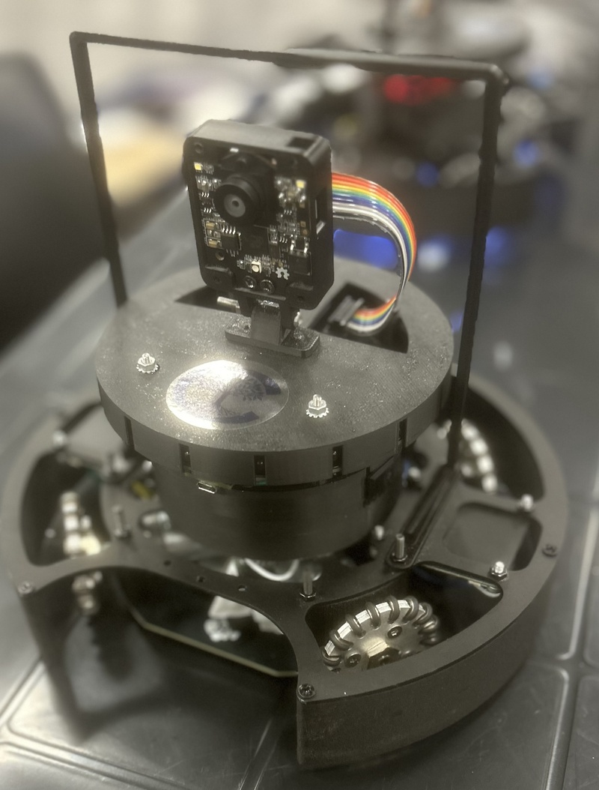

## Robot1 Front

*Robot 1 Front view*

## Robot1 Back

*Robot 1 Back view*

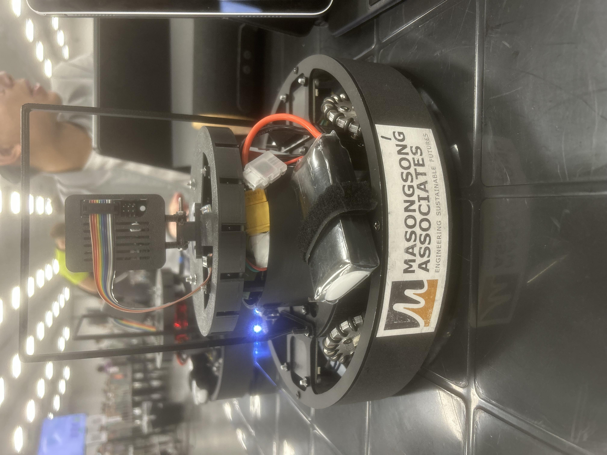

## Robot1 Top

*Robot 1 Top View*

## Robot1 Bottom

*Robot 1 Bottom View*

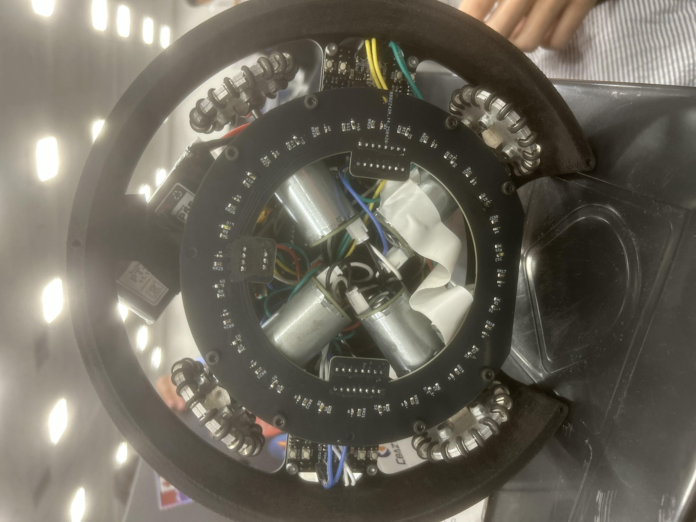

## Robot1 Right

*Robot 1 Right View*

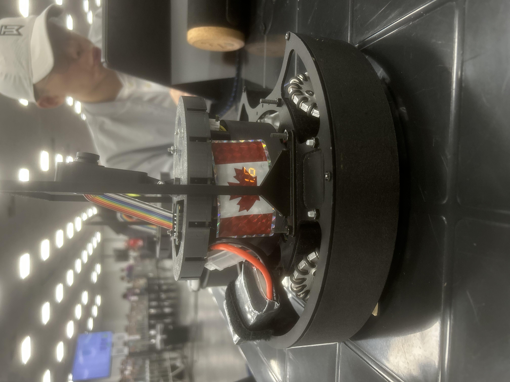

## Robot1 Left

*Robot 1 Left View*

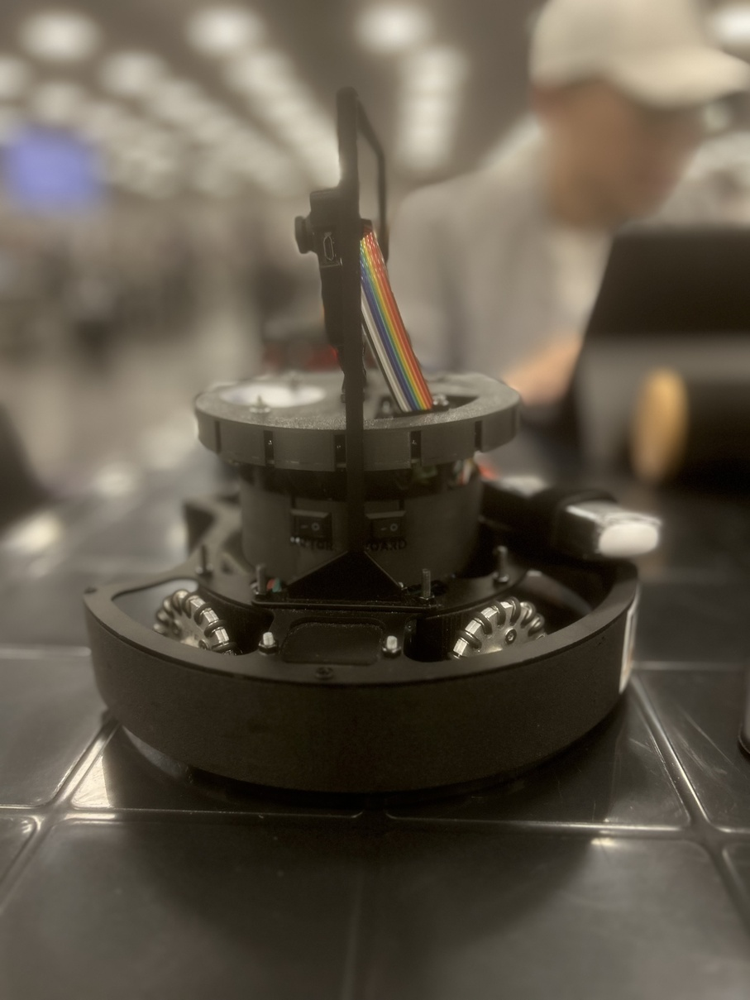

## Positioning & Movement

*How do you find your position inside the field and how do you use that position to move your robots around?*

We use two sensors to know where we are and what direction we need to face: our Pixy 2.1 (camera) and BNO055 (gyroscope). Using simple trigonometry based on the size of the net, we are able to not only know the angle at which we need to rotate to face the opponent’s goal, but also see how far away we are from the net, giving us insight into our needed speed. The gyroscope is used as a fallback, during times when we cannot see the opponents—like when we are rotated 180 deg, for example.

## Robot2 Overall

*Robot 2 Overall View*

## Robot2 Front

*Robot 2 Front view*

## Robot2 Back

*Robot 2 Back view*

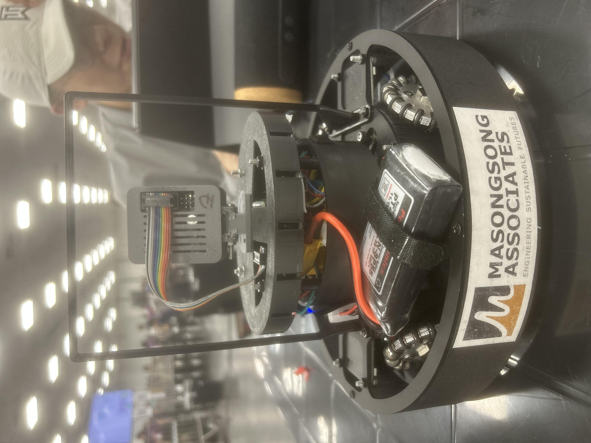

## Robot2 Top

*Robot 2 Top View*

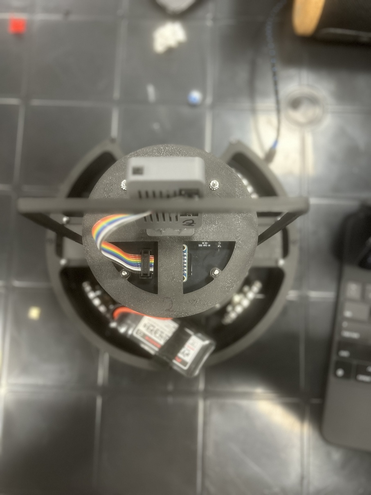

## Robot2 Bottom

*Robot 2 Bottom View*

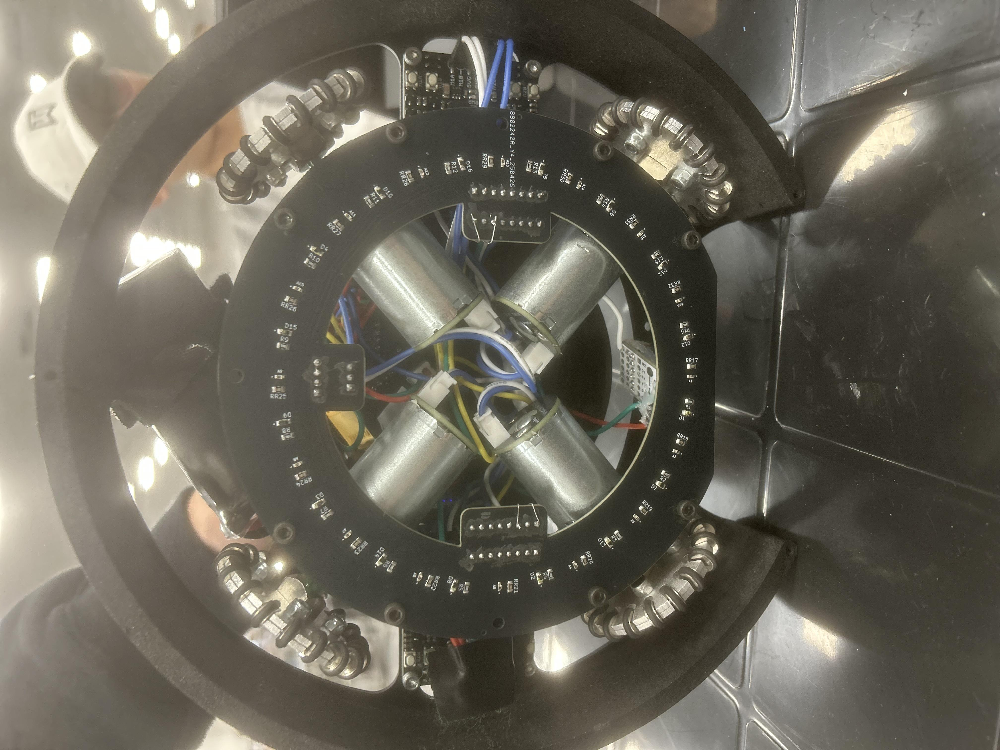

## Robot2 Right

*Robot 2 Right View*

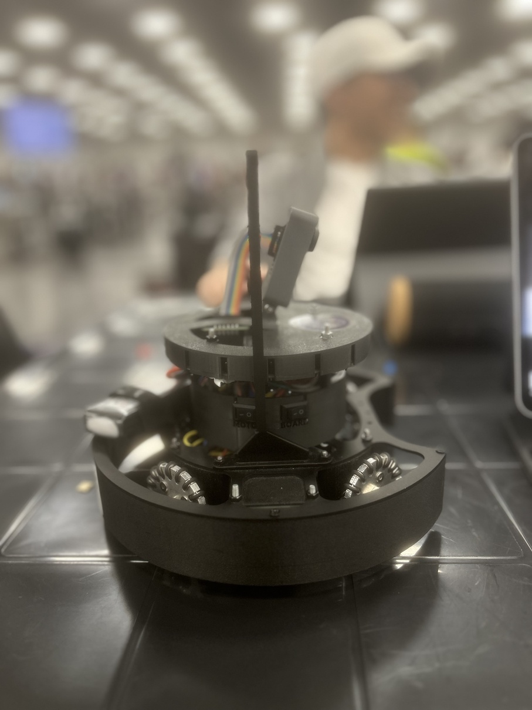

## Robot2 Left

*Robot 2 Left View*

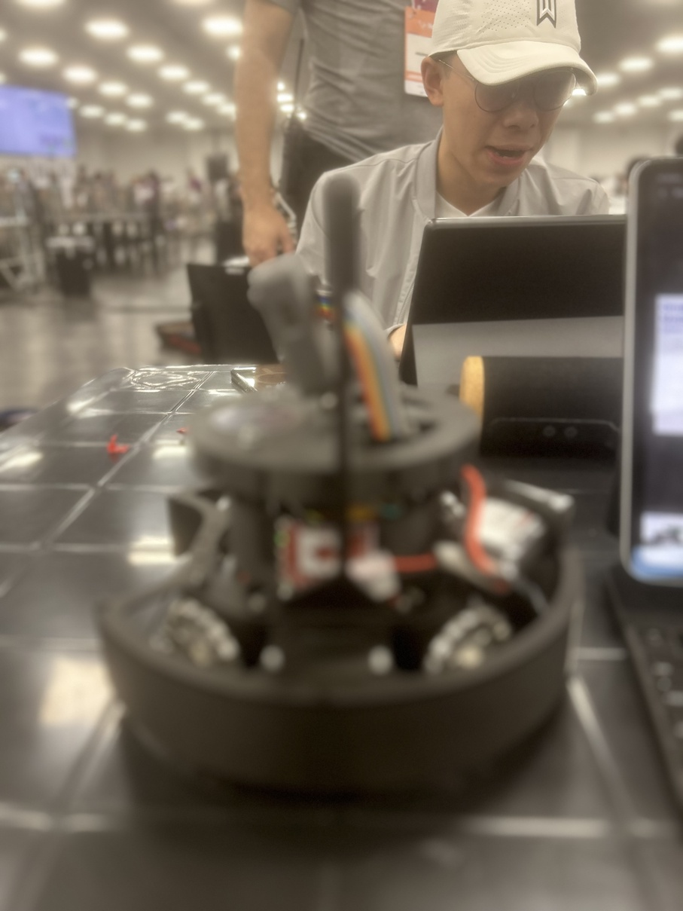

## Mechanical Design

*How did you design the mechanical parts of your robots?*

While our robot was designed for soccer, it shares design inspiration with robots like Ziggo, a well-known BattleBot. Ziggo’s circular frame was used to protect internal components and wheels during high-impact combat. Similarly, our circular design offers structural protection, keeping the omni wheels safely enclosed within the frame. However, while Ziggo uses a differential drive to spin and attack, our robot uses omni wheels for smooth, multi-directional movement—better suited for agile, precise control on the field.
We selected our components based on performance, reliability, and suitability for competitive robotic soccer. ALS-PT19 ambient light sensors were used for boundary detection due to their fast response and ability to detect brightness differences on the field. For ball tracking, we used 16 infrared sensors tuned to 38 kHz, which can reliably detect the modulated IR signal emitted by the ball. A Pixy 2.1 smart camera was added to provide real-time vision for goal detection, complementing the IR system. At the heart of the robot is a Teensy 4.1 microcontroller, chosen for its high processing speed and multiple I/O ports, BNO055 for accurate direction readings, along with MCP3008 ADCs to handle the analog light sensor inputs.Many of the components were chosen because they are widely used and trusted by most teams, making them a proven standard in robocup lightweight soccer.

## Build Method

*How did you build your design?*

Our robot features a circular chassis with a front cutout, a layout chosen to improve movement, protection, and sensor integration—key factors for success in fast-paced robotic soccer. The circular frame allows us to maximize internal space and fully enclose the wheels, protecting the drive system from collisions and impacts during gameplay. This shape also improves overall durability and makes the robot easier to maneuver, especially with an omni-directional drive system. The cutout at the front gives the robot better access to the ball. A vertical frame holds the Pixy 2.1 vision camera at a higher position, allowing the robot to detect goals and field objects clearly. This visual input supports more accurate offensive plays when combined with the IR ball-tracking system.

## Motors & Reason

*How many motors have you used and why?*

We used 8 motors because we found that it had the best balance between high speed while also having high control.

## Kicker Design

*If your robot has a kicker, explain how you designed and built the mechanics of the kicker*

## Dribbler Design

*If your robot has a dribbler, explain how you designed and built the mechanics of the dribbler.*

## CAD Files

*CAD design files*

https://cad.onshape.com/documents/ce2816c27266bdc816e29d39/w/327935e8ca26093c69276721/e/78f97841209d7d1f2fb6a9fd?explodedView=MtexPOjKLwpWeQlcq&renderMode=0&uiState=6869e9cce8839440d4d8ad9d

## Mechanical Innovation

*Mechanical Innovation*

A mechanical system that we were very proud of was the custom made structure of the Robot. Hayden and his hardware team custom built both an aluminum base plate and carbon fibre reinforced nylon shield, which both were integral structural components to our robot. The aluminum plate was crucial to the functionality of our robot as it allowed many different major subsystems to be mounted onto it, as well as staying lightweight and strong to ensure it didn’t fall apart. Then, the custom built carbon fibre nylon reinforced shield was also an instrumental part of our success, as it was able to absorb the kinetic energy that was generated through the collisions during the game and still stay strong to protect our internal electronics.

## Mechanical Photos

*Photos of your mechanical designs highlights*

## Electronics Block Diagram

*Provide us with a block diagram of your robot's electronics*

## Power Circuit

*How does your power circuits work?*

Our power circuit begins at the battery just like every robot. The robot goes through the voltmeter and then it goes to a set of dual independent switches.  One of these switches leads to a DC DC Buck Converter, and the other leads to the motor drivers. That buck converter is used in order to turn the voltage from 12V down to 5V, because all of our components that we use except for the teensy use 5V instead of 12V. For the teensy that utilizes only 3V, we have a series of resistors that are able to lower the voltage. Finally, we have a JST acting as a power bus that is used to plug in all boards to the power.

## Motor Drive Circuit

*How do you drive your motors? Explain the circuits you use for that*

When it comes to driving our motors, our methodology of driving our motors is a bit unconventional due to our wheels not being exactly 90 degrees from each other. Due to this fact, our software team determined that we needed to use some simple trigonometry in order to calculate the amount of power that we put into the motors. We do some simple linear algebra to calculate the one-dimensional vector of each wheel using the two-dimensional movement vector of the robot. This allows our robot to move in any arbitrary angle, helping us catch the ball and put it into the opponent’s net.

## Microcontroller & Reason

*What kind of micro controller or board do you use for your robot? Why did you decide to use this part for your robot? If you have more than 1 processor, explain each one separately.*

On both of our robots we decided to use a Teensy 4.1 as our microcontroller.  We used the Teensy 4.1 because it has high speed, a very large memory capacity, a large amount of GPIO pins and a small form factory.

## Ball Detection

*How does your ball detection sensors and/or camera[s] work?*

On our top board, we have 16 IR sensors distributed equally in a circle. To find the ball, we calculate the midpoint between all IR sensors that detect the ball, and use that midpoint to calculate the angle where the ball is relative to our robot. The camera finds the goal and gives us the width and height of the frame that detects the goal. Using the change in width and height of the frame, we can determine how close or how far the goal is relative to our robot. The location of the center of that frame tells us where we want the robot to point at all times.

## Line Detection

*How does your line detection circuits work?*

Our line detection circuit begins with an ambient light sensor which are connected through voltage dividers to read the light that is reflected from the field. In order to increase the amount of contrast there is between the white and green colours on the field, we have an LED ring made up of 16 LEDs to provide light underneath the robot. These analog signals are then sent to our MCP3008 ADCs, which convert them and allow SPI communication with the teensy.

## Navigation/Position Sensors

*What sensors do you use for navigation and how are these sensors connected to your processor? What sensors do you use to find your position in the field? What about the direction your robot faces?*

When it comes to navigating the field, the three main ways we navigate are through our camera, our IR receivers, and our compass which are all connected back to connectors on our main PCB. When it comes to the camera, we are able to figure out where we are located on the field by looking at the size of the goal we are attacking relative to us. Then we can use basic trig in order to determine where we are located on the field. Secondly, we are able to use our TSSP4038 IR Receivers in order to find out where the ball is, which will allow us to attack and move towards the ball accordingly. Finally, we use our compass to find the orientation of the robot when we are unable to use our camera.

We use two sensors to know where we are and what direction we need to face: our Pixy 2.1 (camera) and BNO055 (gyroscope). Using simple trigonometry based on the size of the net, we are able to not only know the angle at which we need to rotate to face the opponent’s goal, but also see how far away we are from the net, giving us insight into our needed speed. The gyroscope is used as a fallback, during times when we cannot see the opponents—like when we are rotated 180 deg, for example.

## Kicker Circuit

*How do you drive your kicker system? How does the circuit make the kicker work?*

N/A

## Dribbler Circuit

*How does your dribbler system work? What components and circuits did you use to drive it?*

N/A

## Schematics

*Schematics of your robot*

## PCB

*PCB of your robot*

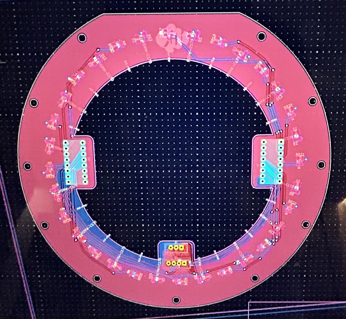

## Innovation

*Innovations*

We believe that the part of the Robot’s Electronic System that we are most proud of is definetly our colour sensor that was utilized for the boundary detection system. When it comes to the components of our robot, the colour sensor was always kind of the problem child for our robot. Hayden and our hardware team spent 100+ hours working and working on that colour sensor over the course of this past year and a half, as it would constantly have bugs and errors. Then once it finally worked correctly and was able to be implemented perfectly, it was the most satisfying feeling and made us all very proud.

## Circuit Photos

*Photo of your circuit boards highlights*

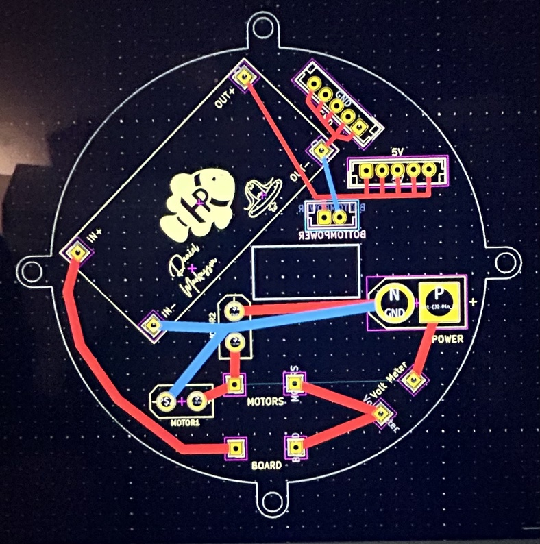

## Motor Control

*How do you use your processor to move your motors?*

We use two MDD38 motor drivers to control the speed—using PWM—and direction—by inverting motor poles. Then, we are able to combine data from all our sensors and determine what direction we need to go and where to face. For example, if we read that the ball is at a 45 deg angle from the robot, we first check if we are out of bounds, if so, that trumps everything and we need to get back in bounds by going in the opposite direction of the white line; then we check if we aren’t facing the net if so, we add a rotation force to the motion vector of the robot. Finally, after doing all of these preliminary checks, we are able to move the robot in the direction of the ball.

## Ball Detection Method

*How do you find where the ball is? How do you read the data from the ball detection sensors or camera?*

We use an array of TSSP4038 IR sensors to detect where the ball is. From these readings, we take the midpoint of all the activated IR sensors in order to calculate an angle and locate where the ball is relative to our robot.

## Ball Catch Algorithm

*How does your algorithm work to catch the ball? Is there a difference between your robots in how they move towards the ball? Explain the differences.*

There are a couple of cases pertaining to where the ball is. First, if the ball is in front of us, we simply go grab it. Second is if the ball is directly to the left or right of the robot, we need to add a small amount of backwards movement to the robot so it can successfully catch the ball and not just nudge it into the wall. Finally, if the ball is behind us, we need to perform a U-turn-style manuver in order to catch the ball within our zone.

## Line Algorithm

*How does your robot find the lines to stay inside the field? What algorithms do you use to avoid going out of bounds?*

Our robot’s boundary detection mechanism is built around a ring of 16 ambient light sensors—clones of the ALS-PT19 phototransistor—paired with 16 surface-mounted white LEDs. Each sensor detects reflected white light intensity from the playing surface directly beneath it. Since boundary lines are typically brighter than the surrounding field (e.g., white lines on a green surface), this differential in light allows the robot to determine when it crosses out of bounds. We are then able to use our colour sensor along with this contrast in the lights that is detected by our ambient light sensors to tell when our robot hits a white line, and then we can make it stop before it goes out of bounds.

## Goal Algorithm

*What algorithms do you use to score goals? How do you use your kicker and dribbler to handle the ball?*

_

## Defense Algorithm

*What algorithms do you use to avoid the opponent team scoring? How do your robots defend your own goal?*

Our robots do not have a defensive algorithm. We use the same ball catching algorithm, which performs well as a defense.

## Robot Communication

*Do your robots communicate with each other? How do you use this communication to your advantage?*

## Innovation2

*Innovations*

The part of the code that I think we are the most proud of is the fact that our robot can move in any arbitrary  direction. This makes us the most proud because we had just learned about how we can perform these functions in calculus class. Most of the time when you are at school, you hear people say “well when will we ever need this in the real world,” or “this won’t ever help me in anything other than school.” However, learning calculus concepts in class and then successfully applying them to the coding of our robot was something that we were all very proud of.

## GitHub Link

*GitHub link*

https://github.com/Dmarky9873/RoboCup-Junior-2025

## BOM

*Bill of Materials (BOM)*

[https://drive.google.com/open?id=1mNhX5cpUQ2MmViXgeHQyydBJz-KsIvg1](https://drive.google.com/open?id=1mNhX5cpUQ2MmViXgeHQyydBJz-KsIvg1)

## Cost

*How much did it cost you to build your robots?*

Total Robot Cost Over 3 Years: $8,171.68
Final Components in Robot: $1,071.68
Money Spent during Trial And Error: Approximately $6,500
Cost of Tools/Environment Used To Build Robot:  $600

## Funding

*How did you gathered the funds to build the robots?*

How Did You Gather Funds to Build Robots:
25% Sponsors
60% School
15% Parents

## Affordability

*How affordable was it to compete in RoboCupJunior Soccer?*

7

## Answer Check

*Have you checked all of your answers?*

Yes!

## Publication Consent

*We publish TDPs and posters during or after the competition as described in the beginning*

Yes, we acknowledge everything submitted in the above form can be published.

## Email Address

*Email Address*

noahkassam@gmail.com

## TDP File

*TDP File Upload (Not required)*

[https://drive.google.com/open?id=1DlJjJilbLdYLnUg3b121DCm3fQoU_24i](https://drive.google.com/open?id=1DlJjJilbLdYLnUg3b121DCm3fQoU_24i)

## Extra Column

*Column 67*

