## Timestamp

*Timestamp*

7/12/2025 2:41:52

## Team Name

*What is your team's name?*

EMM-Soccer

## League

*What league do you participate in?*

Open League

## Country

*Where are you from?*

Macau China

## Contact

*If other teams have questions about your robot, now or in the future, what email address(es) can we publish along with this document for people to reach you?

(You can put in multiple email addresses, like multiple team members, an email for the whole team or both. Feel free to share other ways of communication like Discord handles)*

lipeihua28@gmail.com

## Social Media

*Team Social Media Links (if you have any)*

Youtube :
https://youtube.com/@emm-soccer?si=GBicoOLAiv58Jqp0

Bilibili (China):
https://b23.tv/xCx6kpP

## Team Photo

*Upload a photo of your whole team with your mentor and robots

Note: This is not mandatory and will be published along with your TDP if you choose to upload something*

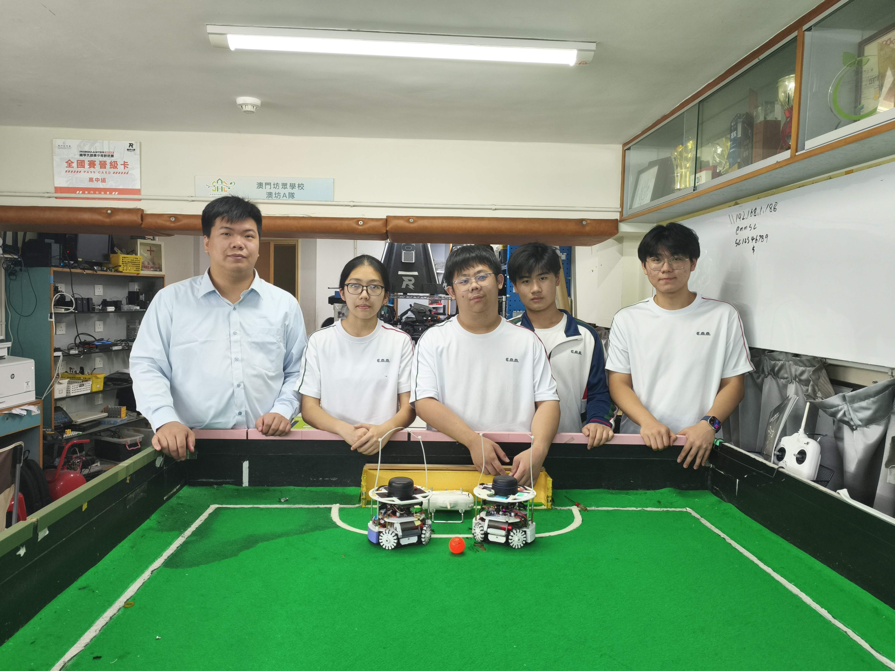

## Members & Roles

*What are the names of the team members and their role(s)?*

LEI PUI WA:Programming/Hardware
YE CHON KIT:Programming
SIT YONG:Hardware/Eletricity
LAU SING:Circuit and PCB design

## Meeting Frequency

*How often did your team meet?
(e.g. 90 minutes once per week or a day every weekend.)*

Our team holds meetings once a week to once every two weeks, each lasting about an hour. For competition preparation, we train during the free time on school days and holidays.

## Meeting Place

*Where did you meet to work on your robot?
(e.g. a robotics room at school, at some other place, one of your homes, school library etc.)*

In the school's robotics room. It's actually an attic in our school.

## Start Date

*When did your team start working on this year's robot?*

We started the R & D around August last summer vacation. By October, it could basically be put into formal use. In mid - April this year, we developed the second - generation robot, and we replaced the camera.

## Past Competitions

*Which RoboCupJunior competitions have you competed in and in which leagues?*

The following data commence from the current team members and do not include those of previous senior members:

China Open 2023: Lightweight League 
RoboCup2023-France: Lightweight League

China Open 2024: Open League 
RoboCup2024-Holland: Open League

JapanOpen 2025: Open League
China Open 2025: Open League

## Mentor Contribution

*Which parts of your work received the most contribution from your mentor?*

We decided to use radar for positioning. So we first tested whether we could successfully obtain radar data with the controller. However, we encountered a problem when reading radar data from the ESP32. The code seemed correct, but we couldn't find the issue for a long time. Later, our tutor finally helped us identify the problem and successfully read the radar data from the ESP32, which was a very important step for our robot.

## Workload Management

*How did you manage the workload?*

For daily communication, we mainly use WeChat and WeChat groups. WeCom is our primary tool for task assignment and work management, although most of our work arrangements are made through in - person meetings. Program codes, design drawings, and other materials are shared via the internal network drive of our school's interest class.

## AI Tools

*Which AI tools did you use?*

Artificial intelligence tools played a vital role in all aspects of our project. I used Doubao (China)'s AI voice recognition function when creating poster content for the competition, sharing copywriting, and writing development logs. Just speak my thoughts, and it can accurately and on-topic transcribe my words into text, providing me with a convenient and efficient way to record and organize my thoughts.

## Robot1 Overall

*Robot 1 Overall View*

## Robot1 Front

*Robot 1 Front view*

## Robot1 Back

*Robot 1 Back view*

## Robot1 Top

*Robot 1 Top View*

## Robot1 Bottom

*Robot 1 Bottom View*

## Robot1 Right

*Robot 1 Right View*

## Robot1 Left

*Robot 1 Left View*

## Positioning & Movement

*How do you find your position inside the field and how do you use that position to move your robots around?*

Model: RPLIDAR A2M6

These coordinates have a wide range of applications, include:

1.Out of bonds
Purpose: Get as close to the ball as possible when it is outside the white line (perhaps get the ball)
Since our robot is not equipped with a line sensor, we rely entirely on LiDAR data to prevent the robot from going out of bounds.

2. Reset when there is no ball
Purpose: Get the best view when the ball disappears

For reset when there is no ball, we set a target reset point (such as the center of the court). Then, through trigonometric calculations, we determine the angle and distance between the robot and the target point so that the robot can accurately reset to the target point.

3. Get the ball to attack

The functions listed above will be elaborated on in the relevant questions below.

## Robot2 Overall

*Robot 2 Overall View*

## Robot2 Front

*Robot 2 Front view*

## Robot2 Back

*Robot 2 Back view*

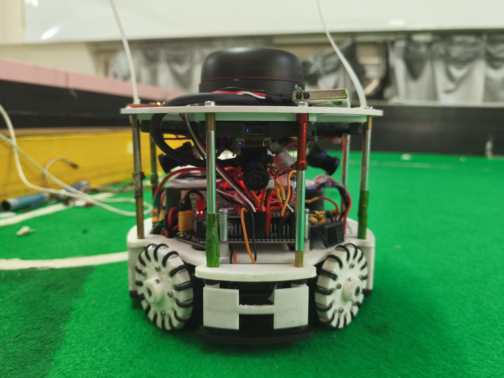

## Robot2 Top

*Robot 2 Top View*

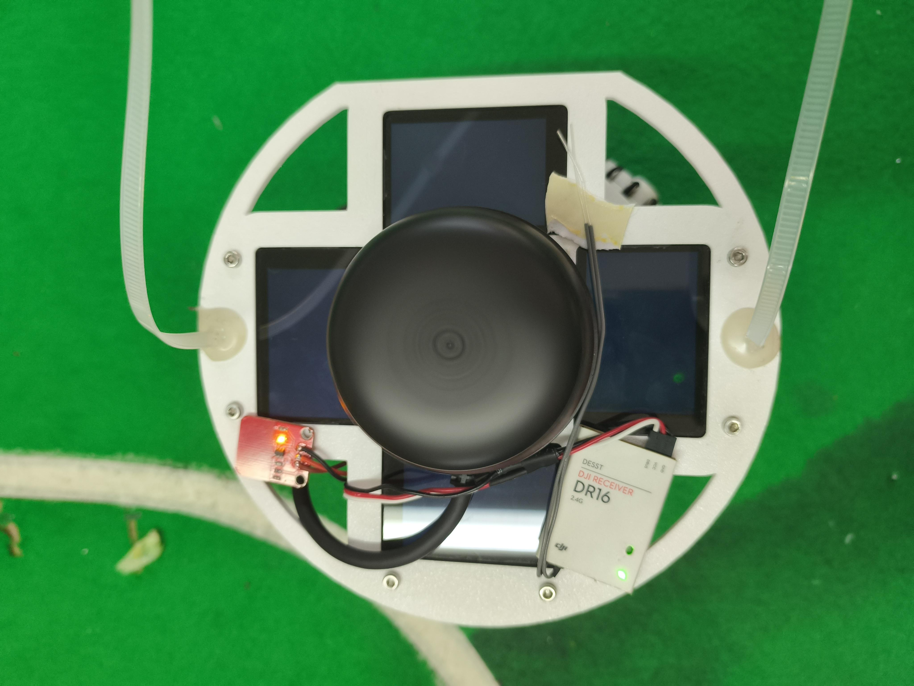

## Robot2 Bottom

*Robot 2 Bottom View*

## Robot2 Right

*Robot 2 Right View*

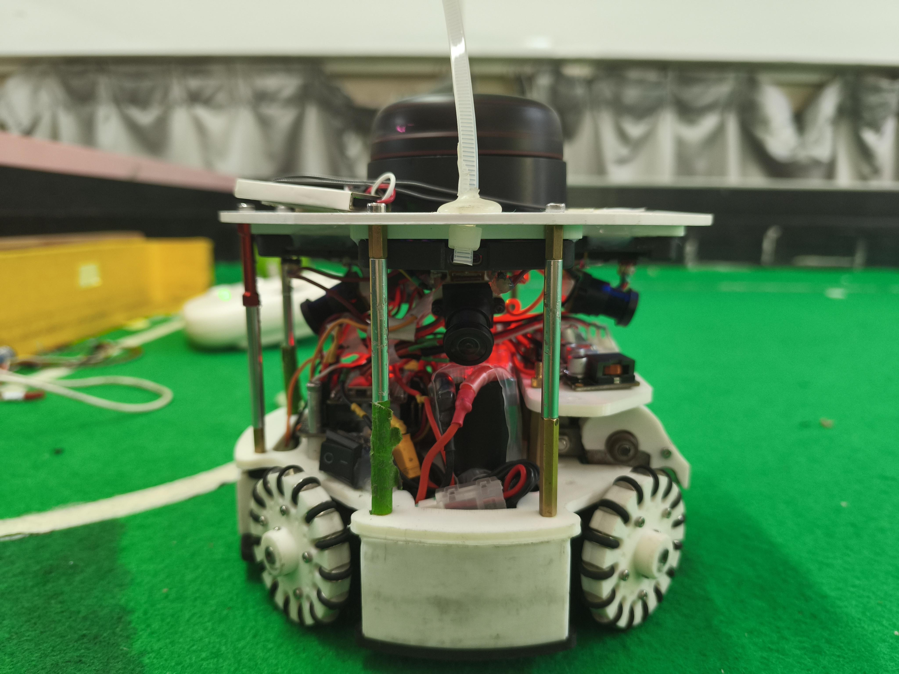

## Robot2 Left

*Robot 2 Left View*

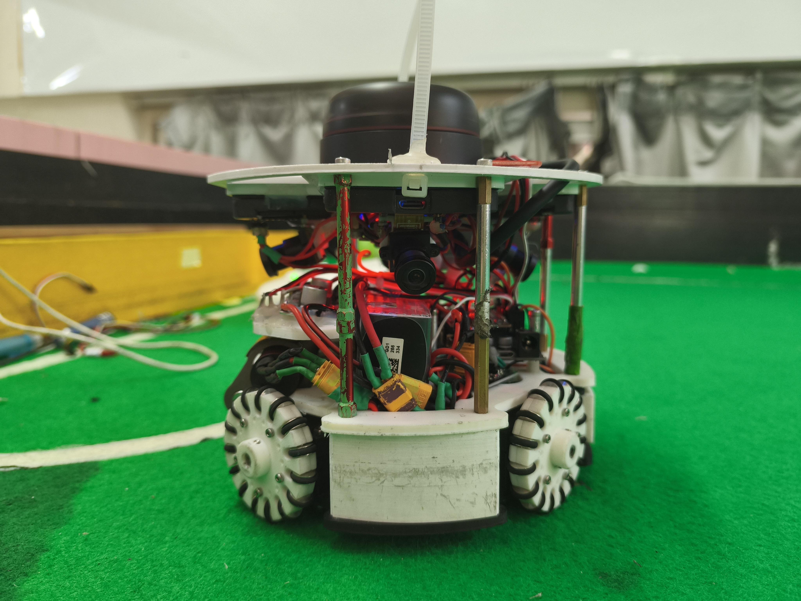

## Mechanical Design

*How did you design the mechanical parts of your robots?*

We used SolidWorks to design the robot's mechanical parts.  We used the "four cameras + lidar" solution this year. The mechanical structure was customized to integrate these sensors, while the chassis retained the 90-degree four-wheel drive layout.

During the design process, we balanced structural strength, weight, space, and cost. The robot body uses materials such as  PETG , Petg-cf.

We believe that future components should be modular. This will simplify component replacement, thereby improving the practicality of the robot.

## Build Method

*How did you build your design?*

We primarily use the Bambu Lab X1C 3D printer to manufacture most of the components of the robot. 

For some components, we rely on external companies for manufacturing services. Our printed circuit boards (PCBs) are manufactured by JLCPCB, a well-known and reliable service provider in the industry. 

In addition, the gears and skeleton structure of the ball mechanism are produced by an external company through metal 3D printing. 

During the construction process, we encountered some challenges that required adjustments to the design. For the ball structure, a micro switch and a lift height limit plate are installed above it. However, the installation height of the limit plate usually needs to be adjusted according to the actual assembly situation. This is critical to ensure that the ball structure exerts appropriate downward pressure.

## Motors & Reason

*How many motors have you used and why?*

We used four motors to drive the omnidirectional wheels of our robot, chosen for the following key reasons:
1. Enhanced Power and Stability
- Four motors provide greater combined torque, enabling the robot to maintain stable movement during collisions with opponents.

Wheel Design and Fabrication
- Design Approach
We designed the wheels using SolidWorks and adopted a traditional omnidirectional wheel structure to achieve smooth multi-directional movement. Each omnidirectional wheel consists of 15 small roller assemblies uniformly distributed around the main wheel hub.

- Connection Method to Motor Shafts
The wheels are connected to the motor shafts via a shaft-hole and set screw fastening method—aligning the holes on the wheel and motor shaft, then securing them with vertical screws. This ensures a rigid, adjustable, and easy-to-assemble connection.

List of drive system components:
1. Drive motor
-Model: RoboMaster M2006
- Quantity: 4
2. Omnidirectional wheel:
- Quantity: 4
-3D file has been placed on GitHub
- Main wheel: petg
- Tire: rubber
- Small wheel housing, shaft: steel
3. Connecting parts
- Set screw (M3*16): 1
- Others (M2*12): 8

## Kicker Design

*If your robot has a kicker, explain how you designed and built the mechanics of the kicker*

Our robot's kicker adopts an electromagnet instead of a mechanical structure, mainly because the electromagnet offers fast response speed, has low requirements for mechanical structures, is not prone to wear, and features strong stability. For example, pneumatic kickers will reduce their power as the air pressure decays. Moreover, the electromagnet does not take up much space, so we finally decided to use it. We designed the electromagnet on the chassis.
 
First, the power source of the kicker is entirely from the electromagnet. We set up a fixed base for it, which is clamped by two fixing parts of the electromagnet and locked with screws. Then we designed a kicking plate, which is connected to the threads on the electromagnet with nuts, so that the force of the electromagnet can be evenly transmitted to the kicking plate.

## Dribbler Design

*If your robot has a dribbler, explain how you designed and built the mechanics of the dribbler.*

We use SolidWorks to design the ball-playing structure. First, select the motor to be used, import the motor model and the ball model into the assembly, then preliminarily design a roller according to the position of the ball, determine the center distance between the roller and the motor shaft, and then combine the target reduction ratio, select 0.5 modulus and 20 degree pressure angle, use the gear transmission formula to calculate the number of gear teeth, and generate the gear model.

Then start to design the skeleton of the ball-playing structure. First generate the basic block, according to the position of the motor, roller, gear and other parts that have been determined, draw a sketch on the block, use the stretch cut, rotation cut and other functions to gradually turn the block into the skeleton of the ball-playing device, and then refine the structure. 

Finally, move the ball to the specified ball-eating depth, let the roller of the ball-playing device just tangent to the ball, then design a height-limiting board, tangent to the top of the ball-playing device, and determine the appropriate height limit. In this way, the preliminary design of the ball-playing structure is completed.

## CAD Files

*CAD design files*

https://github.com/leiemm/emm2025/tree/main/CAD%20drawing/3Ddrawing(robot)

## Mechanical Innovation

*Mechanical Innovation*

In the design of robotic mechanical systems, our proudest innovation is the reverse hub-motor embedding design, which stems  from breaking through dimensional constraints.
 
I. Design Background and Problem Analysis
After finalizing the motor and kicker components, the wheel design faced a critical challenge: the motor we selected has a long shaft with an outer-biased fixing position. If this conventional scheme were followed, it would cause dimensional overrun.
 
II. Innovative Design Solution
To overcome the above bottleneck, we proposed the design of a reverse-fixed wheel hub:
 
- Structural inversion: Shift the wheel's fastening position from the inner side to the outer side, moving the wheel inward toward the motor;
- Installation innovation: Design a special wheel hub so that its fixing interface with the motor is located on the outer side. In this way, the "semicircle beyond the chord" space wasted in the traditional design is efficiently utilized.
 
III. Core Advantages and Technical Value
- Extreme space utilization: Eliminates the space redundancy in traditional designs, ensuring that the overall profile of the wheel after installation fully conforms to the circular dimension constraints.

## Mechanical Photos

*Photos of your mechanical designs highlights*

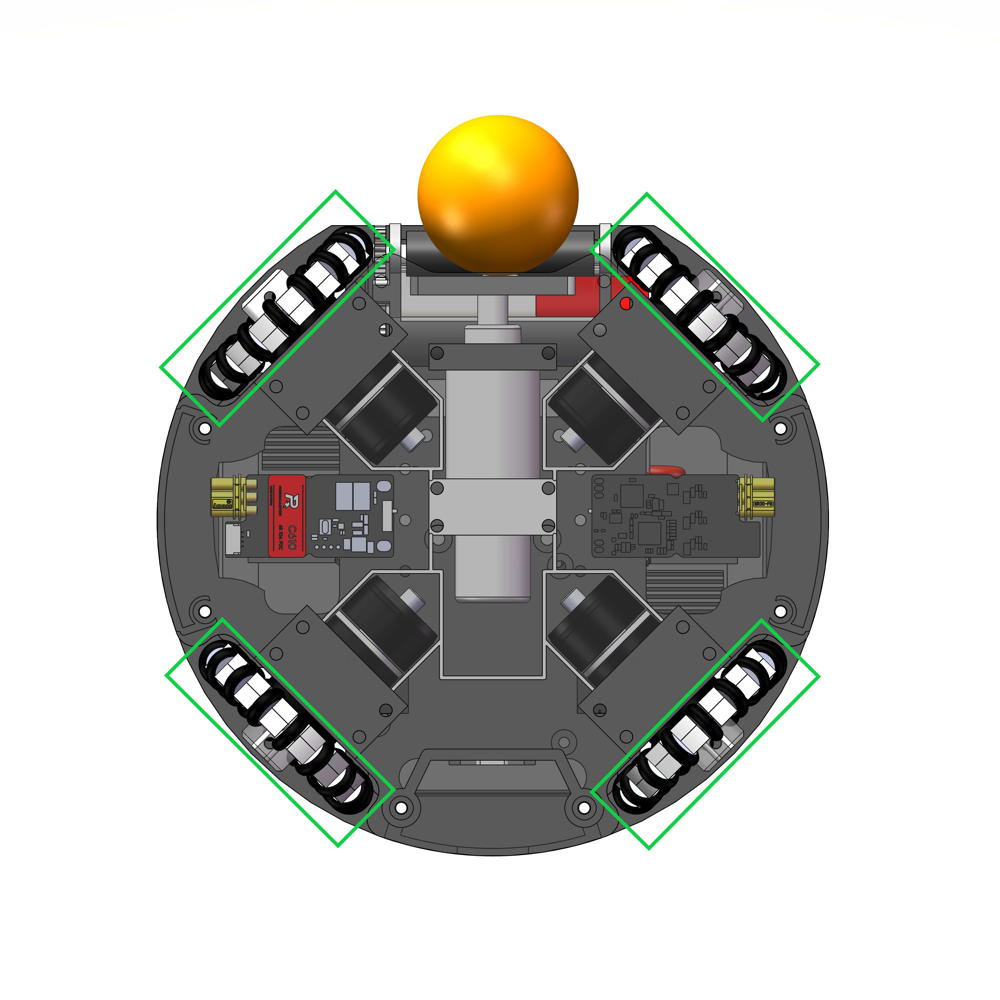

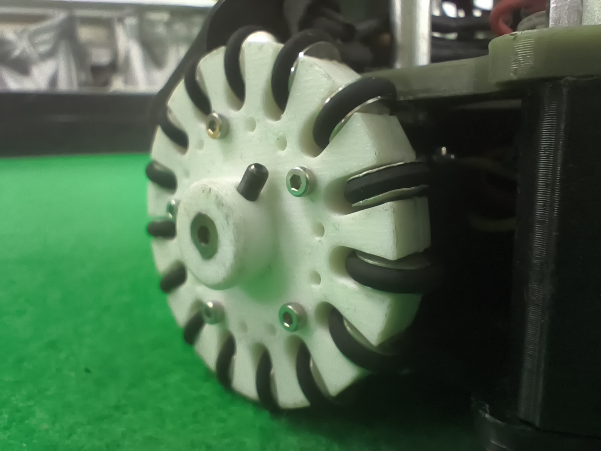
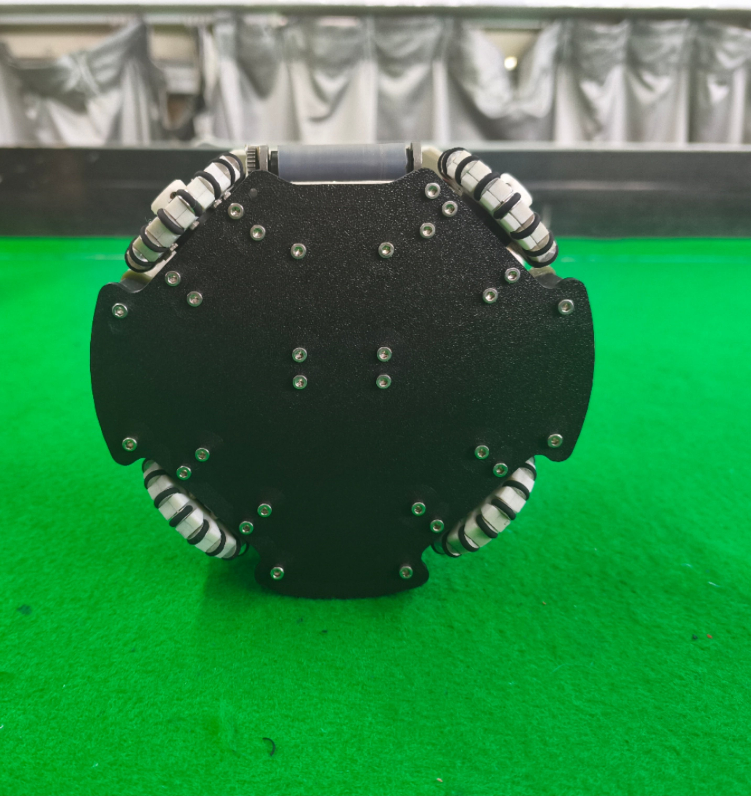

## Electronics Block Diagram

*Provide us with a block diagram of your robot's electronics*

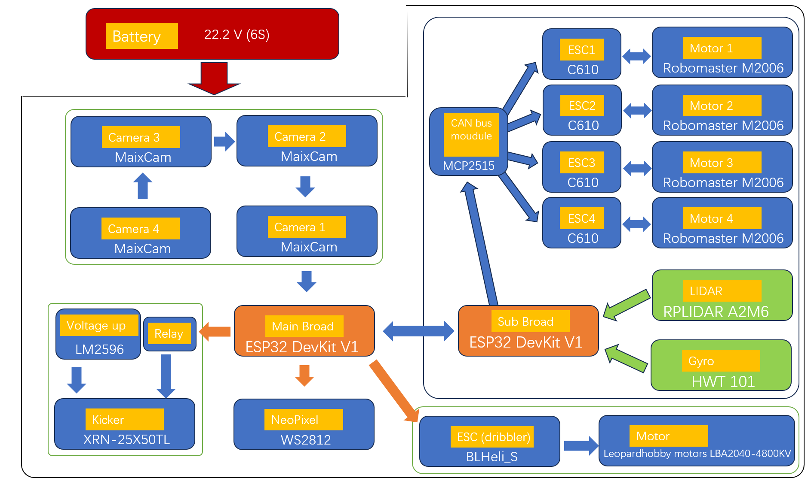

## Power Circuit

*How does your power circuits work?*

Our robot has a 22.2V (6S) battery pack, which is first divided into three paths. One path is regulated to 12V to drive the ball motor; the second path directly supplies 22.2V to the four motors and electromagnets on the chassis; the third path is stepped down to 5V to drive our main control board (esp32), and 5V/3.3V voltage is directly provided from esp32 to various modules (motor driver, various cameras, touch control, NeoPixel...).

## Motor Drive Circuit

*How do you drive your motors? Explain the circuits you use for that*

In terms of hardware connection and motor driving, our system is structured as follows:
 
1. Power Supply: A 22.2V battery pack serves as the power source, directly supplying electricity to the entire driving circuit.

2. Motor - ESC Connection: We utilize four RoboMaster M2006 motors, each paired with a RoboMaster C610 Electronic Speed Controller (ESC). The motors are first connected to the C610 ESCs, and then the cables from the ESCs are combined and linked to the CAN - bus power supply.

3. Communication Interface: The C610 ESCs and motors are connected to an MCP2515 CAN bus module through a four - in - one CAN bus via two CAN buses. The MCP2515 module acts as a communication bridge, interfacing with the sub - controller (ESP32) through an SPI interface. The SPI interface includes pins such as SCK (Clock), MOSI (Master Out Slave In), MISO (Master In Slave Out), and CS (Chip Select).
 
This physical connection setup constitutes a complete hardware circuit for motor driving, enabling the transmission of both power and control signals from the battery and the sub - controller to the motors.

## Microcontroller & Reason

*What kind of micro controller or board do you use for your robot? Why did you decide to use this part for your robot? If you have more than 1 processor, explain each one separately.*

Our robot is equipped with two ESP32 microcontrollers that serve as the core processing units. The selection of ESP32 is based on multiple advantages: it boasts an abundance of ports and supports diverse communication protocols, ensuring seamless integration with various components. Moreover, it stands out for its cost - effectiveness compared to many other controllers. The built - in Bluetooth module is a significant plus, allowing for communication between different parts of the robot without the need for additional external communication modules.
 
The two ESP32s have distinct functions. The ESP32 on the main board is mainly tasked with executing the core logic of the competition program, as well as driving the kicker and ball dribbler. The ESP32 on the sub - board, meanwhile, is responsible for handling data from a multitude of other modules.
 
The sub - board is connected to an MCP2515 module, which controls the motors via the CAN bus. It also interfaces with a gyroscope, four MaxCam Speed cameras, and a lidar. The sub - board processes sensor data and manages motor operation. Information like the gyroscope's angle, coordinates from the lidar, and data regarding the ball (including its angle and distance) are transmitted to the main board through serial communication. In response, the main board sends movement commands to the sub - board, which uses these instructions to drive the motors.

## Ball Detection

*How does your ball detection sensors and/or camera[s] work?*

Our robot is equipped with four MaixCam cameras, each fitted with a fisheye lens, providing comprehensive 360 - degree field - of - view coverage. Positioned at the front, rear, left, and right, these cameras each monitor a 90 - degree range to detect the ball.
 
To identify the ball within the captured images, we employ a hybrid detection approach that combines the YOLO model with threshold - based detection. First, we train a customized lightweight YOLO model using a dataset of real - world images captured by the on - board cameras, which are carefully annotated to mark the ball's position. This enables reliable ball detection across various lighting conditions, shadows, and background distractions.
 
Simultaneously, we conduct image segmentation and color - space conversion (such as from RGB to HSV) on match - scenario images to fine - tune and identify the optimal color threshold values specific to the ball, allowing for precise isolation from the background. When properly calibrated, threshold - based detection can achieve longer - range detection compared to the YOLO model, though it is more sensitive to environmental variations.
 
Our system prioritizes the YOLO model for ball detection. In cases where the YOLO model fails to detect the ball, the threshold - based method is automatically activated. If neither the YOLO model nor the threshold - based detection can identify the ball, it indicates that the ball is truly beyond the system's detection capabilities under the current circumstances.

## Line Detection

*How does your line detection circuits work?*

There is no circuit board for line detection on our robot. The line detection mechanism of our robot represents a unique innovation because it can operate without any traditional line detection circuit (grayscale board, etc.).
Instead, we rely solely on the distance data transmitted by the LiDAR sensor to determine the position of the robot relative to the white line of the field, which is crucial for our "Out Of Bound' algorithm. The high-precision coordinates provided by the LiDAR sensor allow us to omit additional components such as grayscale sensors that are usually used for line detection.

Essentially, we do not detect the white line, our restricted area line detection system is a coordinate-based monitoring system. By utilizing the data from the LiDAR , we can accurately determine when the robot is close to the restricted area line and take corrective measures immediately.

## Navigation/Position Sensors

*What sensors do you use for navigation and how are these sensors connected to your processor? What sensors do you use to find your position in the field? What about the direction your robot faces?*

For navigation, we mainly use the RPLIDAR A2M6 lidar for coordinates and the HWT 101 gyroscope for direction detection. Both sensors are connected to the sub - controller via serial port communication. The robot's facing direction is adjusted based on competition strategies, with the gyroscope's attitude feedback as the basis.

## Kicker Circuit

*How do you drive your kicker system? How does the circuit make the kicker work?*

The kicker system's operational details are as follows:
 
1.  22.2V input is boosted to 46V by a converter, charging a 10,000μF electrolytic capacitor that stays perpetually charged.
2. A relay (normally open) acts as the circuit switch. When the ESP32 motherboard sends a trigger signal, the relay closes, allowing the 46V/10,000μF capacitor to discharge into the electromagnet.
3. Discharge-Recharge Cycle:
- Capacitor energy powers the electromagnet for the kick. The ESP32 controls relay timing via system clocks, opening the relay post-discharge.

## Dribbler Circuit

*How does your dribbler system work? What components and circuits did you use to drive it?*

The dribbler circuit mainly consists of a brushless motor, its corresponding ESC (Electronic Speed Controller), and an ESP32 motherboard. The ESP32 sends PWM signals to the ESC, which then controls the brushless motor's rotation, enabling precise ball handling.

## Schematics

*Schematics of your robot*

## PCB

*PCB of your robot*

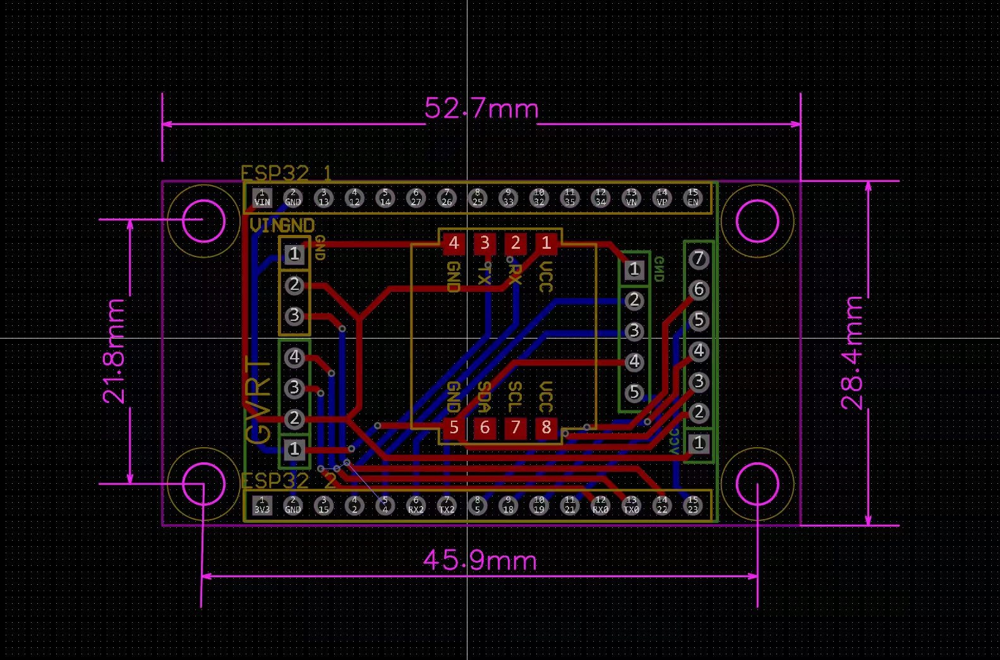
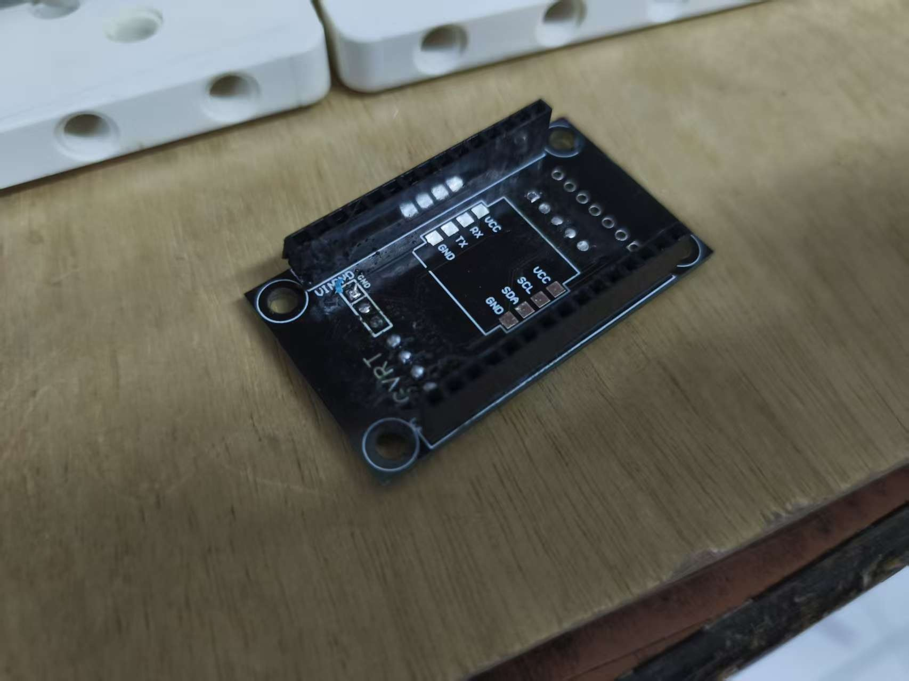
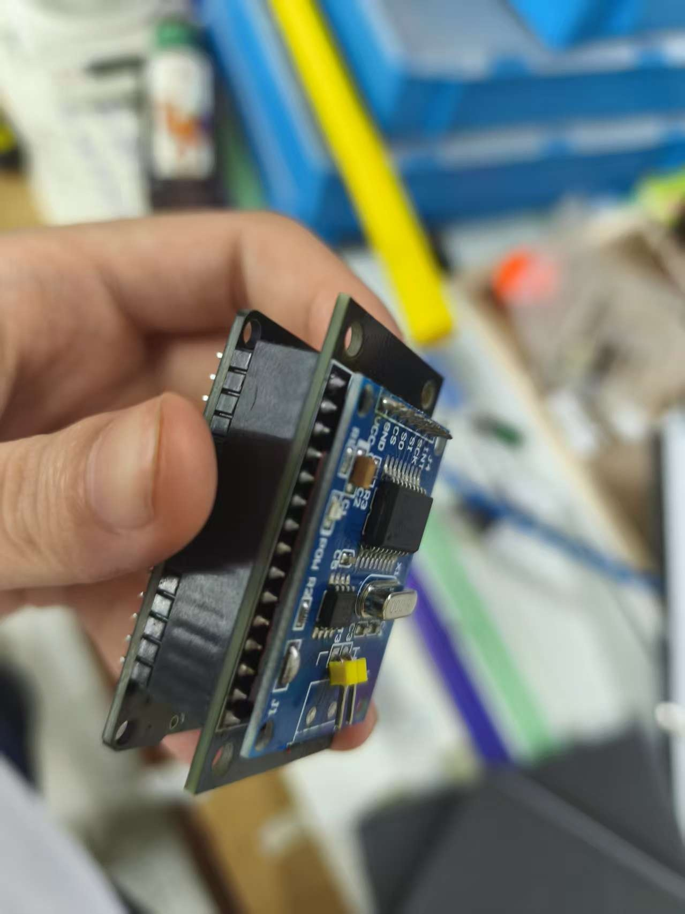

## Innovation

*Innovations*

The electronic product we take the greatest pride in this year is our radar technology. With its 360-degree data collection ability, it can accurately detect information from any direction, regardless of the robot's posture. This has allowed us to develop new offensive strategies and execute maneuvers that were previously impossible, like scoring while facing away from the goal and implementing outward-facing defenses. The radar has also enabled us to innovate in many areas. On the Super Team field, it helps our robots pinpoint their exact positions, giving us a significant edge.

## Circuit Photos

*Photo of your circuit boards highlights*

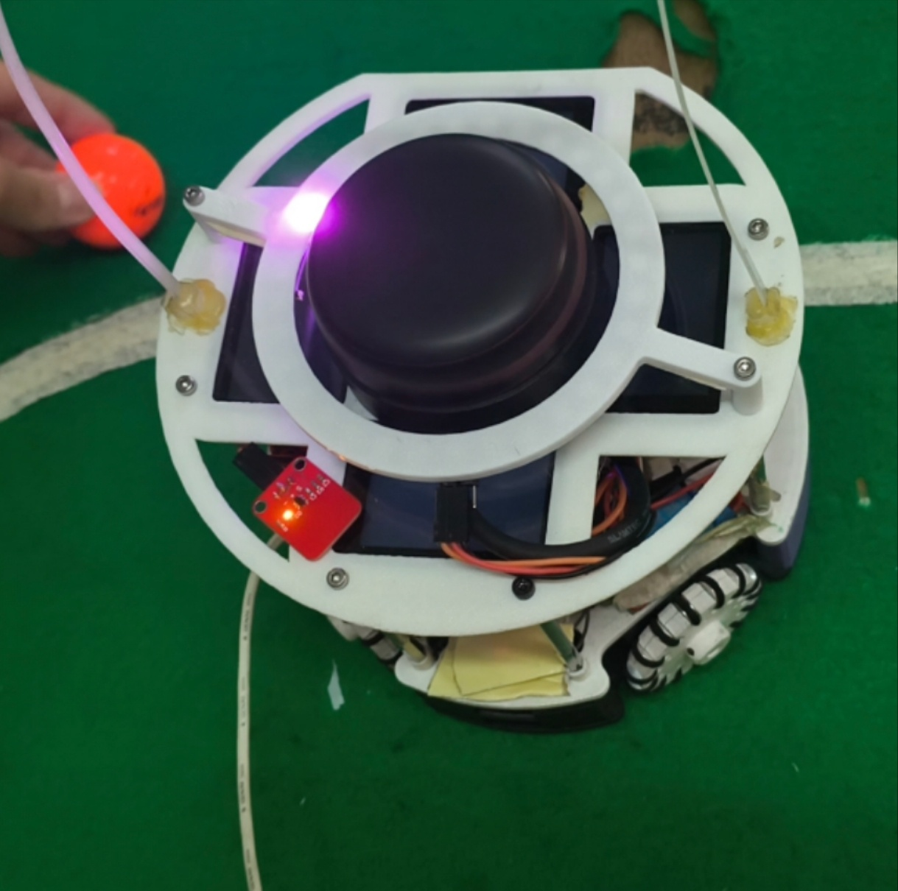
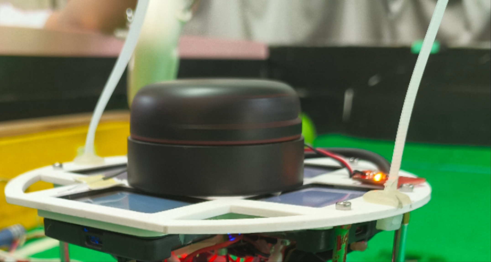
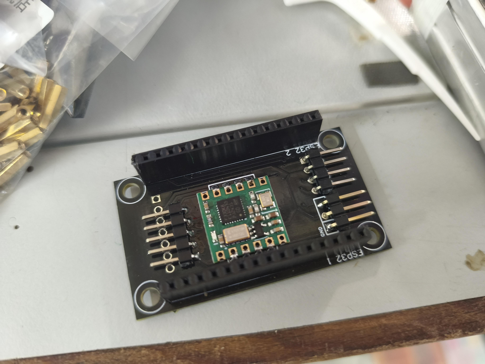
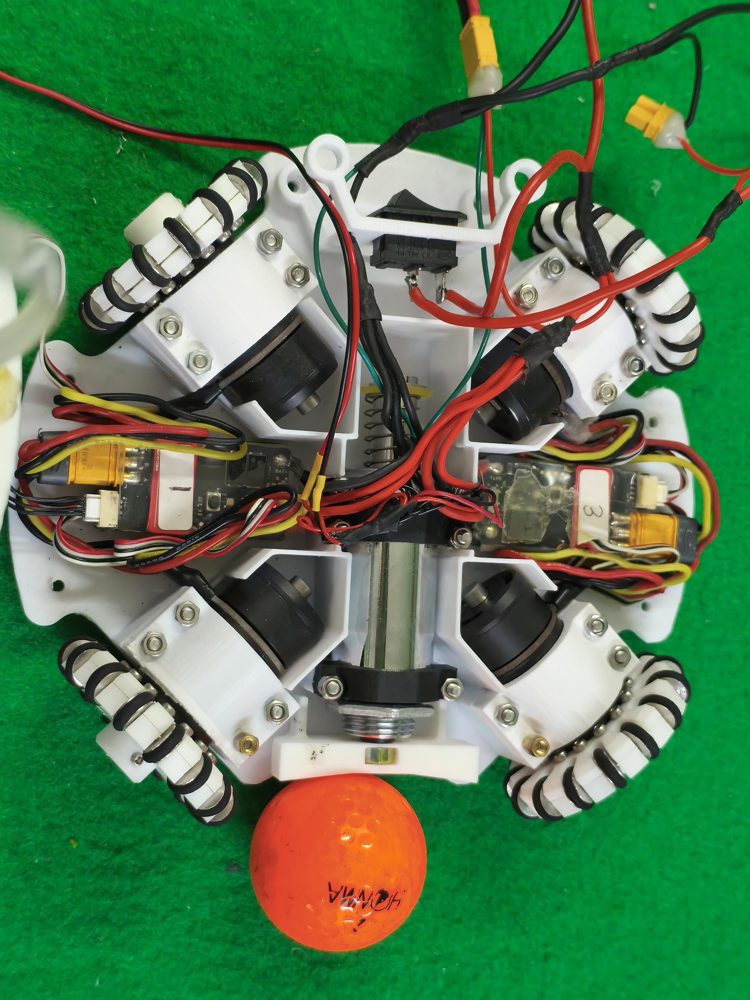

## Motor Control

*How do you use your processor to move your motors?*

The process of using the processor to drive the motors is as follows:
 
1. Instruction Reception and Transmission: The main controller, based on the action requirements of the robot during the soccer match , sends three key parameters—speed, direction, and angular velocity—to the sub - controller (ESP32) via serial communication.
2. Kinematic Calculation: Once received, the sub - controller (ESP32) inputs these three parameters into the in - house developed kinematic equations. Through these equations, it calculates the corresponding rotation speeds and directions required for each of the four motors.
3. Protocol Conversion and Signal Transmission: After obtaining the calculated motor control parameters, the sub - controller packages these data into data frames following the CAN protocol. Then, it communicates with the MCP2515 CAN bus module through the SPI interface. 
4. Motor Control: The C610 ESCs, which support CAN - bus communication, parse the received CAN - bus signals. Based on the signal instructions, they generate corresponding control signals to precisely adjust the rotation speeds and directions of the M2006 motors, thus enabling the robot to perform various actions as required in the soccer match.

## Ball Detection Method

*How do you find where the ball is? How do you read the data from the ball detection sensors or camera?*

Multi-Camera Ball Tracking System Calculation and Data Flow  

(1).System Layout & Viewing Angles
- Cam1 (Front): Covers 315° to 45° zone  
- Cam 2 (Right): Covers 45° to 135° zone  
- Cam3 (Back): Covers 135° to 225° zone  
- Cam4 (Left): Covers 225° to 315° zone  
- 15° overlap between adjacent cameras for seamless coverage  

(2).Data Collection & Transmission
1. Hierarchical data flow:  
   - Cam 4 → Sends data to Cam3  
   - Cam 3 → Sends self + Cam 4 data to Cam 2  
   - Cam 2 → Sends self + Cam 3 data to Cam 1  
   - Cam1 → Receives self + all downstream data  

(3). Data content per camera:  
   - Ball center coordinates: Horizontal = x + width/2, Vertical = y + height/2  
   - Ball dimensions (width w, height h)  
   - Transmission rate: 100Hz (updated every 10ms)  

(4). Angle calculation (FC):  
   - Local angle: (Horizontal position - 224) / 224 × 45°  
   - Global conversion:  
     * Cam 1: Use local angle directly  
     * Cam 2: Local angle + 90°  
     * Cam 3: Local angle + 180°  
     * Cam 4: Local angle + 270°  
   - Negative angle handling: Add 360° if result < 0  

(5). Distance calculation (F):  
   - Base distance = Vertical position / 6.24  
   - Camera-specific calibration:  
     * Cam 1: Base distance - shift1  
     * Cam 2: Base distance - shift2  
     * Cam 3: Base distance - shift3  
     * Cam 4: Base distance - shift4  
   - Validation: Output 1 if ≤0, 0 if no ball detected  

(6). Data fusion logic:  
   - Key metric: Absolute value of local angle (center offset)  
   - Priority: Select camera with smallest offset  
 

(7)Output to ESP32
1. Transmission protocol:  
   - Camera 1 sends processed data directly via UART  

(8). Coordinate system:  
   - Angle reference: 0° = front, clockwise positive  
   - Distance: Relative value (higher = farther)

## Ball Catch Algorithm

*How does your algorithm work to catch the ball? Is there a difference between your robots in how they move towards the ball? Explain the differences.*

Ball - handling and Defensive Algorithms for Robots
 
Our attacking robots' ball - handling algorithm is centered around two key variables: the angle (fc) and the distance (f) of the ball relative to the robot, where 0 degrees represents the direction directly in front of the robot, and the angle increases clockwise. When an attacking robot is far from the ball, it moves straight towards it. As it approaches, instead of a direct path, it follows a direction approximately tangent to the ball, determined by a formula considering both the ball's angle and distance. Once the ball is within approximately ±10 - 15 degrees of the robot's front, it moves directly towards the ball to catch it.
 
Defensive robots operate differently. They also rely on the ball's angle and distance but additionally use radar to calculate the angle and distance between themselves and the goal. Typically, defensive robots move along the vicinity of the penalty area line. When the angle between the defensive robot and the ball aligns with the angle between the robot and the goal, meaning the robot is positioned on the path from the ball to the center of the goal, it is considered to have successfully defended and stops moving. However, if the ball remains stationary for an extended period, the defensive robot will switch to an offensive - like strategy. It will approach the ball following the above - mentioned logic, push the ball towards the goal, turn towards the goal, and attempt a shot to clear the potential threat.

## Line Algorithm

*How does your robot find the lines to stay inside the field? What algorithms do you use to avoid going out of bounds?*

Anti-Out-of-Bounds (OOB) Algorithm
 
Our robots do not rely on line sensors for boundary detection. To ensure they stay within the field, we use a strategy based on radar-measured distance data combined with a velocity decomposition algorithm. Here’s the oriented approach to bounds (Boundary Orientation and Unidirectional Navigation via Decomposition Strategy):
 
Core Mechanism: Oriented Boundary Management
 
1. Radar Oriented-Scanning
The laser radar continuously scans in a directional pattern to detect the robot’s distance and orientation relative to field boundaries (sidelines and penalty area lines), establishing a real-time coordinate system for boundary vectors.
2. Vector Decomposition by Boundary Type
- Regular Sidelines (Linear Boundaries):
When approaching a sideline (e.g., left boundary), decompose velocity into tangential (along the line) and normal (perpendicular to the line) components. Cancel the normal component directed outward (toward OOB), retaining only the tangential component to move parallel to the boundary.

- Penalty Area Curves (Curved Boundaries):
For curved boundaries, decompose velocity into tangential (local tangent to the curve) and radial (perpendicular to the tangent) components. Cancel the radial component that would push the robot out of the penalty area, forcing movement along the curve’s tangent to maintain in-bounds proximity to the ball.
3. Orientation-Driven Recombination
After canceling the out-of-bounds velocity component, recombine the remaining vectors to form a new velocity that:
- Prioritizes in-field orientation (no OOB movement).
- Maintains the robot’s trajectory toward the ball by preserving the tangential component, which aligns with the boundary while keeping the robot within bounds.
 
For a visual representation of vector orientation and decomposition, refer to the diagram in our poster.

## Goal Algorithm

*What algorithms do you use to score goals? How do you use your kicker and dribbler to handle the ball?*

Goal-Scoring Algorithms and Ball Handling Strategies
 
1. Direct Dribble-and-Shoot Strategy
After acquiring the ball using the previously described ball-handling algorithm, the robot employs its dribbler to control the ball. Key steps include:
 
- Positioning for Shooting: The robot uses radar to calculate the angle to the goal and a gyroscope to monitor its own orientation. When the robot is aligned directly toward the goal (within a specific tolerance), it triggers the kicker mechanism.
- Kicker Activation: A relay controls the kicker to deliver a rapid, powerful strike toward the goal, leveraging the precise angle data from the radar and gyroscope to ensure accuracy.
 
2. Backward Ball Control with Wall-Based Maneuvers
 
This strategy uses the radar’s precision to evade opponents:
 
- Waypoint Navigation: Using radar coordinates, the robot defines waypoints along the sideline. It calculates the distance and angle to each waypoint using trigonometric functions, moving stepwise toward the opponent’s goal line.
- Final Approach and Shot: Upon reaching the goal line, the robot turns to face the goal and executes a shot via the kicker, again confirming alignment via radar and gyroscope data.

## Defense Algorithm

*What algorithms do you use to avoid the opponent team scoring? How do your robots defend your own goal?*

Our robots use radar - based velocity decomposition for goal defense, avoiding line sensors. The key is to move them in a circular path around the penalty zone for effective blocking.
 
Defense Strategy
 
1. Trajectory Control: Using radar data, robots adjust their velocity in real - time to maintain a circular path around the penalty zone. If too close to the goal, they move outward; if too far, they move inward, always facing outward to stay ready for defense.
2. Velocity Decomposition: The initial velocity towards the ball is split into components. One adjusts the distance from the goal, and then the components are recombined to guide the robot's movement precisely.
3. Positioning: Robots position themselves on the line between the ball and the goal center to maximize blocking area and stop once aligned.
4. Ball Clearance: When the ball is still, the defensive robot controls, turns, and shoots it towards the opponent’s goal.
 
See the poster image for a visual of velocity decomposition and trajectory.

## Robot Communication

*Do your robots communicate with each other? How do you use this communication to your advantage?*

Our robots can communicate with each other using the built-in Bluetooth modules on their mainboards. One of our tactics is that when the defensive robot gets the ball, it exchanges position coordinates with the offensive robot. If the defensive robot successfully receives the offensive robot's coordinate information, it will kick the ball towards the offensive robot. Specifically, you can watch the video posted on YouTube.

## Innovation2

*Innovations*

Key Offensive Algorithm: Backward Dribbling Strategy
 
The core offensive strategy for our robots centers on a backward dribbling approach, leveraging radar and gyroscope to execute tactical maneuvers:
 
Tactical Execution
1. Wall - Shielded Ball Positioning
After securing the ball, the robot turns toward the nearest field wall, using its body to block the ball from opponents’ view. This shields the ball from defensive detection, allowing unimpeded movement.
2. Waypoint - Driven Navigation
Radar defines sequential waypoints along the sideline toward the goal. The robot calculates angles and distances to each waypoint, moving stepwise while keeping the ball concealed against the wall.
3. Goal - Aligned Shooting
Using radar - derived coordinates, the robot computes its position relative to the goal and aligns via gyroscope, executing a precise shot once oriented correctly.
 
Strategic Impact
This approach has been pivotal in our scoring success—by combining tactical concealment with precise navigation, the strategy enables consistent goal - scoring opportunities, making it a cornerstone of our offensive performance.

## GitHub Link

*GitHub link*

https://github.com/leiemm/emm2025

## BOM

*Bill of Materials (BOM)*

[https://drive.google.com/open?id=1PQPeRHq-dh71oUDd0NayCR12UxLqvduH](https://drive.google.com/open?id=1PQPeRHq-dh71oUDd0NayCR12UxLqvduH)

## Cost

*How much did it cost you to build your robots?*

Robots (cost of components that are in your robots right now): 4900 CNY each
Experiments (failed builds, broken hardware etc.): 2500 CNY
Environment (fields, balls, etc.) : 10000 CNY

## Funding

*How did you gathered the funds to build the robots?*

98% school
2% individual

## Affordability

*How affordable was it to compete in RoboCupJunior Soccer?*

8

## Answer Check

*Have you checked all of your answers?*

Yes!

## Publication Consent

*We publish TDPs and posters during or after the competition as described in the beginning*

Yes, we acknowledge everything submitted in the above form can be published.

## Email Address

*Email Address*

lipeihua28@gmail.com

## TDP File

*TDP File Upload (Not required)*

## Extra Column

*Column 67*

