## Timestamp

*Timestamp*

7/13/2025 17:09:42

## Team Name

*What is your team's name?*

HIKARI

## League

*What league do you participate in?*

Open League

## Country

*Where are you from?*

Australia

## Contact

*If other teams have questions about your robot, now or in the future, what email address(es) can we publish along with this document for people to reach you?

(You can put in multiple email addresses, like multiple team members, an email for the whole team or both. Feel free to share other ways of communication like Discord handles)*

yan0108@mhs.vic.edu.au
lia0049@mhs.vic.edu.au
ngu0546@mhs.vic.edu.au
gor0008@mhs.vic.edu.au

## Social Media

*Team Social Media Links (if you have any)*

## Team Photo

*Upload a photo of your whole team with your mentor and robots

Note: This is not mandatory and will be published along with your TDP if you choose to upload something*

## Members & Roles

*What are the names of the team members and their role(s)?*

Starr Yang: CAD and PCB Design
Taj Gordon: Mechanical Assembly
Bao Nguyen: Vision Programming
Brendan Liang: Strategy Programming

## Meeting Frequency

*How often did your team meet?
(e.g. 90 minutes once per week or a day every weekend.)*

Our team meets for 3 hours every Thursday afternoon.

## Meeting Place

*Where did you meet to work on your robot?
(e.g. a robotics room at school, at some other place, one of your homes, school library etc.)*

A robotics room at school, and sometimes at a library.

## Start Date

*When did your team start working on this year's robot?*

We began working on this year's robot in February, after the school holidays ended.

## Past Competitions

*Which RoboCupJunior competitions have you competed in and in which leagues?*

Australian Open 2023: Soccer Entry League/Standard League
Australian Open 2024: Soccer Open League

## Mentor Contribution

*Which parts of your work received the most contribution from your mentor?*

As we had no prior experience, our mentor taught us how to use CAD and PCB design software, and how to use the 3D printers.

## Workload Management

*How did you manage the workload?*

We communicated via a group chat on Microsoft Teams and a group chat on Discord. To distribute tasks among different members of the team, we created detailed to-do lists on Google Docs. Additionally, we used GitHub and Microsoft Teams to share code and other files.

## AI Tools

*Which AI tools did you use?*

We used GitHub Copilot and Cursor to assist us with coding the robot. We also used ChatGPT to quickly search the web to find suitable components when designing PCBs.

## Robot1 Overall

*Robot 1 Overall View*

## Robot1 Front

*Robot 1 Front view*

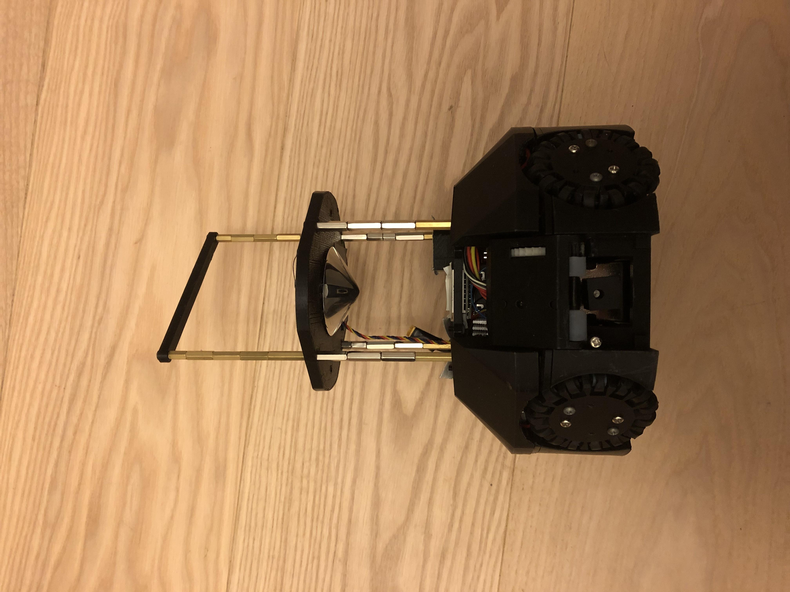

## Robot1 Back

*Robot 1 Back view*

## Robot1 Top

*Robot 1 Top View*

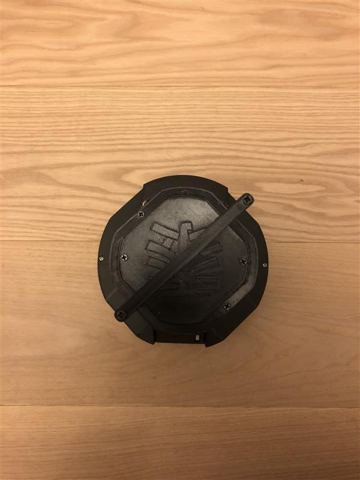

## Robot1 Bottom

*Robot 1 Bottom View*

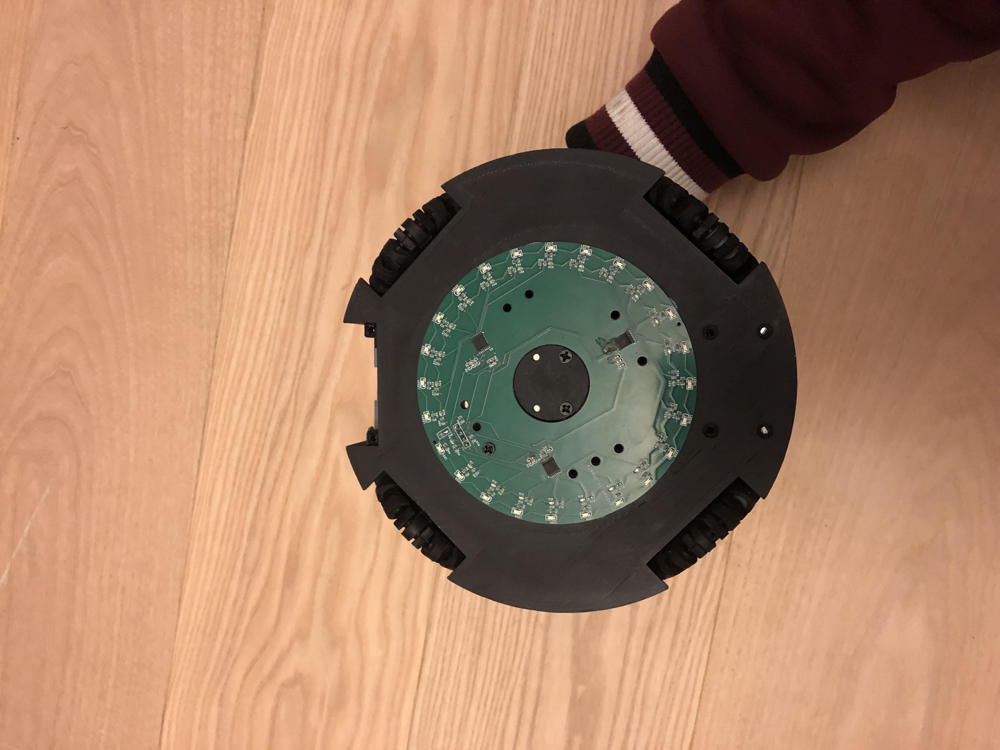

## Robot1 Right

*Robot 1 Right View*

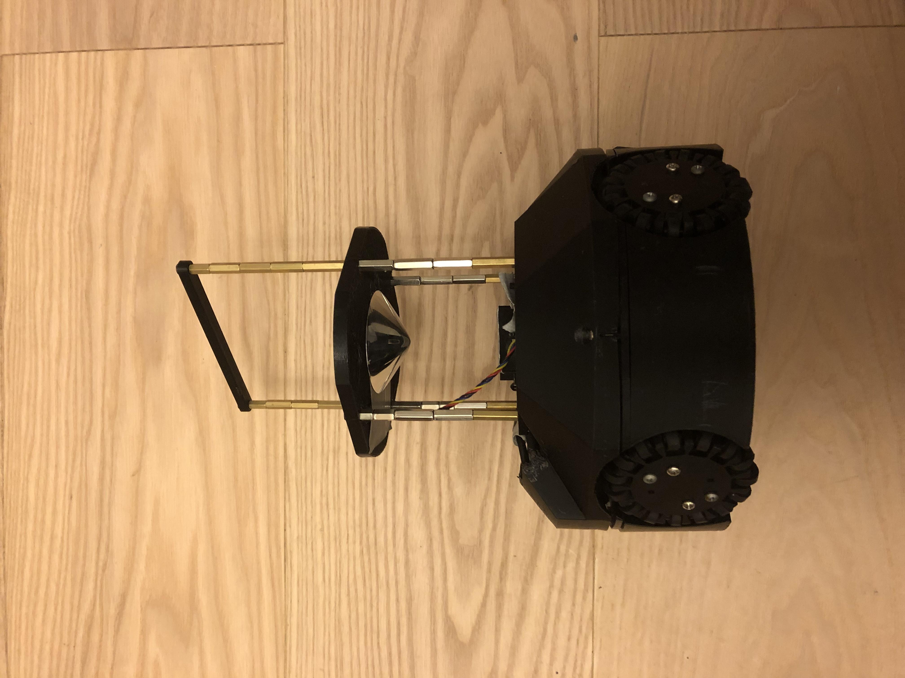

## Robot1 Left

*Robot 1 Left View*

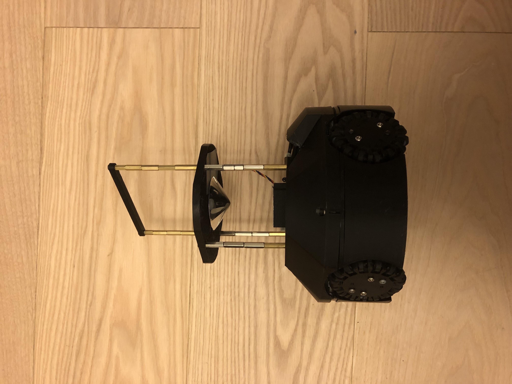

## Positioning & Movement

*How do you find your position inside the field and how do you use that position to move your robots around?*

In order to find our position within the field, we use a purely camera-based approach. By processing the camera image, we can determine the angle and distance to the blue and yellow goals. Using this, we can calculate our position within the field with trigonometry.

We make use of this position in certain situations: when the robot cannot see the ball, the robot will move to the centre of the field, and when the robot is a defender robot, it will check its position to make sure it stays near the goal.

## Robot2 Overall

*Robot 2 Overall View*

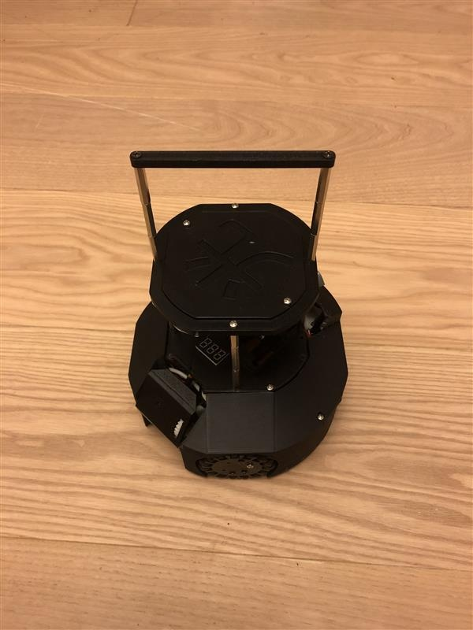

## Robot2 Front

*Robot 2 Front view*

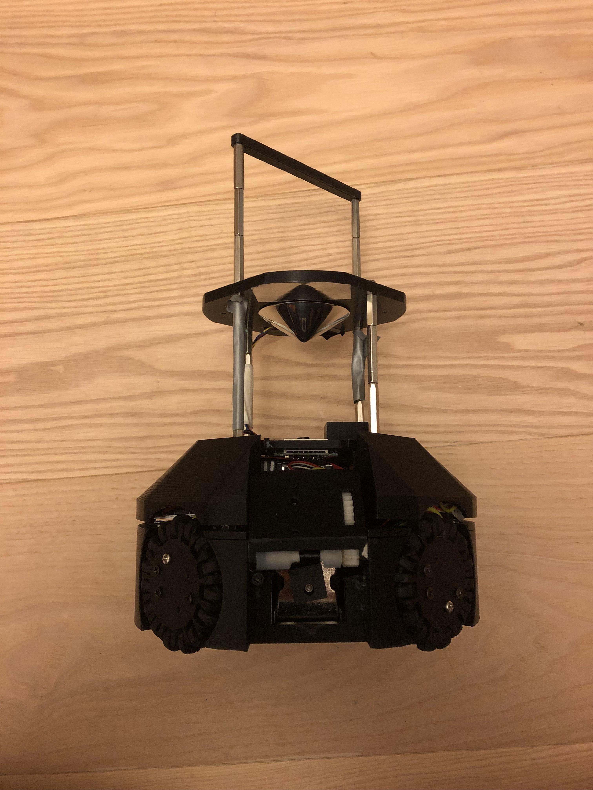

## Robot2 Back

*Robot 2 Back view*

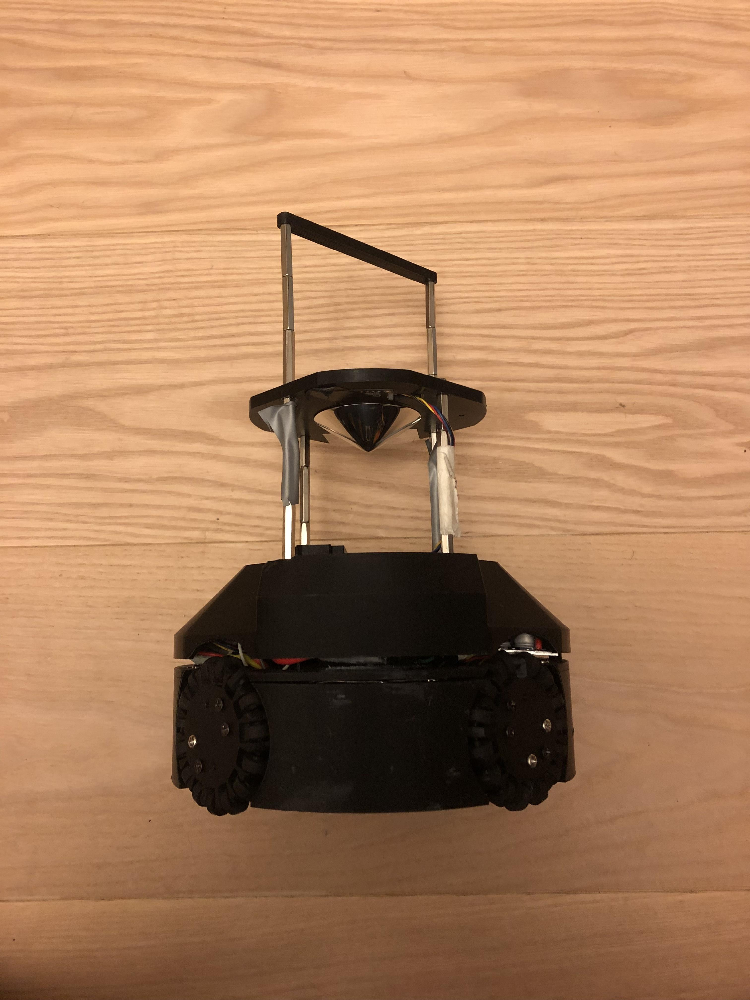

## Robot2 Top

*Robot 2 Top View*

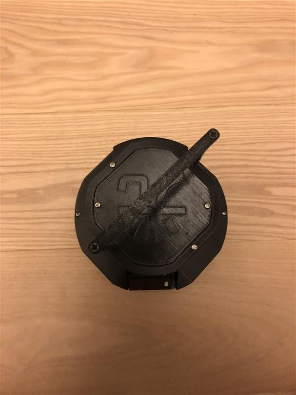

## Robot2 Bottom

*Robot 2 Bottom View*

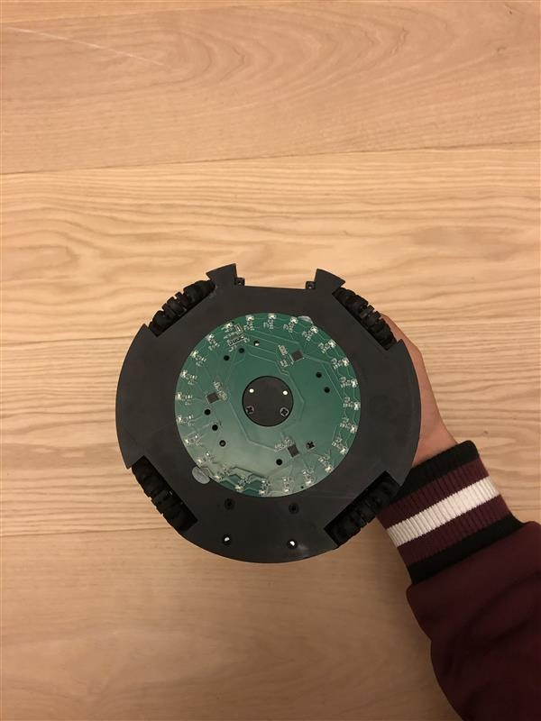

## Robot2 Right

*Robot 2 Right View*

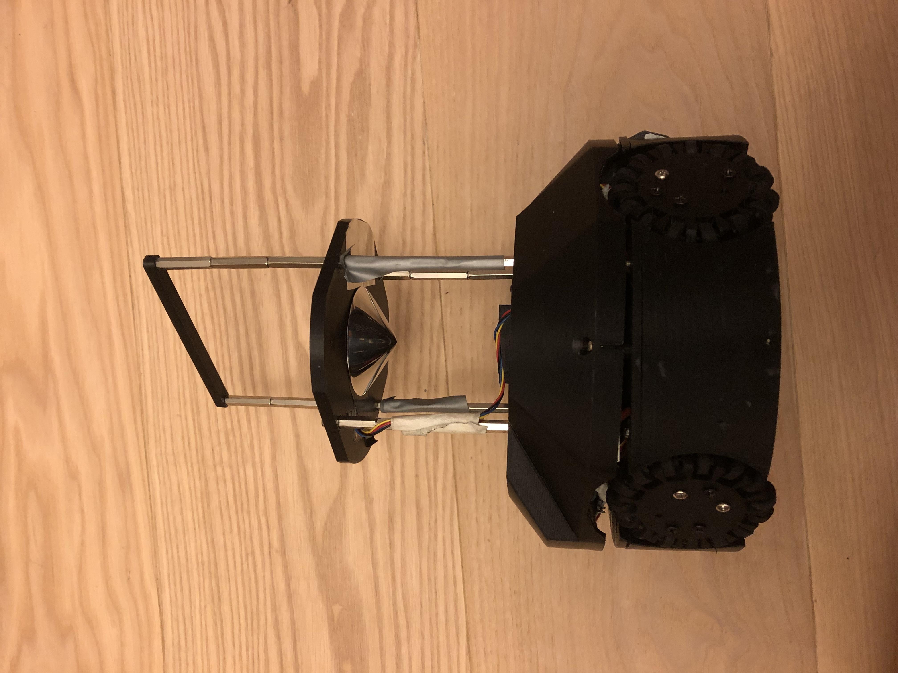

## Robot2 Left

*Robot 2 Left View*

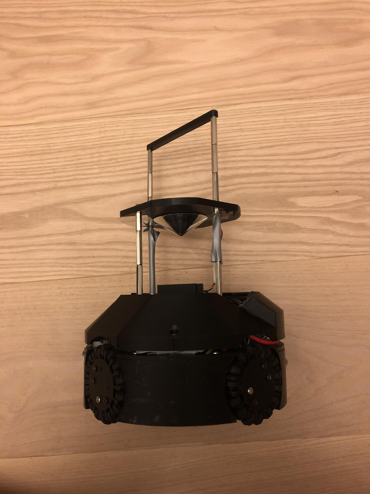

## Mechanical Design

*How did you design the mechanical parts of your robots?*

We used Fusion360 to design the mechanical parts of the robot. Our design was based off of knowledge we had from competing in soccer last year, and also partly inspired by the posters of other teams.

The primary elements we considered and prioritised when designing the robot were: motor speed, dribbler ball control, and kicker speed.

We went through a number of iterations to improve the robot's design. Key changes we made were:
- Increasing the thickness of the 3d printed parts to prevent breaking
- Decreasing the diameter of the dribbler roller to make the dribbler more compact
- Incorporating heat-set inserts into the design to make joints between parts stronger
- Adjusting the position of the kicker solenoid to leave more space around the motors
- Adding a flat plate on the front of the kicker solenoid to allow for more contact area with the ball
- Printing the dribbler out of ABS instead of PLA since the PLA prints would sometimes melt

## Build Method

*How did you build your design?*

We used 3D printers to produce the main parts of the robot, out of PLA and ABS plastic.

We ordered the mirror to be CNCed by JLCCNC, which was the cheapest option we found (alternative services like Xometry and PCBWay gave us much more expensive quotes).

We ordered our PCBs to be produced and assembled by JLCPCB, which was also quite cheap and very fast shipping. However, there was an issue with our line sensor PCBs, in which we forgot to ground a few pins, causing the line sensors to behave unreliably. We had no time to order new PCBs, so we used extremely thin copper wire and fixed the board with careful soldering to make it work.

## Motors & Reason

*How many motors have you used and why?*

We are using 4 motors in our drive base, and 1 additional motor for the dribbler. Our main reason for using 4 motors is stability, especially when driving left and right, and additionally because the calculations for 4 omniwheel systems seem to be simpler to do than 3 omniwheel systems.

We built our own omniwheels so that we could control the exact size of our omniwheels. Commercial omniwheels that we found were either too small (which resulted in not enough clearance with the ground), or too large (which resulted in not enough space for the dribbler). Making our omniwheels allowed us to make them a size that was just right for our design.

Our omniwheels are 3D printed out of PLA. They are composed of two halves, which sandwich together to hold the subwheels in place. Our subwheels are silicone, and instead of using commercial O-rings or X-rings, we just cut a long silicone tube by hand into small wheels to use in our omniwheels.

The design files for our omniwheels are published on our GitHub which is linked further down.

## Kicker Design

*If your robot has a kicker, explain how you designed and built the mechanics of the kicker*

Our kicker is solenoid-powered.  Mechanically, the kicker solenoid is firmly attached to the base plate using screws through the bottom of the base plate. In previous designs, we tried to attach the solenoid by surrounding it in plastic, but this would often break; a direct attachment to the bottom of the base plate proved much more reliable.

On the front of the solenoid is a flat kicker plate to increase the contact area with the ball. This kicker plate is 3D printed out of PLA. We inserted a M5 nut into the kicker plate while it was printing, securely fastening the nut into the kicker plate, which allows us to easily screw the kicker plate onto the front of the solenoid.

## Dribbler Design

*If your robot has a dribbler, explain how you designed and built the mechanics of the dribbler.*

Our dribbler uses 2 gears, with a 3.5 to 1 gear ratio, to increase the speed of the dribbler bar.
The 28-tooth gear is mounted onto the dribbler motor, and the 8-tooth gear is printed with the dribbler bar. The dribbler bar rotates around a smooth 2mm steel rod. Crucially, we do not use bearings in our dribbler design to save space. The smooth 2mm rod offers a significantly lower friction than alternative options such as m2 screws, allowing us to omit bearings.

The dribbler bar has a 50mm long silicone roller on it to impart backspin onto the ball. To construct the silicone roller, we printed a mould out of PLA and poured 2-part silicone into it. For reference, the silicone takes around 4 hours to cure.

All the parts of the dribbler are printed out of ABS, because the dribbler gets quite hot while running and our PLA prints would often deform at these high temperatures.

The entire dribbler rotates around an axle, allowing it to move up and down slightly, to let it absorb the impact when the ball crashes into it. We had initially included a spring to dampen the shock, but we found that this was not necessary.

The design files for our dribbler are published on our GitHub which is linked further down.

## CAD Files

*CAD design files*

https://github.com/MelbourneHighSchool/hikari3

## Mechanical Innovation

*Mechanical Innovation*

N/A

## Mechanical Photos

*Photos of your mechanical designs highlights*

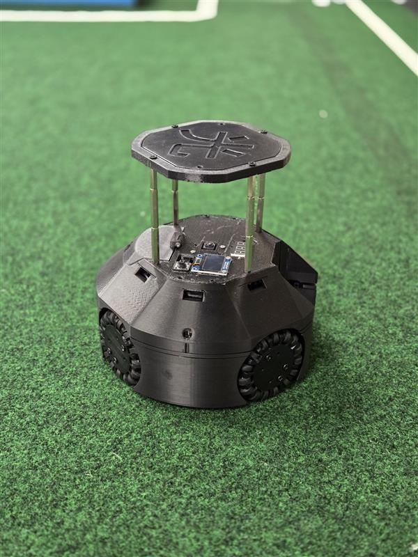
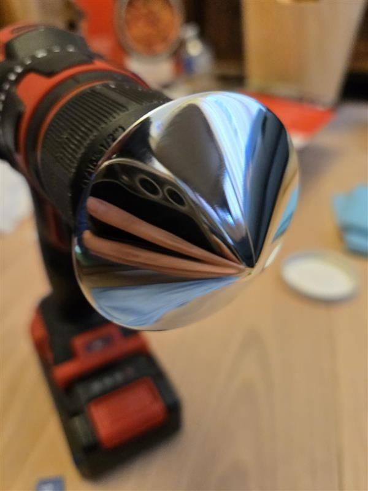

## Electronics Block Diagram

*Provide us with a block diagram of your robot's electronics*

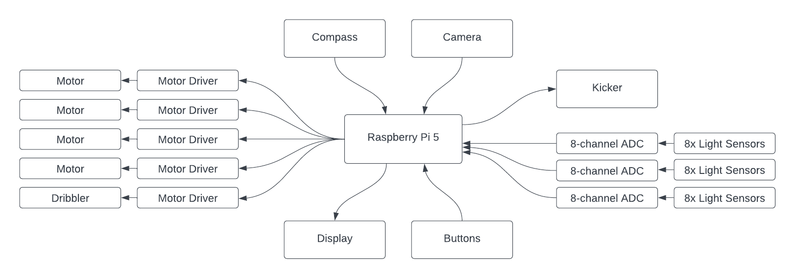

## Power Circuit

*How does your power circuits work?*

Our robot uses a 14.8V 4S LiPo battery.

A buck converter converts the voltage to 5V for our Raspberry Pi.
The Raspberry Pi internally converts the voltage to 3.3V, which our line sensors, display, and compass use.
The motor drivers run directly off battery voltage.
A boost converter boosts the voltage to 47V for our solenoid kicker.

## Motor Drive Circuit

*How do you drive your motors? Explain the circuits you use for that*

We use commercial motor drivers to drive our motors, which communicate with our Raspberry Pi through I2C.

## Microcontroller & Reason

*What kind of micro controller or board do you use for your robot? Why did you decide to use this part for your robot? If you have more than 1 processor, explain each one separately.*

We use a Raspberry Pi 5 for our robot, with no other microcontrollers. The reason we are using a Raspberry Pi is for ease of programming: the Pi can be programmed wirelessly over SSH, and with simpler programming languages such as Python. 

However, the Raspberry Pi does have drawbacks: it has a higher latency than traditional microcontrollers, and it offers significantly less interfaces/channels than most microcontrollers (for example, the Raspberry Pi only has 2 PWM channels, compared to the ESP32 which has 16 PWM channels).

## Ball Detection

*How does your ball detection sensors and/or camera[s] work?*

Our ball detection comprises of a Raspberry Pi Camera Module 3 Wide, facing up into a hyperbolic mirror. We modelled the hyperbolic mirror using the Conic Curve command in Fusion360, before ordering it to be CNCed by JLCPCB and polishing it by hand. 

Before ordering the mirror, we tested whether it would work using simulations and renderings in Blender. This allowed us to make adjustments to improve the mirror before actually manufacturing it, which was very helpful.

Our camera records a 60fps video of the mirror, which allows us to see the entire field. For every frame, we run Python code that uses OpenCV to detect blobs of specific colours (i.e. orange, yellow, blue) to detect the location of objects. We then filter out smaller blobs that could be noise and return the position of the largest object of each colour for the rest of the code to use.

## Line Detection

*How does your line detection circuits work?*

Our line detection circuits are comprised of 24x LED + light sensor pairs and 3x 8-channel ADCs. The specific model of phototransistor we are using is the ALS-PT19 light sensor and it gives a very good range of values; we would definitely recommend this sensor to future teams. 

We have the LEDs constantly switched on, then the ALS-PT19 light sensor will measure the light level and the ADS7830 8-channel ADC we are using will send the value to our Raspberry Pi through I2C. When the value is high, it indicates the light sensor is above an area of high reflectivity, so it is likely the white line, and when the value is low, it indicates that it is not the white line.

Using the 24 light sensors positioned evenly around the line sensor, we can additionally determine the angle of the line based on which light sensors are high and low, which allows us to more efficiently avoid or follow the line.

The schematic and PCB for our light sensor are published further down.

## Navigation/Position Sensors

*What sensors do you use for navigation and how are these sensors connected to your processor? What sensors do you use to find your position in the field? What about the direction your robot faces?*

We use the BNO085 IMU to ensure that our robot is facing in the direction we want it to. The BNO085 connects to our Raspberry Pi 5 over the I2C interface; the BNO085 also supports various other interfaces such as SPI if future teams would prefer to use that. 

To find our position in the field we use information from the camera to calculate our position based on the distance and angle to the blue and yellow goals. Initially we were intending to use time-of-flight sensors to find our position, but we decided to go with this camera-based approach to save space.

## Kicker Circuit

*How do you drive your kicker system? How does the circuit make the kicker work?*

Our kicker system comprises of a solenoid, a boost converter, an optocoupler, 3 capacitors, a N-channel MOSFET, and a diode.

The goal is to drive the solenoid with a high voltage. However, for switching a high voltage, a relatively beefy MOSFET must be used, which can't be driven directly off the Raspberry Pi's 3.3v gpio voltage. In order to resolve this issue, we use an optocoupler to allow the Raspberry Pi to control a 16v current, which can easily switch the MOSFET. A diode is connected across the leads of solenoid to mitigate spikes of flyback voltage.

## Dribbler Circuit

*How does your dribbler system work? What components and circuits did you use to drive it?*

For our dribbler, we use a commercial motor driver, which communicates with our Raspberry Pi through I2C.

## Schematics

*Schematics of your robot*

[https://drive.google.com/open?id=1fg3S07mf558lJIqGrwR8CF-eLukGvdDE](https://drive.google.com/open?id=1fg3S07mf558lJIqGrwR8CF-eLukGvdDE)

## PCB

*PCB of your robot*

[https://drive.google.com/open?id=1cksdT82kHk5fpXW9l8Fv6v2OdZhLxb0J](https://drive.google.com/open?id=1cksdT82kHk5fpXW9l8Fv6v2OdZhLxb0J)

## Innovation

*Innovations*

N/A

## Circuit Photos

*Photo of your circuit boards highlights*

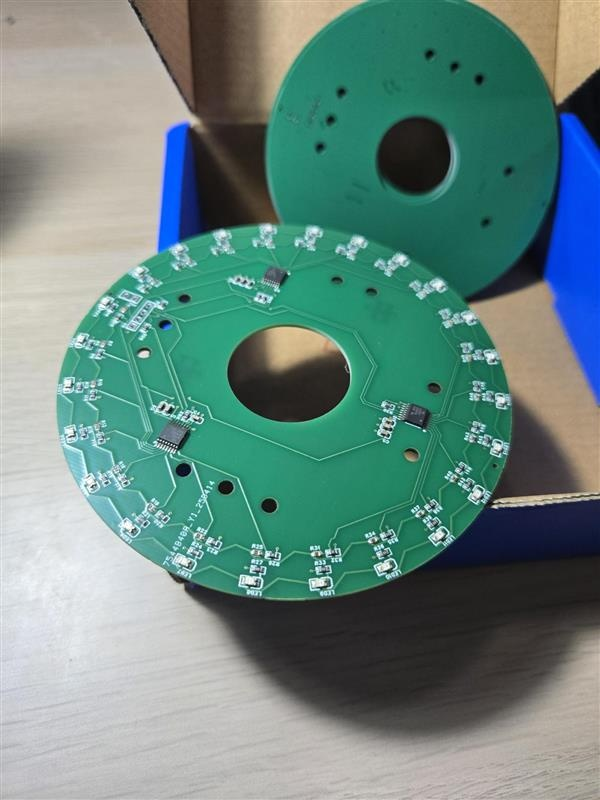

## Motor Control

*How do you use your processor to move your motors?*

Our motor drivers communicate with our Raspberry Pi 5 over I2C. The Raspberry Pi can send speed commands to the motor drivers, resulting in movement.

## Ball Detection Method

*How do you find where the ball is? How do you read the data from the ball detection sensors or camera?*

To detect the ball, the Python code uses OpenCV to detect orange blobs in the camera frame. We filter out small orange blobs and assume that the largest orange blob is the ball. In order to read the data from the camera, we use the picamera2 library.

## Ball Catch Algorithm

*How does your algorithm work to catch the ball? Is there a difference between your robots in how they move towards the ball? Explain the differences.*

The attacking and defending robots have different behaviours.
The attacking robot first rotates until it directly facing the ball, then the robot drives forward.
The defending robot just drives left and right sideways, based on the ball's angle.

## Line Algorithm

*How does your robot find the lines to stay inside the field? What algorithms do you use to avoid going out of bounds?*

To avoid going out of bounds, our robot uses the line sensor PCB mounted on the bottom of the robot. We can determine the angle of the line by considering which light sensors on the PCB have been activated: by averaging the angles, we can determine the angle of the line. Then, when the robot detects that it is on a line, it can drive away from the line using that angle.

## Goal Algorithm

*What algorithms do you use to score goals? How do you use your kicker and dribbler to handle the ball?*

When the robot gets near the ball, it will turn its dribbler on automatically. Then, when the ball is captured and inside the dribbler, it will slowly turn towards the target goal. Once the target goal is directly in front of the robot, it will kick the ball at a high speed.

## Defense Algorithm

*What algorithms do you use to avoid the opponent team scoring? How do your robots defend your own goal?*

To defend against the enemy team, we have a dedicated defender robot that will stay close to our own goal. The defender robot mainly only moves left and right. To ensure the defender robot doesn't stray too far from our own goal, we constantly check the distance of the robot from the goal, and move it backwards if its going too far.

## Robot Communication

*Do your robots communicate with each other? How do you use this communication to your advantage?*

Our robots don't communicate with each other

## Innovation2

*Innovations*

N/A

## GitHub Link

*GitHub link*

https://github.com/MelbourneHighSchool/hikari3

## BOM

*Bill of Materials (BOM)*

[https://drive.google.com/open?id=1jVHR6dG63v52kaGd6pKE1f2AuOcJGBM2](https://drive.google.com/open?id=1jVHR6dG63v52kaGd6pKE1f2AuOcJGBM2)

## Cost

*How much did it cost you to build your robots?*

Robots: 1950 AUD each
Experiments: 1400 AUD
Environment: 500 AUD

1 AUD = 0.66 USD

## Funding

*How did you gathered the funds to build the robots?*

65% school
30% sponsors
5% parents

## Affordability

*How affordable was it to compete in RoboCupJunior Soccer?*

5

## Answer Check

*Have you checked all of your answers?*

Yes!

## Publication Consent

*We publish TDPs and posters during or after the competition as described in the beginning*

Yes, we acknowledge everything submitted in the above form can be published.

## Email Address

*Email Address*

starryang544@gmail.com

## TDP File

*TDP File Upload (Not required)*

## Extra Column

*Column 67*

