## Timestamp

*Timestamp*

7/12/2025 14:44:31

## Team Name

*What is your team's name?*

IKARO

## League

*What league do you participate in?*

Lightweight League

## Country

*Where are you from?*

Italy

## Contact

*If other teams have questions about your robot, now or in the future, what email address(es) can we publish along with this document for people to reach you?

(You can put in multiple email addresses, like multiple team members, an email for the whole team or both. Feel free to share other ways of communication like Discord handles)*

paolo.torda@gmail.com

## Social Media

*Team Social Media Links (if you have any)*

https://www.instagram.com/ikaro_robotics/

## Team Photo

*Upload a photo of your whole team with your mentor and robots

Note: This is not mandatory and will be published along with your TDP if you choose to upload something*

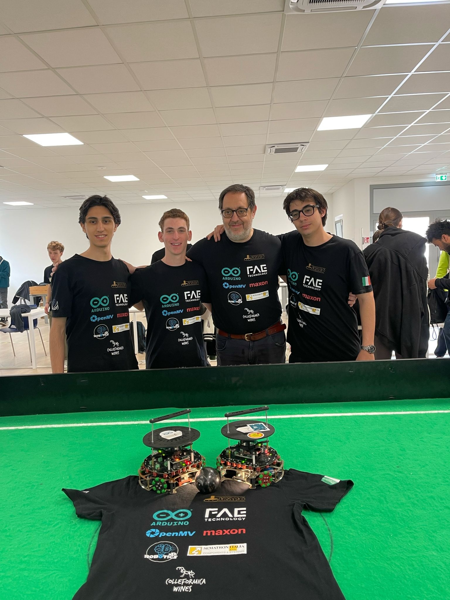

## Members & Roles

*What are the names of the team members and their role(s)?*

Lorenzo Addario : Camera software developer
Francesco D'angelo : Electronics and PCB Designer | Mechanical Developer
Andrea Perrina :  software developer

## Meeting Frequency

*How often did your team meet?
(e.g. 90 minutes once per week or a day every weekend.)*

during year

## Meeting Place

*Where did you meet to work on your robot?
(e.g. a robotics room at school, at some other place, one of your homes, school library etc.)*

During the school year, once a week for 3 hours; in the final period, every day.

## Start Date

*When did your team start working on this year's robot?*

October 2024 for hardware, December for software

## Past Competitions

*Which RoboCupJunior competitions have you competed in and in which leagues?*

Italian Championship (Verbania) 2024: Lightweight League
Rome cup 2024 (Rome): Lightweight League 
Italian Championship (Pescara) 2025: Lightweight League
Rome cup 2025 (Rome): Lightweight League 
World Championship 2024 (Eindhoven): Lightweight League

## Mentor Contribution

*Which parts of your work received the most contribution from your mentor?*

During the first year (2023), they received support with PCB design and software configuration. Over time, they became capable of developing the robot on their own, with the teacher providing only external supervision. In late 2024 the robot was made from their works.

## Workload Management

*How did you manage the workload?*

The majority of communication occurs in person in the laboratory, with additional use of WhatsApp, Gmail, and Google Drive for coordination and file sharing

## AI Tools

*Which AI tools did you use?*

actually there is only a limited use of AI, for software debugging and problem solving.

## Robot1 Overall

*Robot 1 Overall View*

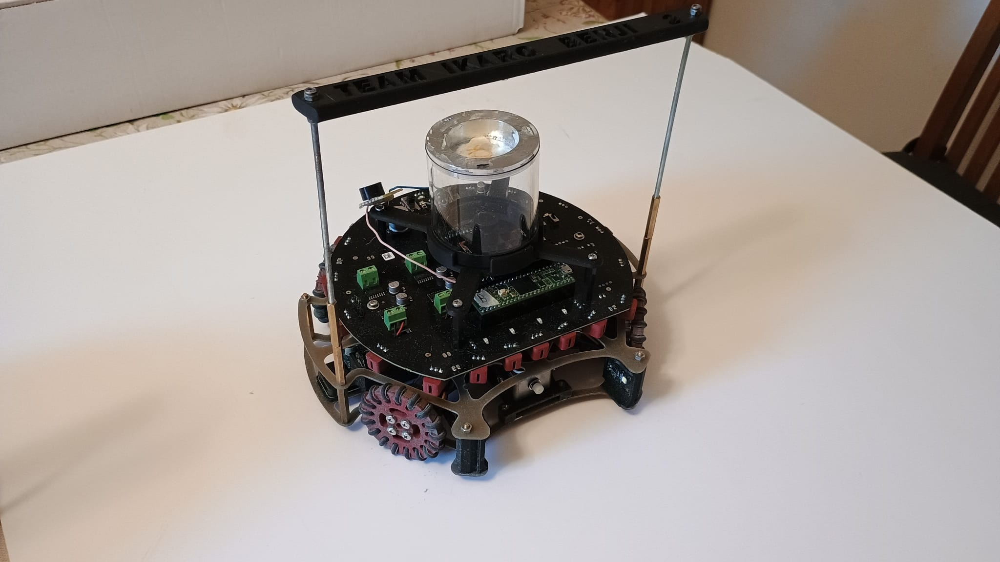

## Robot1 Front

*Robot 1 Front view*

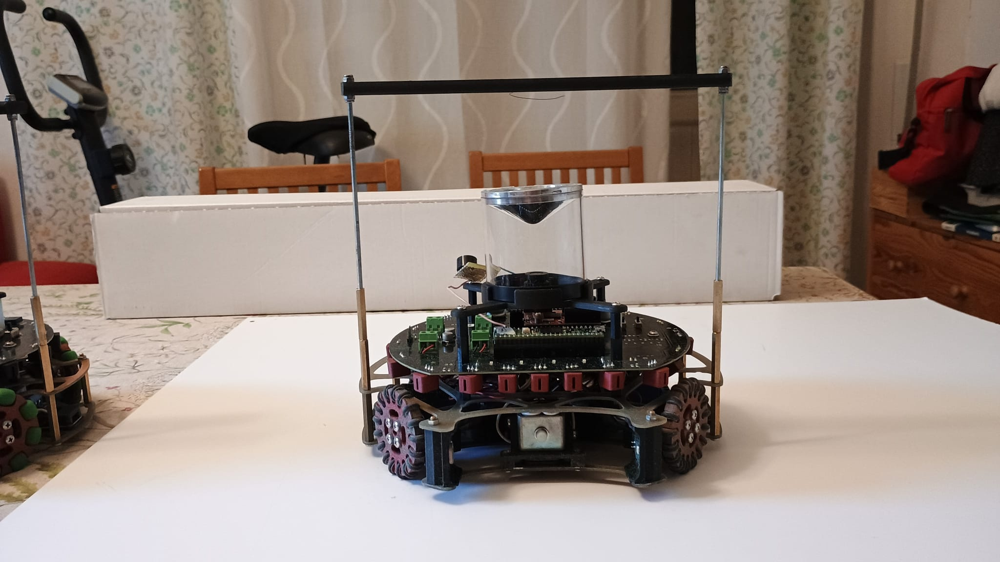

## Robot1 Back

*Robot 1 Back view*

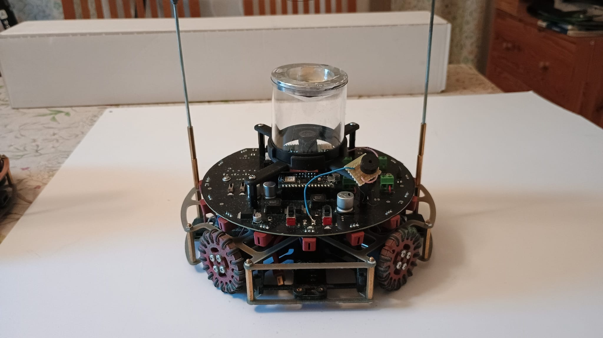

## Robot1 Top

*Robot 1 Top View*

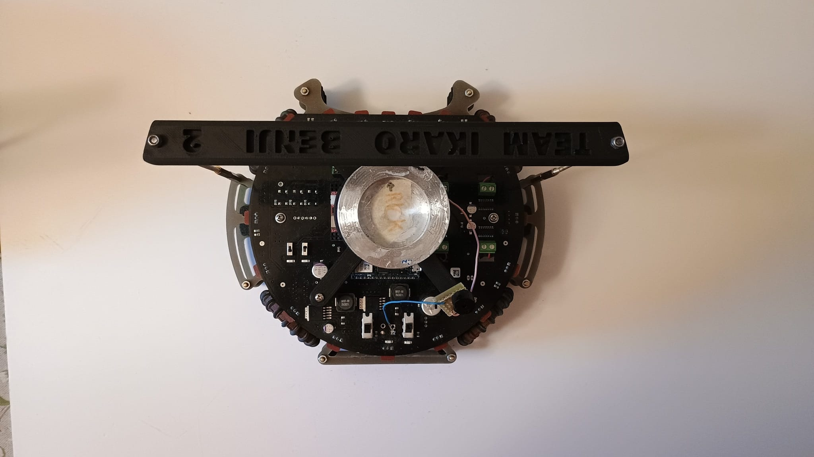

## Robot1 Bottom

*Robot 1 Bottom View*

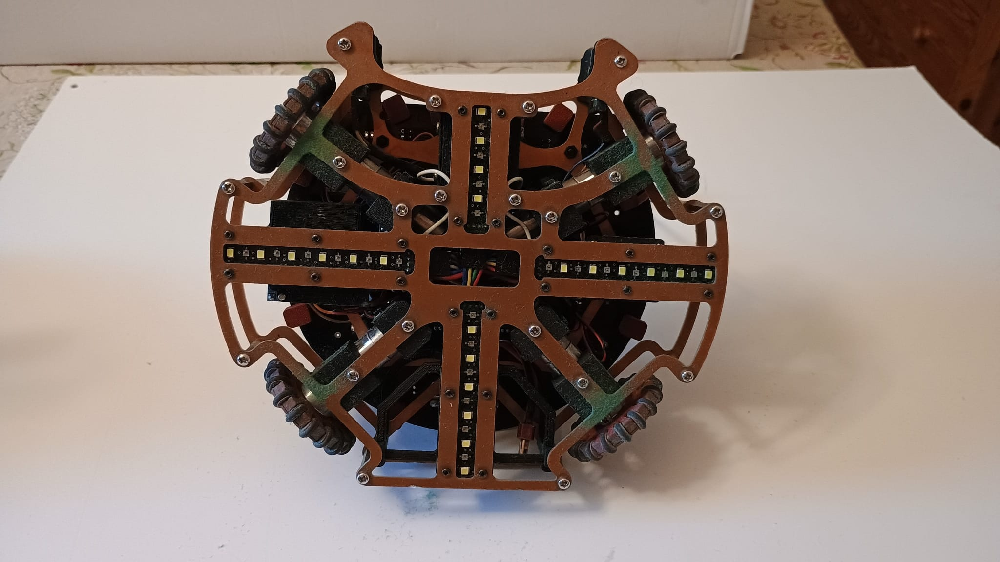

## Robot1 Right

*Robot 1 Right View*

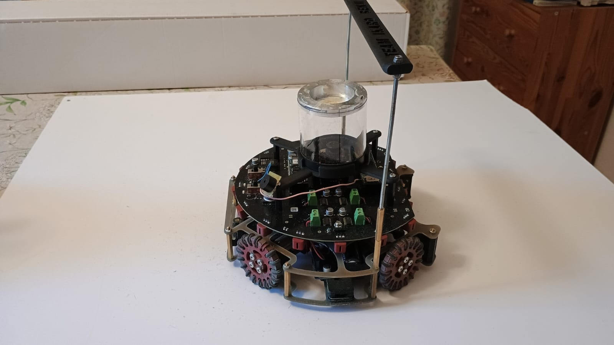

## Robot1 Left

*Robot 1 Left View*

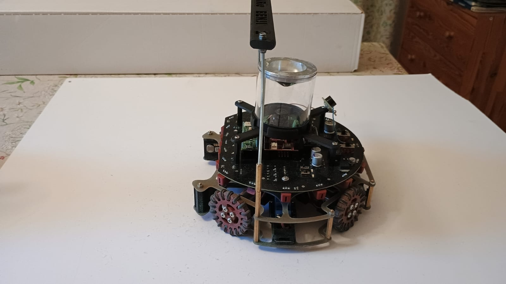

## Positioning & Movement

*How do you find your position inside the field and how do you use that position to move your robots around?*

Our robot is equipped with a camera and a conical mirror to see 360°.We use colour recognition to identify 
the angle of the two doors. 
We need this in order to decide the strategy of the game and to direct the robot towards the opponent's 
goal when attacking. 
Knowing the dimensions of the field and the angles at which the goals are located, we can determine the 
position in the field. 
For the robot, the centre of the field is the point (0,0), so the two goals have the coordinates (0, 200) and 
(0, -200). Using the chamber to find the angles between the goals and the robot (α) and (β), we find the 
equations of the two straight lines passing through the centre of the goal and the robot. The intersection of 
the two lines gives us the coordinates in the robot's field. This feature is actualy (12/7/2025)work in 
progress.

## Robot2 Overall

*Robot 2 Overall View*

## Robot2 Front

*Robot 2 Front view*

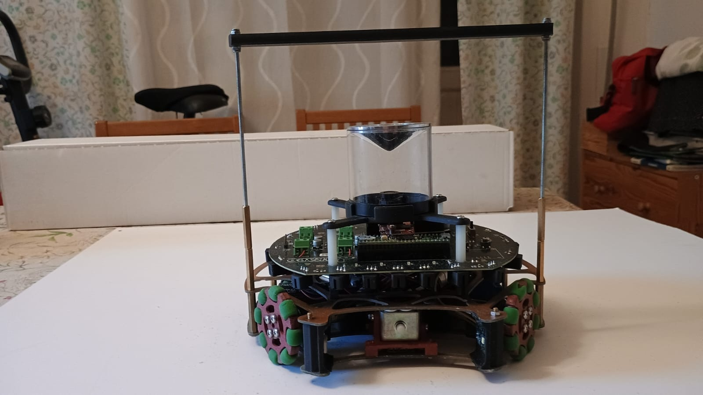

## Robot2 Back

*Robot 2 Back view*

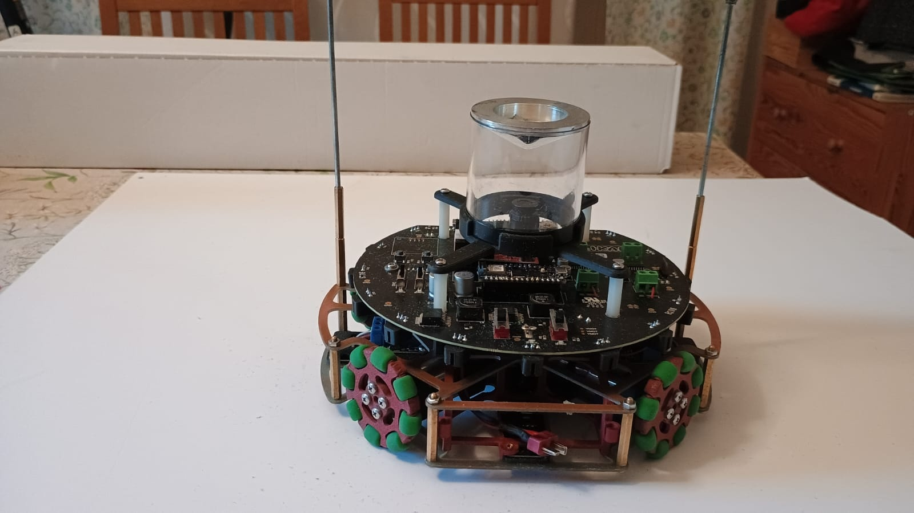

## Robot2 Top

*Robot 2 Top View*

## Robot2 Bottom

*Robot 2 Bottom View*

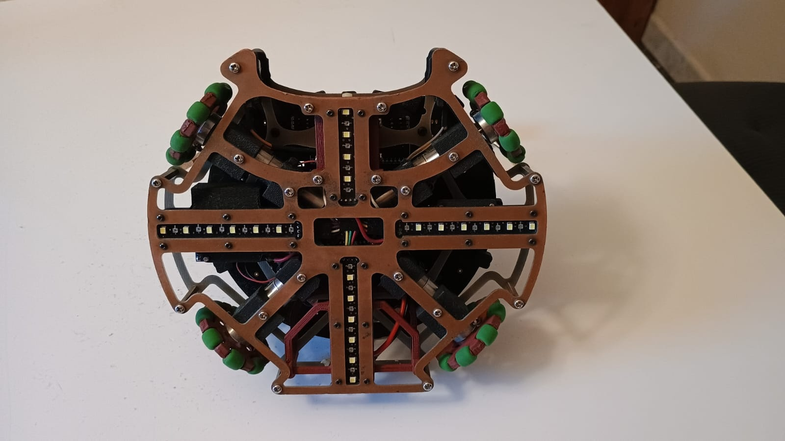

## Robot2 Right

*Robot 2 Right View*

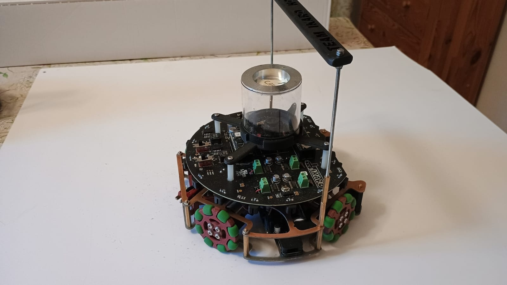

## Robot2 Left

*Robot 2 Left View*

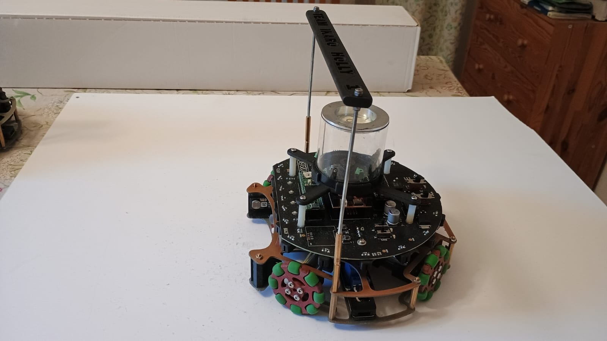

## Mechanical Design

*How did you design the mechanical parts of your robots?*

For design the mechanical parts we use Autodesk fusion.
For the realization was used 3D printer and cnc milling machine.
Our robots have been equipped with two bases, the lower base is the one on which the 4 motors, kicker, line sensors, and boost voltage system are attached. 
The upper base, on the other hand, is used to support the main PCB. 
These two bases are designed to be as light as possible, with many holes to save weight but 
without hurting the strength. Our robots have been equipped with two bases, the lower base is the one on which the 4 motors, kicker, line sensors, and boost voltage system are attached. 
The upper base, on the other hand, is used to support the main PC. 
As the material used, we chose vetronite because it is the material with the highest quality/price value. 
Omni-Wheels :
This year we decided to differentiate the wheels                                
on the robots, the defender needs more fluidity 
and stability in lateral movements, the striker 
needs speed to get to the ball quickly and 
braking to avoid going outside the lines. 
After several tests, we realized that braking is 
more suited to silicone cylinders and fluidity of 
movement to rubber rings. 
The silicone used is a two-component from two 
different densities that we poured and dried in 
“roll” shaped molds. It has a low enough density 
to have a very good grip but high enough to not 
wear out too much while playing. 
Improvements : 
Introduction of the dribbler mechanich.

## Build Method

*How did you build your design?*

PCB was realizad from one of our sponsor (FAE Technology, Bergamo (IT)), we produce the schematich and the pcb design  with Eagle / Autodesk Fusion
All the plastic and rubber parts was made from us in our laboratory. The mirror was made with the help of another teacher with a Proxxon lathe.

## Motors & Reason

*How many motors have you used and why?*

The wheels were designed using Autodesk Fusion, with the exception of the hubs, which were purchased from Pololu. The inner part is made of carbon-fiber-reinforced PLA and consists of two parts clamped together using the same screws as the hub. The rings and the tires were made using two-component silicone. First, we 3D-printed the molds in PLA, then poured the silicone into them. The choice of silicone type was inspired by a previous Italian team from another school. The color of the silicone also indicates the compound: white is softer but wears out quickly, while green is more durable and, for us, optimal.

## Kicker Design

*If your robot has a kicker, explain how you designed and built the mechanics of the kicker*

The kicker we use is a commercial solenoid, we design with the 3d printer the support.The kicker uses a solenoid mechanism. The voltage is boosted to approximately 40V to charge a capacitor, and the kick is activated through a relay.

## Dribbler Design

*If your robot has a dribbler, explain how you designed and built the mechanics of the dribbler.*

we don't have a dribbler

## CAD Files

*CAD design files*

https://drive.google.com/drive/folders/1Sr0x7_nmIDnWCsggzRnweyczGPE1vKvz?usp=sharing

## Mechanical Innovation

*Mechanical Innovation*

"The mechanical parts we are most satisfied with are the omnidirectional wheels. We studied two different types: one with rings and one with cylinders. The ring-based wheel provides smoother and more precise movement, while the cylinder-based version offers better grip. Their use depends on the type of carpet; in general, the more precise wheel is better suited for the goalkeeper, while the one with more grip is more appropriate for the attacker.

## Mechanical Photos

*Photos of your mechanical designs highlights*

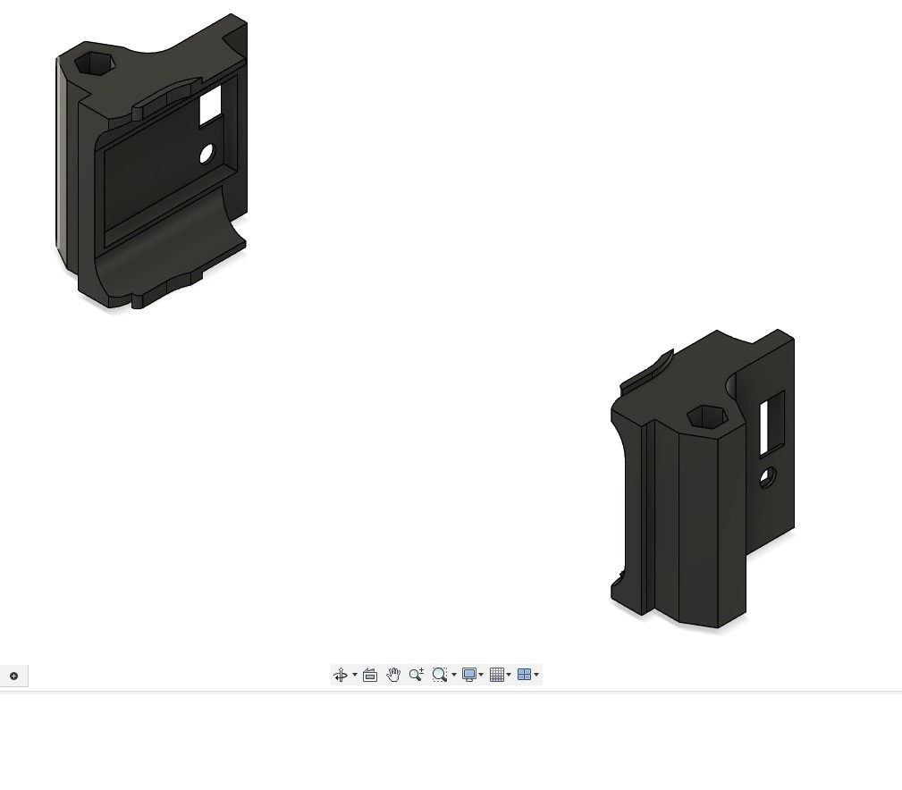
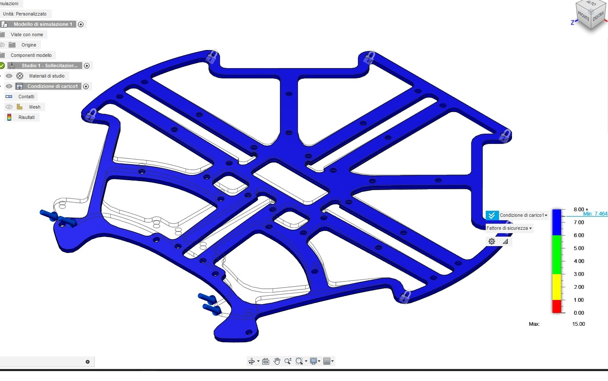
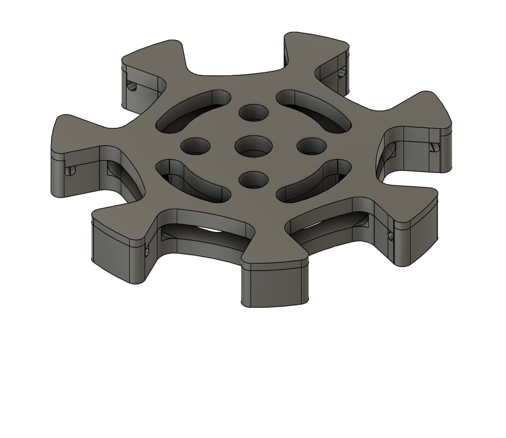
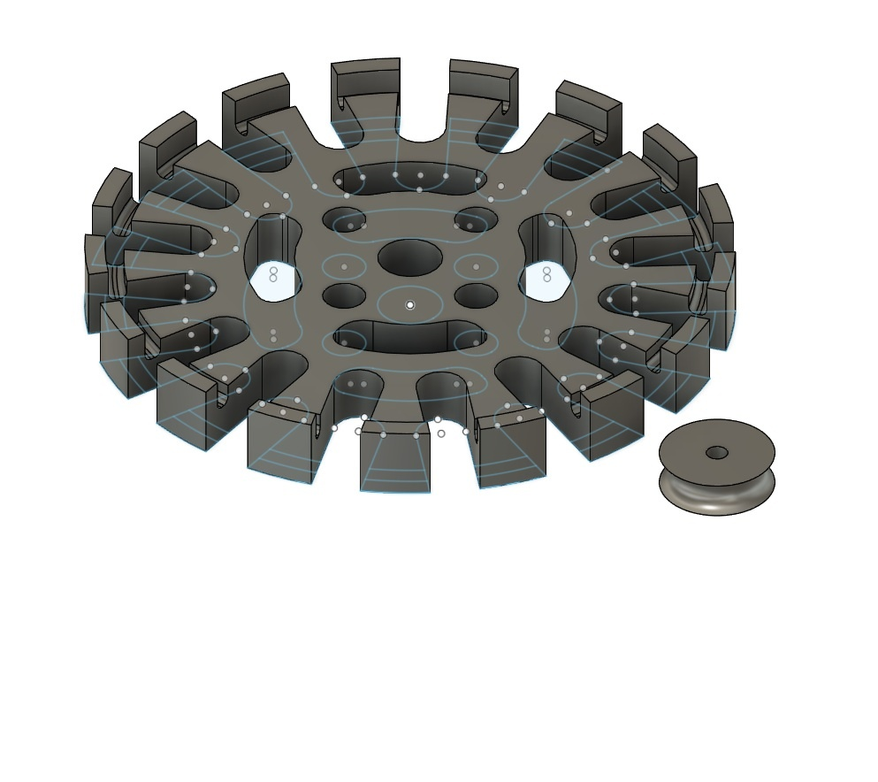

## Electronics Block Diagram

*Provide us with a block diagram of your robot's electronics*

[https://drive.google.com/open?id=1EWkYOOeorDVQrl2ahH3WCoDkhSs8cvLR](https://drive.google.com/open?id=1EWkYOOeorDVQrl2ahH3WCoDkhSs8cvLR)

## Power Circuit

*How does your power circuits work?*

Our robot has a 11.1V battery pack that is regulated to 3.3V for our microcontrollers ( Teensy and RP2040  )and used directly by the motor drivers. All the electronics wors at 3.3V

## Motor Drive Circuit

*How do you drive your motors? Explain the circuits you use for that*

The robot is equipped with a 3S LiPo battery (11.1V). The motor drivers run directly on 11.1V, the main electronics operate at 3.3V. A step-up voltage converter is used to supply 40V to the kicker system.

## Microcontroller & Reason

*What kind of micro controller or board do you use for your robot? Why did you decide to use this part for your robot? If you have more than 1 processor, explain each one separately.*

The main processor chosen is the Teensy 4.1, selected for its high number of I/O pins (all of which are in use), a good number of analog inputs, and at least three serial ports. These serial ports are used to communicate with the camera, the ball detection system, and optionally with a Bluetooth module. Other advantages include its high clock speed (600 MHz) and ample memory capacity.

A secondary microcontroller, the Arduino Nano RP2040, is used to read the ball sensors, calculate the angle and distance, and communicate with the Teensy via serial. For this role, at least 18 digital inputs and a serial interface (in addition to USB) were required.

## Ball Detection

*How does your ball detection sensors and/or camera[s] work?*

To calculate the ball angle, the Arduino RP2040 continuously reads each sensor over a 10 ms period. The sensor that has the clearest view of the ball will register a higher number of zero readings (indicating strong detection) compared to the others. The sensors with the highest number of detections are selected, and a weighted average is calculated to determine the ball's angle. The sensor readings also provide an estimate of the ball's distance, although this measurement is not very precise and depends on the ball's orientation.

## Line Detection

*How does your line detection circuits work?*

To detect the field lines, we use 8 sensors, each consisting of a white-emitting LED and a phototransistor. Each sensor is read using an analog input, and the output value increases when a white line is detected. The detection threshold is set in software. The 8 sensors are arranged in a cross pattern, with 4 positioned internally and 4 externally.

## Navigation/Position Sensors

*What sensors do you use for navigation and how are these sensors connected to your processor? What sensors do you use to find your position in the field? What about the direction your robot faces?*

The navigation sensors include the camera and the IMU. The IMU is used to orient the robot in the desired direction using a PID algorithm—typically towards the north or the opponent’s goal. Using the camera combined with a conical mirror, we can calculate the angle to the opponent’s goal when attacking, or to our own goal when defending.

If both goals are visible in the camera’s field of view, the robot’s position on the field can be estimated using an algorithm based on analytic geometry. This method is effective especially when the robot is angled relative to the goal.

Line sensors are also used for position recognition. For example, the goalkeeper returns to its own goal and stops when the southeast external sensor detects the area line.

## Kicker Circuit

*How do you drive your kicker system? How does the circuit make the kicker work?*

The kicker circuit includes a step-up voltage converter that boosts the input to around 40V, a capacitor charged to this voltage level, and a relay used to trigger the solenoid for the kicking action. The solenoid is a commercial component.

## Dribbler Circuit

*How does your dribbler system work? What components and circuits did you use to drive it?*

we don't have a dribbler.

## Schematics

*Schematics of your robot*

[https://drive.google.com/open?id=1MIx-Wm7q2aERfddV-A2G_yi9BE85VZRK](https://drive.google.com/open?id=1MIx-Wm7q2aERfddV-A2G_yi9BE85VZRK)
[https://drive.google.com/open?id=1iBXqmeuORFZ_69yqu-MFYsYO8y5Q2g0s](https://drive.google.com/open?id=1iBXqmeuORFZ_69yqu-MFYsYO8y5Q2g0s)
[https://drive.google.com/open?id=1ty9y8EYhYJOvfRAiMLSTfNpPzaP6kLe_](https://drive.google.com/open?id=1ty9y8EYhYJOvfRAiMLSTfNpPzaP6kLe_)

## PCB

*PCB of your robot*

[https://drive.google.com/open?id=1-WwucWmXkVHKqp6EC1Ig_f8UM5XGw9cW](https://drive.google.com/open?id=1-WwucWmXkVHKqp6EC1Ig_f8UM5XGw9cW)
[https://drive.google.com/open?id=1c6bWV5PDtdXXwjk2CZ0TcWsxgAFRGUvD](https://drive.google.com/open?id=1c6bWV5PDtdXXwjk2CZ0TcWsxgAFRGUvD)
[https://drive.google.com/open?id=1p74Kzuc-FRt8NWkqyKSLgFbkh6z0zoOr](https://drive.google.com/open?id=1p74Kzuc-FRt8NWkqyKSLgFbkh6z0zoOr)

## Innovation

*Innovations*

Overall, we are very satisfied with the PCB design. In two and a half years, we have progressed from having only basic knowledge of PCB design to developing a complex system, significantly improved from last year’s project. The motor drivers have proven to be reliable, and we have not encountered any issues related to noise or malfunction.

The kicker control circuit, which uses a relay, is not optimal—we initially intended to design one using MOSFETs—but it has nonetheless proven to be reliable. For this reason, we decided to focus our efforts on other aspects of the robot." While there are no significant innovations compared to last year's robots, numerous small improvements have been implemented.

## Circuit Photos

*Photo of your circuit boards highlights*

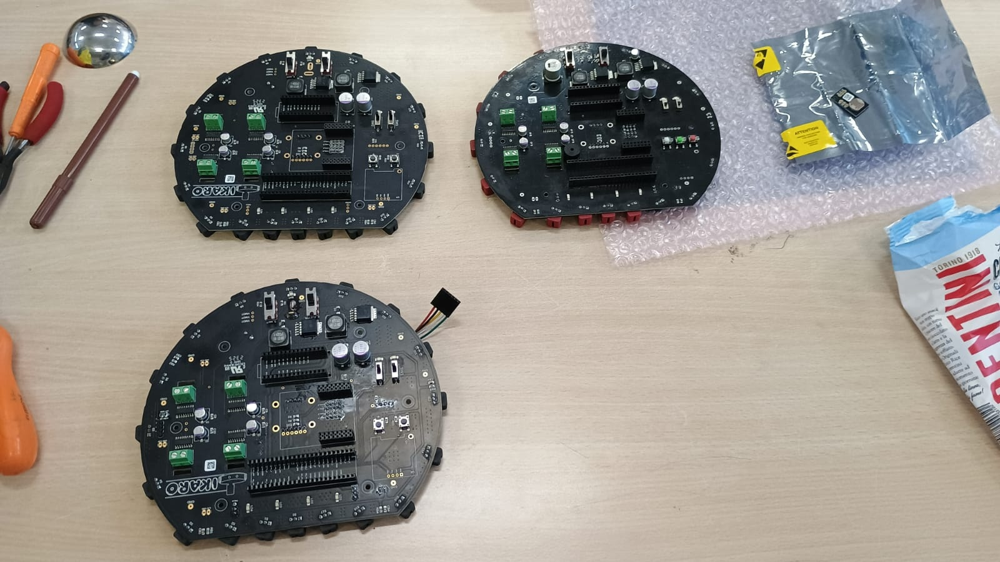

## Motor Control

*How do you use your processor to move your motors?*

To drive the motors with omnidirectional movement, we use a calculation system based on publications from RoboCup Major. Additionally, we employ a PID controller to prevent the robot from oscillating and to keep it consistently oriented towards the north or the goal. For these calculations, we use data from the IMU along with an Arduino library.

## Ball Detection Method

*How do you find where the ball is? How do you read the data from the ball detection sensors or camera?*

To calculate the ball angle, the Arduino RP2040 continuously reads each sensor over a 10 ms period. The sensor that has the clearest view of the ball will register a higher number of zero readings (indicating strong detection) compared to the others. The sensors with the highest number of detections are selected, and a weighted average is calculated to determine the ball's angle. The sensor readings also provide an estimate of the ball's distance, although this measurement is not very precise and depends on the ball's orientation.

## Ball Catch Algorithm

*How does your algorithm work to catch the ball? Is there a difference between your robots in how they move towards the ball? Explain the differences.*

Determining the robot’s optimal movement toward the ball required numerous tests and is still not fully optimized. Generally, the 360-degree field of view is divided into sectors. For the rear and side sectors, the robot moves toward the ball but avoids approaching it directly to prevent accidental collisions. For the front sectors, we use a PID system to ensure the robot captures the ball with its ‘mouth.’

Since the ball detection system is not perfect, the robot sometimes miscalculates movements and approaches the ball from the side. Slowing down the robot improves accuracy but negatively impacts overall game performance.

## Line Algorithm

*How does your robot find the lines to stay inside the field? What algorithms do you use to avoid going out of bounds?*

The robot’s software is based on a state machine. Usually, the robot operates in the 'playing' state, but when it detects a line, it first enters a 'braking' state for 25 ms, followed by a 'reaction' state where the robot moves away from the active line sensors. The duration of the reaction state varies depending on the situation, but generally, the robot remains in this state until it has fully re-entered the playing area.

## Goal Algorithm

*What algorithms do you use to score goals? How do you use your kicker and dribbler to handle the ball?*

The robot tends to capture the ball with its ‘mouth’ and orient itself toward the goal, as indicated by the camera.When the robot has the ball in its ‘mouth’ (where a sensor is located) and is properly oriented towards the opponent’s goal, the kicker is activated. To protect the circuits, the kicker can be triggered at most once every 2 seconds.

## Defense Algorithm

*What algorithms do you use to avoid the opponent team scoring? How do your robots defend your own goal?*

The goalkeeper stays on the goal area line, oriented toward its own goal and positioned in front of the ball. Usually, it remains in this position unless the ball is close for at least 2 seconds. In that case, it switches to attacker mode and attempts to score.

## Robot Communication

*Do your robots communicate with each other? How do you use this communication to your advantage?*

Currently, we have not yet completed communication between the robots.

## Innovation2

*Innovations*

The most important innovation is the introduction of a PID algorithm to position the robot in front of the ball, both as attacker and goalkeeper. This is expected to provide greater control and precision.

## GitHub Link

*GitHub link*

https://drive.google.com/drive/folders/1Sr0x7_nmIDnWCsggzRnweyczGPE1vKvz?usp=sharing

## BOM

*Bill of Materials (BOM)*

[https://drive.google.com/open?id=1H9puK6L6qzhNkvKhp-9i8zU26KDGU4d1](https://drive.google.com/open?id=1H9puK6L6qzhNkvKhp-9i8zU26KDGU4d1)

## Cost

*How much did it cost you to build your robots?*

The most expensive components are the motors, which cost around €150 each, and the camera, which costs approximately €100. The Teensy costs about €35. The PCBs and most electronic components were provided by our sponsors. We estimate the cost of each robot to be around €700–800.

To this, we must add the cost of components that were damaged—such as at least two cameras (due to handling errors), one Teensy, and some batteries. In this version of the robot, we did not make major purchasing mistakes, as most experiments were initially conducted using components already available in our lab. The field we use is also quite old, at least 10 years.

Overall, we can estimate the cost per robot at approximately €1,500, with an additional €200–300 per year for experimentation, and around €1,000 for basic equipment such as the field and at least two balls.

## Funding

*How did you gathered the funds to build the robots?*

40% sponsors
40% school
20% parents

## Affordability

*How affordable was it to compete in RoboCupJunior Soccer?*

1

## Answer Check

*Have you checked all of your answers?*

Yes!

## Publication Consent

*We publish TDPs and posters during or after the competition as described in the beginning*

Yes, we acknowledge everything submitted in the above form can be published.

## Email Address

*Email Address*

paolo.torda@gmail.com

## TDP File

*TDP File Upload (Not required)*

## Extra Column

*Column 67*

