## Timestamp

*Timestamp*

7/11/2025 23:12:44

## Team Name

*What is your team's name?*

LARES

## League

*What league do you participate in?*

Lightweight League

## Country

*Where are you from?*

South Korea

## Contact

*If other teams have questions about your robot, now or in the future, what email address(es) can we publish along with this document for people to reach you?

(You can put in multiple email addresses, like multiple team members, an email for the whole team or both. Feel free to share other ways of communication like Discord handles)*

maison102938@gmail.com

## Social Media

*Team Social Media Links (if you have any)*


## Team Photo

*Upload a photo of your whole team with your mentor and robots

Note: This is not mandatory and will be published along with your TDP if you choose to upload something*


## Members & Roles

*What are the names of the team members and their role(s)?*

SiYeong (Offense Programming), MinJun (Defense Programming), Sehwan (Hardware)

## Meeting Frequency

*How often did your team meet?
(e.g. 90 minutes once per week or a day every weekend.)*

14 hours per week

## Meeting Place

*Where did you meet to work on your robot?
(e.g. a robotics room at school, at some other place, one of your homes, school library etc.)*

a robotics room at school

## Start Date

*When did your team start working on this year's robot?*

March,2025

## Past Competitions

*Which RoboCupJunior competitions have you competed in and in which leagues?*

Netherlands open 2024: Lightweight League

## Mentor Contribution

*Which parts of your work received the most contribution from your mentor?*

We discussed an algorithm for not entering the penalty zone.

## Workload Management

*How did you manage the workload?*

We used Notion to manage our schedule and tasks.

## AI Tools

*Which AI tools did you use?*

We used ChatGpt to debug our codes.

## Robot1 Overall

*Robot 1 Overall View*

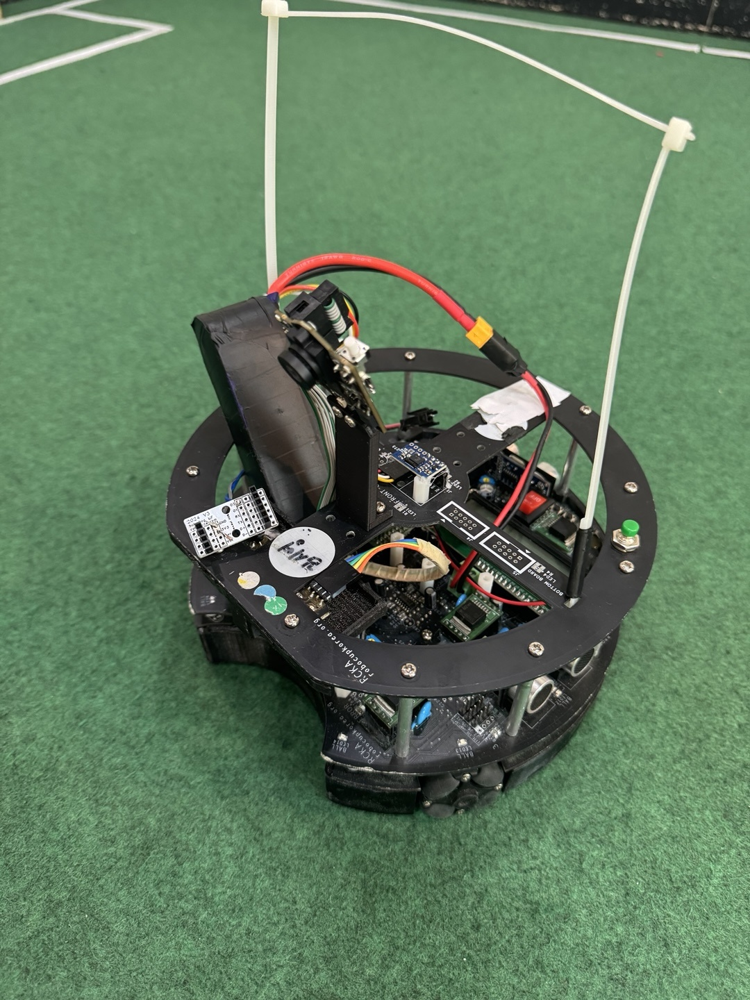

## Robot1 Front

*Robot 1 Front view*

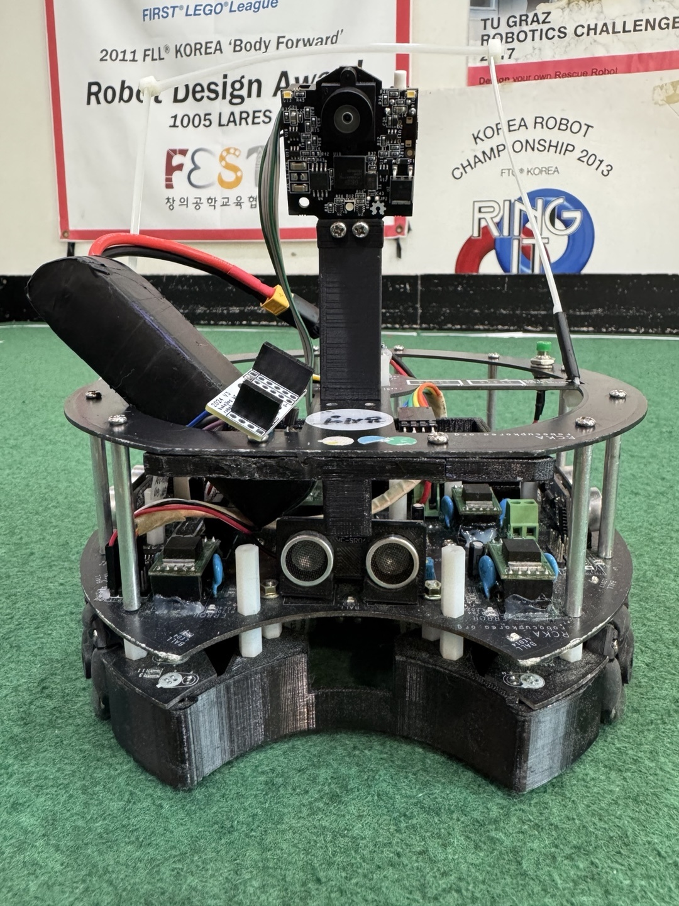

## Robot1 Back

*Robot 1 Back view*

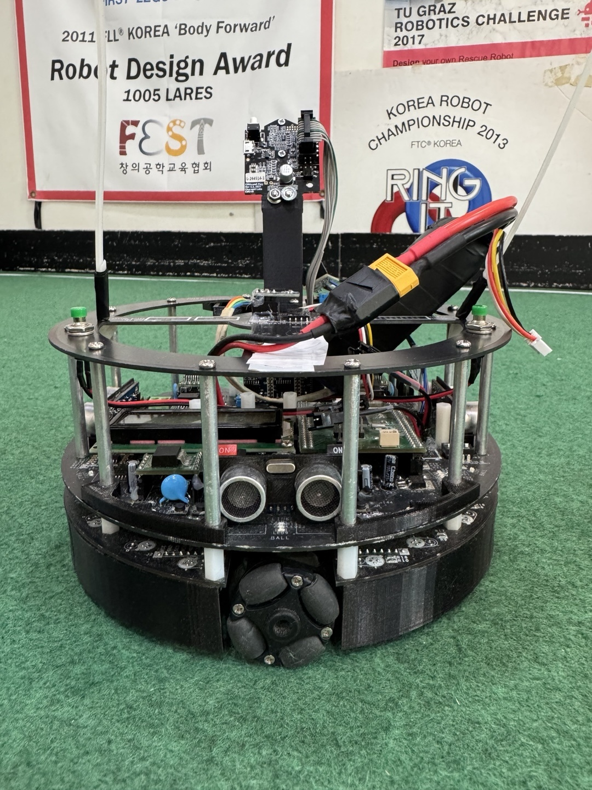

## Robot1 Top

*Robot 1 Top View*

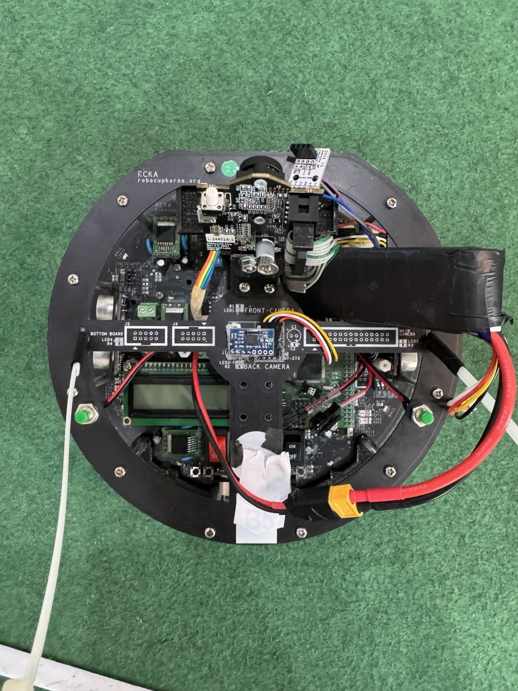

## Robot1 Bottom

*Robot 1 Bottom View*

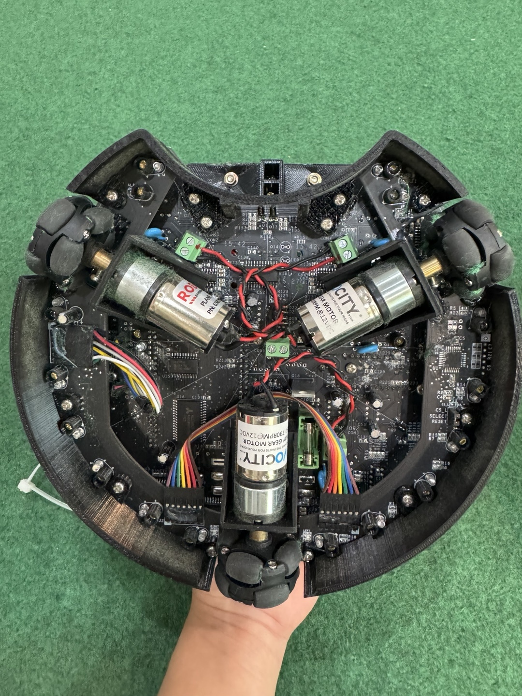

## Robot1 Right

*Robot 1 Right View*

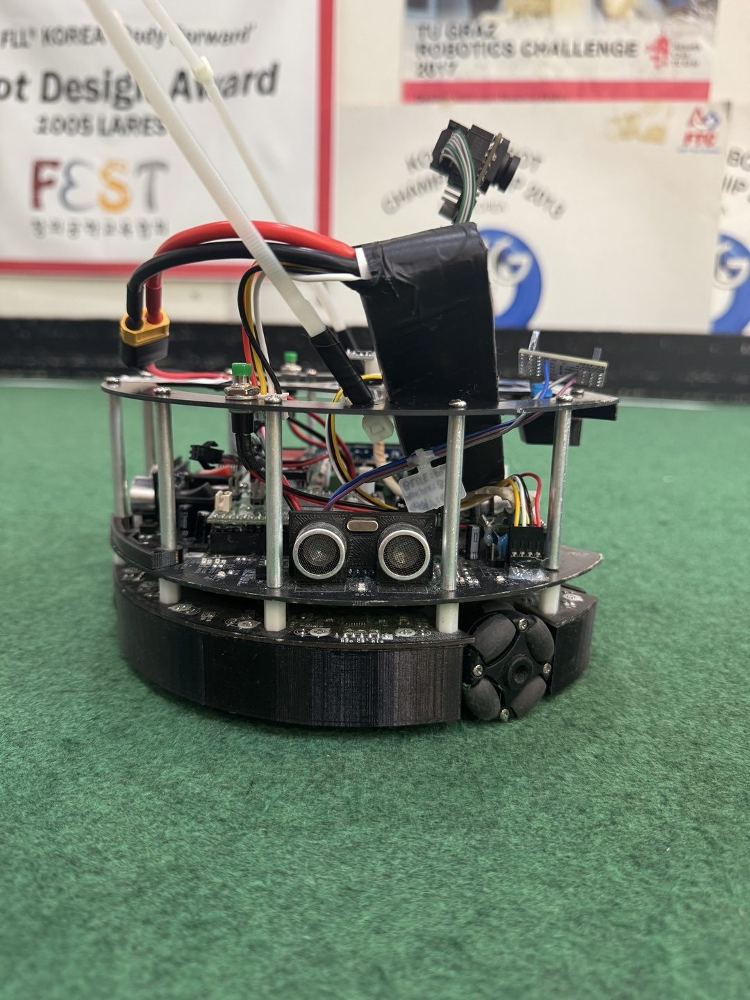

## Robot1 Left

*Robot 1 Left View*


## Positioning & Movement

*How do you find your position inside the field and how do you use that position to move your robots around?*

We used ultrasonic sensors and camera sensors to find position inside the field.
The robot uses ultrasonic sensors to determine the relative distance from the wall, and uses camera sensors to determine the position of the goalpost.

## Robot2 Overall

*Robot 2 Overall View*

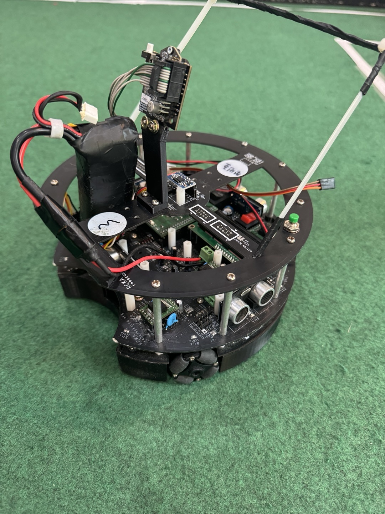

## Robot2 Front

*Robot 2 Front view*

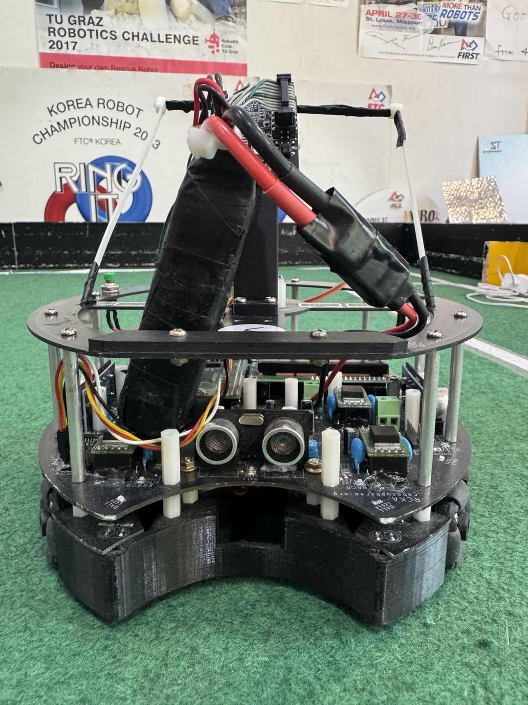

## Robot2 Back

*Robot 2 Back view*

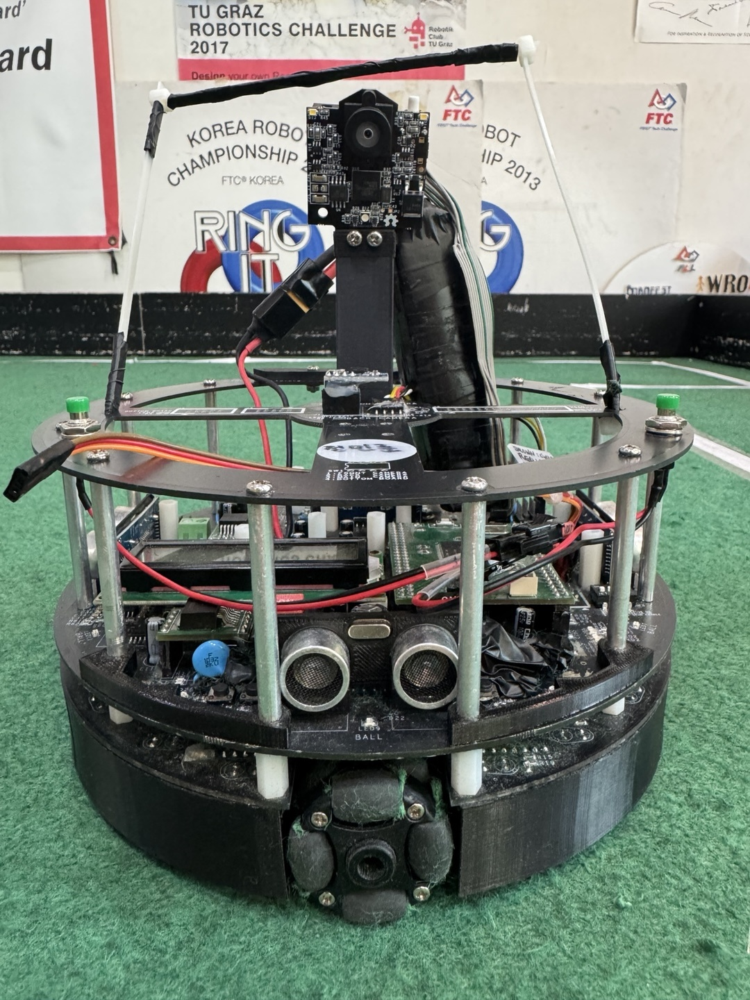

## Robot2 Top

*Robot 2 Top View*

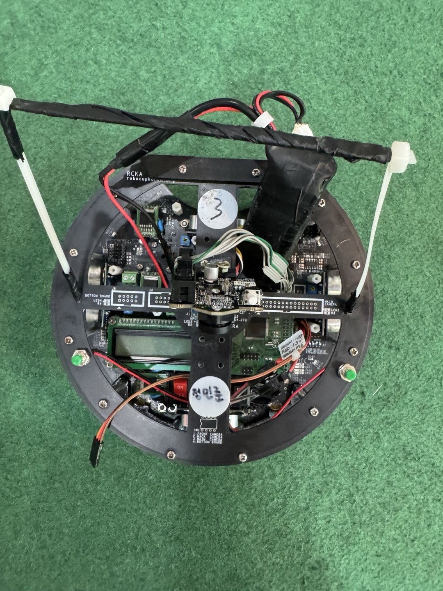

## Robot2 Bottom

*Robot 2 Bottom View*

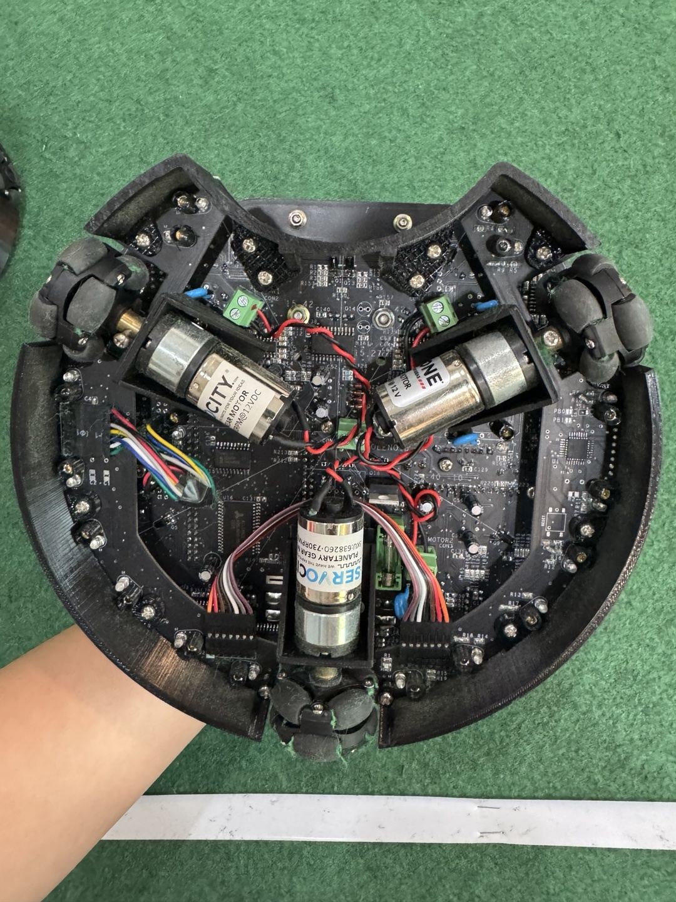

## Robot2 Right

*Robot 2 Right View*

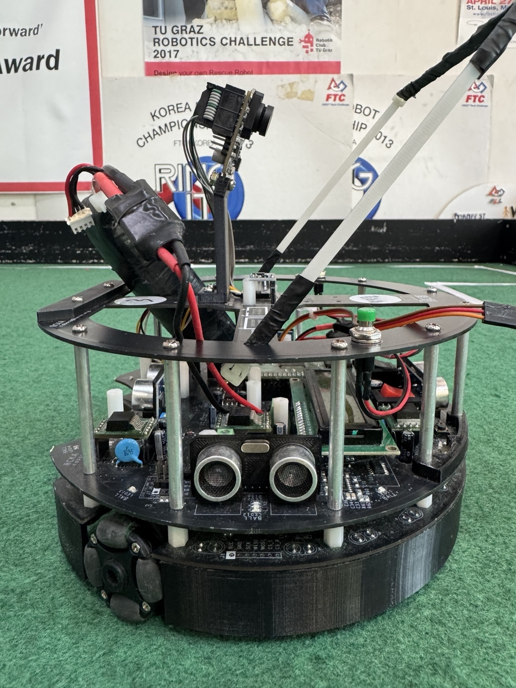

## Robot2 Left

*Robot 2 Left View*

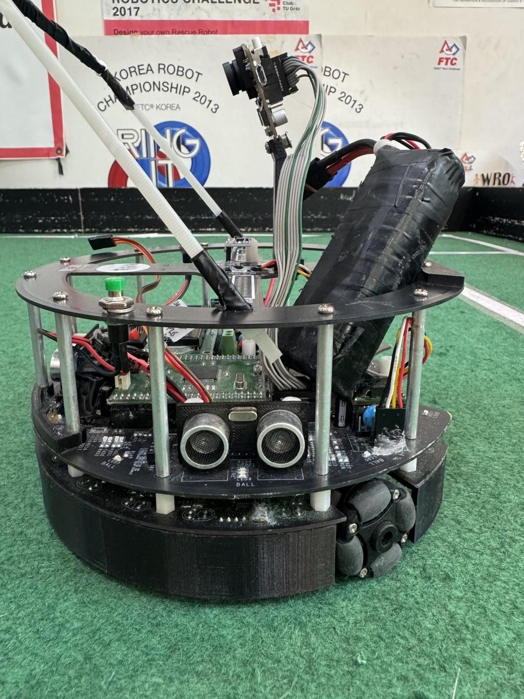

## Mechanical Design

*How did you design the mechanical parts of your robots?*

We primarily use the ATmega2560 as the mainboard. To detect the boundary lines on the field, we use 12 Arduino light sensors. For ball detection, we use 16 IR sensors, and to detect walls, we use ultrasonic sensors. To measure the robot's orientation changes, we use a BNO055 compass sensor.

## Build Method

*How did you build your design?*

We designed the robot using ATMega 2560 compatible parts.
To make the robot's guard and other parts, a credibility 3D printer was used.

## Motors & Reason

*How many motors have you used and why?*

We used three motors, the minimum number of motors that can move quickly and freely through a two-dimensional plane. We control the robot using the concept of vectors.

## Kicker Design

*If your robot has a kicker, explain how you designed and built the mechanics of the kicker*

N/A

## Dribbler Design

*If your robot has a dribbler, explain how you designed and built the mechanics of the dribbler.*

N/A

## CAD Files

*CAD design files*

N/A

## Mechanical Innovation

*Mechanical Innovation*

Using a 3D printer and a light sensor, we created a device to check if the robot caught the ball. By putting the device in front of the robot, it could decide whether to shoot or not.

## Mechanical Photos

*Photos of your mechanical designs highlights*


## Electronics Block Diagram

*Provide us with a block diagram of your robot's electronics*


## Power Circuit

*How does your power circuits work?*

Our robot has a 11.1V battery pack that is regulated to 5V for our Arduino and used directly by the motor drivers.

## Motor Drive Circuit

*How do you drive your motors? Explain the circuits you use for that*

Each of the three motors is controlled by its respective motor drivers.

## Microcontroller & Reason

*What kind of micro controller or board do you use for your robot? Why did you decide to use this part for your robot? If you have more than 1 processor, explain each one separately.*

We used the ATmega 2560 board as the mainboard.

## Ball Detection

*How does your ball detection sensors and/or camera[s] work?*

Our robots each have 12 IR sensors. This allows us to determine which of the 12 directions the ball is in.

## Line Detection

*How does your line detection circuits work?*

Our robots each have 16 light sensors. If one of each sensor detects a white color, it escapes in the opposite direction of that sensor.

## Navigation/Position Sensors

*What sensors do you use for navigation and how are these sensors connected to your processor? What sensors do you use to find your position in the field? What about the direction your robot faces?*

The most core sensors are Ultrasonic sensors (4 total) ()
The ultrasonic sensors are placed at the 12, 3, 6, and 9 o’clock positions when viewed from above.
These are used to measure the distance from walls and other objects.
They are connected to digital I/O pins and are checked using timer interrupts.
If the ball is not detected, the robot uses the ultrasonic sensors to move toward the center of the field.

## Kicker Circuit

*How do you drive your kicker system? How does the circuit make the kicker work?*

N/A

## Dribbler Circuit

*How does your dribbler system work? What components and circuits did you use to drive it?*

N/A

## Schematics

*Schematics of your robot*


## PCB

*PCB of your robot*


## Innovation

*Innovations*

We use 16 line sensors placed around the bottom edge of the robot.
Each sensor checks whether it sees the white boundary line.

If a sensor detects the line, it gives us a direction using its fixed position.
We use a function called LSDir(i) that returns the angle of sensor i.
When multiple sensors are triggered, we calculate the average direction as a vector sum.

In real matches, this dynamic line escape algorithm achieved a success rate of approximately 98%, making it one of the most reliable parts of our system.

## Circuit Photos

*Photo of your circuit boards highlights*

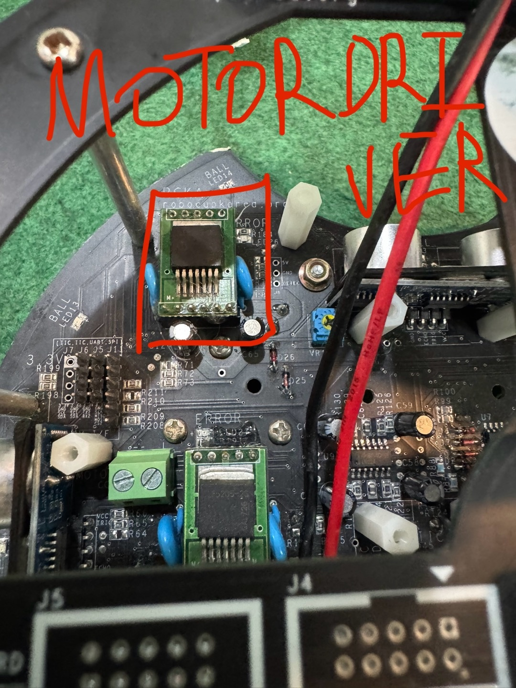

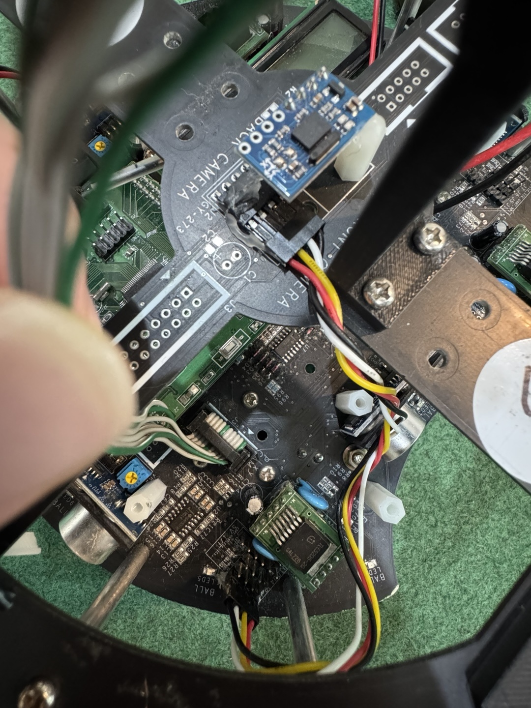
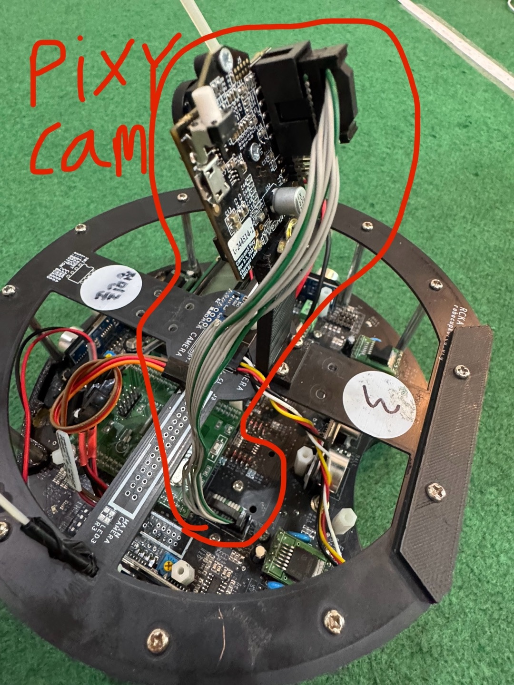


## Motor Control

*How do you use your processor to move your motors?*

Our robot uses 3 DC motors with omni-wheels for full-direction movement.
Each motor is controlled through a driver, which is connected to the ATmega2560 processor.
The processor sends signals to the motor drivers to control speed and direction.

We use a function called dir_move() to move the robot in 12 possible directions.
This function works together with the BNO055 compass sensor, so the robot can move in the correct direction based on its heading.
For example, when the opponent’s goal is at 180°, the robot can move forward, backward, or sideways relative to that direction.

## Ball Detection Method

*How do you find where the ball is? How do you read the data from the ball detection sensors or camera?*

We use 12 IR ball sensors placed around the robot in a circle, every 30 degrees.
These sensors detect the infrared signal from the ball.

The processor reads the values from each sensor and stores them in an array.
We take the average of the last four readings for each sensor to make the result more stable.
Then we find the sensor with the highest value, and use that to decide the ball direction.

The software uses two key variables:

ball_dir: the direction of the ball (0 to 11, like a clock)

max_ir: the strongest sensor value

Using these values, our program decides how the robot should move or defend.
We do not use a camera for ball detection.

## Ball Catch Algorithm

*How does your algorithm work to catch the ball? Is there a difference between your robots in how they move towards the ball? Explain the differences.*

Our robot uses 12 IR sensors to detect the direction of the ball.
The sensor with the strongest signal is stored as ball_dir, and the robot moves toward that direction using the dir_move() function.

If the ball is very close (for example, the front ultrasonic sensor detects a distance under 7 cm), the robot increases its speed to go straight and catch the ball quickly.
This allows the robot to react fast and approach the ball without needing a mechanical dribbler.

We have two different roles: offense and defense.
Each robot uses a different function in the code: ATTACK() for the offensive robot and DEFENCE() for the defensive robot.

The offense robot moves quickly and aggressively toward the ball when it is detected.

The defense robot stays near the goal and moves more carefully, only going to the ball when it is close enough.

If the ball is not detected, the robot uses ultrasonic sensors to move back to the center of the field and search again.

## Line Algorithm

*How does your robot find the lines to stay inside the field? What algorithms do you use to avoid going out of bounds?*

Our robot uses 16 line sensors arranged around the bottom edge of the robot.
Each sensor checks for a white boundary line by comparing its value to a specific threshold.

If a sensor sees the line, we use a function LSDir(i) to get its direction (in degrees).
We then calculate the average vector direction of all sensors that see the line.
This tells us the best direction to escape.

Here is how the algorithm works:

Each sensor compares its value with a set threshold (lineThr[i]).

If the value is high, that means the sensor sees the white line.

For each active sensor, we calculate a direction vector using its angle.

All vectors are added to find an average escape direction.

The robot moves in that direction to return to the safe area.

This dynamic system helps the robot escape even when only a few sensors are triggered.
It is very reliable, with a success rate of over 98%.

## Goal Algorithm

*What algorithms do you use to score goals? How do you use your kicker and dribbler to handle the ball?*

Our robot does not have a kicker or a dribbler.
Instead, we focus on software-based control using sensors to score goals effectively.

We detect the ball using 12 IR sensors, and move toward it using dir_move() based on the ball_dir value.
When the ball is close, the robot checks the goal direction using the Pixy2 camera.
The camera gives us data like the position and angle of the opponent’s goal (FoundBlock[2] or [3]).

Using the BNO055 compass, the robot turns to face the goal.
Then, it moves forward and pushes the ball into the goal with its body.

All scoring is done through precise movement and sensor fusion—without any mechanical shooter.
This allows us to keep the robot simple and reliable, while using all our hardware and software resources to improve accuracy and performance.

## Defense Algorithm

*What algorithms do you use to avoid the opponent team scoring? How do your robots defend your own goal?*

Our robot uses a defense algorithm to protect our goal.

We use 12 IR sensors to detect the ball direction (ball_dir).
If the ball is coming toward our goal, the robot moves to block it.
When the ball is close enough, the robot moves forward to intercept.
Otherwise, it stays near the goal and waits.

We also use the Pixy2 camera to check the goal position.
This helps the robot stay near our own goal and avoid mistakes.
With the BNO055 compass sensor, the robot always knows which way it is facing.
This allows us to move in the correct direction based on the goal’s location.

To avoid going behind the goal line, we use 16 line sensors on the bottom.
If a line is detected, the robot quickly escapes in the safe direction using a vector-based line escape algorithm.

All of this allows our robot to defend the goal with both smart positioning and fast reactions.

## Robot Communication

*Do your robots communicate with each other? How do you use this communication to your advantage?*

Unfortunately, our robots do not communicate with each other.

Each robot runs its own program independently, based on sensor inputs and internal algorithms.
We focus on making each robot smart and reliable using data from IR sensors, the compass, and the Pixy2 camera.

Even without communication, our robots can track the ball, stay in position, and defend or attack effectively.
We plan to add communication in the future to improve teamwork.

## Innovation2

*Innovations*

One algorithm we are particularly proud of is how we detect whether the ball is truly in front of the robot, especially in noisy sensor conditions. Normally, we use the max_ir value, which indicates the strongest signal from our 12-direction IR ball sensors. However, we noticed that when the ball is far away or not clearly in view, max_ir sometimes hovers around 2 or 3 — this caused many false positives.

To solve this, we implemented a logic that tracks how long max_ir stays at a low value (≤ 2). If it stays that way for more than a specific count (e.g., 20 cycles), we consider the ball not detected. This prevents the robot from chasing empty space when the ball is not clearly seen.

This helped us significantly reduce unnecessary movements and allowed our offensive and defensive strategies to rely on more stable input. We handled this entirely in software without additional hardware resources, allowing us to optimize limited memory and processing power.

```c
int cntMaxIr2 = 0;

bool isBallDetected()
{
  if (max_ir <= 2) {
    cntMaxIr2++;
  } else {
    cntMaxIr2 = 0;
  }

  if (max_ir <= 2 && cntMaxIr2 >= 20) {
    return false;
  }

  return true;
}
```

## GitHub Link

*GitHub link*

We do not have a public GitHub repository at the moment.

Instead, we share our main code files—especially Common.h—directly within our team and update them regularly.
We chose to focus our time and resources on developing and optimizing the core algorithms rather than managing an online repository.

If needed, we are happy to provide our code (such as Common.h) during the competition for code review or inspection.

## BOM

*Bill of Materials (BOM)*

[https://drive.google.com/open?id=1LKAqiMva0VW_JPOBrQWZHnlMccqCMD2D](https://drive.google.com/open?id=1LKAqiMva0VW_JPOBrQWZHnlMccqCMD2D)

## Cost

*How much did it cost you to build your robots?*

1,000,000 WON = 726.88$

## Funding

*How did you gathered the funds to build the robots?*

100% parents

## Affordability

*How affordable was it to compete in RoboCupJunior Soccer?*

6

## Answer Check

*Have you checked all of your answers?*

Yes!

## Publication Consent

*We publish TDPs and posters during or after the competition as described in the beginning*

Yes, we acknowledge everything submitted in the above form can be published.

## Email Address

*Email Address*

maison102938@gmail.com

## TDP File

*TDP File Upload (Not required)*


## Extra Column

*Column 67*


