## Timestamp

*Timestamp*

7/13/2025 6:23:42

## Team Name

*What is your team's name?*

LNX Robots

## League

*What league do you participate in?*

Open League

## Country

*Where are you from?*

Bratislava, Slovakia

## Contact

*If other teams have questions about your robot, now or in the future, what email address(es) can we publish along with this document for people to reach you?

(You can put in multiple email addresses, like multiple team members, an email for the whole team or both. Feel free to share other ways of communication like Discord handles)*

lnxrobots@gmail.com

## Social Media

*Team Social Media Links (if you have any)*

https://www.instagram.com/lnxrobots
https://www.youtube.com/@lnxrobots9860 
https://lnxrobots.github.io
https://github.com/lnxrobots

## Team Photo

*Upload a photo of your whole team with your mentor and robots

Note: This is not mandatory and will be published along with your TDP if you choose to upload something*

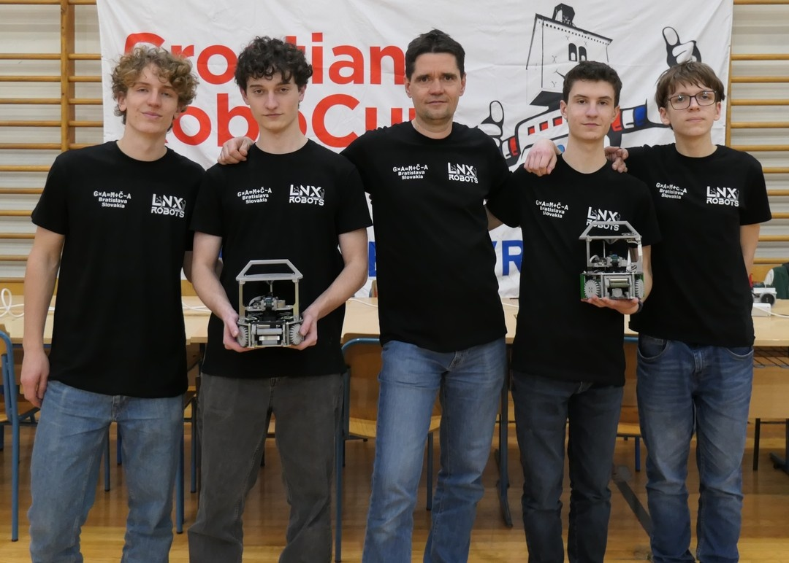

## Members & Roles

*What are the names of the team members and their role(s)?*

Tomáš Kováč – Programming, PCB and Mechanical design  
Matúš Mišiak – AI training, Programming and Mechanical design 
Michal Imrišek – Strategy and Programming 
Radko Bábíček – PCB and Mechanical design 
Radoslav Kováč – Team Mentor

## Meeting Frequency

*How often did your team meet?
(e.g. 90 minutes once per week or a day every weekend.)*

We mostly work individually from home. We meet weekly or biweekly for 2-3 hours.

## Meeting Place

*Where did you meet to work on your robot?
(e.g. a robotics room at school, at some other place, one of your homes, school library etc.)*

computer room at school, at someone's house

## Start Date

*When did your team start working on this year's robot?*

8/2024

## Past Competitions

*Which RoboCupJunior competitions have you competed in and in which leagues?*

RoboCup Junior Slovakia 2023: Soccer Open 
European Championship 2023: Soccer Open 
World Championship 2023: Soccer Open 
RoboCup Junior Slovakia 2024: Soccer Open 
RoboCup Junior Croatia 2024: Soccer Open 
European Championship 2024: Soccer Open 
World Championship 2024: Soccer Open 
RoboCup Junior Slovakia 2025: Soccer Open 
RoboCup Junior Croatia 2025: Soccer Open 
European Championship 2025: Soccer Open

## Mentor Contribution

*Which parts of your work received the most contribution from your mentor?*

Our mentor provided invaluable support in securing sponsors, enabling us to fund the construction of our robots and cover travel expenses for competitions. Since we primarily work from our individual homes, our mentor assisted us by helping coordinate the logistics of delivering hardware parts between team members. Additionally, the mentor helped us maintain focus by guiding project planning and establishing clear priorities.

## Workload Management

*How did you manage the workload?*

We have a Discord server which we use to communicate with each other. It helps us to keep motivated by seeing each other working hard. During each meeting, we track our progress by setting new tasks and marking already completed ones in a spreadsheet.

## AI Tools

*Which AI tools did you use?*

We used ChatGPT as a learning and support tool for electronics. Since we’re all self-taught in this area, it was especially helpful for understanding concepts and debugging hardware issues. We also used GitHub Copilot to speed up coding, helping us write and complete functions more efficiently, which boosted overall productivity. Additionally, we used ChatGPT to improve the grammar and readability of both our poster and this TDP.

## Robot1 Overall

*Robot 1 Overall View*

## Robot1 Front

*Robot 1 Front view*

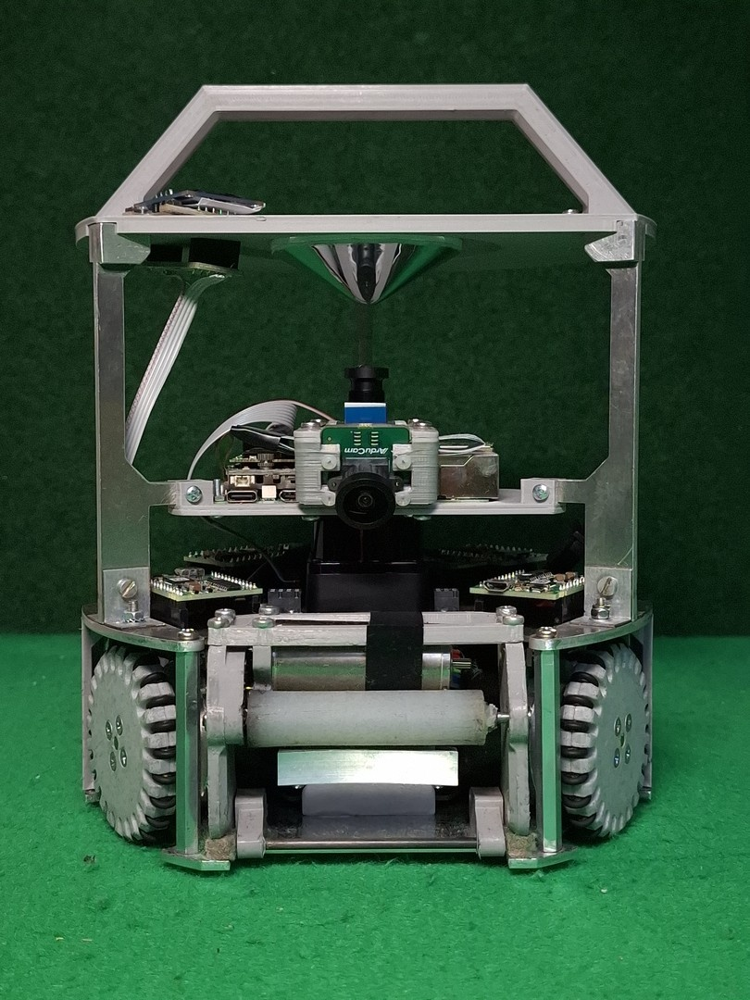

## Robot1 Back

*Robot 1 Back view*

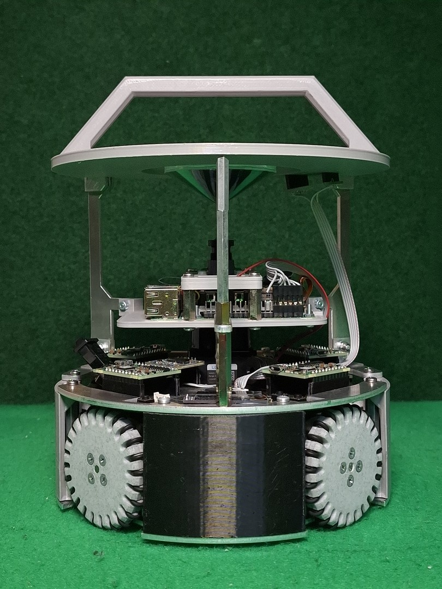

## Robot1 Top

*Robot 1 Top View*

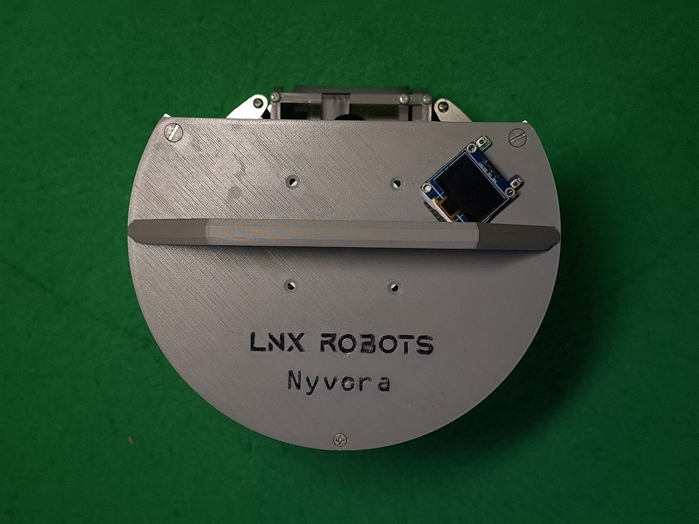

## Robot1 Bottom

*Robot 1 Bottom View*

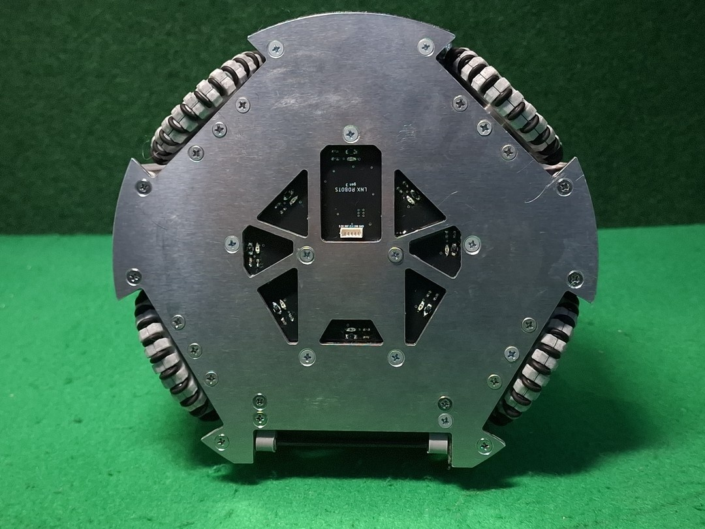

## Robot1 Right

*Robot 1 Right View*

## Robot1 Left

*Robot 1 Left View*

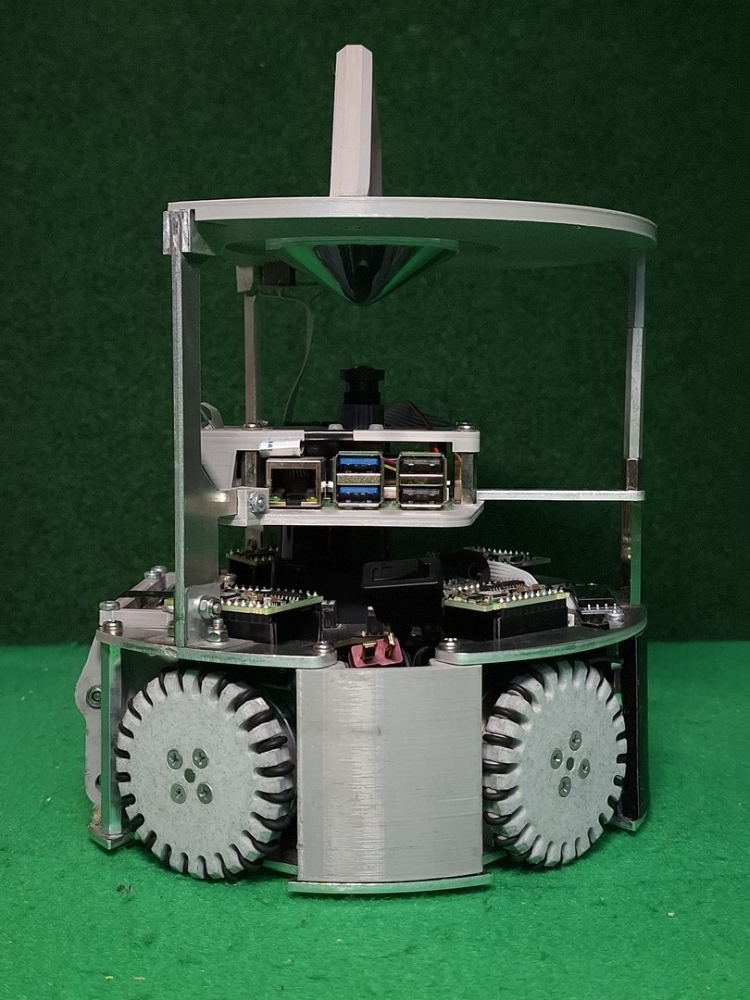

## Positioning & Movement

*How do you find your position inside the field and how do you use that position to move your robots around?*

We use a LiDAR sensor to determine our robot’s position on the field. The LiDAR provides a point cloud of the surroundings, which we rotate based on the robot’s real-time heading to align it with the field's orientation. We then apply a Hough transform to detect the field walls and estimate the robot’s exact position.
Once the current position is known, we calculate the direction and distance to the target location. From that, we compute the angle and speed needed to move the robot efficiently toward the destination.

## Robot2 Overall

*Robot 2 Overall View*

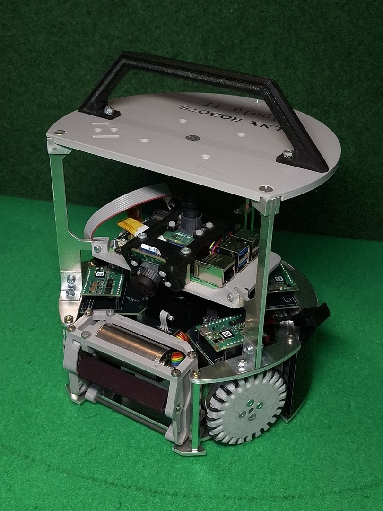

## Robot2 Front

*Robot 2 Front view*

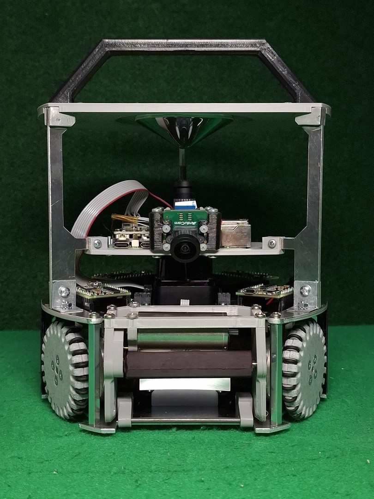

## Robot2 Back

*Robot 2 Back view*

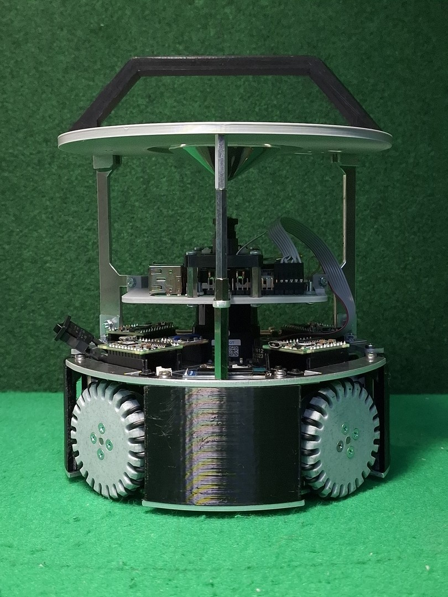

## Robot2 Top

*Robot 2 Top View*

## Robot2 Bottom

*Robot 2 Bottom View*

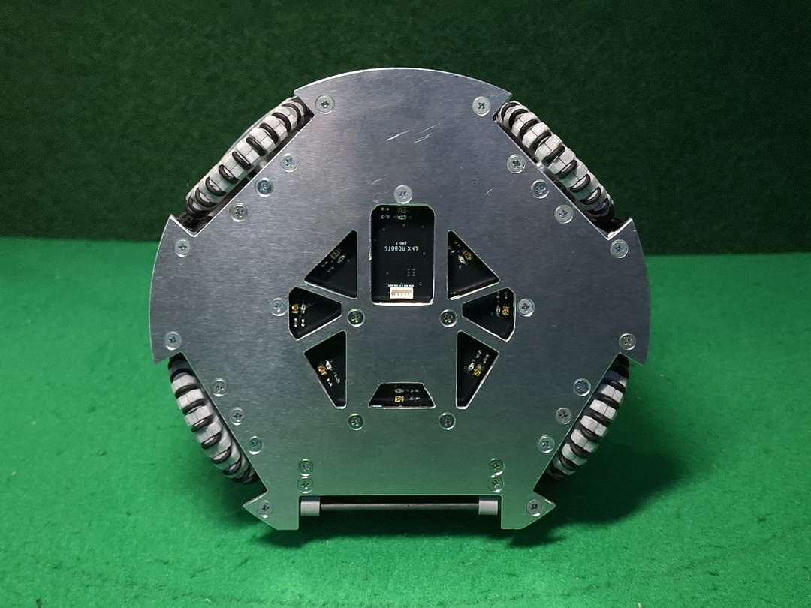

## Robot2 Right

*Robot 2 Right View*

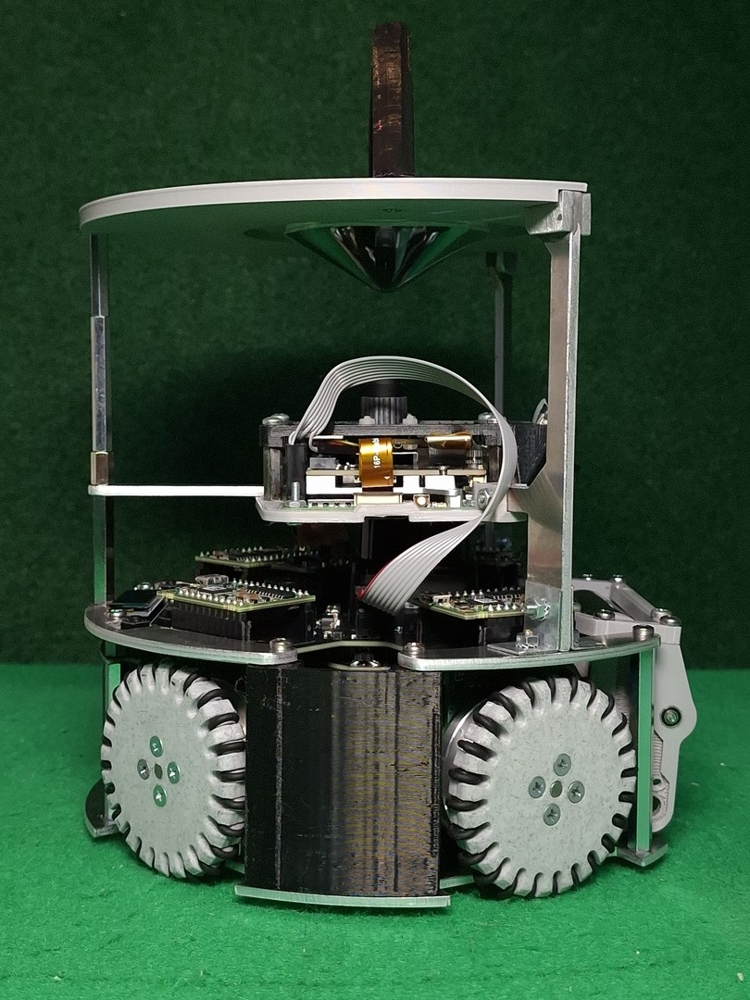

## Robot2 Left

*Robot 2 Left View*

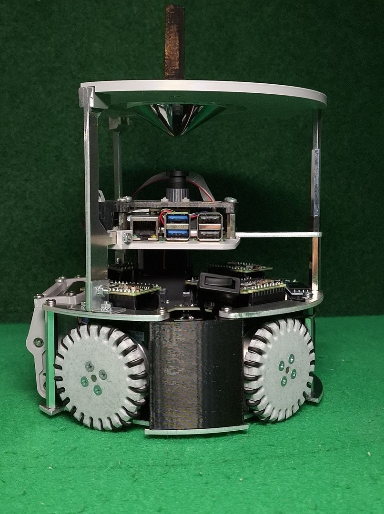

## Mechanical Design

*How did you design the mechanical parts of your robots?*

We used Fusion 360 to make our design and Eagle for our PCBs.
Firstly, we created a 3D model of the part in Fusion 360. We have our whole robot designed there so it's pretty easy adding new things to our robot since the rest of it is already precisely modeled. Later we got them made from aluminum or we 3D printed them ourselves.  
There are countless hours and versions behind the way our robots look now from material selections to the actual parts placements.  
Last year we had lots of cable breakages which made maintaining the robots a complete nightmare. This year we really wanted to improve this part of our hardware, and we managed to do so quite nicely. We shrunk the number of cables from around 150 down to only 20 thanks to using board-to-board connectors for everything, even our motors.

## Build Method

*How did you build your design?*

To build our design, we began by 3D printing all parts of the chassis. This allowed us to quickly prototype and identify design weaknesses. For instance, we found that the undercarriage supporting the motors was structurally too weak and prone to breaking. As a result, we redesigned this part to be made from aluminum for improved durability.
All plastic components were printed in-house using PET-G filament. The aluminum chassis parts were laser-cut by idilna.cz, and we carried out the subsequent processing (sanding, bending, and gluing the pieces) ourselves. The solenoid plunger was manufactured by a local machining company through steel milling.
For the 360-degree mirror, we worked with a local company that used vacuum forming with laminated polystyrene. Prior to that, we experimented with DIY vacuum forming using a vacuum cleaner, but the pressure was too uneven. We also attempted to machine the mirror from aluminum on a lathe. While the result was usable, it required excessive polishing and was ultimately not worth the effort compared to the vacuum-formed version.
Our PCBs were manufactured externally by JLCPCB, but we soldered some of the components ourselves.

## Motors & Reason

*How many motors have you used and why?*

We have five motors. 
Four motors are used for movement, these are the “Maxon EC45 flat 70W” (with encoders, for better speed control in lower speeds). We chose four motors because in combination with the right placement, all of them will always contribute to the robot’s movement, regardless of the direction (if we only had three motors, one would be stationary when going in certain directions), hence making the robot stronger in robot-to-robot duels. We also made our own omni wheels, as we needed 6cm diameter ones (so our drive motors fit there, as they have a diameter of 43mm) and weren’t able to find any suitable on the market. 
Each omni wheel consists of two 3D-printed halves, a circular iron wire axle (1 mm thick), and 24 small idler rollers. The rollers are also 3D printed and fitted with O-rings for improved traction. To form the axle, we bent the iron wire around a PVC pipe with a slightly smaller diameter than the final wheel, ensuring a precise circular shape. The rollers were mounted onto this ring, then enclosed between the two printed halves and secured using a Pololu motor mounting hub. The hub is glued to the iron axle using Loctite 638 (green) for a reliable hold. 
The last motor is the “Maxon EC-max 22 25W ” and it is used for the dribbler.

## Kicker Design

*If your robot has a kicker, explain how you designed and built the mechanics of the kicker*

Our kicker is a high current solenoid which we designed ourselves. To save space we also made it a flat solenoid as it’s commonly possible to see in the Small Size League (SSL).  
To calculate the exact values of our solenoid we first set a hard weight limit since we were working on it before the weight limit was lifted and our last years robot was only 100g lighter than the limit and we tried to keep it as light as possible. To keep the solenoid powerful while keeping it light, we came to the conclusion that increasing the number of turns is a bad idea, hence we have to increase the current which we kick with. To approximate the coil strength, we calculated the strength of the TIGERs Mannheim SSL team’s front kick solenoid with info we gathered on discord and from their TDPs. We then tried to get 1/3 of this power by playing around with the variables. We came to the numbers of kick current of 28A and coil winding specs we customised to our needs.  
We then designed the plunger of the solenoid consisting of aluminum non-magnetic part and iron magnetic part which we got machined. All this theory proved to be well calculated as we stuck with the first wound solenoid as it had proven to be strong enough to satisfy the rules limits.  
We also experimented of the displacement of the ball from the plunger and different rubber and springs to pull back the plunger.

## Dribbler Design

*If your robot has a dribbler, explain how you designed and built the mechanics of the dribbler.*

We experimented quite a lot with different designs and silicones for our dribbler. However, we found out pretty fast that stationary dribblers are not great at holding the ball (the dribbling bar is not moving). 
Then there are 2 options for a point mounted dribblers high mounted and bottom mounted - one has the point of rotation above the dribbling bar which dribbles the ball the other has it lower. 
The bottom mounted were found superior since they didn't push out the ball before actually getting into the dribbling position. (Linear sliding dribblers are a good alternative however they are quite hard to finetune in our opinion)

## CAD Files

*CAD design files*

https://github.com/lnxrobots/hw-rcj-soccer-open/tree/main/gen3/mechanics

## Mechanical Innovation

*Mechanical Innovation*

We try not to overcomplicate our hardware since we prioritize consistent design over flashy ones. However, we had at least 7 cable breakages on our maxon motors last year since they are brushless with encoders and each has around 20 cables. We managed to create our own pcb that is directly soldered onto the motor and has board-to-board connectors coming from it ensuring a stable and rigid connection. Also we are really proud of our dribbler however they havent changed much from last year we only made them wider to capture the ball easier.

## Mechanical Photos

*Photos of your mechanical designs highlights*

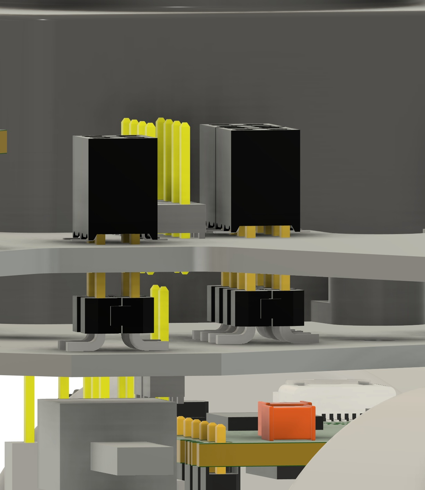
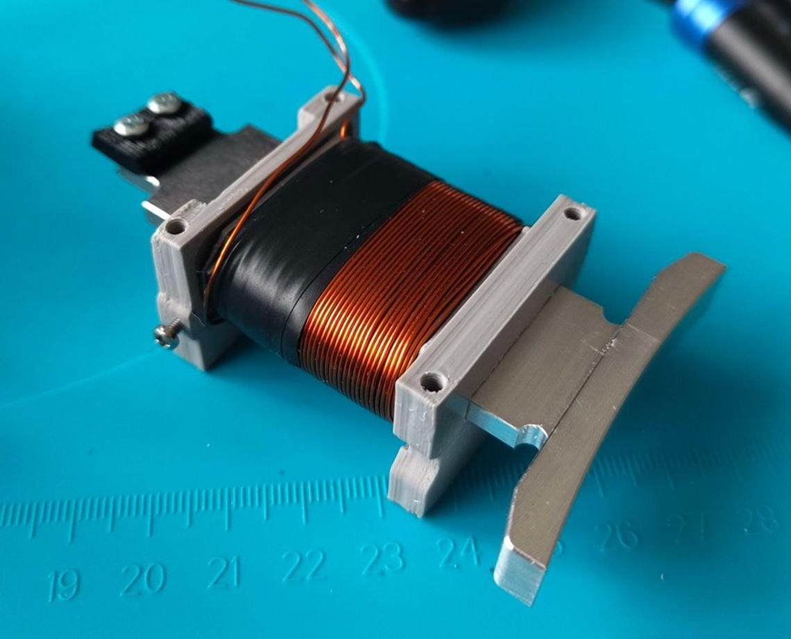
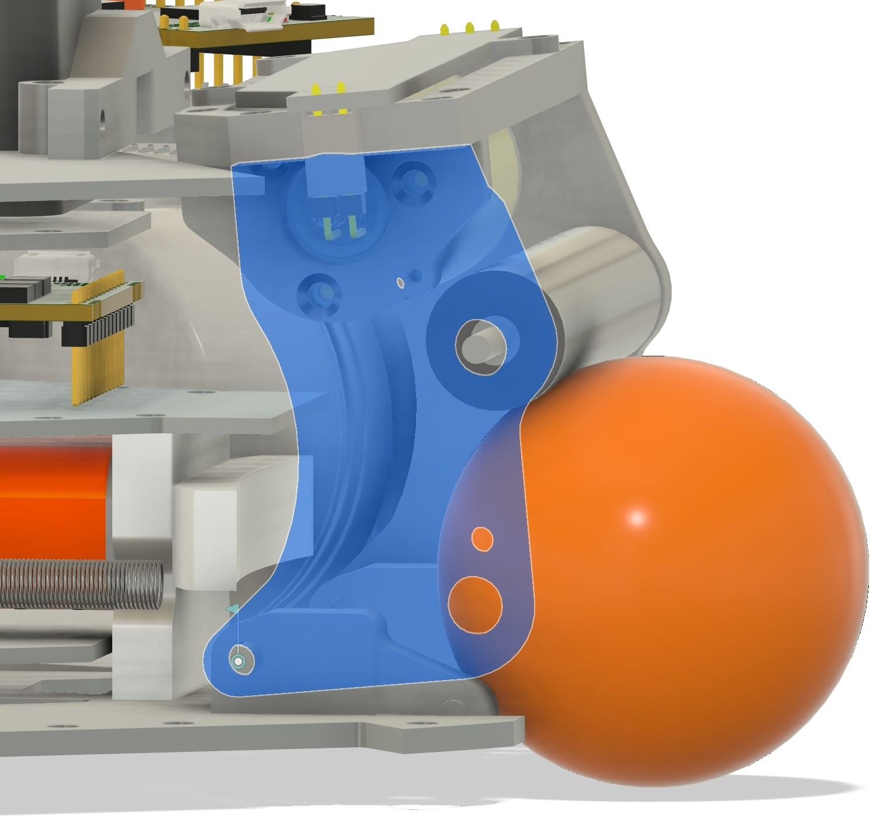

## Electronics Block Diagram

*Provide us with a block diagram of your robot's electronics*

[https://drive.google.com/open?id=18hxcmK5Zg5rsm3Y_I1zzNYLMoeMepgct](https://drive.google.com/open?id=18hxcmK5Zg5rsm3Y_I1zzNYLMoeMepgct)

## Power Circuit

*How does your power circuits work?*

Our power system is based on two 3S LiPo batteries (11.4 V each) connected in series to provide a total voltage of 22.8 V, which supplies power directly to our motor drivers and motors. We use a 5 V, 5 A buck converter to step this voltage down to 5 V for the Raspberry Pi 5. From there, we further regulate the voltage down to 3.3 V using low-dropout regulators (LDOs) to power our STM32 microcontrollers.
For the kicker, we employ a 47.5 V boost converter that charges large 4.4 mF capacitors to store the required energy. A dedicated 15 V LDO powers the MOSFET gate driver to ensure fast switching, minimizing the MOSFET’s time spent in the linear region and improving efficiency.
All converters were carefully selected from Mouser and integrated directly onto our custom PCBs, which helps reduce space and simplifies wiring.

## Motor Drive Circuit

*How do you drive your motors? Explain the circuits you use for that*

We drive our motors using Maxon ESCON 24/2 motor drivers, which operate in a closed-loop configuration for precise control. Each motor is equipped with an encoder that provides position feedback at a resolution of 1024 counts per revolution. This enables accurate speed and position control, even at low velocities, and is essential for maintaining smooth omni-directional movement and executing fast directional changes. 
The ESCON motor drivers receive PWM control signals from our STM32 microcontroller and then adjust motor output accordingly using PID control, leveraging the encoder feedback in real time.

## Microcontroller & Reason

*What kind of micro controller or board do you use for your robot? Why did you decide to use this part for your robot? If you have more than 1 processor, explain each one separately.*

Our robot uses three main processors: two 32-bit STM32 microcontrollers and a Raspberry Pi 5 paired with a Hailo-8L AI accelerator.
The Raspberry Pi 5 serves as the central processing unit. We chose it because it offers high computational power and supports easy integration with the Hailo-8L module, which accelerates our neural network inference for real-time computer vision. Its multi-core architecture allows us to run separate processes for each peripheral (e.g. camera, communication, sensors), enabling efficient parallelism and more real-time responsiveness. Additionally, its compatibility with Python allows us to iterate quickly and take advantage of a wide range of community-developed libraries. The Raspberry Pi also hosts various hardware components such as the camera, Wi-Fi/Bluetooth connectivity, and storage, making it a compact and flexible mainboard.
The “top” microcontroller, an STM32F767, handles all time-critical control tasks. It is responsible for the motor control, kicker, IMU, light gate, and user interface. We chose this model for its speed, rich feature set, and large number of GPIO pins, which are essential for directly interfacing with multiple components in real time.
The “bottom” microcontroller, an STM32G474, manages lower-level sensing tasks. It processes data from the line sensors and LiDAR, pre-filtering and formatting the data before passing it to the Raspberry Pi. This division of responsibilities ensures fast and reliable sensor feedback without overloading the central processor.
We chose STM32 microcontrollers over 8-bit alternatives like Arduino due to their significantly higher performance, wider peripheral support, and widespread use in industry. They also offered a learning opportunity, as we wanted to explore more advanced embedded platforms.

## Ball Detection

*How does your ball detection sensors and/or camera[s] work?*

...for more see "LNX Robots - RoboCupJunior Soccer TDP form.pdf" in the TDP File Upload link...

## Line Detection

*How does your line detection circuits work?*

.

## Navigation/Position Sensors

*What sensors do you use for navigation and how are these sensors connected to your processor? What sensors do you use to find your position in the field? What about the direction your robot faces?*

.

## Kicker Circuit

*How do you drive your kicker system? How does the circuit make the kicker work?*

.

## Dribbler Circuit

*How does your dribbler system work? What components and circuits did you use to drive it?*

.

## Schematics

*Schematics of your robot*

[https://drive.google.com/open?id=1On5VyupzVK6XJta7tLjUCwI61f8xGTee](https://drive.google.com/open?id=1On5VyupzVK6XJta7tLjUCwI61f8xGTee)
[https://drive.google.com/open?id=1uk1xzAtksOUa4LuIWy-PCG9GMcbhcLa5](https://drive.google.com/open?id=1uk1xzAtksOUa4LuIWy-PCG9GMcbhcLa5)
[https://drive.google.com/open?id=1fzrft5cTauu7KSaQsttHz8PK8I2W9ul9](https://drive.google.com/open?id=1fzrft5cTauu7KSaQsttHz8PK8I2W9ul9)
[https://drive.google.com/open?id=1Ze-Pi8KMQaPKf1HkvlBNneKaEZ1yvYjL](https://drive.google.com/open?id=1Ze-Pi8KMQaPKf1HkvlBNneKaEZ1yvYjL)

## PCB

*PCB of your robot*

[https://drive.google.com/open?id=1o20W_2FTU4pvJlACGGKanrh3dhr00g3n](https://drive.google.com/open?id=1o20W_2FTU4pvJlACGGKanrh3dhr00g3n)
[https://drive.google.com/open?id=1eIsQ9yvcCDf0p1WSWTnLwjT5aZhKTIL0](https://drive.google.com/open?id=1eIsQ9yvcCDf0p1WSWTnLwjT5aZhKTIL0)
[https://drive.google.com/open?id=1zJ2hvHg_0h2nAGD_QNJFNqgtOOuY_xCa](https://drive.google.com/open?id=1zJ2hvHg_0h2nAGD_QNJFNqgtOOuY_xCa)
[https://drive.google.com/open?id=1ZRjr_lb_yssAYTvTY07tEBJ_k9g7CC6U](https://drive.google.com/open?id=1ZRjr_lb_yssAYTvTY07tEBJ_k9g7CC6U)

## Innovation

*Innovations*

.

## Circuit Photos

*Photo of your circuit boards highlights*

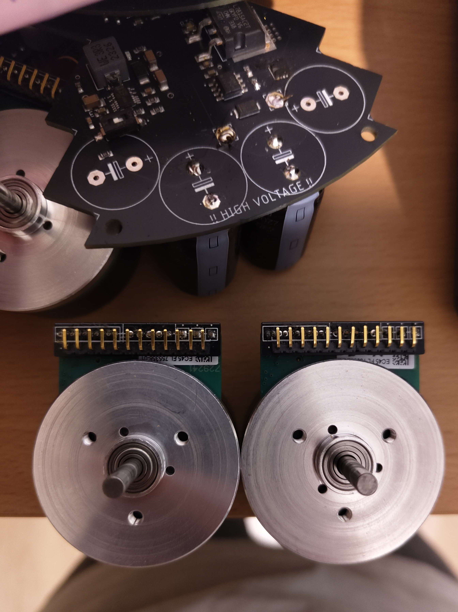
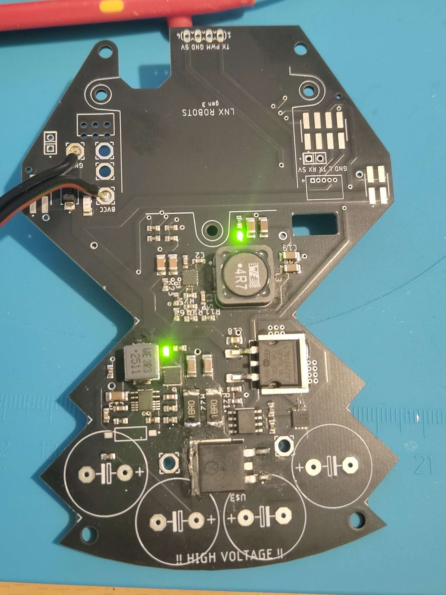

## Motor Control

*How do you use your processor to move your motors?*

.

## Ball Detection Method

*How do you find where the ball is? How do you read the data from the ball detection sensors or camera?*

.

## Ball Catch Algorithm

*How does your algorithm work to catch the ball? Is there a difference between your robots in how they move towards the ball? Explain the differences.*

.

## Line Algorithm

*How does your robot find the lines to stay inside the field? What algorithms do you use to avoid going out of bounds?*

.

## Goal Algorithm

*What algorithms do you use to score goals? How do you use your kicker and dribbler to handle the ball?*

.

## Defense Algorithm

*What algorithms do you use to avoid the opponent team scoring? How do your robots defend your own goal?*

.

## Robot Communication

*Do your robots communicate with each other? How do you use this communication to your advantage?*

.

## Innovation2

*Innovations*

.

## GitHub Link

*GitHub link*

https://github.com/lnxrobots/rcj-soccer-open-gen3

## BOM

*Bill of Materials (BOM)*

[https://drive.google.com/open?id=11xkmpjIGN08thMutUYkxLM2rNx9XAybV](https://drive.google.com/open?id=11xkmpjIGN08thMutUYkxLM2rNx9XAybV)

## Cost

*How much did it cost you to build your robots?*

.

## Funding

*How did you gathered the funds to build the robots?*

.

## Affordability

*How affordable was it to compete in RoboCupJunior Soccer?*

3

## Answer Check

*Have you checked all of your answers?*

Yes!

## Publication Consent

*We publish TDPs and posters during or after the competition as described in the beginning*

Yes, we acknowledge everything submitted in the above form can be published.

## Email Address

*Email Address*

kovacr@gmail.com

## TDP File

*TDP File Upload (Not required)*

[https://drive.google.com/open?id=12fpgvP4LHy8uxCUD5t0t6I1G_74yKTJC](https://drive.google.com/open?id=12fpgvP4LHy8uxCUD5t0t6I1G_74yKTJC)

## Extra Column

*Column 67*

