## Timestamp

*Timestamp*

7/12/2025 16:17:01

## Team Name

*What is your team's name?*

Lovbot Altrons

## League

*What league do you participate in?*

Open League

## Country

*Where are you from?*

Vancouver, BC, Canada

## Contact

*If other teams have questions about your robot, now or in the future, what email address(es) can we publish along with this document for people to reach you?

(You can put in multiple email addresses, like multiple team members, an email for the whole team or both. Feel free to share other ways of communication like Discord handles)*

ezhou1025@gmail.com

## Social Media

*Team Social Media Links (if you have any)*

N/A

## Team Photo

*Upload a photo of your whole team with your mentor and robots

Note: This is not mandatory and will be published along with your TDP if you choose to upload something*

## Members & Roles

*What are the names of the team members and their role(s)?*

Felix Hang: mechanical & electrical design, offence program
Emma Zhou: documentation, defence program, gameplay strategies

## Meeting Frequency

*How often did your team meet?
(e.g. 90 minutes once per week or a day every weekend.)*

20 hours per week

## Meeting Place

*Where did you meet to work on your robot?
(e.g. a robotics room at school, at some other place, one of your homes, school library etc.)*

robotics studio

## Start Date

*When did your team start working on this year's robot?*

September 2024

## Past Competitions

*Which RoboCupJunior competitions have you competed in and in which leagues?*

2025 RoboCup Americas Superregional Open League
2025 RoboCup Western Canada Open League
2024 RoboCup World Championships Open League
2024 RoboCup Western Canada Open League

## Mentor Contribution

*Which parts of your work received the most contribution from your mentor?*

This year, we set out to build a reliable dribbler but initially struggled to find the right mechanism and gearbox that could deliver enough power and torque for effective ball control. With the guidance of our mentor, we were able to source the appropriate gearbox components, bearings, and refine the overall structural design of the robot. Thanks to this support, we successfully developed a functional and reliable dribbler.

## Workload Management

*How did you manage the workload?*

The team met everyday from the end of June to the day that we left, meaning we had time to assign work to different members and schedule our workload accordingly. This allowed us to contribute the work evenly among the days we had and among the members evenly so that we could accomplish what we had hoped to achieve. All team members were punctual and worked efficiently.

## AI Tools

*Which AI tools did you use?*

We mainly used ChatGPT for the implementation of specific algorithms or functions and to consistently check over our code for apparent bugs and to keep it organized. We would also run our electrical design over with ChatGPT for constructive feedback.

## Robot1 Overall

*Robot 1 Overall View*

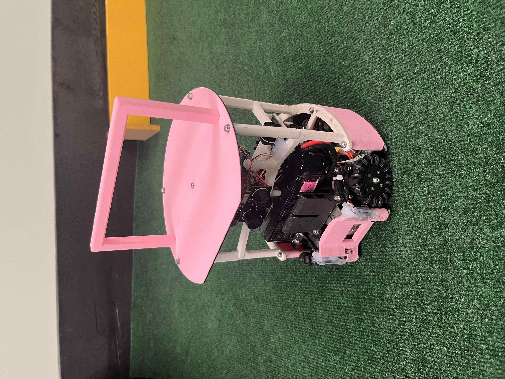

## Robot1 Front

*Robot 1 Front view*

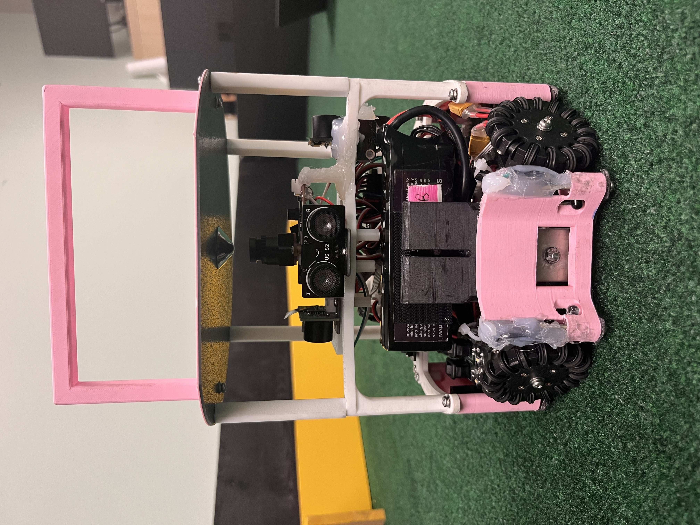

## Robot1 Back

*Robot 1 Back view*

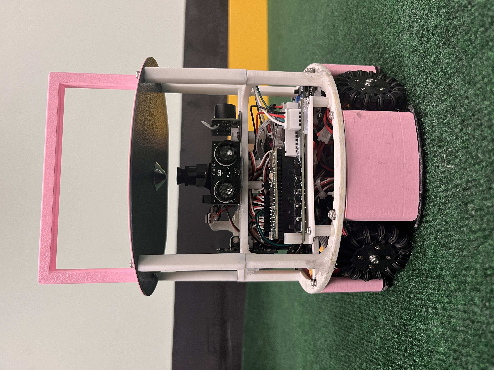

## Robot1 Top

*Robot 1 Top View*

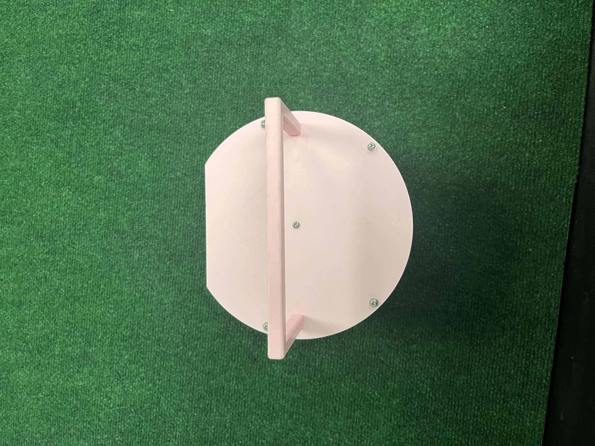

## Robot1 Bottom

*Robot 1 Bottom View*

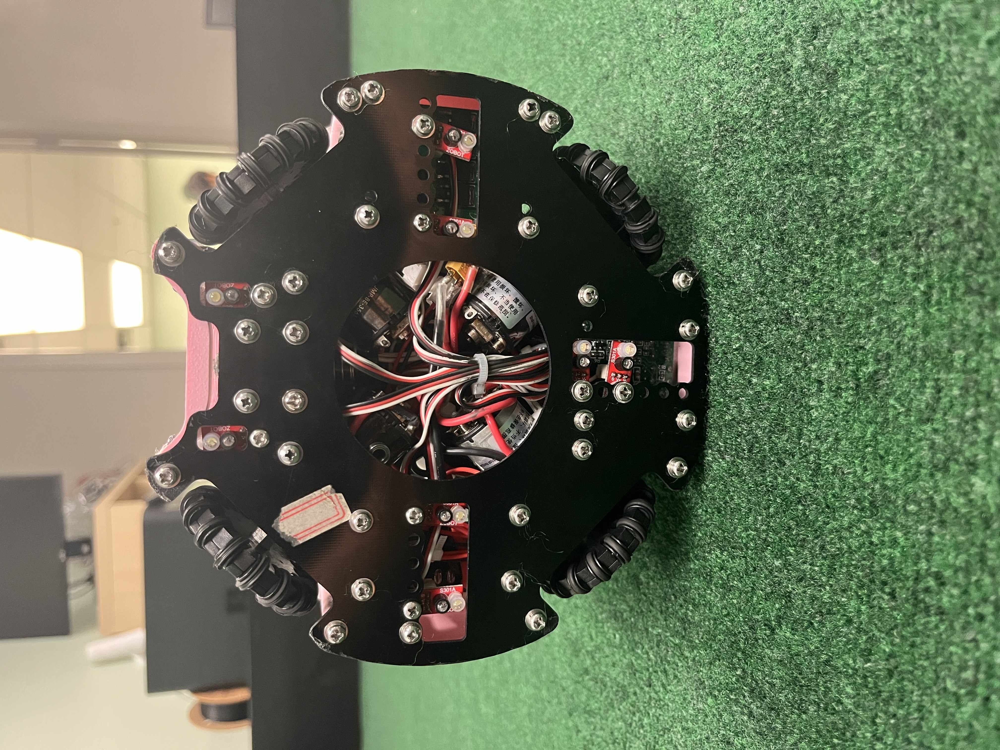

## Robot1 Right

*Robot 1 Right View*

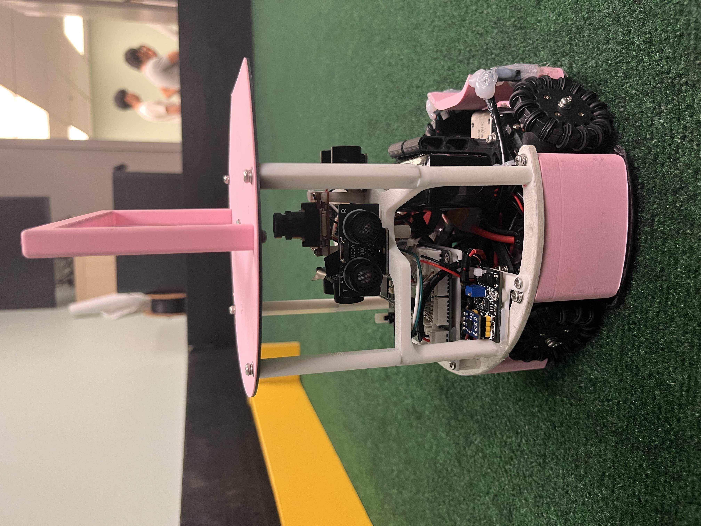

## Robot1 Left

*Robot 1 Left View*

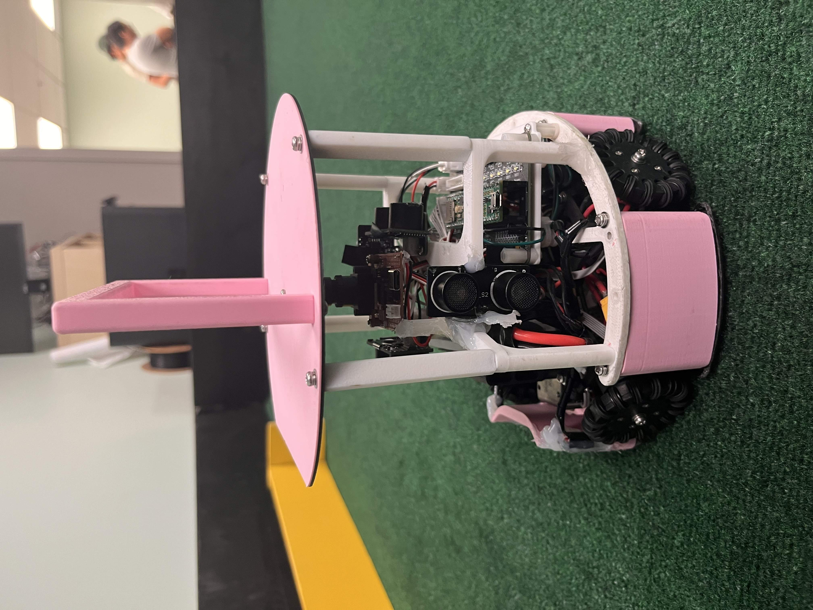

## Positioning & Movement

*How do you find your position inside the field and how do you use that position to move your robots around?*

We localize our robot by using four ultrasonic sensors, each mounted on one side of the chassis, to measure the distances to the surrounding field walls. These distance readings allow us to locate the robot’s position on a Cartesian coordinate system, effectively mapping its location for the known dimensions of the field. The raw ultrasonic data is converted into centimeters to provide a consistent and intuitive unit for both calculation and debugging. By comparing the sensor readings to the field boundaries, we can estimate the robot’s x and y coordinates in real time. This positional data is then used to guide the robot's movement and orientation, allowing us to navigate accurately and implement path planning strategies during gameplay.

## Robot2 Overall

*Robot 2 Overall View*

## Robot2 Front

*Robot 2 Front view*

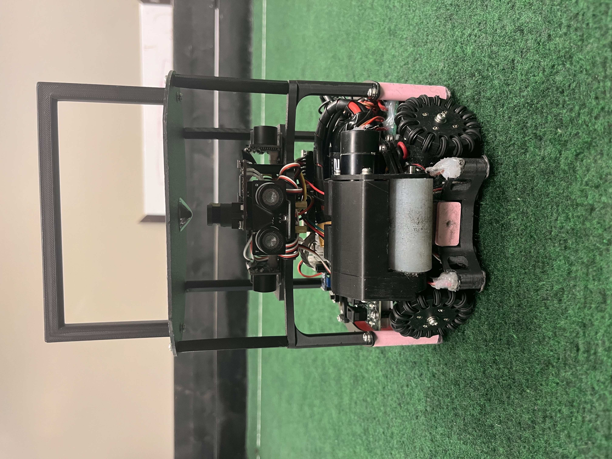

## Robot2 Back

*Robot 2 Back view*

## Robot2 Top

*Robot 2 Top View*

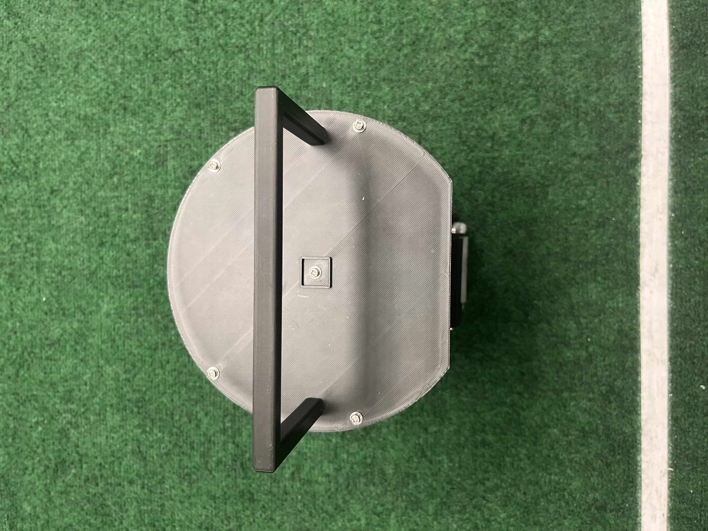

## Robot2 Bottom

*Robot 2 Bottom View*

## Robot2 Right

*Robot 2 Right View*

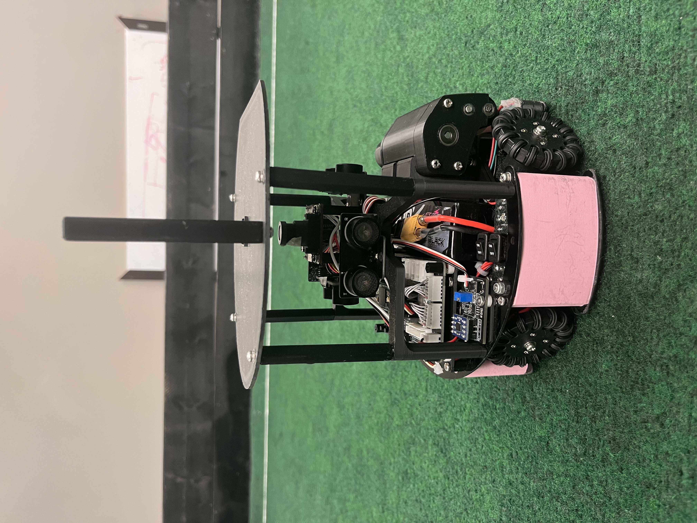

## Robot2 Left

*Robot 2 Left View*

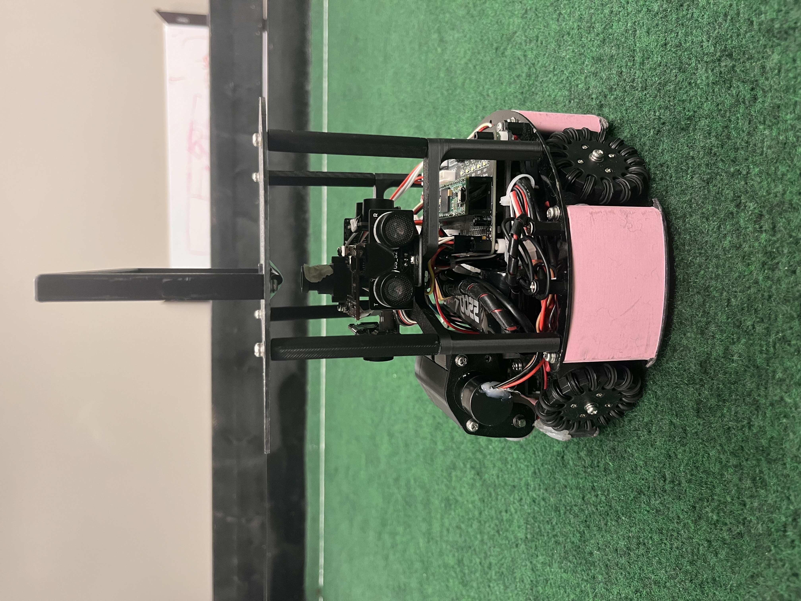

## Mechanical Design

*How did you design the mechanical parts of your robots?*

We used SolidWorks and Fusion 360 to design our robot. Our first chassis blocked much of the camera’s view, so over several weeks, we revised the layout to improve visibility and better fit the components.

By December 2024, we had lowered key parts, repositioned the ultrasonic sensors for clearer readings, and adjusted the camera-mirror setup for a wide-angle view. We also redesigned the top plate to reduce light interference.

Space and wiring were major challenges due to the robot’s compact size. To improve this, we plan to add more custom PCBs and use smaller components to save space and simplify maintenance.

## Build Method

*How did you build your design?*

We used a mix of in-house fabrication and external services to build our design. Most parts were CAD-designed and made using laser cutting, CNC milling, or 3D printing. For stronger parts like gears and shafts, we used metal machining. Our PCBs were designed in-house and manufactured by JLCPCB. We also made our mirrors in-house using a mold and heat-forming process.

During assembly, we faced issues like wiring congestion and camera visibility. We fixed these by adjusting component placement and refining the layout. These changes helped improve the robot’s performance and reliability.

## Motors & Reason

*How many motors have you used and why?*

For the drivetrain, we used four motors positioned at degrees 45, 135, 225, and 315 respectively to ensure equal strength in moving in all directions, while also leaving enough space for the ball capturing zone at the front of the robot. 

We built our own 3d printed wheels by trial and error: we would experiment with different diameters and different widths and program the robot to run the same code to find the best specs to make the robot run as smoothly as possible.

## Kicker Design

*If your robot has a kicker, explain how you designed and built the mechanics of the kicker*

Our kicker mechanism uses a Takaha solenoid as the actuator, which delivers a rapid linear motion to strike the ball. The solenoid is powered by a voltage boost circuit, implemented through a custom PCB that steps up the robot’s 12V battery supply to 48V. This higher voltage significantly increases the energy delivered to the solenoid coil, resulting in a stronger and faster kick. When activated, the solenoid’s plunger extends forward with high force, transferring momentum to the ball.

## Dribbler Design

*If your robot has a dribbler, explain how you designed and built the mechanics of the dribbler.*

We used a Maxon motor with high torque going to a 2:1 reduction gearbox for further increase in torque rather than speed, for better control of the ball. The gearbox outputs to a custom made silicon mode to grip the ball.

## CAD Files

*CAD design files*

N/A

## Mechanical Innovation

*Mechanical Innovation*

We designed every part of the robot with easy maintenance and quick repairs in mind. From the start to the final build, we made sure any mechanical or electrical problems could be fixed quickly—even during the pressure of a competition match.

We also spent a lot of time improving the size and shape of the convex mirror to give the camera the best view of the field. Our goal was to get a clear and accurate image, especially for things farther away. A steeper mirror helped the robot see nearby objects but caused image distortion. A flatter mirror reduced distortion but created a blind spot near the robot. After testing different versions, we found the best shape that gave the camera a wide, smooth view with little distortion.

## Mechanical Photos

*Photos of your mechanical designs highlights*

## Electronics Block Diagram

*Provide us with a block diagram of your robot's electronics*

## Power Circuit

*How does your power circuits work?*

The main body of our robot is powered by a 12V battery pack, which supplies power directly to both the Teensy shield and the motor drivers. The shield regulates the 12V input down to 5V to power its onboard components, including the Teensy microcontroller. The Teensy then further reduces the voltage to 3.3V for use with its analog input pins.

## Motor Drive Circuit

*How do you drive your motors? Explain the circuits you use for that*

To drive our four JMP DC motors, we use two motor controller boards (each handling two motors) connected to our Teensy shield. The Teensy sends PWM signals for speed control and digital signals for direction, which the motor controllers use to power the motors accordingly. Power is supplied by a main battery regulated through a custom-built switch system and stabilized with a capacitor to handle current spikes. We use a custom extension board to simplify wiring, integrate motor controller ports, and add test/debugging functions. In software, we calculate a movement vector (direction and speed), then convert it into individual motor speeds using vector decomposition, allowing omnidirectional movement with precise control.

## Microcontroller & Reason

*What kind of micro controller or board do you use for your robot? Why did you decide to use this part for your robot? If you have more than 1 processor, explain each one separately.*

We used the Teensy 4.1 because it’s fast, compact, and has everything we need for a robot with lots of sensors. With a 600 MHz processor, it handles real-time decisions like tracking the ball and reacting quickly without lag. It also has 18 analog ports, as well as plenty of digital, and other-protocol input and output ports, which makes it easy to connect our camera, ultrasonic sensors, compass, and motor controllers all at once. The extra RAM and flash give us space to run more advanced code without worrying about memory limits. Overall, it’s powerful, efficient, highly customizable, and small enough to fit nicely into our robot and onto our shield.

## Ball Detection

*How does your ball detection sensors and/or camera[s] work?*

We use an OpenMV camera pointed upward at a convex mirror, giving the robot a wide-angle view of the field and its surroundings. The camera processes the image to detect colored objects—like the orange ball and colored goals—by identifying blobs based on predefined color thresholds. It calculates the angle and distance of each detected object relative to the center of the image.

To improve communication speed, we shrink the data before sending it over UART to the Teensy microcontroller, which receives it through the Serial7 port. On the Teensy side, the data is rescaled back to its original form for processing. This allows the robot to make quick decisions based on the ball and goal positions.

## Line Detection

*How does your line detection circuits work?*

Our line detection system uses downward-facing individual grayscale sensors to detect a white line on a green field. Each sensor sends out light and measures the reflection as an analog signal. White areas reflect more light and produce a higher signal, while green areas reflect less and give a lower signal. The robot reads these analog values to determine the line’s position and stay on track.

## Navigation/Position Sensors

*What sensors do you use for navigation and how are these sensors connected to your processor? What sensors do you use to find your position in the field? What about the direction your robot faces?*

For navigation, we use an MPU6050 gyroscope to track the robot’s orientation. It provides real-time angular data, allowing us to determine the direction the robot is facing. This sensor connects to the Teensy via I2C.

To estimate the robot's position on the field, we use four ultrasonic distance sensors, one mounted on each side of the robot. These measure the distance to nearby walls or field boundaries, giving us a rough idea of our position relative to the edges. The ultrasonic sensors are connected to the Teensy through digital I/O pins using a trigger and echo configuration.

Additionally, the OpenMV camera helps with localization by detecting the direction of the two coloured goals, which further improves orientation and positioning accuracy during gameplay.

## Kicker Circuit

*How do you drive your kicker system? How does the circuit make the kicker work?*

We drive the kicker using a Takaha solenoid powered by a voltage boost circuit. The circuit takes the robot’s 12V battery input and increases it to 48V, supplying enough power to the solenoid coil for a strong, fast kick. When the microcontroller sends a signal to activate the kicker, the boosted voltage energizes the solenoid, causing its plunger to quickly extend and strike the ball. The boost circuit ensures the solenoid receives sufficient current and voltage to deliver a powerful kick every time.

## Dribbler Circuit

*How does your dribbler system work? What components and circuits did you use to drive it?*

Our dribbler system uses a high-torque Maxon motor connected to a 2:1 reduction gearbox, which increases torque while reducing speed for better ball control. The gearbox drives a custom-made silicone roller that grips the ball securely during play.

To control the motor, we use a 20A electronic speed controller (ESC) connected to an analog port on the Teensy shield. The ESC receives control signals from the microcontroller, allowing precise regulation of the dribbler’s speed and responsiveness.

## Schematics

*Schematics of your robot*

## PCB

*PCB of your robot*

## Innovation

*Innovations*

One of the biggest improvements we made to our electronics this year was switching from the Arduino Mega2560 to a smaller and faster microcontroller. The Mega2560 had been reliable and easy to use in past years, but it had some drawbacks. It only had one I²C connection, making it hard to add more sensors, and its large size didn’t fit well in our compact Open League robot. It also wasn’t fast enough for some of the things we wanted to do.

The new microcontroller made a big difference. It’s smaller, faster, and gives us more flexibility with wiring and sensor use. Our robot now runs more smoothly, and it’s easier to organize everything inside. This upgrade helped us build better, more efficient electronics that are also easier to maintain.

## Circuit Photos

*Photo of your circuit boards highlights*

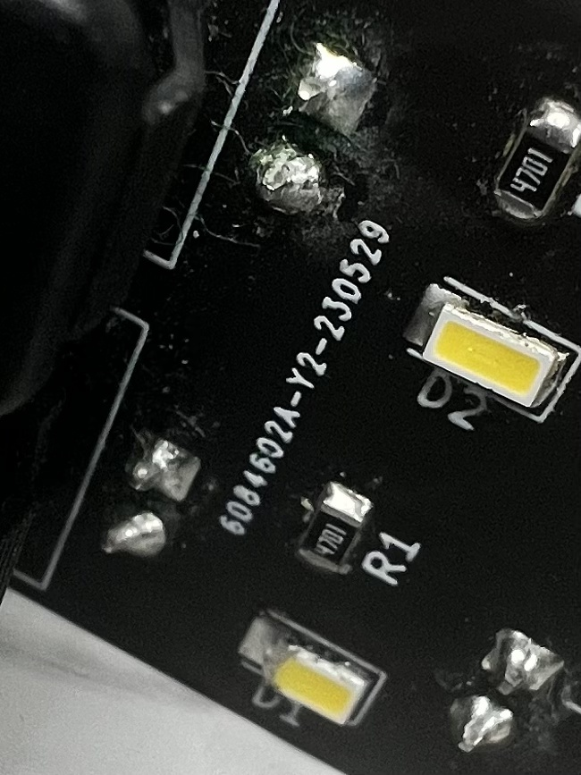
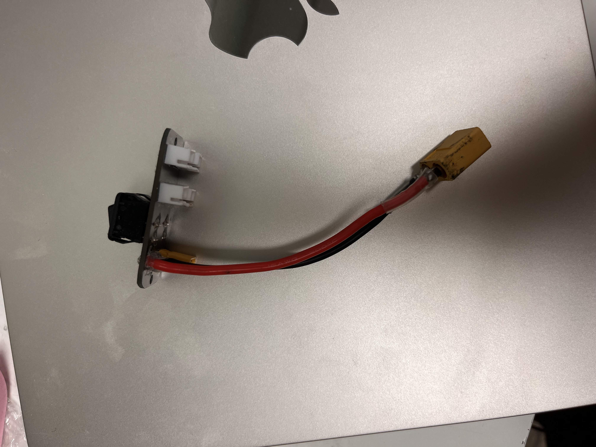

## Motor Control

*How do you use your processor to move your motors?*

We use the processor to move the motors by controlling the direction and speed pins connected to each motor driver. The Teensy 4.1 sets specific pins as outputs so it can send signals to the motors. For each motor, one pin controls direction and another controls speed using PWM (pulse-width modulation). The direction pin sends either a HIGH or LOW signal to determine which way the motor spins, while the PWM pin sends a fast, pulsing signal to control how fast it spins. A higher duty cycle in the PWM signal results in faster motor movement. By continuously adjusting these signals, the processor is able to move the robot smoothly and accurately in response to movement commands.

## Ball Detection Method

*How do you find where the ball is? How do you read the data from the ball detection sensors or camera?*

We find the ball using a camera that faces a convex mirror, allowing it to view the entire field from above. The camera detects objects based on color by scanning for pixels that match a certain color threshold, identifying them as blobs. If multiple blobs are detected, we select the largest one and use its color to determine whether it represents a ball or a goal. The camera sends this data through a serial connection to the processor in a packet of bytes. To make sure the data is accurate and not corrupted during transmission, we verify it using a checksum—a simple method where all the data bytes are added together and compared to a final checksum byte sent with the packet. If the values match, the data is accepted. If the packet confirms a ball detection, the processor records the angle and distance of the ball for use in movement and strategy.

## Ball Catch Algorithm

*How does your algorithm work to catch the ball? Is there a difference between your robots in how they move towards the ball? Explain the differences.*

To ensure that the chances of us being able to catch the ball are high, we always try to position the bot directly behind the ball so that we can move with the ball in the capturing zone. To do this, we use the camera. By using the camera we can see where the ball is and what direction the bot has to move to make sure that it can end up directly behind the ball with no issues like knocking the ball away.

## Line Algorithm

*How does your robot find the lines to stay inside the field? What algorithms do you use to avoid going out of bounds?*

We use ultrasonics to determine the distance from the wall, which we then use to determine whether we should stop or not. If the distance from the wall becomes too small, we tell our robot to stall until the ball is moved to avoid leaving or going out of the boundary lines. If our ultrasonics becomes unreliable and is malfunctioning, we can rely on our grey scales to determine whether we have hit a white line or not. If we have hit a white line we can either wait until the ball is moved or we can return to the centre point for a certain amount of time.

## Goal Algorithm

*What algorithms do you use to score goals? How do you use your kicker and dribbler to handle the ball?*

When the offensive robot gets the ball, it looks for an open spot near the opponent’s goal, aims there, and kicks to score. If the ball is near the crowded center, the robot dribbles backward slowly while turning, then spins fast to shoot and surprise the opponents. Near the edge, it dribbles along the sideline to keep control and move forward. If the ball is stuck in a corner, the robot hides it, quickly dribbles out, and heads toward the goal before a “lack of progress” call. Getting out of the corner this way improves our chances to score.

## Defense Algorithm

*What algorithms do you use to avoid the opponent team scoring? How do your robots defend your own goal?*

The goalie is designed to handle any situation when the offense doesn’t have the ball. It needs to block the ball from entering the goal from any angle at any time. Our strategy is for the robot to find the best angle to block the ball by calculating where the ball is coming from and positioning itself there. The goalie also adjusts its speed based on where the ball is, how far it is, and which direction the ball is moving.

Since the goalie stays near the goal, it moves close to the field’s boundaries, called the penalty area. To keep it inside the field, we treat the penalty line like an invisible wall the robot can’t cross. The goalie always stays on this boundary while defending. If the ball stops moving on the field, the goalie switches to offense for a short time to avoid missing chances to score.

## Robot Communication

*Do your robots communicate with each other? How do you use this communication to your advantage?*

Since we play with a passive orange ball, only tracked by the camera, the ball may often disappear from the robot’s vision which is caused by another object being in front of it. As soon as both robots fail to locate the ball, we would immediately begin to search for the ball across the field, in case an opponent robot is attempting to perform strategies that involve hiding the ball. The robots will also share ball information with one another should one of them see the ball and the other one doesn’t. The offence robot will be mainly in charge of the front section of the field, leaving the back half for the goalie to avoid them fighting one another for the ball and the possibility of double defence.

## Innovation2

*Innovations*

One of the innovations we’re most proud of is how we use the five physical buttons on our robot to control and configure its behavior. Since our robots don’t have screens, debugging and adjusting settings can be challenging. To solve this, we designed a flexible system where each button can be assigned to control different modes, roles, or strategies. This means we can easily switch between robot settings—like adjusting speed, changing behavior modes, or activating debug features—without needing to reprogram or connect a laptop. During competitions, this gives us a huge advantage because we can quickly adapt to the opposing team’s strategy with just a button press. It allows us to make real-time decisions and customize our robot’s behaviour based on the situation, which increases our chances of performing better and winning more games.

## GitHub Link

*GitHub link*

N/A

## BOM

*Bill of Materials (BOM)*

[https://drive.google.com/open?id=1m-MMlEUI_Fg7NdE9BG5iyDtVKnIghlps](https://drive.google.com/open?id=1m-MMlEUI_Fg7NdE9BG5iyDtVKnIghlps)

## Cost

*How much did it cost you to build your robots?*

2 robots: $1500 x 2 = $3000 CAD = $2200 USD

Experiments (3D Print Failures, Prototypes, Extra Motors & Drivers, Damaged Solenoids and sensors, teensy, Misfit Chassis): $2400 CAD = $1750 USD

Environment (Soccer Field, Lighting Setup, Tools, Power Supplies, 3D Printers): $4000 CAD = $2925 USD

## Funding

*How did you gathered the funds to build the robots?*

100% parents

## Affordability

*How affordable was it to compete in RoboCupJunior Soccer?*

5

## Answer Check

*Have you checked all of your answers?*

Yes!

## Publication Consent

*We publish TDPs and posters during or after the competition as described in the beginning*

Yes, we acknowledge everything submitted in the above form can be published.

## Email Address

*Email Address*

ezhou1025@gmail.com

## TDP File

*TDP File Upload (Not required)*

## Extra Column

*Column 67*

