## Timestamp

*Timestamp*

7/12/2025 16:15:40

## Team Name

*What is your team's name?*

Lovbot Legends

## League

*What league do you participate in?*

Lightweight League

## Country

*Where are you from?*

Vancouver, Canada

## Contact

*If other teams have questions about your robot, now or in the future, what email address(es) can we publish along with this document for people to reach you?

(You can put in multiple email addresses, like multiple team members, an email for the whole team or both. Feel free to share other ways of communication like Discord handles)*

Will Wu: 
willwu7370@gmail.com
	
Kyle Gu:
kyle.gu08@gmail.com

## Social Media

*Team Social Media Links (if you have any)*

https://www.youtube.com/@LovbotLegend

## Team Photo

*Upload a photo of your whole team with your mentor and robots

Note: This is not mandatory and will be published along with your TDP if you choose to upload something*

## Members & Roles

*What are the names of the team members and their role(s)?*

Will Wu: Mechanical, Electrical; Kyle Gu: Software, Camera

## Meeting Frequency

*How often did your team meet?
(e.g. 90 minutes once per week or a day every weekend.)*

Regular week: 14 hours a week; 3 weeks before the competition: 50 hours a week

## Meeting Place

*Where did you meet to work on your robot?
(e.g. a robotics room at school, at some other place, one of your homes, school library etc.)*

Robotics club room

## Start Date

*When did your team start working on this year's robot?*

September 2024

## Past Competitions

*Which RoboCupJunior competitions have you competed in and in which leagues?*

2024 Worlds @ Eindhoven: Lightweight League (Lovbot Quantum)
2023 Worlds @ Bordeaux: Open League (MapleTech Nebula)

Western Canada Championship 2024: Lightweight League
Western Canada Championship 2023: Open League

## Mentor Contribution

*Which parts of your work received the most contribution from your mentor?*

Our mentor helped us with the high level strategy and planning including the buying/sourcing of sensor parts along with general direction for the robot. For example, we research the parts that we want online and/or from other teams, and our mentor helps us make an informed decision based on their past experience. A good example is that they recommended us to use a sliding resistor on our circular light sensor this year (as the led was too bright at Eindhoven last year and resulted in poor white line detection).

## Workload Management

*How did you manage the workload?*

We mainly communicated through a WhatsApp group and assigned tasks using a google spreadsheet. Whenever we decided to make hardware changes, we would ensure that we had one fully functional robot so that someone could always work on the software.

## AI Tools

*Which AI tools did you use?*

We integrated ChatGPT into our workflow across both software development and documentation. On the software side, it served as an efficient debugging assistant, helping us quickly isolate syntax errors and refine our implementation. For our poster and written materials, we used it to improve clarity and tone, rewording unclear phrasing and ensuring our final documentation met a professional standard. All ideas, though, are completely original and we cited our AI usage when necessary (for example, we cited matplot code from ChatGPT on our poster).

## Robot1 Overall

*Robot 1 Overall View*

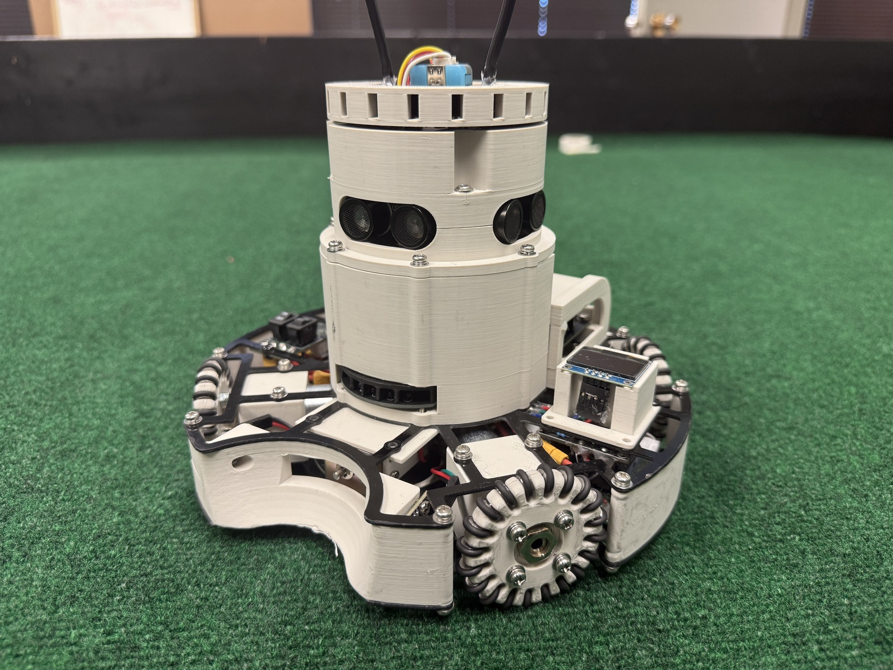

## Robot1 Front

*Robot 1 Front view*

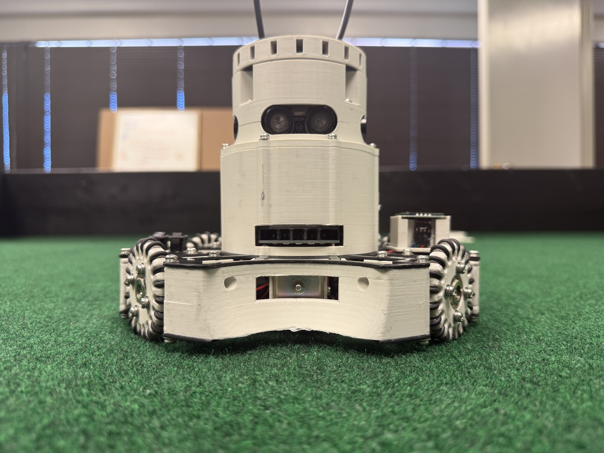

## Robot1 Back

*Robot 1 Back view*

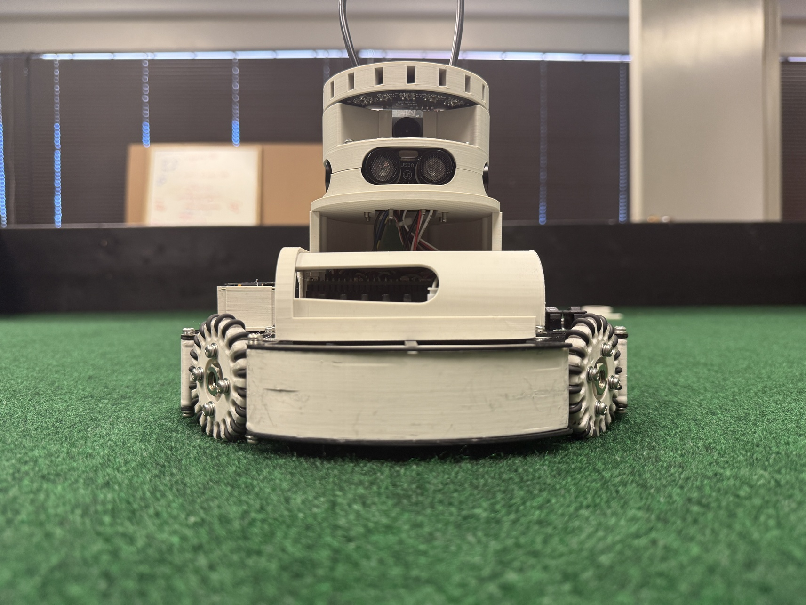

## Robot1 Top

*Robot 1 Top View*

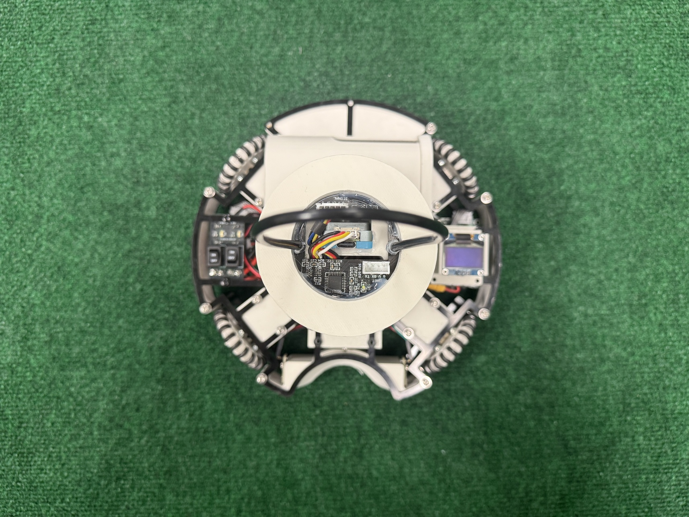

## Robot1 Bottom

*Robot 1 Bottom View*

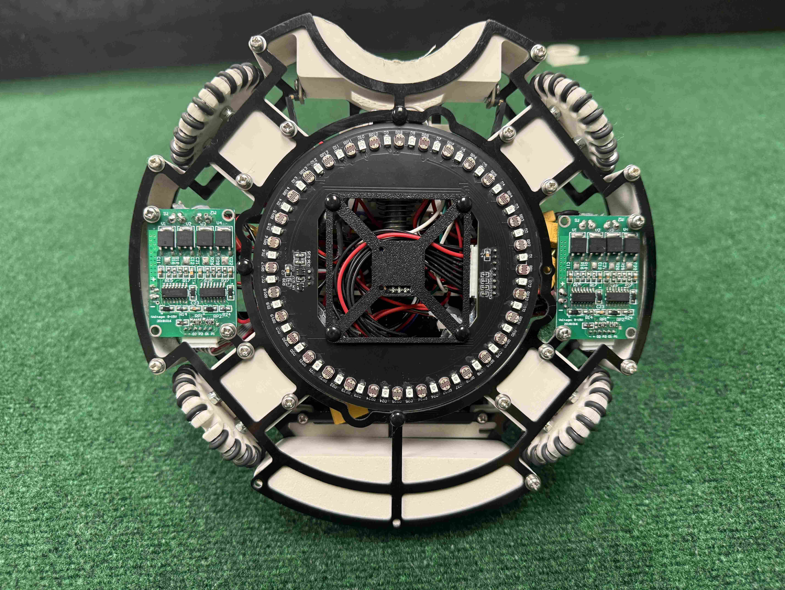

## Robot1 Right

*Robot 1 Right View*

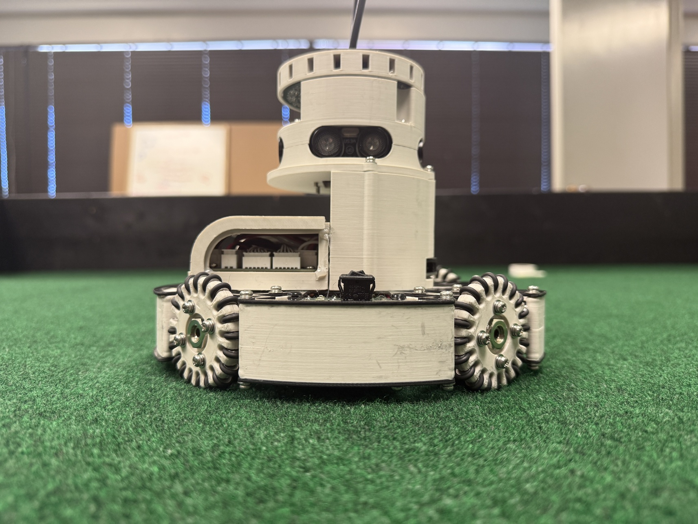

## Robot1 Left

*Robot 1 Left View*

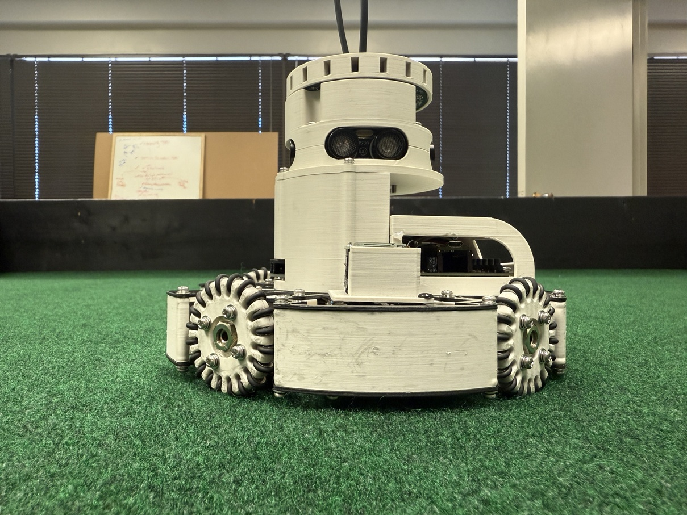

## Positioning & Movement

*How do you find your position inside the field and how do you use that position to move your robots around?*

We have four ultrasonic sensors that we used to map into Cartesian (x, y) coordinates. In this case, we can easily just call a goToCoordinate(int x, int y) function and the robot will move to that specific coordinate on the field. For reference, x = 0 and y = 0 at the center of the field. 

This year, we implemented a mouse sensor (Odometry Sensor from SparkFun) to record the drift from our nearest accurate ultrasonic reading. If the ultrasonic readings ever get blocked, we can just get another (x,y) reading from our mouse sensor from the last accurate position given by the ultrasonics. We reset the drift of the mouse whenever we get an accurate ultrasonic reading.

## Robot2 Overall

*Robot 2 Overall View*

## Robot2 Front

*Robot 2 Front view*

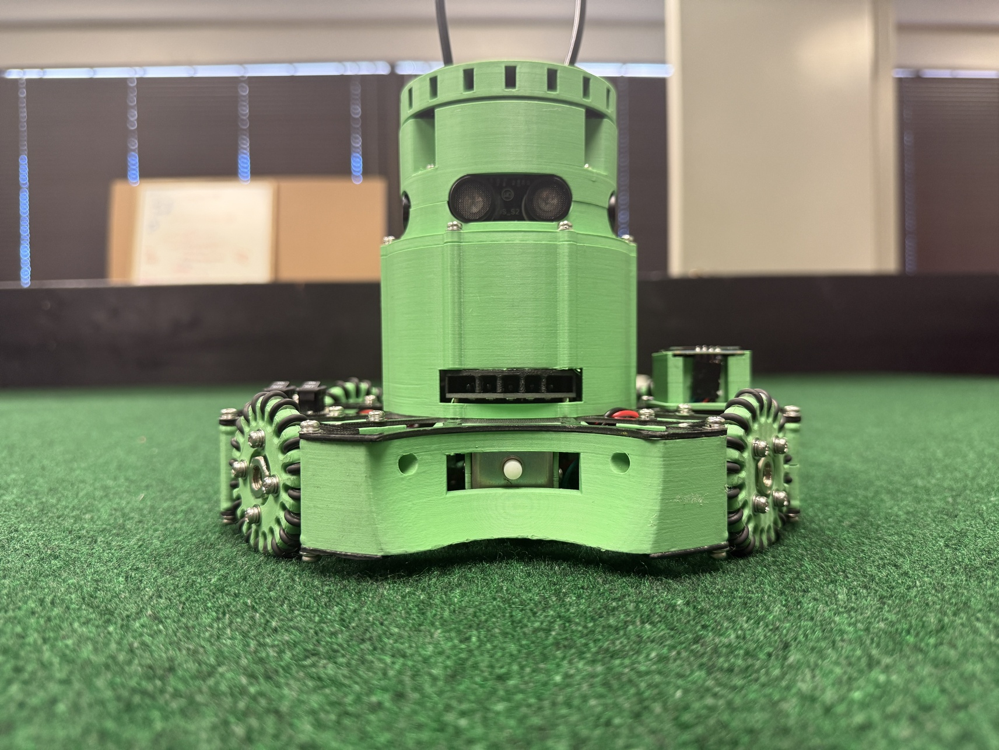

## Robot2 Back

*Robot 2 Back view*

## Robot2 Top

*Robot 2 Top View*

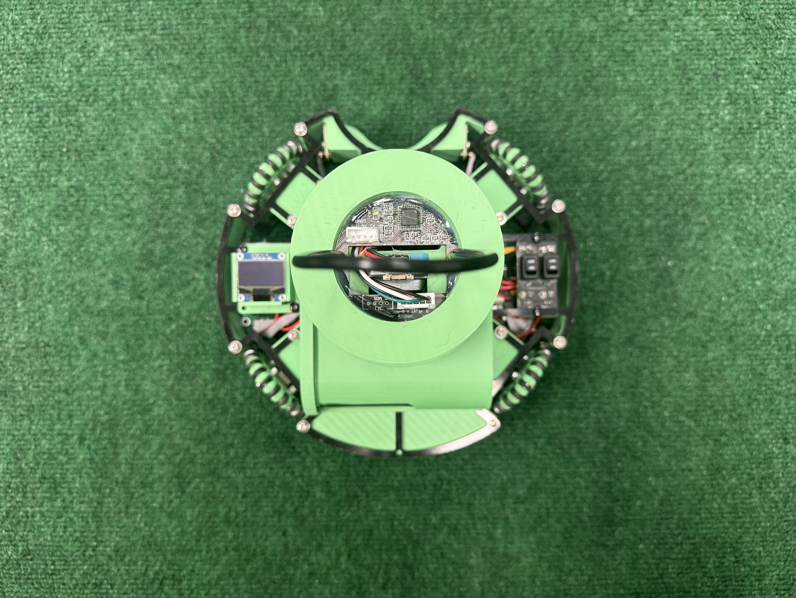

## Robot2 Bottom

*Robot 2 Bottom View*

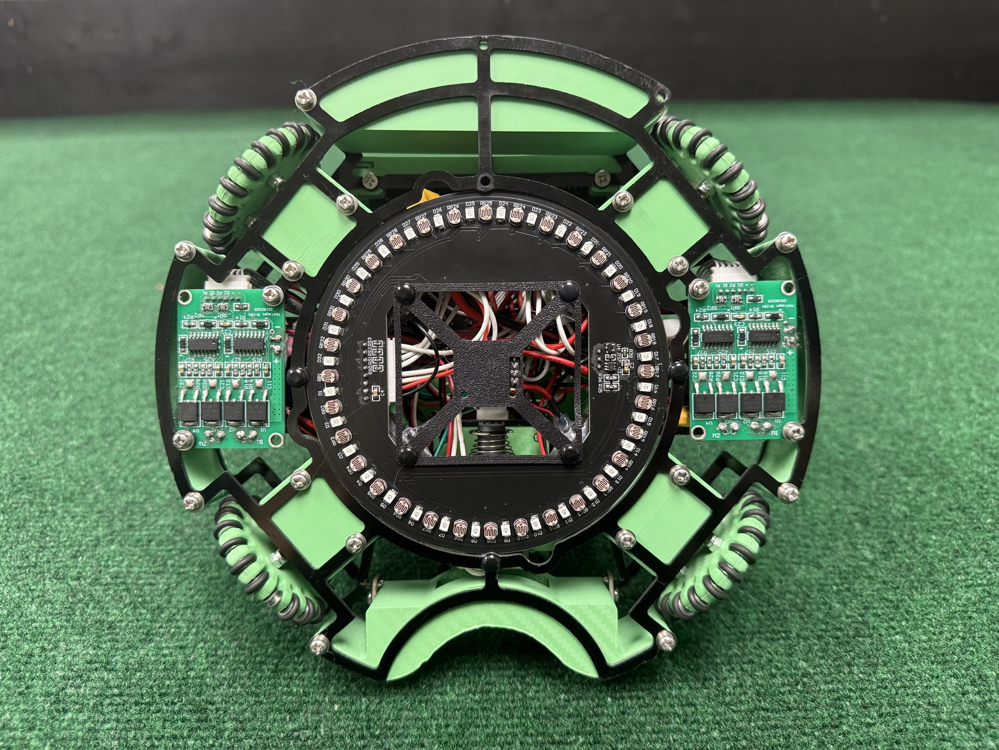

## Robot2 Right

*Robot 2 Right View*

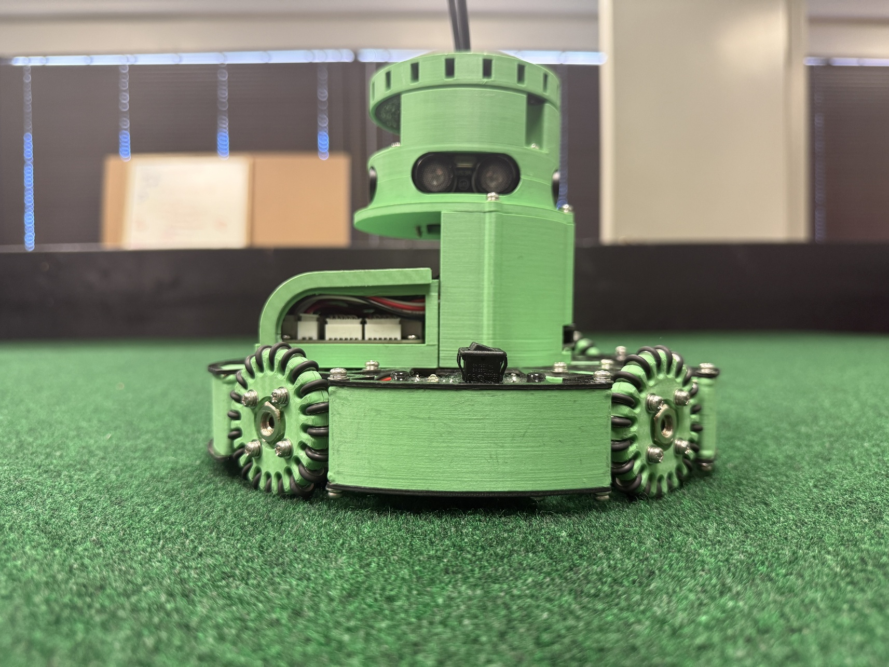

## Robot2 Left

*Robot 2 Left View*

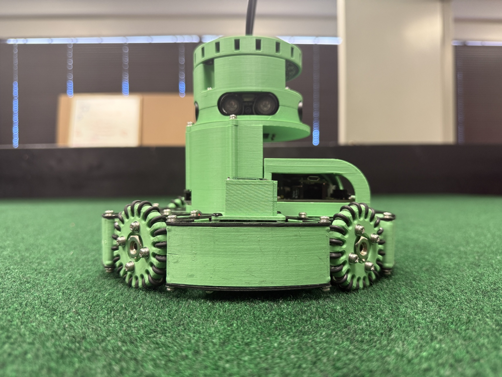

## Mechanical Design

*How did you design the mechanical parts of your robots?*

We have around 4-5 years of Solidworks experience dating back to RoboCup lightweight in 2019 at Syndey. We used Solidworks for CAD and then Bambu Lab for 3D Printing. We built off 30% of our design from last year (Lovbot Quantum) and then redesigned everything from the second chassis and above. A lot of considerations we made this year were from mistakes/learnings from last year. 1) We removed the dribbler for increased reliability. 2) We switched from an OpenMV camera to an M5 Stack Camera after talking with Kotaro from Edge. The M5 is a lot more reliable. 3) We made our own 3D printed wheels this year because we did not find larger commercial wheels to lift our robot higher above the surface. Last year, due to smaller wheels, the circular light sensor was getting interfered because it was too close to the ground.

There are a lot of minor considerations we made, but these are some of our biggest decisions that we made for this years robot.

## Build Method

*How did you build your design?*

We used Bambu Lab's P1S to 3D Print around 80% of our robot. Our 3 fiberglass chassis are cut with a CNC (LY BGACNC 6040Z). 

We used JLCPCB to manufacture our PCBs. 

We didn't really need to make much changes, but we did shift from a lot of externally bought hexagonal pillars to 3D prints this year. I think the 3D prints are much stronger but also heavier, so we had to play with the infill a lot and used many rolls of filament for testing (I think we printed the entire robot to 3% infill to meet the weight requirement)

## Motors & Reason

*How many motors have you used and why?*

We used x4 Polulu 9.7:1 Gearmotors. We originally used the JoinMax motors due to their high RPM, and it worked in the past when we competed in open. We then realized that the motor RPMs highly varies across motors and caused us to rely on software-hacked motor correction to keep the robot straight at all times. We then tried the high power polulu motors and the RPM speeds were surprisingly very linear and consistent. We have always had 4 motors since it's the perfect balance between traction and weight considerations.

For the wheels, we essentially reverse-engineered a metal GTF Robot wheel and made it larger. For the mini wheels of the omniwheel, we use the same ones that come from a Dyson vacuum. We then 3D print the wheel and assemble the wheel with a metal wire connecting the mini wheels. As to why, we needed larger wheels for better white line detection, but never found anything suitable commercially.

## Kicker Design

*If your robot has a kicker, explain how you designed and built the mechanics of the kicker*

We bought a Takaha CB1037 from Japan and connected it to a capacitor. Our wheels run on 12V, the Teensy board runs on 3.3V/5V, and the capacitor is rated up to 48V. We added the capacitor as a buffer to handle sudden drops in voltage and suppress voltage spikes, particularly when the motor draws a large current during startup or sudden directional changes.

## Dribbler Design

*If your robot has a dribbler, explain how you designed and built the mechanics of the dribbler.*

We removed our dribbler from last year because it often caused battery issues and was not necessary at all in lightweight.

## CAD Files

*CAD design files*

https://grabcad.com/library/2025-robocup-junior-lightweight-lovbot-legends-1

## Mechanical Innovation

*Mechanical Innovation*

We had 3 main innovations we were proud of this year:

1) 3D-printed Omniwheels. As explain earlier, we are really proud of the omni-wheels we designed. We had undergone 7 different versions of the wheel until we finally landed on a design that we thought was better than the commercial options. 

2) Mouse Sensor Navigation: We may be the first team to integrate a mouse sensor for drift correction. To handle its computational load, we used a Seeed Xiao to relay data to the Teensy. It drifts only 3–5 cm over a full lap, making it a reliable backup when ultrasonics are blocked. We're still investigating minor slowdowns possibly caused by the sensor.

3) 3D-Printed Chassis: This is our first year using a nearly fully 3D-printed robot. Initially overweight by 100g, we tested various infill settings and settled on 3% gyroid, bringing us 15g under the limit. A prototype is shown in our design photo.

## Mechanical Photos

*Photos of your mechanical designs highlights*

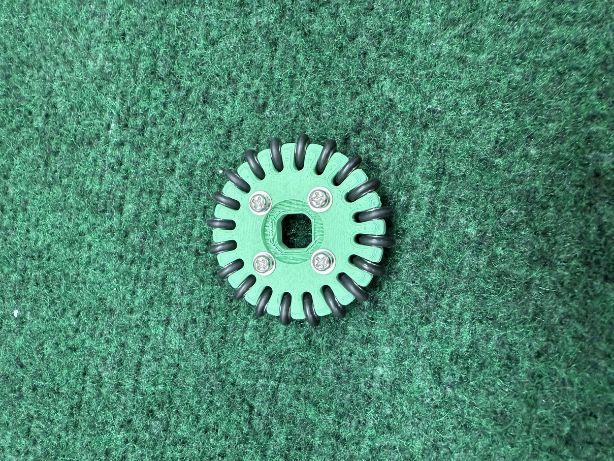
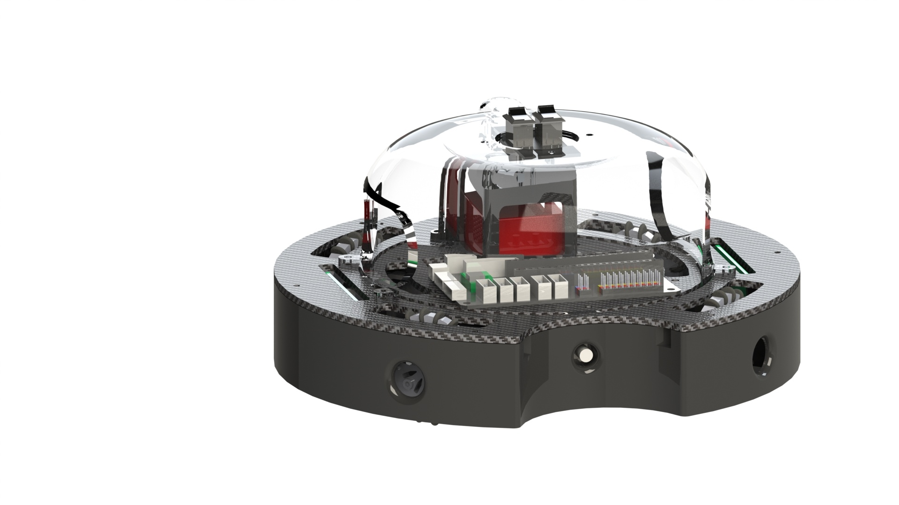

## Electronics Block Diagram

*Provide us with a block diagram of your robot's electronics*

## Power Circuit

*How does your power circuits work?*

We have a 3s 1500mAh LiPo Battery (12.6V full charge) connected to our switch board which connects to our motors which run on 12V. The switch board connects to our teensy shield which has a buck converter that steps down to 5v.

## Motor Drive Circuit

*How do you drive your motors? Explain the circuits you use for that*

We drive our motors using two H-bridge motor controllers purchased from AliExpress. Each controller is capable of independently driving two Polulu motors, allowing for full bidirectional control and variable speed through PWM.

## Microcontroller & Reason

*What kind of micro controller or board do you use for your robot? Why did you decide to use this part for your robot? If you have more than 1 processor, explain each one separately.*

We have been using the Teensy4.1 for over 3 years since it has 600 MHz frequency (almost 100x faster than Arduino Mega) and because it has exactly enough analog ports for our robot. We also have a Seeed xiao which connects to our mouse sensor, but we are still figuring it out and the design is not finalized yet. The mouse can connect directly to the teensy but we found it slows down the processing power, so we've been spending the last few weeks trying to test the seeeduino.

## Ball Detection

*How does your ball detection sensors and/or camera[s] work?*

Our robot uses the TSSP58038 IR receiver for ball detection, which is tuned to detect the infrared signal from the ball. The IR ball emits this signal in bursts at a known pulse frequency. The TSSP58038 outputs a digital low signal whenever it detects a valid IR pulse, and our system measures the duration of these low pulses to determine if the detected signal matches the expected ball signature. The detection circuit is built into a custom PCB, which outputs an analog signal representing the ball's angle and strength. This signal is read through two pins on the Teensy: eyePort (which selects the sensor) and eyeValue (which reads the corresponding strength).

## Line Detection

*How does your line detection circuits work?*

Our line detection system uses 32 photoresistor (MG45-12 photoresistor from ali-express) sensors arranged around the base, each wired as a voltage divider to detect changes in surface brightness. The analog signals are routed through two 8-bit multiplexers to a single analog input on the Teensy, allowing us to read all sensors efficiently. A sliding resistor is included in the LED circuit to adjust brightness and improve contrast based on lighting conditions.

## Navigation/Position Sensors

*What sensors do you use for navigation and how are these sensors connected to your processor? What sensors do you use to find your position in the field? What about the direction your robot faces?*

We use 4 ultrasonic sensors which sends an analog signal to the teensy. As for direction, we use a BNO055 as the compass to keep our robot facing straight. In addition, we've innovated a mouse sensor that gives us a drift value from the nearest accurate ultrasonic value.

## Kicker Circuit

*How do you drive your kicker system? How does the circuit make the kicker work?*

Our kicker system is powered by a 48V step-up converter, which boosts the 11.1V LiPo battery to the high voltage needed for kicking. The output charges a capacitor, and when triggered by the Teensy, a circuit rapidly discharges the capacitor through a solenoid, creating a strong kick.

## Dribbler Circuit

*How does your dribbler system work? What components and circuits did you use to drive it?*

No dribbler.

## Schematics

*Schematics of your robot*

[https://drive.google.com/open?id=1sllel7SJUNt61HOQSBheg15wmwY_7Xwd](https://drive.google.com/open?id=1sllel7SJUNt61HOQSBheg15wmwY_7Xwd)

## PCB

*PCB of your robot*

[https://drive.google.com/open?id=1Blgugk-zZYWb-CM01EtHGpW95GjAyXed](https://drive.google.com/open?id=1Blgugk-zZYWb-CM01EtHGpW95GjAyXed)
[https://drive.google.com/open?id=112WZBrRk7fCeT-WeIqzWJsX_wjppFFQi](https://drive.google.com/open?id=112WZBrRk7fCeT-WeIqzWJsX_wjppFFQi)

## Innovation

*Innovations*

We're most proud of our upgraded line detection system, which we redesigned for greater precision and flexibility. Originally, we used 24 photoresistor sensors in a 60mm diameter ring. This year, we expanded it to 32 sensors on a 120mm ring, nearly doubling the sensor density and field coverage. This significantly improved our ability to detect lines from multiple angles, especially during high-speed movement or edge-following maneuvers.

To adapt to varying lighting conditions, we also added a sliding resistor to the LED circuit, allowing us to fine-tune the brightness of the downward-facing illumination ring. This adjustment helps optimize the contrast between white lines and dark flooring depending on ambient light, reducing false detections or blind spots.

## Circuit Photos

*Photo of your circuit boards highlights*

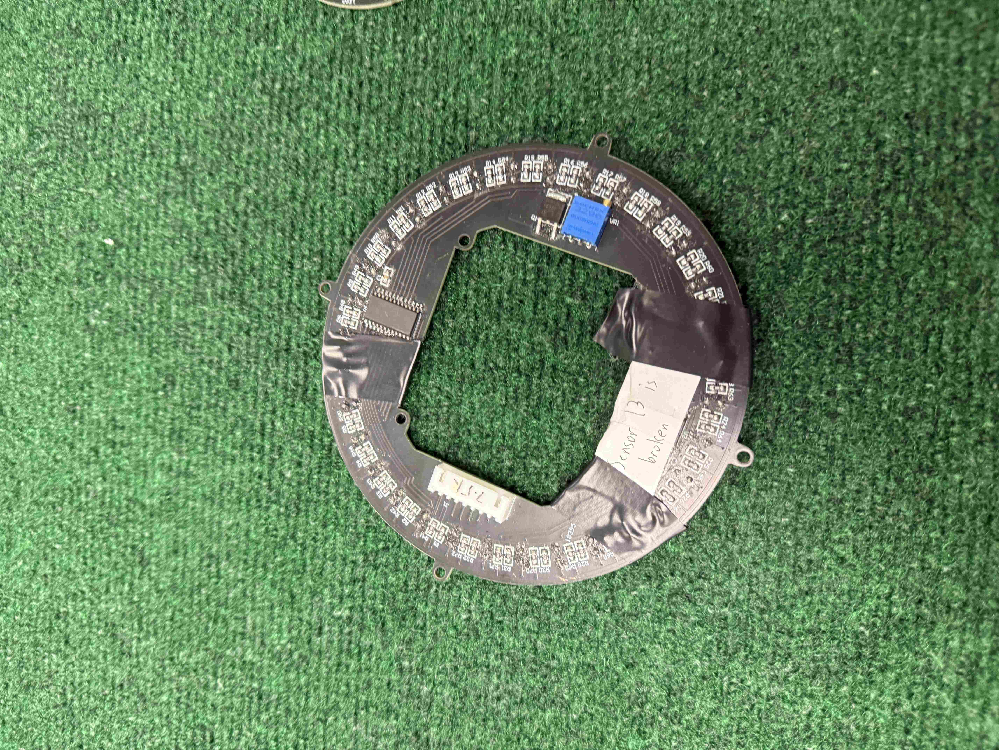
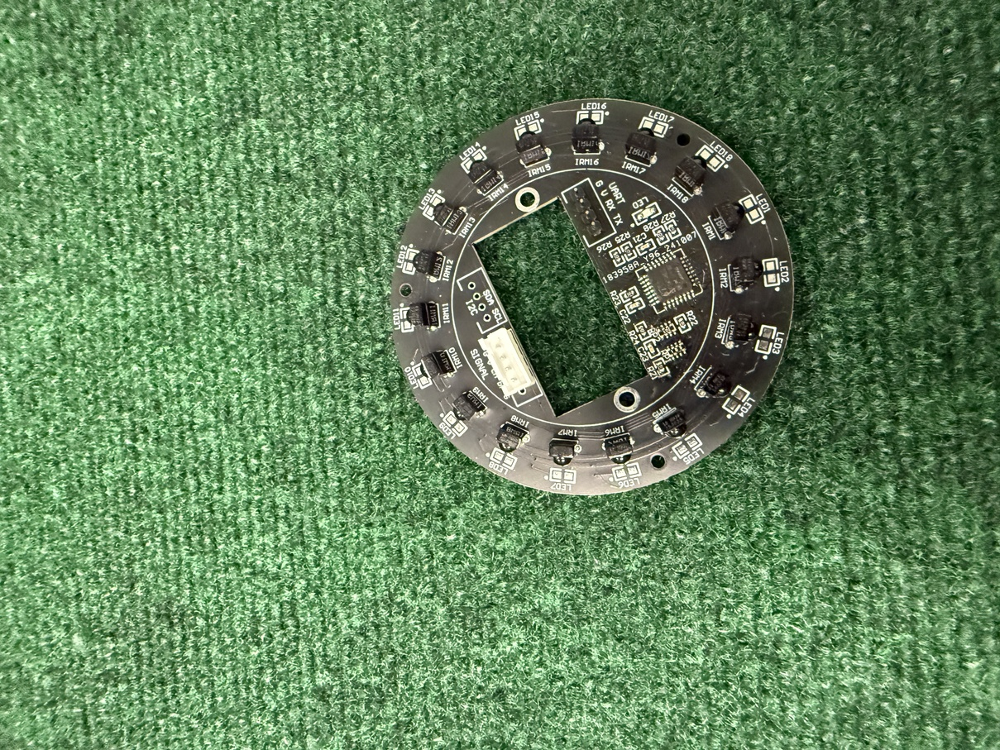
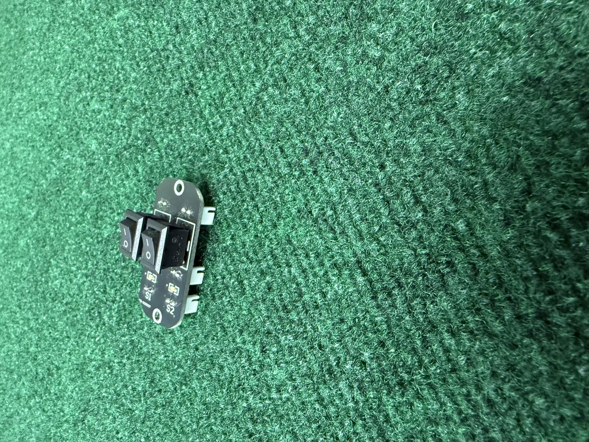

## Motor Control

*How do you use your processor to move your motors?*

We use the Teensy 4.1 microcontroller to control our motors using PWM signals. The Teensy generates high-frequency PWM outputs that are sent to the motor controllers, which interpret the duty cycle of each signal to determine motor speed. A higher duty cycle results in faster rotation, while a lower duty cycle slows the motor down. Direction is controlled using additional digital pins.

## Ball Detection Method

*How do you find where the ball is? How do you read the data from the ball detection sensors or camera?*

The compound eye PCB sends analog signals through two pins: eyePort selects the active sensor, and eyeValue provides the signal strength. By cycling through sensors and reading these two analog ports on the Teensy, we determine the direction and proximity of the ball.

## Ball Catch Algorithm

*How does your algorithm work to catch the ball? Is there a difference between your robots in how they move towards the ball? Explain the differences.*

Our algorithm uses a PID controller to adjust the robot’s movement based on the ball’s direction and distance. The proportional term reacts to the angle between the robot and the ball, helping it turn toward the target, while the derivative term smooths the motion to prevent overshooting. We add the PID output to the current angle of the ball as an offset. The PID is controlled by the ball distance (ballValue).

These are our PID parameters: double dirKp=0.21, dirKi=0.00, dirKd=0.03;

## Line Algorithm

*How does your robot find the lines to stay inside the field? What algorithms do you use to avoid going out of bounds?*

This is an algorithm we spent over 3 years developing. We have the 32 light sensors detect clusters of white line, returning the average angle of that cluster. We then do vector addition of the total clusters and then return both the angle and magnitude of the white line vector. We realized that there are special cases (for example, the white angle is the 270 when the robot is within the white line and on the left side of the field AND the white angle is also 270 when the robot it outside the white line and on the right side of the field). In both cases, the white angle is 270, and the robot does not know which side of the field it is on so we need to apply a flip() logic. With the flip logic, if we detect a change >120 degrees of the final vector, ie. from 270 to 90, then we flip the final vector by doing (whiteangle + 180)%360; In addition to this, based on the getFlip() function, we can vary our speeds (ie. the speed is higher the farther out the robot is)

## Goal Algorithm

*What algorithms do you use to score goals? How do you use your kicker and dribbler to handle the ball?*

We use our M5 camera to directly aim towards to the goal with one simple line: setTarget(getOpposingAngle() + getCompass()) %360; With this line, we always aim towards the goal (we constrained the angle from 315 to 45 so it doesn't turn too much). We then kick when the angle difference between our target angle and compass is within a certain threshold (ie. 10 degrees).

## Defense Algorithm

*What algorithms do you use to avoid the opponent team scoring? How do your robots defend your own goal?*

We are very proud of our white line following algorithm. You can see a full demo of our white line here: https://www.youtube.com/watch?v=B6lyV9Sz0HU. We consulted with Edge a lot and we took a lot of inspiration from their algorithm last year. We essentially take the white line vector and add it to a vector which is parallel to the the white line angle (ie. the parallel vector is 90 if the ball is on the right and 270 if ball is on the left). We also apply a corner slowdown ratio when the white angle starts to get curved so that the robot does not go past the goal when defending. Finally, to ensure that we are not called a damaged robot, we go forward if the ball is in front of our robot for more than 3 seconds.

## Robot Communication

*Do your robots communicate with each other? How do you use this communication to your advantage?*

Yes, we have an HC05 bluetooth communication module which we use to run strategies. You can see a demo of one of our strategies here: https://www.youtube.com/watch?v=KrcUmff-UcM. Essentially, the defense robot will come out of the goal and block the opposing goalie if the offense robot has the ball in the corner for more than 3 seconds. We found that a lot of defense robots in previous years were completely unstoppable, making lightweight play (in my opinion) very flat and uninteresting compared to open. We though this was one of the ways where we can exploit teams that solely follow the white line for defense. Note that this does not violate the pushing rule because the opposing robot must touch BOTH the defending robot and the ball for it to be considered pushing.

## Innovation2

*Innovations*

We are most proud of our localization algorithm which we use to set an invisble white line in case our white line fails. It also allows us to run at a much faster speed compared to our opponents which creates greater score opportunities. 

You can see a demo here: https://www.youtube.com/watch?v=B96fBnEuuu8. In the video, the robot is able to stop before hitting the wall even though there is no apparent white line on the ground. In this case, it is very easy for the robot to run at very high speeds without hitting the white line at all. 

You can refer to our poster for specifics, but the algorithm is created by essentially subtracting 4 wall vectors (distance from wall) from the current around ball vector. In this case, the wall vector should apply a repelX and repelY force which repels the robot from hitting the wall.

## GitHub Link

*GitHub link*

https://github.com/willwu24/LovbotLegends

## BOM

*Bill of Materials (BOM)*

[https://drive.google.com/open?id=1P3lmMcdwarDbzJec8fJWInp1FAUS8Ifq4UZoPZdXWHU](https://drive.google.com/open?id=1P3lmMcdwarDbzJec8fJWInp1FAUS8Ifq4UZoPZdXWHU)

## Cost

*How much did it cost you to build your robots?*

Robots: $3366.52 Total; $1.683,26 USD Each Robot (according to BOM) which includes filament, failed sensors, etc.
Environment is an upfront cost (our club has always had the field for 10+ years)

## Funding

*How did you gathered the funds to build the robots?*

80% Parents 20% Sponsors

## Affordability

*How affordable was it to compete in RoboCupJunior Soccer?*

8

## Answer Check

*Have you checked all of your answers?*

Yes!

## Publication Consent

*We publish TDPs and posters during or after the competition as described in the beginning*

Yes, we acknowledge everything submitted in the above form can be published.

## Email Address

*Email Address*

willwu7370@gmail.com

## TDP File

*TDP File Upload (Not required)*

## Extra Column

*Column 67*

