## Timestamp

*Timestamp*

7/13/2025 13:32:19

## Team Name

*What is your team's name?*

Lovbot Thunder

## League

*What league do you participate in?*

Open League

## Country

*Where are you from?*

Vancouver, Canada

## Contact

*If other teams have questions about your robot, now or in the future, what email address(es) can we publish along with this document for people to reach you?

(You can put in multiple email addresses, like multiple team members, an email for the whole team or both. Feel free to share other ways of communication like Discord handles)*

zhangroy141@gmail.com
ericmiao110@gmail.com
williamzhao649@gmail.com

## Social Media

*Team Social Media Links (if you have any)*

## Team Photo

*Upload a photo of your whole team with your mentor and robots

Note: This is not mandatory and will be published along with your TDP if you choose to upload something*

## Members & Roles

*What are the names of the team members and their role(s)?*

Eric Miao: Hardware & Electronics
William Zhao: Offense Software
Roy Zhang: Defense Software

## Meeting Frequency

*How often did your team meet?
(e.g. 90 minutes once per week or a day every weekend.)*

10 hours every week; full days every day as competition neared

## Meeting Place

*Where did you meet to work on your robot?
(e.g. a robotics room at school, at some other place, one of your homes, school library etc.)*

Robotics club

## Start Date

*When did your team start working on this year's robot?*

September 2024

## Past Competitions

*Which RoboCupJunior competitions have you competed in and in which leagues?*

Western Canada Open 2024: Lightweight League
Worlds Eindhoven 2024: Open League
Western Canada Open 2025: Open League
Eastern Canada Open 2025: Lightweight League
Americas SuperRegionals 2025: Open League

## Mentor Contribution

*Which parts of your work received the most contribution from your mentor?*

Making sure our electronics don't short or burn; helping fix broken hardware or software logic problems (e.g. whether we should give up trying to resurrect a camera which the IDE fails to detect)

## Workload Management

*How did you manage the workload?*

Staying consistent, coming to the lab on time, communicating effectively via Instagram group chat

## AI Tools

*Which AI tools did you use?*

ChatGPT, Deepseek
Mainly helped with debugging code and evaluating logic, acted as a secondary "tester" to make sure faulty code doesn't get executed.

## Robot1 Overall

*Robot 1 Overall View*

## Robot1 Front

*Robot 1 Front view*

## Robot1 Back

*Robot 1 Back view*

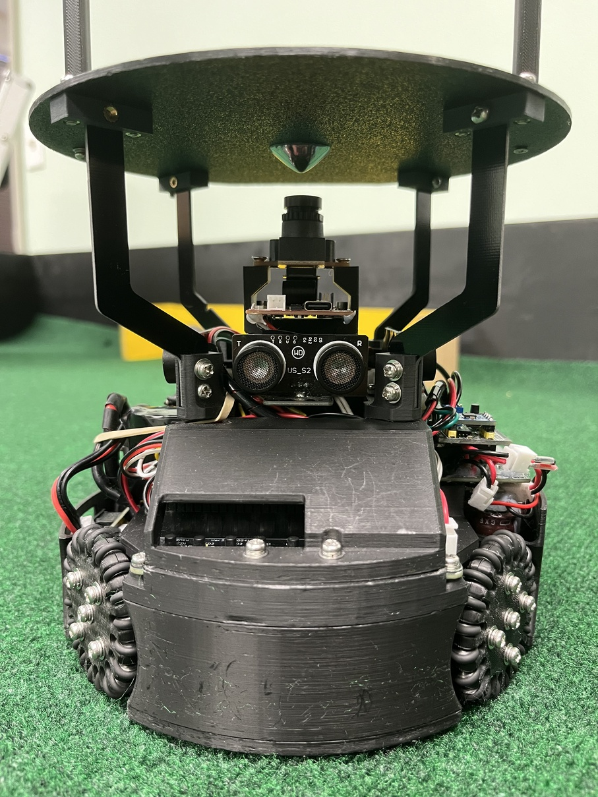

## Robot1 Top

*Robot 1 Top View*

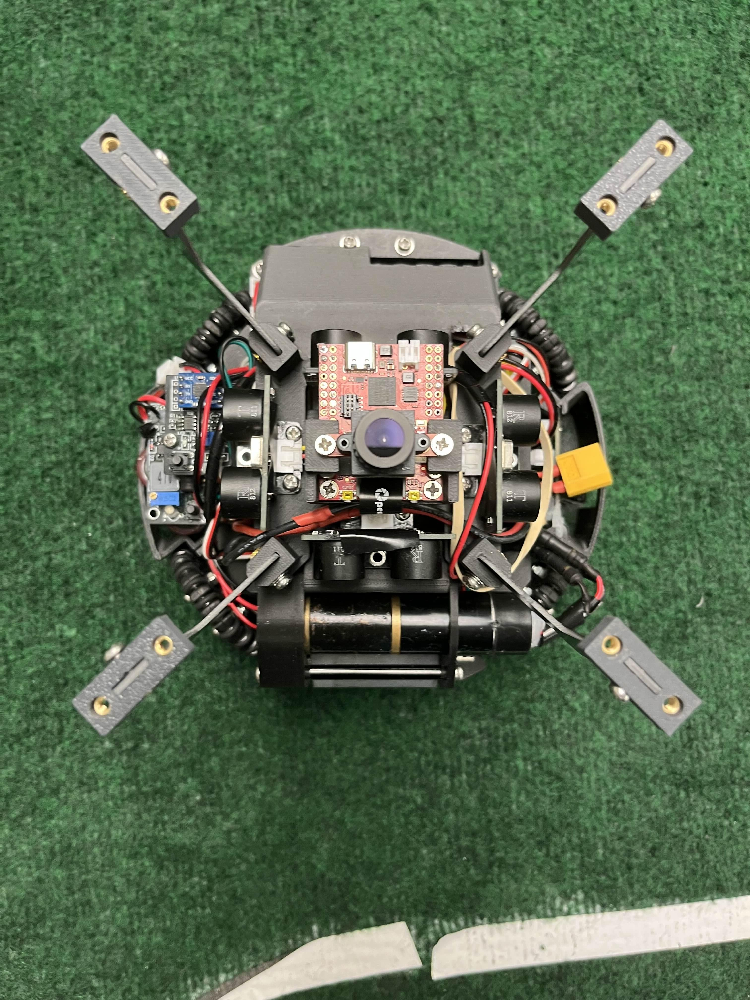

## Robot1 Bottom

*Robot 1 Bottom View*

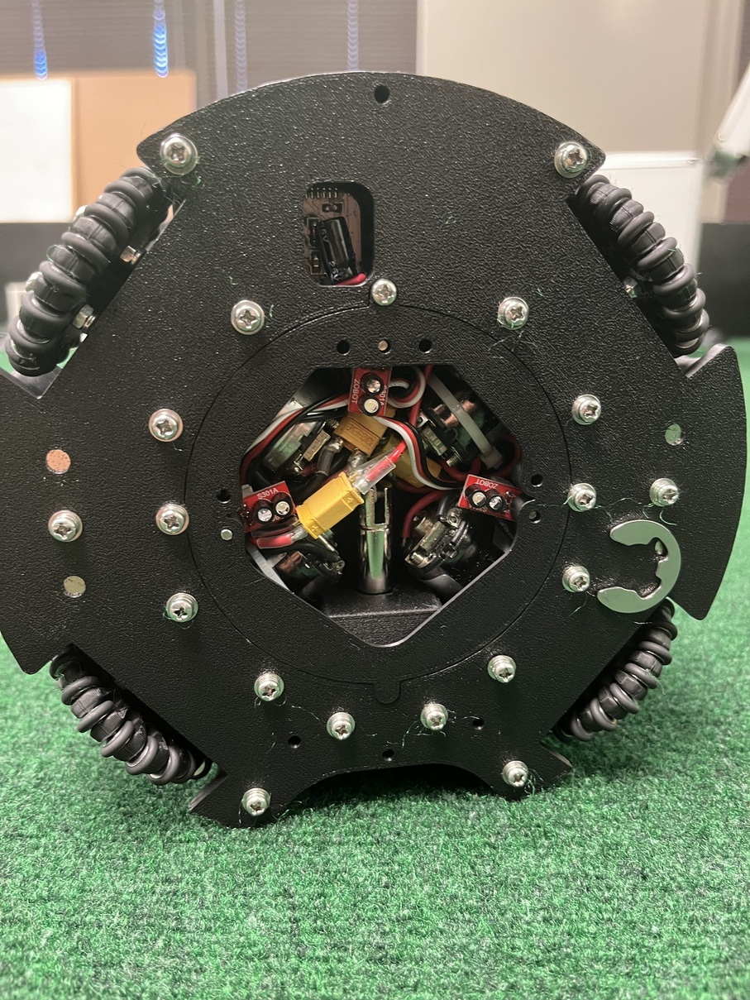

## Robot1 Right

*Robot 1 Right View*

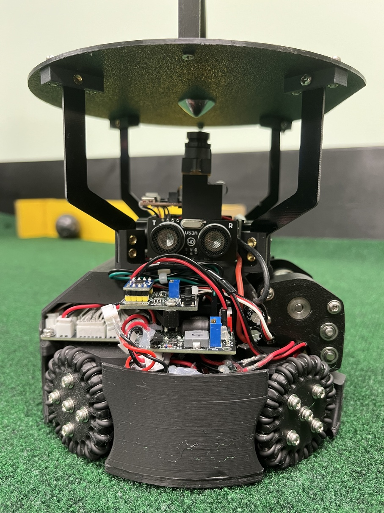

## Robot1 Left

*Robot 1 Left View*

## Positioning & Movement

*How do you find your position inside the field and how do you use that position to move your robots around?*

We used four ultrasonic sensors positioned 90 degrees apart on all four sides to determine distances from the walls. When our robots are not blocked, we can create a simple coordinate system that allows our robot to position at any desired x and y coordinate.

## Robot2 Overall

*Robot 2 Overall View*

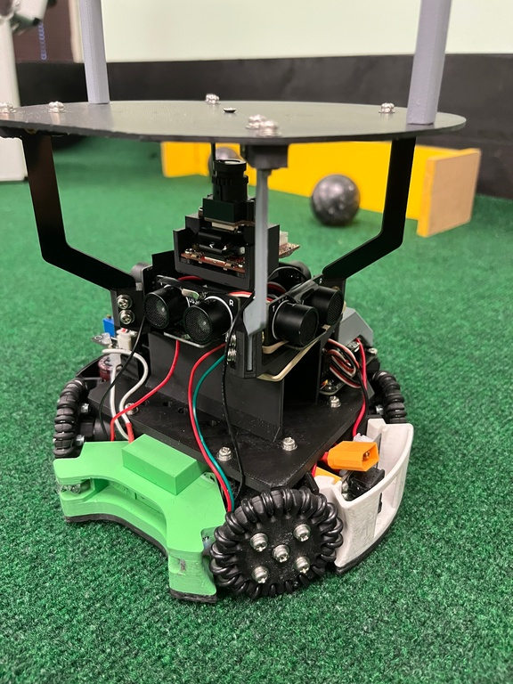

## Robot2 Front

*Robot 2 Front view*

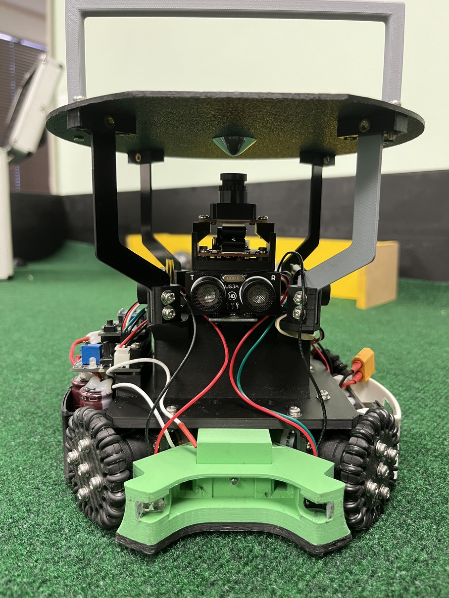

## Robot2 Back

*Robot 2 Back view*

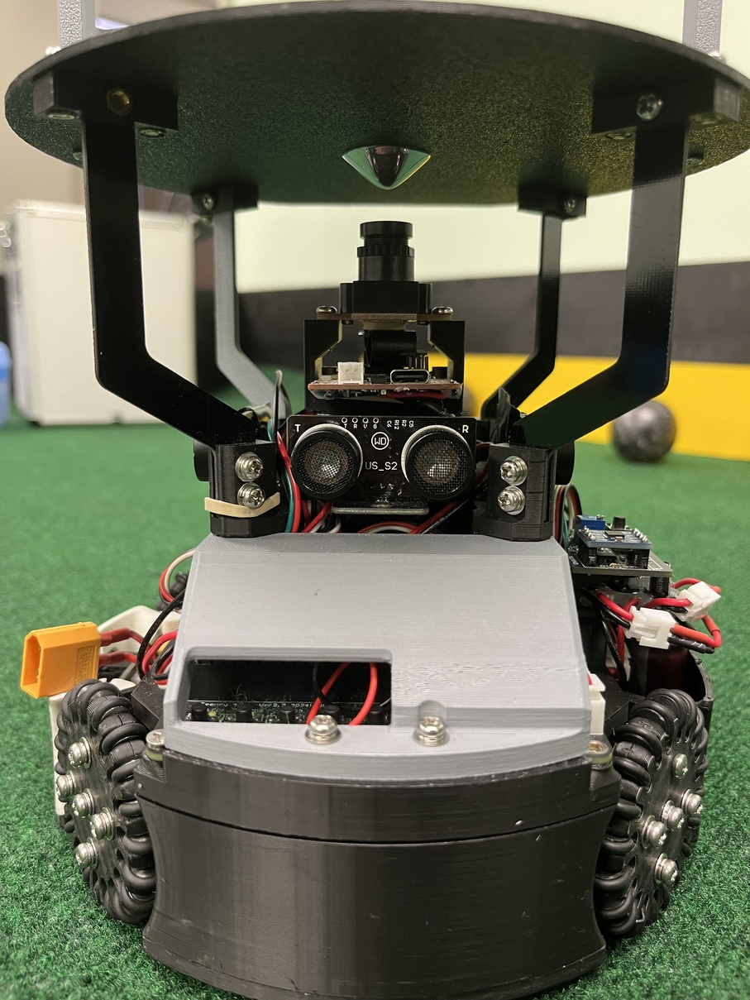

## Robot2 Top

*Robot 2 Top View*

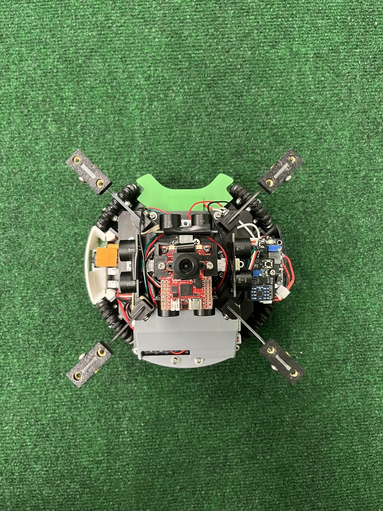

## Robot2 Bottom

*Robot 2 Bottom View*

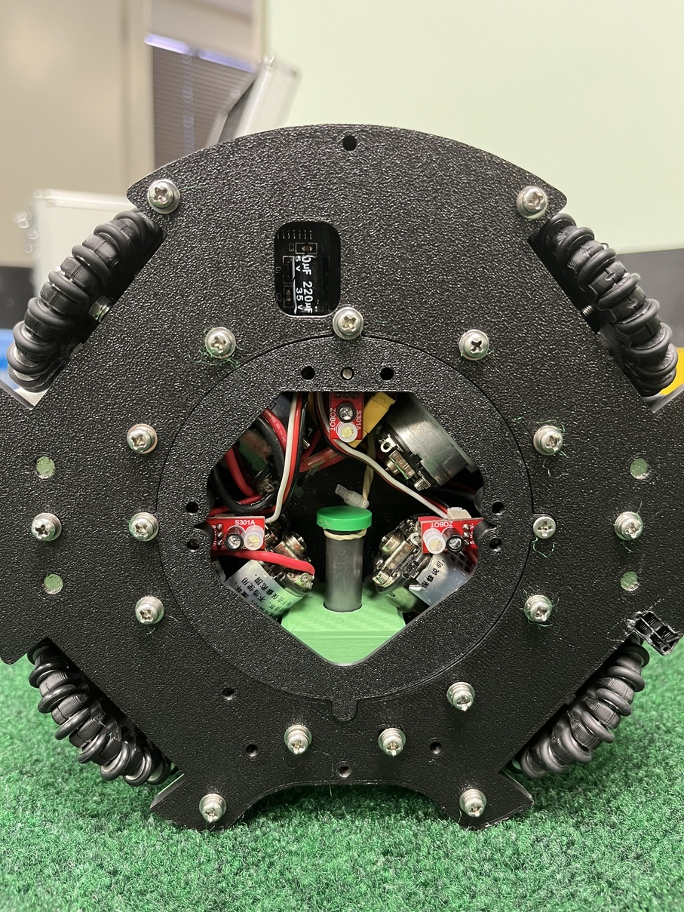

## Robot2 Right

*Robot 2 Right View*

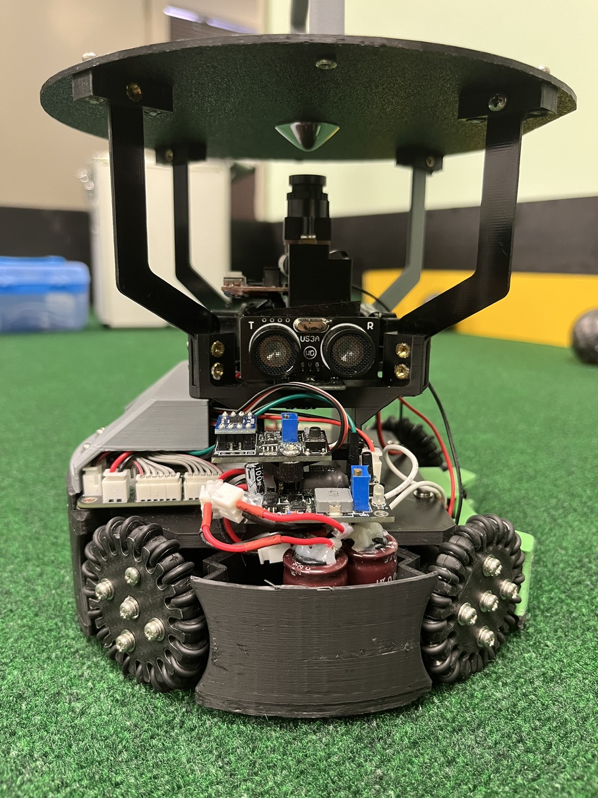

## Robot2 Left

*Robot 2 Left View*

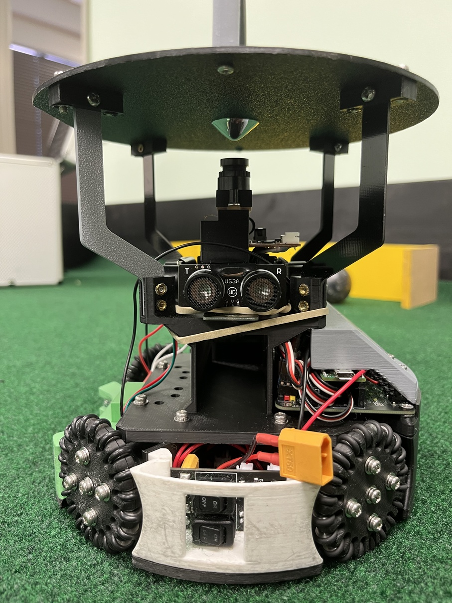

## Mechanical Design

*How did you design the mechanical parts of your robots?*

Our team used solidworks as our CAD to design our robot. As we designed, we focused on making each section modularized so we could fix our robot rapidly during competition. Currently, we could also make some improvements. For instance, it would be nice to have a 3D printed case that goes around our robot and covers the wires to keep the electronics. But because of time constraints, this was sadly not possible.

## Build Method

*How did you build your design?*

Our robot is completely 3D printed except for the mirror and electronics. We used different types of printer all originating from bambu labs to do this. Additionally, for the mirror, we made it ourself using a 3D printed mold and heat press aluminum. Throughout our design process, we encountered a couple of problems. For instance, a major modification that we made was when we decided to add a dribbler to our offence robot. This meant that we needed to change our design and create screws holes for the dribbler mount. This was easy as every part was modularized and it paid off.

## Motors & Reason

*How many motors have you used and why?*

We used four motors positioned at 50°, 130°, 230°, and 310° with omnidirectional wheels to enable full 360° holonomic movement. This setup allows the robot to move in any direction and rotate without turning first, giving us an advantage in both offensive positioning and defensive control. Compared to a three-motor system, our four-motor configuration offers greater stability, smoother acceleration, and more balanced force distribution, which is crucial at high speeds. It’s also more efficient and reliable than a five-motor setup, avoiding unnecessary weight (and space), power draw, and mechanical complexity. Overall, four motors provide the optimal balance of agility, control, and simplicity.

## Kicker Design

*If your robot has a kicker, explain how you designed and built the mechanics of the kicker*

The kicker uses a solenoid that we made ourselves. We wrapped it using 22awg wire and stripped the core from a premade solenoid. The kicker box and coiling piece are both 3D printed. These parts were all modelled within solidworks which made it easy for us to see how everything fit together.

## Dribbler Design

*If your robot has a dribbler, explain how you designed and built the mechanics of the dribbler.*

Our robot does have a dribbler which was also designed within solidworks. The piece that makes contact with the ball is made out of silicone with a shore hardness of 20a. This made it catch the ball with quite a bit of grip which allowed us to run different strategies. The mold was also 3D printed which was sanded in the post processing.

## CAD Files

*CAD design files*

https://github.com/Eric1773/Full-Parts-List-

## Mechanical Innovation

*Mechanical Innovation*

The kicker is the component that we are the most proud of. This year, we chose to make our kicker by ourselves which made it much stronger than its commercial counterparts.

## Mechanical Photos

*Photos of your mechanical designs highlights*

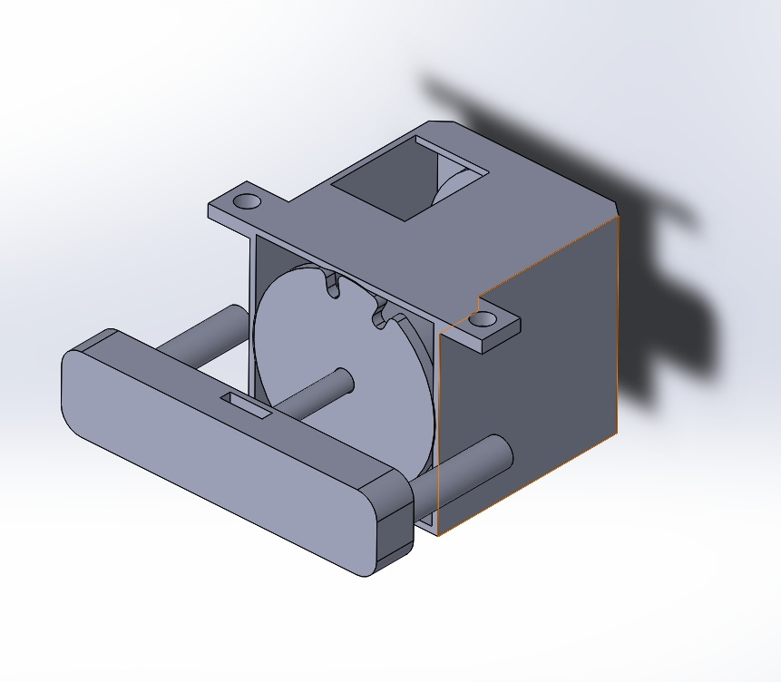
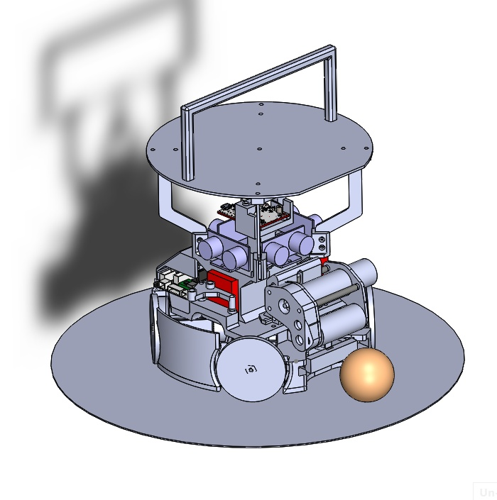
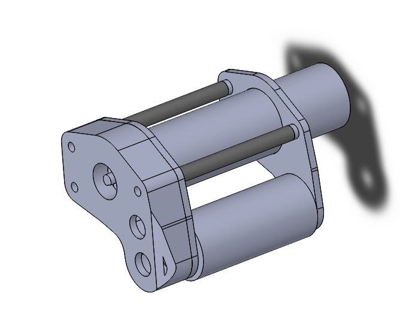

## Electronics Block Diagram

*Provide us with a block diagram of your robot's electronics*

[https://drive.google.com/open?id=1_cW96NoFRiIdJCEp0F3Fam1HPudgwV-v](https://drive.google.com/open?id=1_cW96NoFRiIdJCEp0F3Fam1HPudgwV-v)

## Power Circuit

*How does your power circuits work?*

Our robot uses a 12V battery that directly supplies current to the capacitor board, microcontroller, and motor drivers. The voltage is regulated to 5V in our Teensy, which is then supplied to the OpenMV board and further downed to 3.3V for the sensors. Kicker boosters are explained in a later question.

## Motor Drive Circuit

*How do you drive your motors? Explain the circuits you use for that*

We use a Teensy 4.1 microcontroller to control our motors by sending PWM and direction signals to the motor driver. The driver is powered directly by a 12V battery and uses the PWM signal to control motor speed and a digital input to set the rotation direction. Since the Teensy operates at 3.3V logic and the driver is compatible, no level shifting is needed. This setup keeps high current isolated from the microcontroller and allows for precise, real-time control of each motor.

## Microcontroller & Reason

*What kind of micro controller or board do you use for your robot? Why did you decide to use this part for your robot? If you have more than 1 processor, explain each one separately.*

We use a Teensy 4.1 microcontroller and an OpenMV camera module with an RT1062 processor to control our robot. The Teensy was chosen for its high processing speed (600 MHz), real-time responsiveness, and reliable low-level hardware control, making it ideal for managing motor outputs, sensor inputs, and movement decisions during gameplay. Its ability to run without an operating system ensures minimal latency and predictable timing, which is essential for fast, stable robot behavior.
The OpenMV module is used for computer vision tasks, such as ball and color detection. It processes images onboard using the RT1062 chip and sends simplified vision data to the Teensy via serial communication.

## Ball Detection

*How does your ball detection sensors and/or camera[s] work?*

Our robot uses an OpenMV camera module for ball and goal detection. Electrically, the camera connects to the main microcontroller through a UART serial interface and operates independently with its onboard processor. It captures visual data and processes it in real time to identify colored targets like the ball and goals. The camera is pre-configured with fixed exposure, gain, and color balance settings to ensure stable performance under varying lighting conditions. Once the targets are identified, the camera calculates their position relative to the robot and sends this information as data packets to the main controller, allowing for fast and accurate tracking without burdening the main processor.

## Line Detection

*How does your line detection circuits work?*

We use photoresistance sensors connected directly to the microcontroller, which send analog values based on how much light is reflected from the surface below. White field lines reflect more light than the darker playing field, resulting in lower resistance and higher voltage readings. The microcontroller continuously reads these values through its analog input pins. When the voltage crosses a predefined threshold, it detects the presence of a line.

## Navigation/Position Sensors

*What sensors do you use for navigation and how are these sensors connected to your processor? What sensors do you use to find your position in the field? What about the direction your robot faces?*

We use analog ultrasonic sensors connected to the processor’s analog inputs to measure distances and determine our position on the field. For direction, we use an MPU6050 sensor connected via I2C, which provides real-time orientation data from its gyroscope and accelerometer. This combination allows our robot to accurately track its position and facing direction during matches.

## Kicker Circuit

*How do you drive your kicker system? How does the circuit make the kicker work?*

The battery supplies 12v to the capacitor PCB. Then this PCB loads the capacitor and boosts the voltage up 48v. Then when commanded, the board discharges the capacitors and runs a current through the solenoid which creates an electromagnet which shoots the ferromagnet forwards. After the kick occurs, an elastic band retracts the ferromagnet which allows it to prepare to kick again on the next command.

## Dribbler Circuit

*How does your dribbler system work? What components and circuits did you use to drive it?*

The battery supplies 12v to the ESC which wires to the teensy 4.1 and powers the brushless dribbler motor (Maxon). Then the motor spins which powers a gearbox which leads to a silicone piece which turns and sucks in the ball.

## Schematics

*Schematics of your robot*

## PCB

*PCB of your robot*

## Innovation

*Innovations*

We really wanted our design to stand out with the kicker power and I am very proud of it in our final product. The electronic that we are referring to is the capacitor wiring. We loaded 4 capacitors in a modularized section of the robot which allowed them to charge and discharge while dispersing heat which induced cooling.

## Circuit Photos

*Photo of your circuit boards highlights*

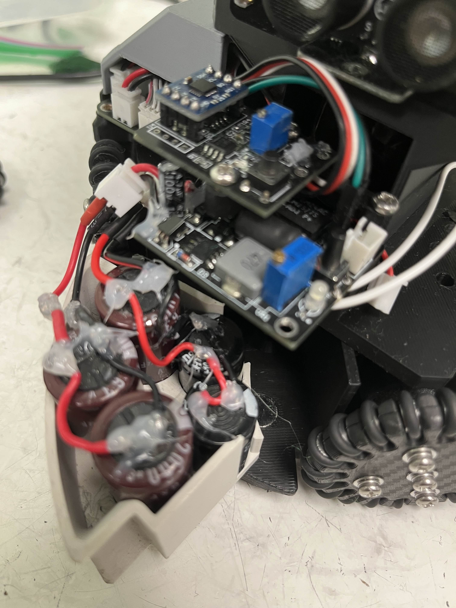

## Motor Control

*How do you use your processor to move your motors?*

We use our processor (microcontroller) to move the motors by calculating direction and speed values in real time based on our robot’s movement plan, then converting those values into PWM (Pulse Width Modulation) signals and digital direction signals that are sent to motor driver pins.
First, we calculate and store the robot’s desired speed, movement direction, and target facing direction via our strategies. The move function reads these values and uses trigonometric calculations to determine how fast each of the four motors should spin to achieve the intended motion. This includes translating a global direction into individual wheel speeds using the law of sines and a combination of motor sign matrices. It also corrects the robot’s orientation using the difference between its current compass heading and its target direction, adjusting motor speeds accordingly to align or turn.
Once the final speeds for each motor are calculated, they are passed to a function adjusts the direction pin (HIGH or LOW) based on whether the motor should spin forward or backward, and sends a PWM signal using analogWrite() to control how fast the motor spins.

## Ball Detection Method

*How do you find where the ball is? How do you read the data from the ball detection sensors or camera?*

We find the ball using an OpenMV RT1062 camera pointed at a convex hyperbolic mirror. This makes for simple ball angle and distance calculations, as we can directly map the x and y values of the camera image to the actual field, where the origin of the coordinates (the center) is our robot. The data is then sent to our microcontroller via UART.

## Ball Catch Algorithm

*How does your algorithm work to catch the ball? Is there a difference between your robots in how they move towards the ball? Explain the differences.*

Our offence algorithm works to catch the ball in two ways. 
If the ball is in bounds, the algorithm works by first checking where the ball is and how far away it is. Instead of going straight toward the ball, it uses ball angle to calculate a slightly curved path by adding a linearly scaling offset to the ball angle itself. This allows the robot to approach from a better angle, especially for gaining control. It then decides whether the ball is in front or behind. If the ball is behind, the robot resets and faces front. If the ball is in front, it chooses whether to aim at the goal or hide the ball based on how far it is from obstacles and how balanced the space is on the left and right sides. The robot also checks how close it is to walls or other objects and stops if needed to avoid crashing. As it moves toward the ball, it adjusts its speed based on how close the ball is—moving faster when far and slower as it gets closer. 
If the ball is not in bounds, the robot turns either 90 or 270 degrees to maximize its reach and slowly moves toward the ball to take control despite the ball being technically out of play. This gives us an advantage versus teams without dribblers, as we would have control of the ball whenever it rolls out the white lines.

The defence algorithm works differently, as it's priority is to clear the ball away from the goal. Instead of developing sophisticated speed and direction control systems, the defence robot turns toward and moves toward ball angle to knock it away from the goal as soon as possible.

## Line Algorithm

*How does your robot find the lines to stay inside the field? What algorithms do you use to avoid going out of bounds?*

We use a combination of ultrasonic distance readings and dedicated, ground facing greyscale sensors to find the lines and stay inside the field. For the ultrasonic readings, we use a sum of vectors formula, where as we approach side walls, we simulate a force exerted from the wall against our robot to slow down the robot's speed/force. For the grayscale sensors, we built a line scanning program that would record the minimum and maximum values of the field, where the minimum would be the whitest white and the maximum the greenest green. An average or desired threshold between the two would be used to evaluate whether our robot is positioned above a white line or not.

## Goal Algorithm

*What algorithms do you use to score goals? How do you use your kicker and dribbler to handle the ball?*

For defence, we use the kicker to clear the ball away from the net if our laser sensors are tripped. We also experimented with bounce and goal shooting with our powerful kicker but ultimately deemed it too risky to do without a dribbler on our defense robot, as these strategies wouldn't clear the ball away as fast.
Once we've captured the ball, we use two main algorithms to score goals, aim shoot and hide ball. Our most direct method is the camera aim shoot algorithm, which uses real-time goal angle data from the camera to align the robot before kicking. Once aligned within a small angular threshold, the robot activates the dribbler to maintain possession and then kicks toward the target with precision. This system ensures we don’t rush the shot and only kick once we’re properly aimed at the goal, which increases shot accuracy.
In more defensive or strategic situations, we use our hide ball routine to protect the ball near the walls. This maneuver uses side distance sensors to determine which wall is closer, then turns the robot sideways and drives toward that wall while maintaining control of the ball. After reaching the desired position, the robot spins and prepares to shoot with a surprise angle. The dribbler keeps the ball close during the entire sequence, and the robot only kicks when it’s in the optimal position and orientation. This technique is particularly effective for countering strategies that defend straight shots exceptionally well.

## Defense Algorithm

*What algorithms do you use to avoid the opponent team scoring? How do your robots defend your own goal?*

Our defence robot primarily uses ultrasonic readings to create a coordinate system where the robot's ideal position lies on the x axis of the plane. The real time ultrasonic readings are compared to the predetermined (via testing) ideal coordinates of the white line. This allows for our robot to dynamically follow the ball's trajectory while aligning itself along the white line to counteract potential pushing from opponents and our offence. We also experimented with algorithms to determine the ball's absolute position and thereby its trajectory vector using this coordinate system, but ultimately found that these predictions are inconsistent and most teams wouldn't have strategies that required a prediction system to counter. We also experimented with strategies to limit the offence robot's shooting angles by moving defence robot up, echoing the conventional soccer goalie strategies of increasing their own relative size to counter striker kicks.

## Robot Communication

*Do your robots communicate with each other? How do you use this communication to your advantage?*

They do not communicate with each other.

## Innovation2

*Innovations*

One of our proudest innovations is how we took our “around ball” behavior from a simple orbit into a strategic, adaptive system that gave us a major competitive advantage. Instead of circling the ball at a fixed offset, we used a linear scaling method with an exponential term for fine tuning to adjust the angle based on how far off-center the ball was. This made our robot more aggressive when the ball was far from the front and more stable as it aligned, resulting in smoother, smarter movement.
We also implemented a quadratic decay in speed as the robot approached the ball. This allowed us to slow down exponentially during the final approach, preventing overshooting and improving control—especially near the corners or against walls. This combination of dynamic angle and speed control gave us a more fluid and reliable way to gain possession and maintain pressure during offensive plays.
To make the system even more intelligent, we developed a dynamic strategy selector. Based on wall distances and the symmetry between left and right sensors, the robot determines whether to orbit into a shot, hide the ball near a wall, or reset to a neutral position. In key situations, we also added pre-aiming—where the robot starts turning toward the goal before it fully possesses the ball—allowing us to shoot faster and more effectively. This innovation helped us convert more possessions into goals and made our robot’s offense significantly harder to counter.

## GitHub Link

*GitHub link*

## BOM

*Bill of Materials (BOM)*

[https://drive.google.com/open?id=1zH5OOQQm-uNdPP1JLkv9alHAFW5ZBZLV](https://drive.google.com/open?id=1zH5OOQQm-uNdPP1JLkv9alHAFW5ZBZLV)

## Cost

*How much did it cost you to build your robots?*

Robots (cost of components that are in your robots right now): 2150 CAD each
Experiments (failed builds, broken hardware etc.): 2000 CAD
Environment (fields, balls, etc.) : 1200 CAD
1 USD = 1.37 CAD

## Funding

*How did you gathered the funds to build the robots?*

100% parents

## Affordability

*How affordable was it to compete in RoboCupJunior Soccer?*

3

## Answer Check

*Have you checked all of your answers?*

Yes!

## Publication Consent

*We publish TDPs and posters during or after the competition as described in the beginning*

Yes, we acknowledge everything submitted in the above form can be published.

## Email Address

*Email Address*

lovbotthunder@gmail.com

## TDP File

*TDP File Upload (Not required)*

## Extra Column

*Column 67*

