## Timestamp

*Timestamp*

7/13/2025 13:36:06

## Team Name

*What is your team's name?*

Mathimazierer

## League

*What league do you participate in?*

Lightweight League

## Country

*Where are you from?*

Germany (Ger)

## Contact

*If other teams have questions about your robot, now or in the future, what email address(es) can we publish along with this document for people to reach you?

(You can put in multiple email addresses, like multiple team members, an email for the whole team or both. Feel free to share other ways of communication like Discord handles)*

theodorreber@gmail.com

## Social Media

*Team Social Media Links (if you have any)*

Team Instagram: https://www.instagram.com/mathimazierer/
https://technulgy.com/
Official Youtube: https://www.youtube.com/@Technulgy

## Team Photo

*Upload a photo of your whole team with your mentor and robots

Note: This is not mandatory and will be published along with your TDP if you choose to upload something*

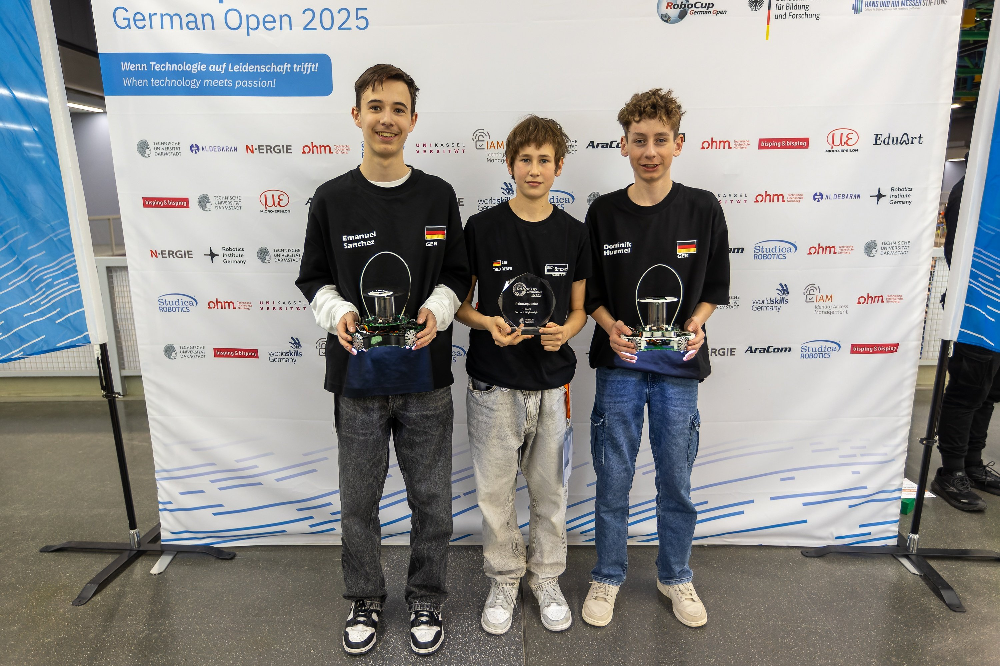

## Members & Roles

*What are the names of the team members and their role(s)?*

Theo Reber: Software development
Dominik Hummel: CAD Design
Emanuel Sanchez: Circuit and PCB Design
Mika Rudat: Soldering and assembling robots

## Meeting Frequency

*How often did your team meet?
(e.g. 90 minutes once per week or a day every weekend.)*

Twice a week for each 1,5 hours

## Meeting Place

*Where did you meet to work on your robot?
(e.g. a robotics room at school, at some other place, one of your homes, school library etc.)*

Robotic room at school

## Start Date

*When did your team start working on this year's robot?*

We started mid December 2024.

## Past Competitions

*Which RoboCupJunior competitions have you competed in and in which leagues?*

South German Championship 2023: 1v1 Lightweight League
German Open 2023: 1v1 Lightweight League
European Championship 2023: 1v1 Lightweight League
-
South German Championship 2024: 2v2 Lightweight League
German Open 2024: 2v2 Lightweight League
European Championship 2024: 2v2 Lightweight League
-
South German Championship 2025: 2v2 Lightweight League
German Open 2025: 2v2 Lightweight League

## Mentor Contribution

*Which parts of your work received the most contribution from your mentor?*

Managing Registration, Managing the whole journey

## Workload Management

*How did you manage the workload?*

We communicated via our WhatsApp Group and Discord. For keeping everything up to date for everyone we used Nextcloud and Github.

## AI Tools

*Which AI tools did you use?*

For some coding issues we used ChatGPT to know why certain problems were happening in the code and to fix some weird program structure.

## Robot1 Overall

*Robot 1 Overall View*

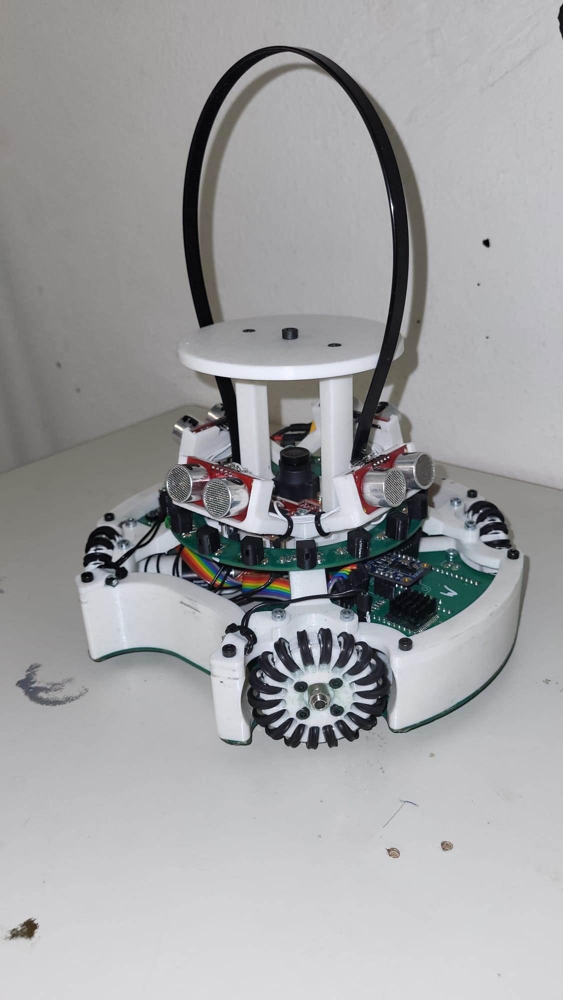

## Robot1 Front

*Robot 1 Front view*

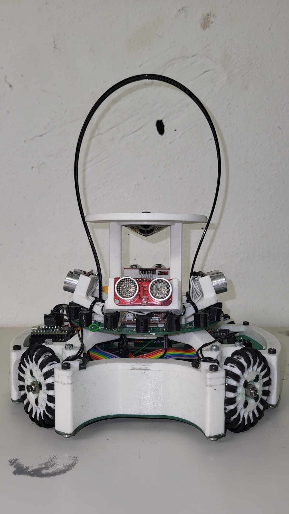

## Robot1 Back

*Robot 1 Back view*

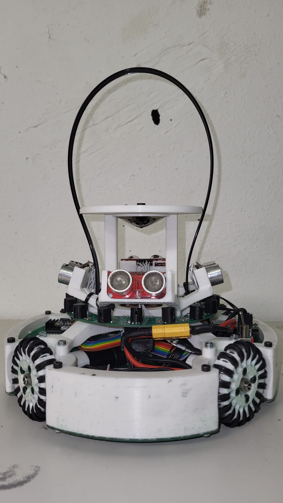

## Robot1 Top

*Robot 1 Top View*

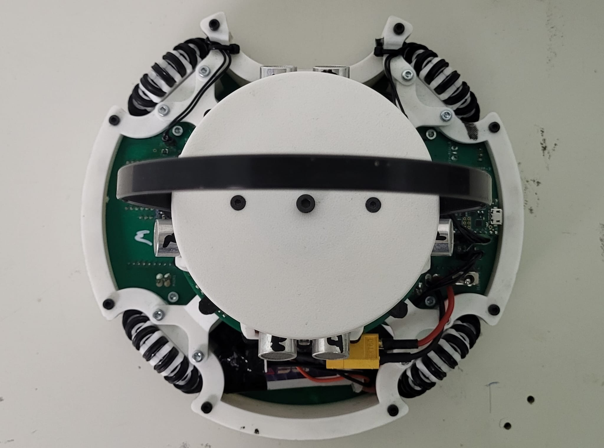

## Robot1 Bottom

*Robot 1 Bottom View*

## Robot1 Right

*Robot 1 Right View*

## Robot1 Left

*Robot 1 Left View*

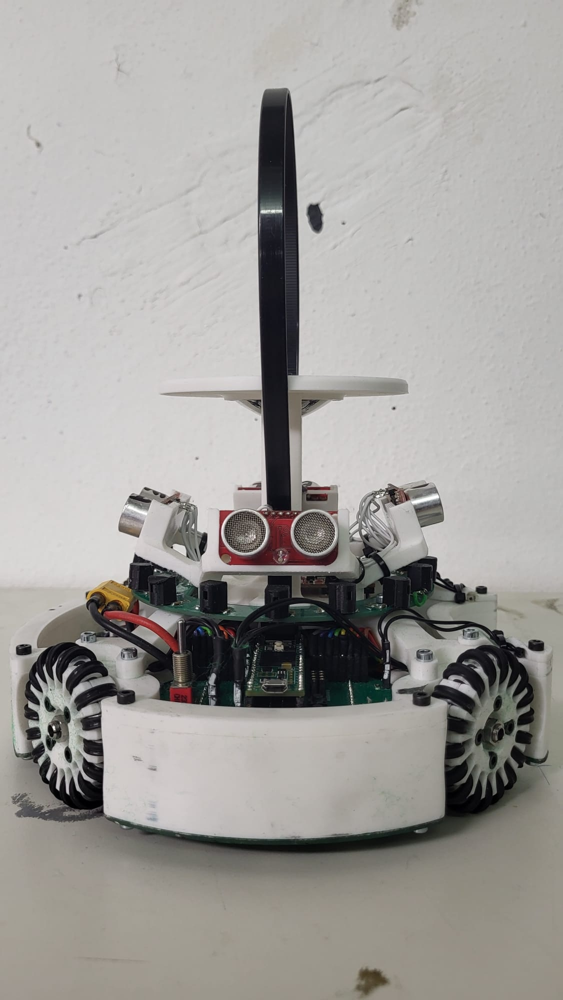

## Positioning & Movement

*How do you find your position inside the field and how do you use that position to move your robots around?*

We use 4 SRF08-Ultrasonic sensors on our robot to measure the distances to the walls. We use these distances to slow our robot down the closer he gets to the nearest wall so he dosn't  drive out of the legal parts of the field as often as he would with just the line detection board.

## Robot2 Overall

*Robot 2 Overall View*

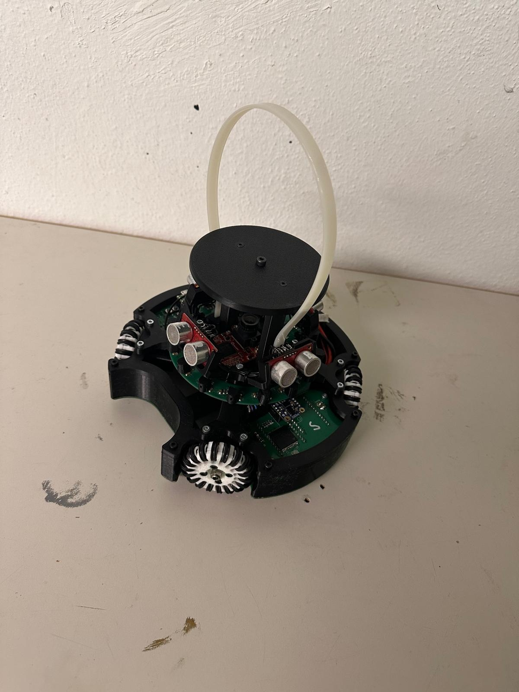

## Robot2 Front

*Robot 2 Front view*

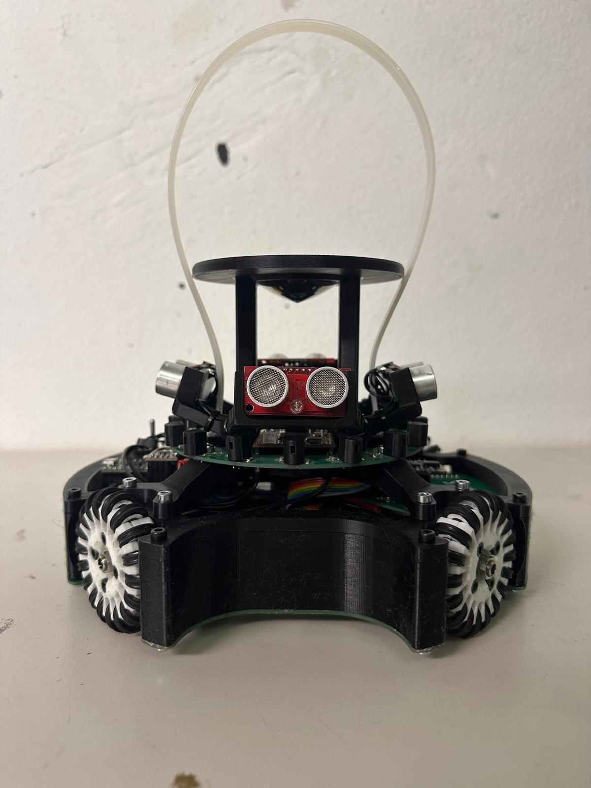

## Robot2 Back

*Robot 2 Back view*

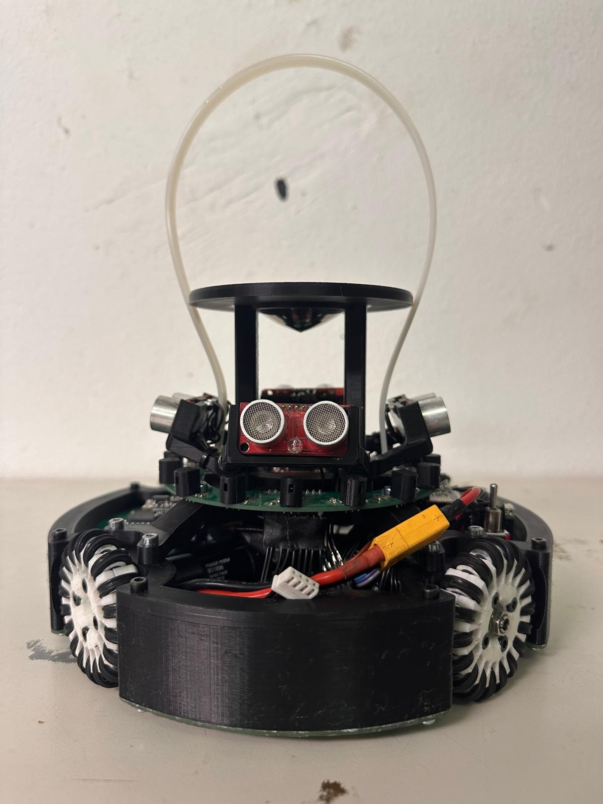

## Robot2 Top

*Robot 2 Top View*

## Robot2 Bottom

*Robot 2 Bottom View*

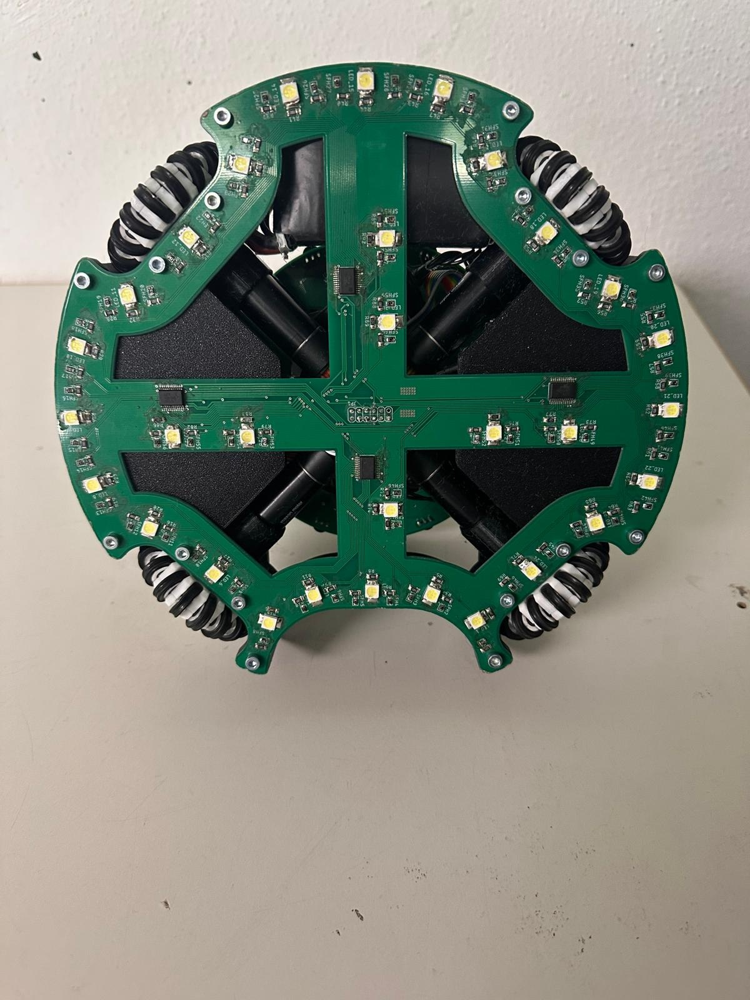

## Robot2 Right

*Robot 2 Right View*

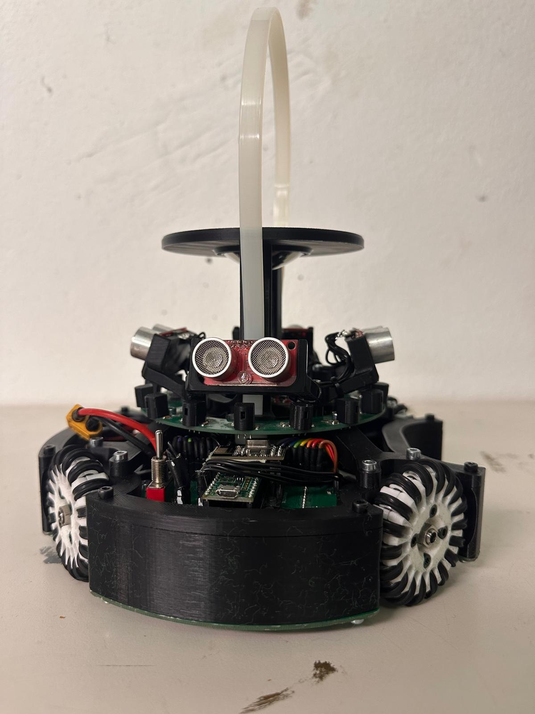

## Robot2 Left

*Robot 2 Left View*

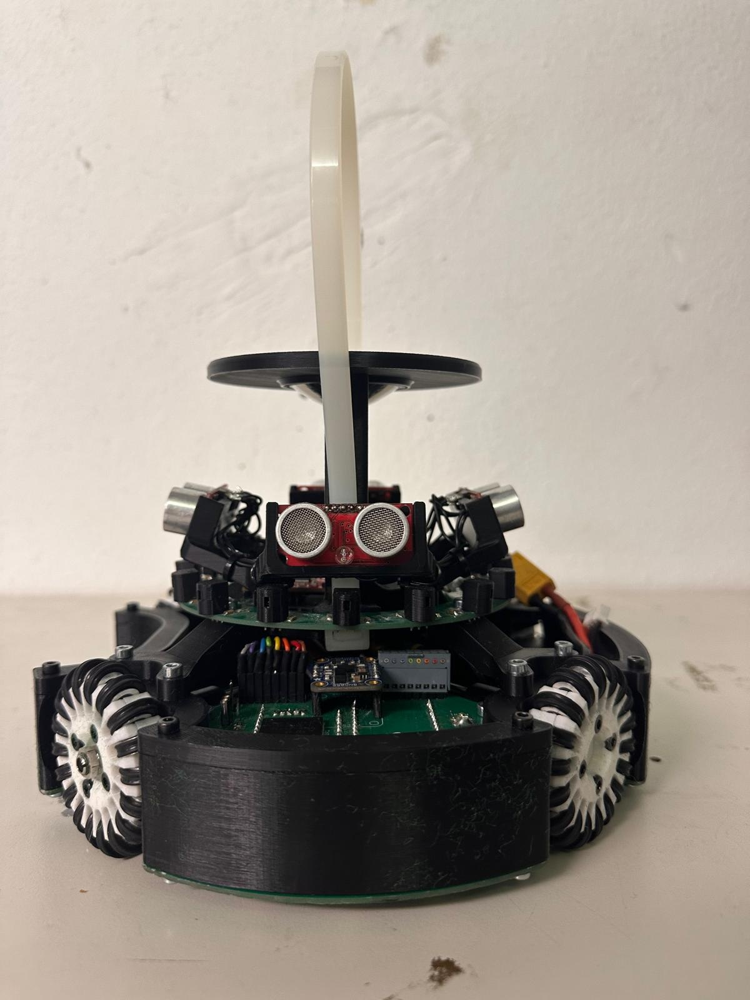

## Mechanical Design

*How did you design the mechanical parts of your robots?*

Since the last year we have changed a lot of things about our robot. Last year we struggled a lot with problem in strength, knowing where we are on the field and turning towards the goal as soon as we have the ball. The problem with strength was solved by using regulated brushless motors instead of our old unregulated brushed motors and combining it with new wheels which use X-Rings instead of O-Rings so we have two parts where the rubber cross wheels can touch the field. The problem with orientation was solved by using 4-Ultrasonic Sensors to know where we are. The last thing being solved was the "turning to the goal", which was solved by using a OpenMV in combination with a 360° mirror so we can see the goal on nearly every point on the field. In the beginning of the design process we noticed that the robot was to unstable and we had a lot of shaking in our camera video which is why we had to construct a few parts new to make them stronger and more stable. We came up with our design because we wanted to build it so it is quite easy to dis- and assemble the robot quickly that why you can for example can take of our ultrasonic sensors and camera unit with only 8 screws. For design we are currently using Autodesk Inventor 2025.

## Build Method

*How did you build your design?*

For the most parts of our robot we used our own 3D-printer. PCBs were ordered at a shop called "MultiCB" and our cross wheels were manufactured by an chinese manufacturer called "Diode Machining". For working together with the chinese factory we first made a quotion in a forum where manufacturers can make offers to the people making the quotion. Then we chatted via e-mail to talk about everything important and soon after the cross wheels arrived. The mirrors were grounded by a local dentist.

## Motors & Reason

*How many motors have you used and why?*

For our robot we used 4 driving motors (Maxon EC motors) because we think that you have the most strength in this configuration. We build our own wheels because we think with our own design we can achieve the most grip and we can adjust the wheels to our robot the best. We designed the wheels using Autodesk Inventor 2025. It's build using a solid 3D-printed base. The cross wheels have small plain bearing (MSM-0205-02) in the inside of the cross wheel to make it drive even more effortlessly. We then put the crosswheels onto pins(ISO 2338 Zylinderstifte, Passung m6) which we then put into the 3D-printed base. On top of that we also put X-rings (XRINGBS202NBR70 at https://www.ir-dichtungstechnik.de) on our cross wheels.

## Kicker Design

*If your robot has a kicker, explain how you designed and built the mechanics of the kicker*

N/A

## Dribbler Design

*If your robot has a dribbler, explain how you designed and built the mechanics of the dribbler.*

N/A

## CAD Files

*CAD design files*

## Mechanical Innovation

*Mechanical Innovation*

The two parts we are most proud of are once the very well functioning 360°-camera, helping us being more efficient with our scoring chances and the easy dis- and assembly of the robot, helping with keeping things easy and fast. The largest innovation this year we are surly proud of are definitely the new wheels with X-rings instead of O-rings. Using this we were able to improve our grip on the field significantly which helps us a lot with not being "Out of bounce". This is the case because the X-rings have two parts were the rubber cross wheels can touch the field, compared to only one with the O-rings, which may not seem like much but it can make a huge difference. Also the wheels are now mounted using clamping sets which help with now having that much force on the motor shaft compared to a single locking screw.

## Mechanical Photos

*Photos of your mechanical designs highlights*

## Electronics Block Diagram

*Provide us with a block diagram of your robot's electronics*

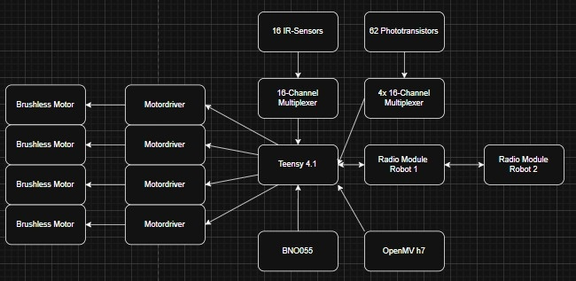

## Power Circuit

*How does your power circuits work?*

Our robot has a 11.1V battery which is directly used by the motors and the motor driver's. For most of the sensors like the ultrasonic sensor, the BNO055 gyro sensor, our OpenMV, our ifrared sensors, our multiplexers and also our teensy we use 5V which we regulate using a dc/dc converter. For our LED on our line detection board and for the phototransistors we use to detect the line we use 3,3V which we, just like with the 5 volts, convert using a dc/dc converter.

## Motor Drive Circuit

*How do you drive your motors? Explain the circuits you use for that*

We use motor drivers that give instructions to the motors. We control our motor drivers via 2 parameters, one is direction, which is just a digital signal the other one, which is important for how fast the motor spins is the PWM signal. Both of these signals are controlled over the Teensy 4.1 on our robot. On top of that our Maxon-ESC (Electronic Speed Controler) motor driver regulates the motors all alone so we don't have to do anything for this part to work.

## Microcontroller & Reason

*What kind of micro controller or board do you use for your robot? Why did you decide to use this part for your robot? If you have more than 1 processor, explain each one separately.*

For our robot we use the Teensy 4.1 micro controller. We made this choice because the Teensy 4.1 can work with loads of data very easylly and it also has lots of pins which is especially important for us because we have a lot of sensors to read and work with. It's also quite small when you think of the fact that it can do so many things which is also very important for our small space robots. On top of that the price/performance ratio is very good for that board.

## Ball Detection

*How does your ball detection sensors and/or camera[s] work?*

Our ball detection works with 16 infrared sensors and one multiplexer which summarizes the values of all sensors. When we have the values on the Teensy 4.1 we use a pre loop to find out which of the 16 sensors has the lowest value (which means the ball is closest to that sensor) and then drive to the pre determined angle according to the sensor. We also difference between a long distance to the ball and a short one so we firstly drive directly on the ball if it is far away and afterwards if it is closer we drive around it. Our camera to detect the goals has a threshold in the LAB- color space which is the same as the color of the goal and afterwards the OpenMV searches the video for pixels with a similar threshold. These pixels are then combined into a rectangle which we calculate the angle from. This happens using the x and y coordinate and using a certain funktain (atan2(y,x)*180/PI).

## Line Detection

*How does your line detection circuits work?*

We have a resistor in front of the LED to reduce the voltage. The LED works normally with the voltage after the resistor and GND. On the photo transistor one side is connected with 3,3V+ the other one with a pull-down-resistor to make it possible for us to read sensor values from it.

## Navigation/Position Sensors

*What sensors do you use for navigation and how are these sensors connected to your processor? What sensors do you use to find your position in the field? What about the direction your robot faces?*

For navigation we use two types of sensors. For knowing on what position we are on the field, we use ultrasonic sensors which communicate via I2C with our Teensy 4.1. For the direction the robot faces we use the BNO055 as a gyro. The BNO055 communicates over I2C as well.

## Kicker Circuit

*How do you drive your kicker system? How does the circuit make the kicker work?*

N/A

## Dribbler Circuit

*How does your dribbler system work? What components and circuits did you use to drive it?*

N/A

## Schematics

*Schematics of your robot*

## PCB

*PCB of your robot*

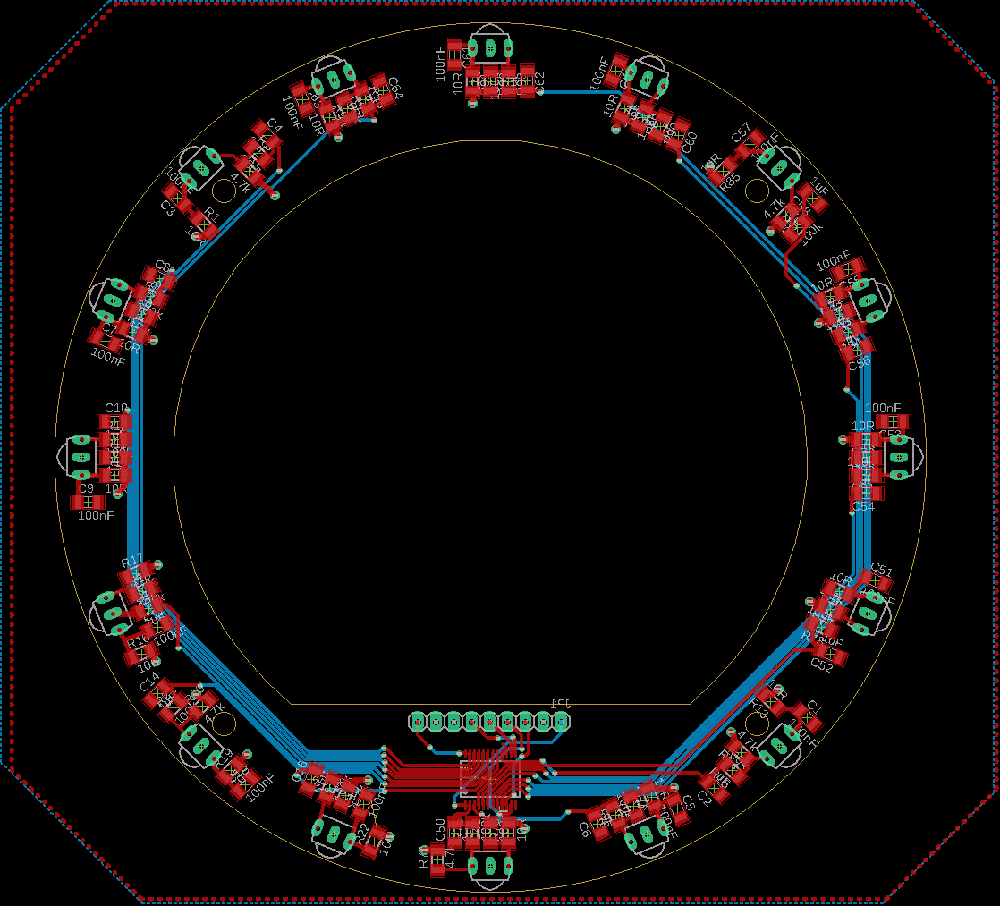
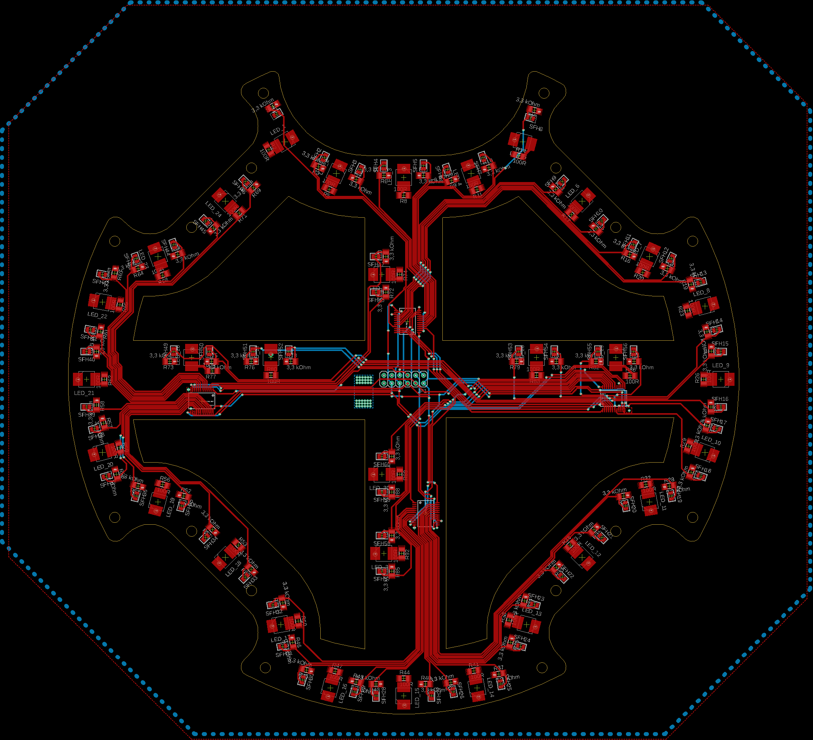
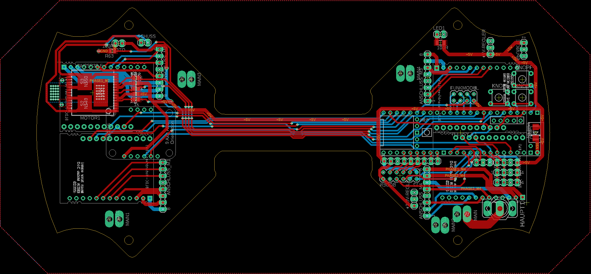

## Innovation

*Innovations*

We are most proud of the very good and reliable PCBs which work very good with all sensors used and make the work a lot easier. A new innovation is that we used new motor drivers, which also directly worked on the first try.

## Circuit Photos

*Photo of your circuit boards highlights*

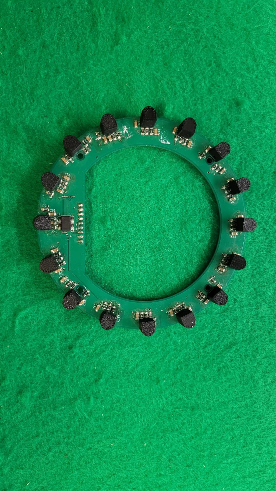
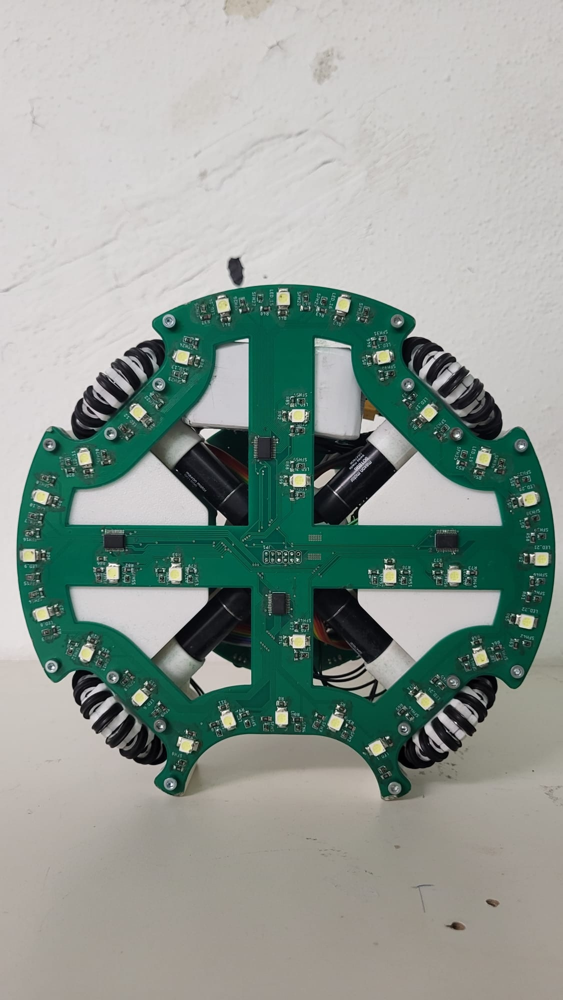
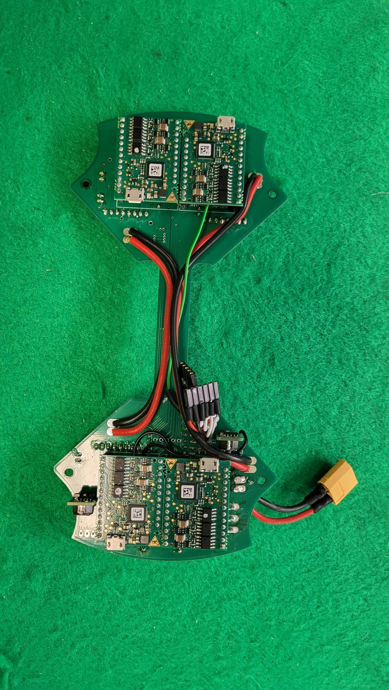
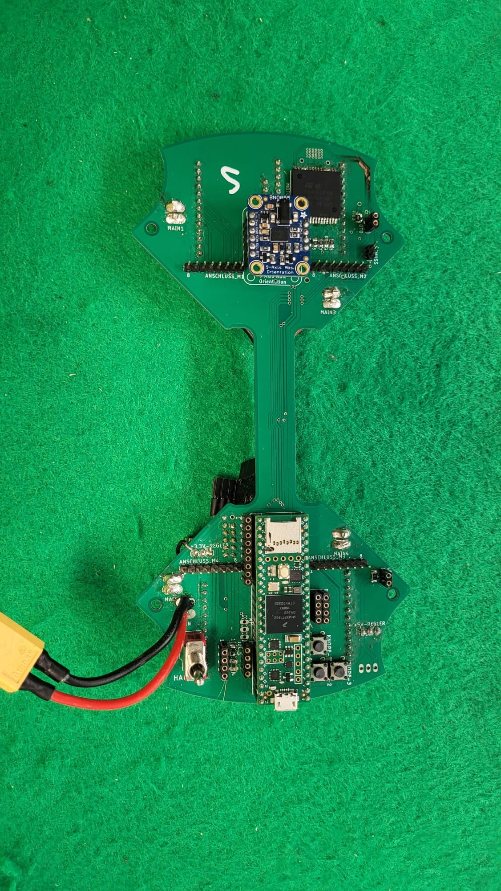

## Motor Control

*How do you use your processor to move your motors?*

We use our Teensy 4.1 to send a PWM-signal to the motor driver to control the speed. For the second signal it's a digital signal to control the direction in which the motors spin.

## Ball Detection Method

*How do you find where the ball is? How do you read the data from the ball detection sensors or camera?*

We read the data from the 16 infrared sensors with a multiplexer. When we have the values on the Teensy 4.1 we use a pre loop to find out which of the 16 sensors has the lowest value (which means the ball is closest to that sensor) and then drive to the pre determined angle according to the sensor. We also difference between a long distance to the ball and a short one so we firstly drive directly on the ball if it is far away and afterwards if it is closer we drive around it. For determining the distance to the ball we use an analog signal from the sensor.

## Ball Catch Algorithm

*How does your algorithm work to catch the ball? Is there a difference between your robots in how they move towards the ball? Explain the differences.*

Our strategy is to firstly drive to the ball directly if it is far away because we can faster come into the closer range of the ball this way. When we are at the closer zone we drive around the ball so in the end the ball is in front of our ball catcher, so for example if the ball is right behind us we want to drive left then back and then right again so the ball lays infront of our robot and we can drive straight on it. Both of our robots use the same way to approach the ball.

## Line Algorithm

*How does your robot find the lines to stay inside the field? What algorithms do you use to avoid going out of bounds?*

Our line detection works with 60 photo transistor sensors which detect the reflected light. When we are over the white line more light emitted by a LED is reflected than when we are over the green field. In the program we have a threshold and if a sensor is higher than that we know that he is over the line. Now we use a algorithm which remembers in a certain time span which sensors have already been on the line so we also take the sensors that are already to far over the line into account. This way we can reduce going "Out Of Bounce" a lot.

## Goal Algorithm

*What algorithms do you use to score goals? How do you use your kicker and dribbler to handle the ball?*

We use an algorithm that calculates the angle to the goal from our offset continuously. When we need to we activate the p-d regulated part in our main program on the Teensy 4.1 and the robot aims at the goal.

## Defense Algorithm

*What algorithms do you use to avoid the opponent team scoring? How do your robots defend your own goal?*

We first position in the middle of the goal using our ultrasonic sensors. Then when the ball goes to the right we want to move with it so the goal is always covered from us. During this process we want to always keep the right distance to the back wall so we don't stand in the middle of the field but in front of the goal.

## Robot Communication

*Do your robots communicate with each other? How do you use this communication to your advantage?*

Our robots communicate with each other via the NRF24L01. We use this for our advantage because this way we can't push out each other and we also always cover up the goal from ourselves.

## Innovation2

*Innovations*

The code we're most proud of is the part to slow ourselves down the nearer we come to the closest wall, using ultrasonic sensors. Because this way, we go "Out Of Bounds" way rarer which is very important for winning games.

## GitHub Link

*GitHub link*

https://github.com/Technulgy-LGNU (You have to look at the right catecories and then always go onto the team mathimazierer folder)

## BOM

*Bill of Materials (BOM)*

[https://drive.google.com/open?id=1iTvt7IX7C2ADnwqFT4GhUCWpBCn-32hF](https://drive.google.com/open?id=1iTvt7IX7C2ADnwqFT4GhUCWpBCn-32hF)

## Cost

*How much did it cost you to build your robots?*

Robots: About 1500 Euro each
Experiments: about 200 Euro
Environment: 750 Euro
1Euro = 0.86 USD

## Funding

*How did you gathered the funds to build the robots?*

80% school
20% sponsors

## Affordability

*How affordable was it to compete in RoboCupJunior Soccer?*

5

## Answer Check

*Have you checked all of your answers?*

Yes!

## Publication Consent

*We publish TDPs and posters during or after the competition as described in the beginning*

Yes, we acknowledge everything submitted in the above form can be published.

## Email Address

*Email Address*

theodorreber@gmail.com

## TDP File

*TDP File Upload (Not required)*

## Extra Column

*Column 67*

