## Timestamp

*Timestamp*

7/13/2025 2:10:29

## Team Name

*What is your team's name?*

Reset

## League

*What league do you participate in?*

Open League

## Country

*Where are you from?*

Taiwan

## Contact

*If other teams have questions about your robot, now or in the future, what email address(es) can we publish along with this document for people to reach you?

(You can put in multiple email addresses, like multiple team members, an email for the whole team or both. Feel free to share other ways of communication like Discord handles)*

ethankeju@gmail.com

## Social Media

*Team Social Media Links (if you have any)*

## Team Photo

*Upload a photo of your whole team with your mentor and robots

Note: This is not mandatory and will be published along with your TDP if you choose to upload something*

## Members & Roles

*What are the names of the team members and their role(s)?*

Ethan Lin : Hardware Design, Manufacture
Osborn Lin : Software Design, Manufacture

## Meeting Frequency

*How often did your team meet?
(e.g. 90 minutes once per week or a day every weekend.)*

8-12 hours in total per week, distributed on weekend.

## Meeting Place

*Where did you meet to work on your robot?
(e.g. a robotics room at school, at some other place, one of your homes, school library etc.)*

Robotics Laboratory outside of school.

## Start Date

*When did your team start working on this year's robot?*

Our team start working on this robot since the last RoboCup at Eindhoven.

## Past Competitions

*Which RoboCupJunior competitions have you competed in and in which leagues?*

2024 RoboCup Asia-Pacific Soccer Open
2024 Eindhoven RoboCup Junior Soccer Open 
2024 RoboCup Taiwan Soccer Open
2023 RoboCup Asia-Pacific Soccer Open
2023 France RoboCup Junior Soccer Lightweight 
2023 RoboCup Taiwan Soccer Lightweight
2022 RoboCup Asia-Pacific Soccer Lightweight

## Mentor Contribution

*Which parts of your work received the most contribution from your mentor?*

We couldn't design the new motherboard completely due to the complex setup coding and PCB design, with our mentor's help, we are able to change some original design of the motherboard that we found should be change in the last competition while still maintaining most of the original function that works good in the last competition.

## Workload Management

*How did you manage the workload?*

We use an google calendar and a timeline whiteboard at the laboratory to keep on track of what we are doing and what we time we should get it done. Since we have only two members in our team, the workload of each of us is much higher but the communication is much easier compare to bigger team so we are able to manage the workload and communication well through this traditional and easy approach.

## AI Tools

*Which AI tools did you use?*

AI is a good tool for researching and initial design. For hardware, we use AI to search for useful and organized information on sensors and how to control different sensors. When we need to design things that involve more advance skills that we haven't have such as designing a new motherboard that can also manage power supply for motherboard, dribbler and kicker, we use AI to check if your design is feasible and which component can fit the our goal the best. For Software, we use AI to give as innovation on how code can be change given what we want to achieve through the code. Nevertheless, although AI can help coding quickly and accurately in other task, when it comes to robotic coding that involve a deep understanding of the robot and game playing, designing and coding is faster and more precise most of the time.

## Robot1 Overall

*Robot 1 Overall View*

## Robot1 Front

*Robot 1 Front view*

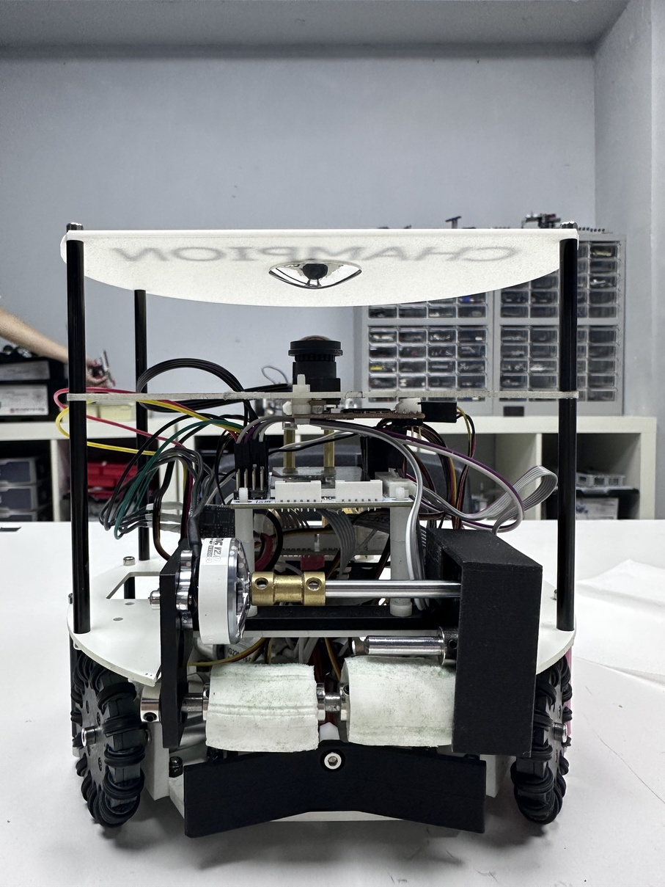

## Robot1 Back

*Robot 1 Back view*

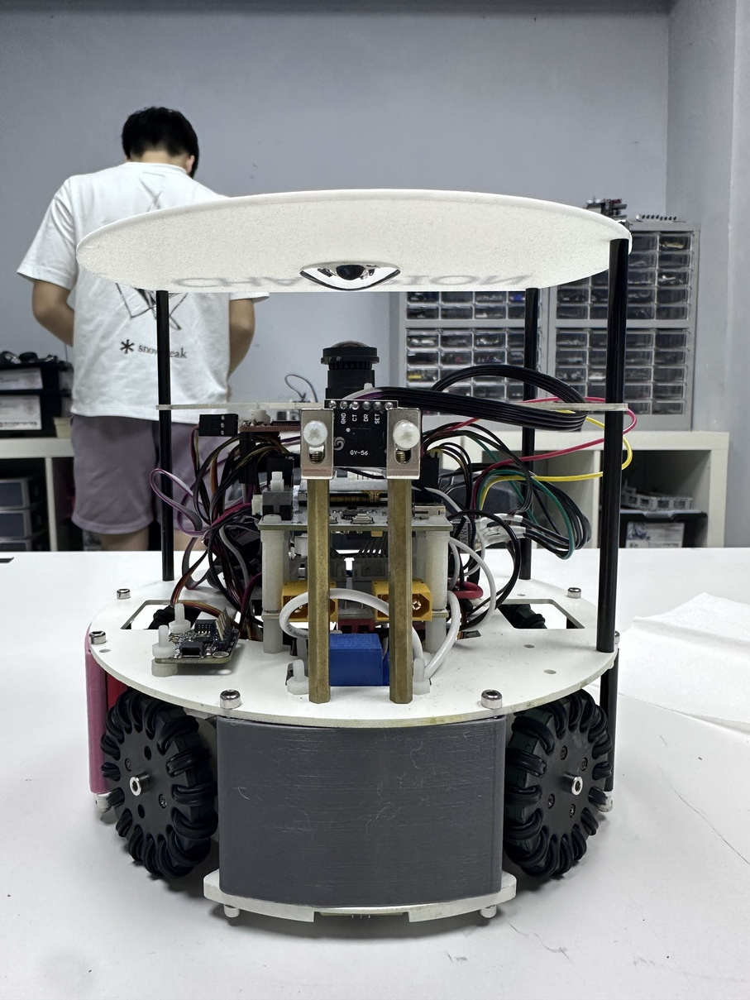

## Robot1 Top

*Robot 1 Top View*

## Robot1 Bottom

*Robot 1 Bottom View*

## Robot1 Right

*Robot 1 Right View*

## Robot1 Left

*Robot 1 Left View*

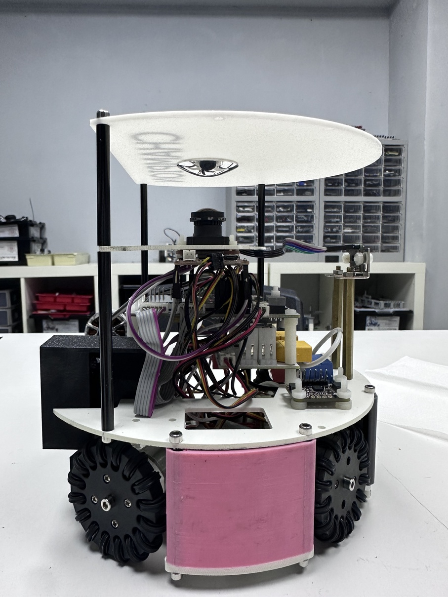

## Positioning & Movement

*How do you find your position inside the field and how do you use that position to move your robots around?*

We use the mirror and OpenMV with help of some code to calculate where on the field the robot is at.

## Robot2 Overall

*Robot 2 Overall View*

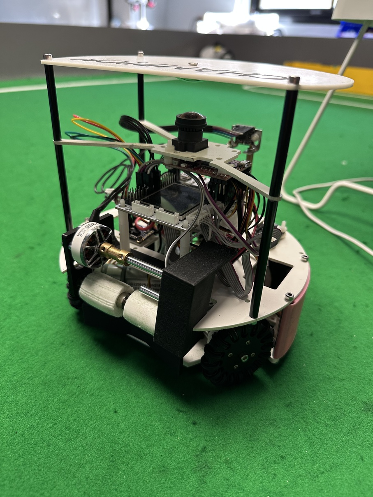

## Robot2 Front

*Robot 2 Front view*

## Robot2 Back

*Robot 2 Back view*

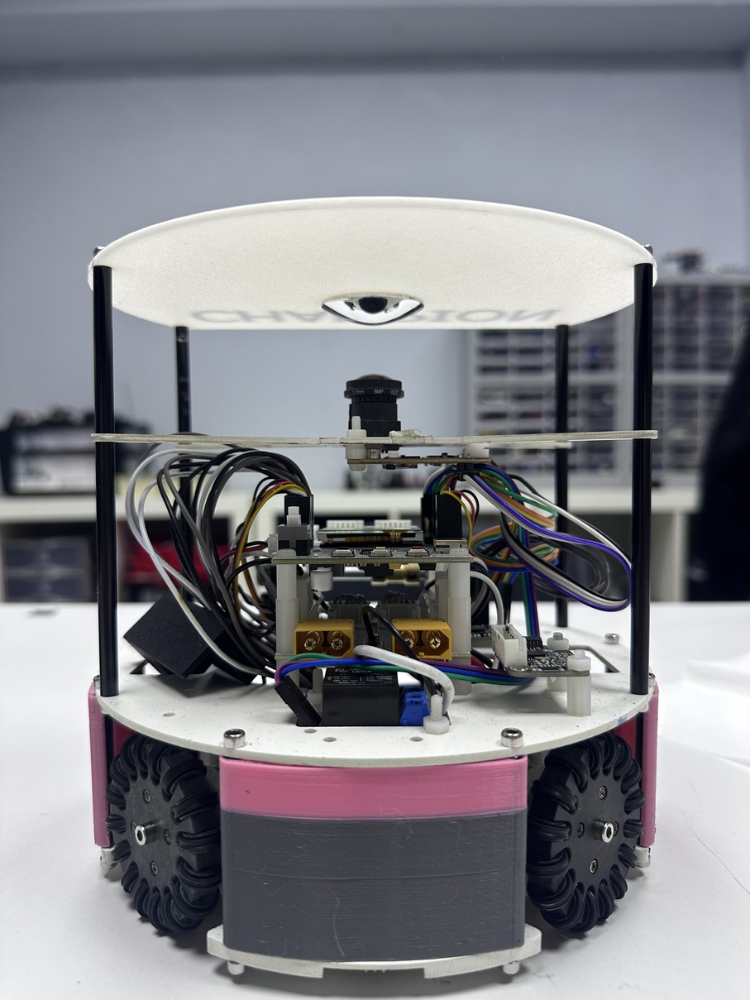

## Robot2 Top

*Robot 2 Top View*

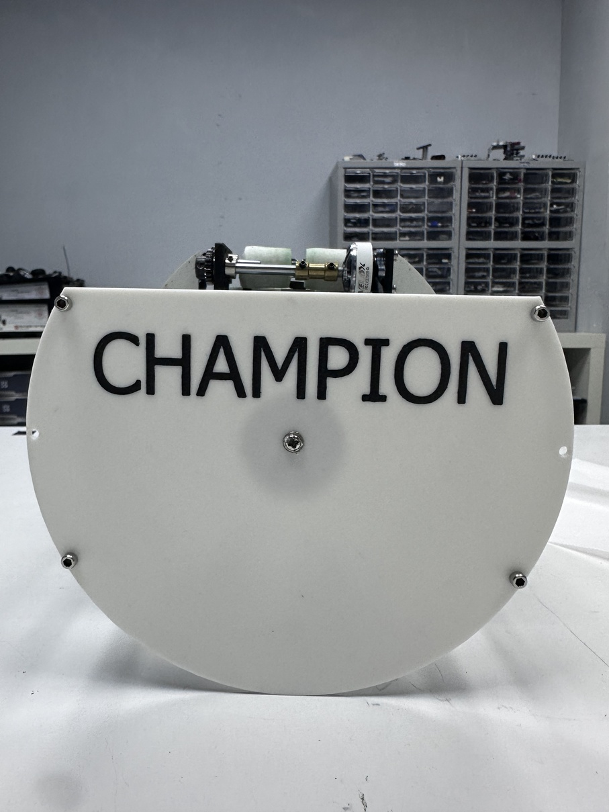

## Robot2 Bottom

*Robot 2 Bottom View*

## Robot2 Right

*Robot 2 Right View*

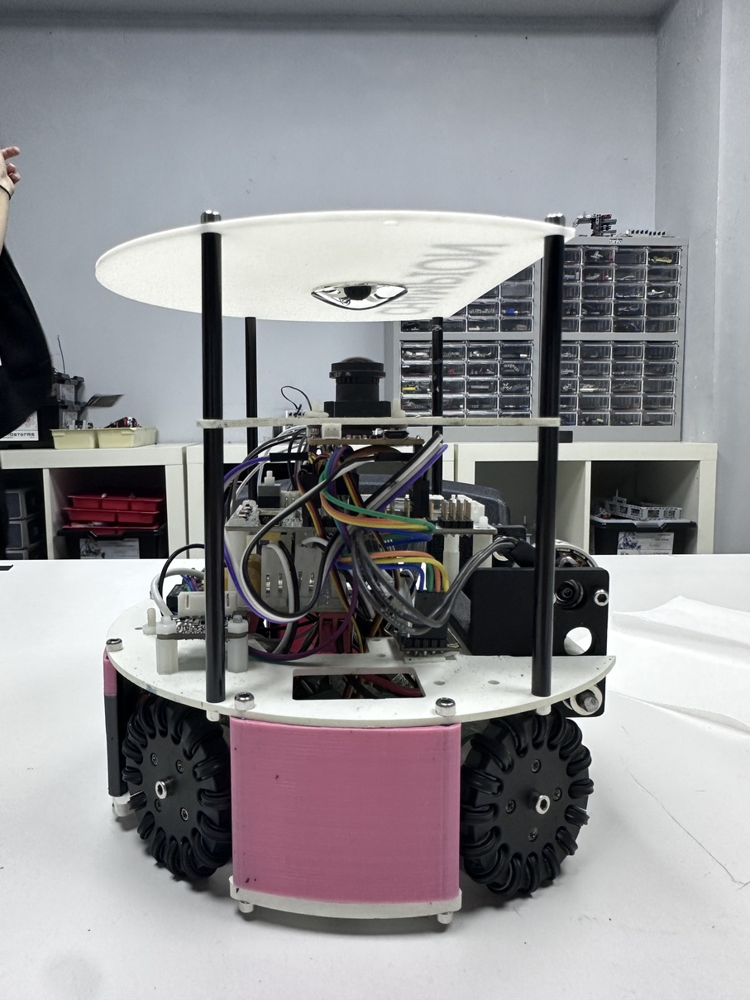

## Robot2 Left

*Robot 2 Left View*

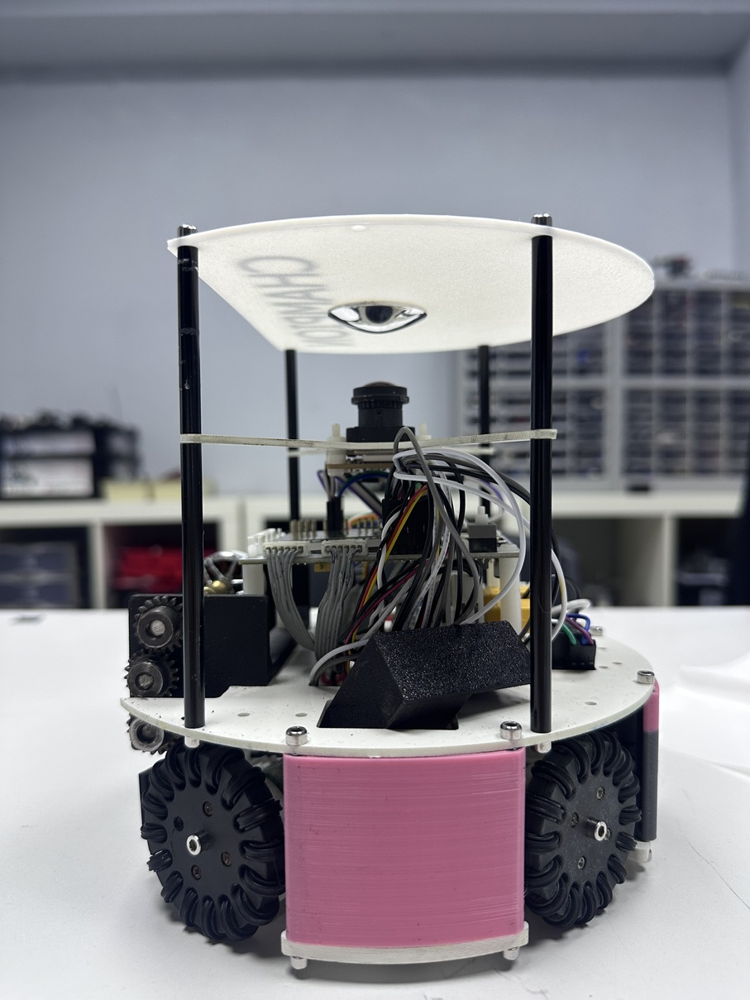

## Mechanical Design

*How did you design the mechanical parts of your robots?*

We use Autodesk Fusion for the board design, PCB design and 3D plastic component design. For PCB design, we also use EasyEDA. We come up with this design through constantly trying new components and sensors. Every new thing we try, we evaluate the robot's performance with the previous version, if the robot perform better, we will adopt the changes and if the robot doesn't improve, we will continue to seek for better sensors that owe can use.

We consider the robot stability of performance heavily while also considering the ability to fit the gameplay. The robot stability that we consider is how the robot is able to performance consistently over 10 minutes (game time) without malfunction, lack of power and damages. The ability to fit the gameplay is how our robot is able to adopt different strategy we design that can help us score and prevent opponent scoring and how the robot can follow the game rule such as not going out of bounds or etc.

To make the design better, we will have to make the robot easier to fix. In our current robot design, although it can perform consistently without malfunction and adopt most of our defense and offense strategy, every time when we have to change the motor and other components, we will have to dissemble a lot of components and boards which isn't ideal since damage may occur anytime during the competition and we won't have enough time to dissemble and fix the robot.

## Build Method

*How did you build your design?*

We use 3D printers and CnC machine to manufacture the board and the 3d components that we design with Fusion. For the PCB, we design it ourself and send it to professional PCB manufacture to make it. For the mirror, we design it ourself through Fusion and send it to companies that can manufacture the aluminum to the shape and polish it ourself. For the boards and 3D components that we can built in the laboratory ourself, we are able to manufacture a new version when a problem occur easily. For PCB, we sometime will have to adjust some wrong current or sensors that can be fix through welding external wire or changing sensors on the PCB. For bigger problem that is impossible to fix without designing a new PCB, we will have to send to company for manufacture again.

## Motors & Reason

*How many motors have you used and why?*

We use four motors per robot. Four motors and each using omniwheels can provide the most stable movement while not consuming too much space in the robot.

## Kicker Design

*If your robot has a kicker, explain how you designed and built the mechanics of the kicker*

For the kicker, we calculate through physics equations on the ideal combination of the radius of wire and amount of rounds given our battery supply and space for the solenoid. We maximize the kicking power through using all the space we have for the wire to increase the power of the solenoid. We bough solenoid on market and dissemble the wire on the solenoid to follow the combination that we calculate can produce the strongest kick. We also replace the shell of the solenoid with tape so we can maximize the round of wires.

## Dribbler Design

*If your robot has a dribbler, explain how you designed and built the mechanics of the dribbler.*

For the dribble, we bought single side brushless motor that is use in drone so that the spin speed and the power can be big enough. To connect the motor to the silicone dribbler, we design a customize gear that can fit the size of the space for dribbler the best. To make the dribbler dribble the ball more stably, we customize the silicone. To ensure the dribble follow the regulation when dribbling, we simulate depth of dribbling given the height of the dribbler and the radius of the silicone before making it.

## CAD Files

*CAD design files*

## Mechanical Innovation

*Mechanical Innovation*

Our most proud mechanical design is the dribbler. Although dribbler seems to become the basic component that every teams have, the stability and ball control ability can make a big difference when trying to perform different strategy with the dribbler such as spin kick, ball hiding and etc. We've tried different size and amount of gear to most efficiently connect the motor to the dribbling silicon and we come out with the optimal size of gear that we design with Autodesk Fusion and send to gear manufacture to make for us. To ensure that the dribbler can dribble stably and the gears won't get stuck, we design the dribbler to make the whole dribbler system one piece. By making our dribbler one-piece, we are able to easily assemble it by putting the motors, gear, and the axle on the one-piece 3D design. For the 3D design, we test printing it with different 3D printing materials and decide to use the PETG because the gear will move very fast and the dribbler will get in contact with other robot making tenacity of the material most important, and PETG has the highest tenacity out of all the material we tried. For the one-piece 3D design, we also tried different structure and test by running it full speed continuously for 30 mins and bump the dribbling silicon while running full speed. The first version cracked on the side of the gear holder when contacting, showing that the structure need to improve. We search online on how to make perpendicular connection more stable and improve the structure and the printing method to make it stronger. We also try stress analysis in Autodesk Inventor to find where will we need to improve on the structure so it won't crack again at different place. The final version can handle running for 30 minutes with maximum speed non-stop while contacting the dribbling silicon.

## Mechanical Photos

*Photos of your mechanical designs highlights*

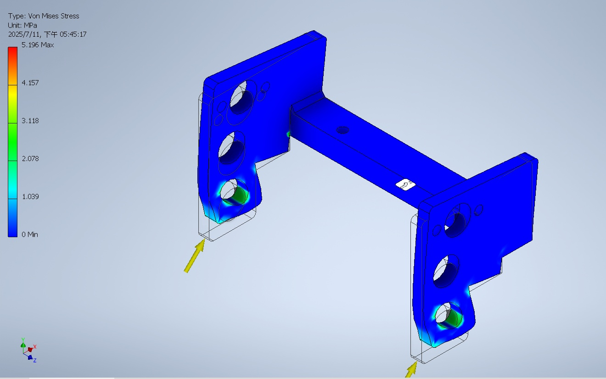
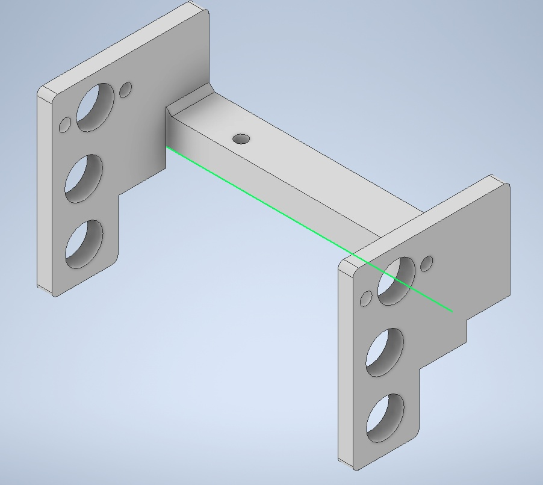

## Electronics Block Diagram

*Provide us with a block diagram of your robot's electronics*

[https://drive.google.com/open?id=1UJUaymImqr-E_0viSnPVj05K9CdDxwO2](https://drive.google.com/open?id=1UJUaymImqr-E_0viSnPVj05K9CdDxwO2)

## Power Circuit

*How does your power circuits work?*

Our robot has two 12V battery pack: one for motor, mother boards and all the sensors, one for the ball control system that involve the motor for dribbler and the solenoid for kicker. For the motor and motherboard battery pack, the 12V power is regulated to 5V for our STM32H743ZIT6 processor and used directly by the motor through the motor controller. For the ball control system battery pack, both the motor for dribbler and the solenoid use 12V directly from the battery. Specifically for the motor, the 12V power is provide to the esc than supply to the motor base on the motherboard's command.

## Motor Drive Circuit

*How do you drive your motors? Explain the circuits you use for that*

For the 4 moving meter, we control it through four individual DRV8876RGTR motor driver each in charge of one of the motor. We design a motor board that include all four DRV8876RGTR in one pub to make the robot cleaner and easier to build and fix. We use PWM signal from the motherboard to manipulate each DRV8876RGTR, DRV8876RGTR will then transfer the signal to DC signal to control the motor. For the power supply, the driver board provide 12V power to all four motors out of one 12V battery connect to it.

## Microcontroller & Reason

*What kind of micro controller or board do you use for your robot? Why did you decide to use this part for your robot? If you have more than 1 processor, explain each one separately.*

We are using STM32H743ZIT6 as the processor. This processor is in charge of everything on the robot.

## Ball Detection

*How does your ball detection sensors and/or camera[s] work?*

We use OpenMV and mirror together to detect the position of the ball. The mirror is able to provide 360 degrees view on the court through only one camera. The camera we use is the OpenMV wide angle camera. For the curve of the mirror, we use MatLab regression to find the best curve and shape of the mirror that can provide the best view of the court. The position of the ball reflected in the mirror can tell the robot the direction where the robot should go. Through careful calculation and regression of the distance on the court and in the mirror, we are also able to compute the distance of the ball to the robot.

## Line Detection

*How does your line detection circuits work?*

We design our own light sensor's PCB and connect each individual light sensor to the motherboard through analog.

## Navigation/Position Sensors

*What sensors do you use for navigation and how are these sensors connected to your processor? What sensors do you use to find your position in the field? What about the direction your robot faces?*

Our robot use the OpenMV and mirror to navigate the position on court. They first find the position of the goal and then calculate their own position on the four through mathematical equations. The direction can be easily find by our robot through our compass.

## Kicker Circuit

*How do you drive your kicker system? How does the circuit make the kicker work?*

For the kicker system, we use relay to connect the power supply and the solenoid. By controlling the power supply through analog signal on the relay, we are able to control when to activate the solenoid for kicking.

## Dribbler Circuit

*How does your dribbler system work? What components and circuits did you use to drive it?*

Our dribbler system includes a single position brushless drone motor and an esc. Together, we can control the power supply to the motor through the analog signal provide to the esc by our motherboard. Since we are not changing the speed of the dribbler, a basic esc is enough for our dribbler system.

## Schematics

*Schematics of your robot*

## PCB

*PCB of your robot*

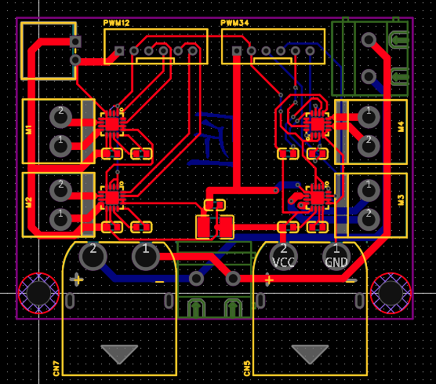

## Innovation

*Innovations*

We are most proud of the motor control pub we design because we are able to not only reduce the size of the motor controller, but also include additional function of managing the power supply of the robot for all components, dribbler and kicker, which that we use to have to manage through external wiring that consume big space.

## Circuit Photos

*Photo of your circuit boards highlights*

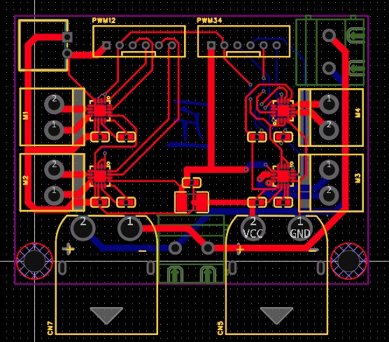
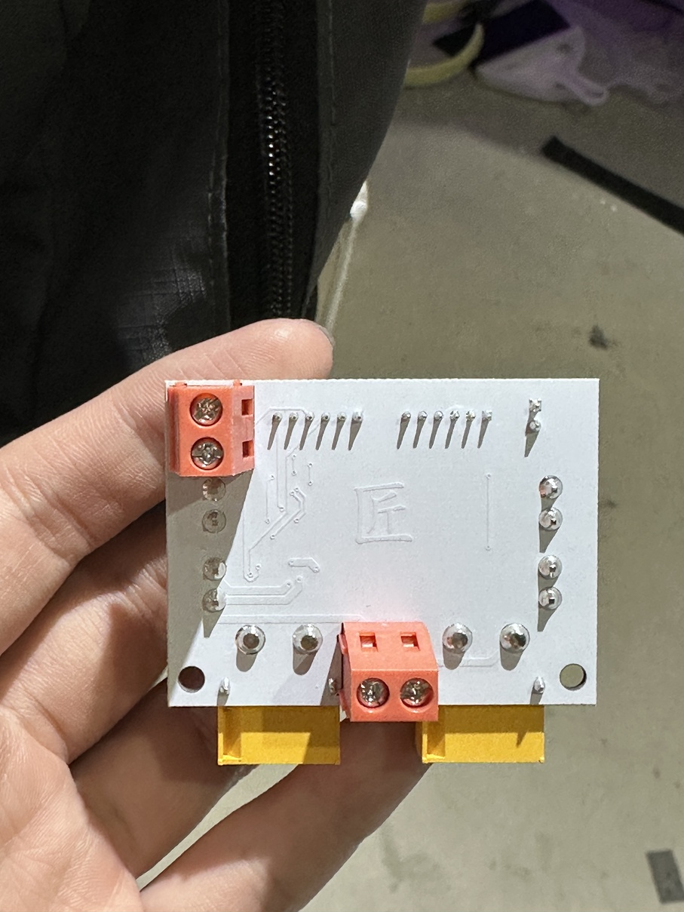
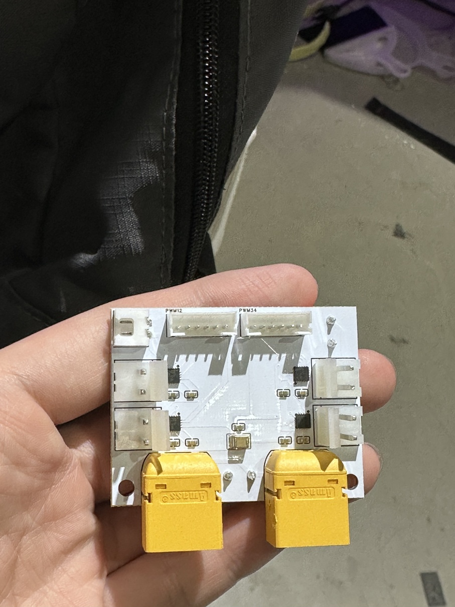

## Motor Control

*How do you use your processor to move your motors?*

Our processor provide PWM signal to the motor driver which then will transfer the PWM signal into DC signal that can directly control our motor. In the code, we write a function that we can call to directly move left right up or down. This code make it much easier to write code referring to the robot's movement because the original layout of our motor isn't perpendicular or parallel to the s and y axis.

## Ball Detection Method

*How do you find where the ball is? How do you read the data from the ball detection sensors or camera?*

We find where the ball is through the openMV and the mirror. The mirror we design can reflect the whole court to openMV, in openMV, we spot the ball by taking the RGB values of the ball. So when the robot is playing game, they are able to spot where is the ball RGB value .

## Ball Catch Algorithm

*How does your algorithm work to catch the ball? Is there a difference between your robots in how they move towards the ball? Explain the differences.*

Our robot uses an OpenMV camera to detect and track the ball in real-time. We manually adjust the LAB color threshold to isolate the ball/goal from anything else. Once detected, the robot calculates the ball’s position relative to itself using vector geometry. Specifically, we determine the x and y distances between the ball and the robot’s center, then compute the angle using:

angle = math.atan2(x_distance, y_distance) * 180.0 / 3.14
angle = 360 - (int(math.fmod(angle + 180.0, 360.0)))

This yields the ball's absolute angle relative to the center of the robot, which is more reliable than direct x/y coordinates due to more consistent behaviors during rapid movement.

The OpenMV sends the ball data—including angle, distance, and x-coordinates, y-coordinates—back to the main STM32 microcontroller. The microcontroller then uses this data to make movement decisions. Most of our robots’ chasing route is based on the angle of the ball, as it provides a more stable reference point, even when the ball is partially blocked or rapidly moving.

We also designed different movement modes to deal with momentum and field dynamics, specifically inertia. For instance, we differentiate between “chase with approach” and “chase without approach.” When approaching from far, our motion is reduced lower than the actual ball angle, so the robot glides on point instead of going too far. This helps us control inertia when accelerating toward the ball for a distance, allowing for smoother and more precise captures.

Our primary goal is to capture the ball into our robot’s beak as fast as possible, enabling us to perform higher-level strategies such as diagonal kick or ball-hiding. The entire system is optimized for speed, accuracy, and adaptability on the field.

## Line Algorithm

*How does your robot find the lines to stay inside the field? What algorithms do you use to avoid going out of bounds?*

To ensure our robots stay within the white line boundaries, we designed light sensors that utilize 5528 LDRs paired with LEDs to detect changes in surface reflectivity. These sensors are strategically placed at 90° intervals around the robot, with two sensors at each —an inner and an outer sensor—perfectly suitable for detecting linear field lines and robot lifting events.

To detect white lines, we wrote a program that records the maximum value of each light sensor when we brush our robots over white lines. Then, it calculates the average between regular and max values, recorded into avg[i]. Whenever the value is greater than this average, it means that the current sensor is on the line. 

The inner sensors are responsible for detecting when the robot begins to cross the border line. Once triggered, the robot records the detection time as ot[i] and initiates a calculated retreat movement. Based on ot[i], the robot moves in the opposite direction for a specific time, allowing it to return to the field efficiently without external commands. This time-based strategy ensures accurate repositioning even when sensor data becomes unpredictable and imprecise during rapid motions.

Meanwhile, the outer sensors are used to confirm re-entry. If the robot is already in the return motion and the outer sensor detects the white line, it immediately stops the retreat and resumes its original program, ball chasing. This double-layer detection reduces unnecessary delays and enables the robot to remain responsive even under severe impact or if held outside the court.

To handle corners, we utilize a smart detection algorithm involving two adjacent 90° sensor pairs. If both inner sensors detect the line simultaneously, the robot calculates a new trajectory at a 45° angle away from the corner to safely redirect itself back into the court.

Our boundary avoidance system is designed to be autonomous, efficient, and reliable. Even if the robot is repeatedly pushed or held outside the field, it will consistently attempt to return, preserving match strategy and maintaining compliance with field regulations.

## Goal Algorithm

*What algorithms do you use to score goals? How do you use your kicker and dribbler to handle the ball?*

To score goals effectively, we primarily rely on two strategies: ball hiding and corner diagonal shots. Both strategies require accurately determining the relative position of the goal corners angles concerning our robot. To achieve this, we use OpenMV to detect the yellow-colored goal by manually adjusting the LAB threshold and drawing a goal blob. From the blob’s x and y coordinates, along with its width and height, we calculate the position of the opposite corner of the goal, allowing our robot to determine the target it has to shoot.
When our robot possesses the ball and is within ±30 degrees of the goal’s direction, it performs a corner diagonal shot immediately. Diagonal shooting is highly effective, as it catches defensive robots off guard, particularly those robots that rely on simple ball alignment defensive movements. By aiming for the far corner, we take advantage of the extra reaction time defenders need to maneuver.
In situations where the robot retrieves the ball near the baseline or sideline, diagonal shots are often too slow, slightly inaccurate, and easily blocked. Instead, the robot performs the ball-hiding strategy. It first turns 90 degrees and drives toward the sideline and the baseline. Then, it rotates back to 40 degrees, approaches the penalty area,  and executes a powerful corner pull shot. This approach is designed to hide the ball from the opponent robots and create an open goal.
Our kicker and dribbler play essential roles in ball control and timing. The dribbler maintains possession and stabilizes the ball during turning and aiming, while the kicker is triggered only when the angle and position are ideal. This ensures accuracy and prevents wasted shots.
Throughout all offensive plays, our system integrates light sensors and OpenMV vision to adapt in real-time, making intelligent decisions based on field position and ball visibility.

## Defense Algorithm

*What algorithms do you use to avoid the opponent team scoring? How do your robots defend your own goal?*

To prevent the opposing team from scoring, our robots use a responsive ball alignment algorithm as the foundation of our defensive strategy. Unlike many teams that fully stop their motors when aligning with the ball, our robot maintains continuous control based on the ball’s angle, allowing for smoother and faster reactions.

When the ball is presented on the field, our robot calculates the angle between itself and the ball. We then multiply that angle by 9 to determine the x-axis movement speed(spx). This speed control ensures that when the ball is farther away, the robot moves faster to intercept it. On the other hand, when the ball is near, the robot slows down, preventing over-chasing and allowing for more accurate positioning, especially near the corner. This dynamic adjustment enables us to maintain a balance between speed, precision, and stability.

Even when perfectly aligned with the ball, our motors do not fully stop. Instead, we keep them running at a low output level—just below the threshold of movement. This mode reduces mechanical startup lag, ensuring the robot can quickly react to sudden changes in the ball’s position. This significantly cuts down on reaction time, a common weakness in many defensive systems that fully stop and then restart.

In addition to central ball alignment, we’ve implemented a corner defense mechanism. When the ball approaches our baseline or corners, our robot automatically backs down toward the goalpost to intercept any corner shooting attempts. This positional retreat helps us cover vulnerable angles that standard center-based defense misses.

Overall, our defensive algorithm combines angle-based speed scaling, non-zero idle motor control, and situational corner retreat to maintain a highly responsive and adaptable backline defense.

## Robot Communication

*Do your robots communicate with each other? How do you use this communication to your advantage?*

Our robots do not use any communication modules; instead, we implement a visual communication system based on color, which allows our robots to work together while staying fully autonomous and hardware-efficient.

We specifically color-code our offensive robot using a pink cover. The defensive robot uses its OpenMV camera to detect this pink color on the field. This simple yet effective technique allows the defender to understand the positioning and status of the offensive robot, and possibly the ball,  without needing any radio signals or Bluetooth communication.

When the defensive robot detects that the pink offensive robot is far from our own goal area, in other words, the other half of the court, it assumes that the opponent may attempt a long-range shot. In this case, the defender centers itself in front of the goal and prepares to block. However, when it detects that the offensive robot is closer to our own goal, or our half of the court, it assumes that the ball is in the defensive zone. In response, the defensive robot begins actively aligning with the ball, preparing for interception or direct blocking.

In scenarios where the defensive robot cannot detect any pink on the field—perhaps due to the offensive robot going out of bounds or becoming non-functional—it switches into offensive mode. It then begins to chase the ball and attempt to score, ensuring that our team maintains pressure on the opponent even if part of our system fails.

This form of visual, decentralized communication provides redundancy and flexibility. It allows each robot to adapt in real-time based on the presence or absence of teammates, increasing our overall field coverage, maintaining strategic balance, and maximizing both offensive and defensive potential without relying on fragile wireless connections.

## Innovation2

*Innovations*

Tell us about any specific code or algorithm you build that you are the most proud of. Explain how you came up with this innovation and how it helps you win more games.

Our most distinct and innovative algorithm is our ball hide prevention system, which we specifically designed to counter a common tactic used by many advanced teams. During matches, we noticed that several opponents attempted to confuse our defensive robot by hiding the ball in the corners of the field. This often made our robot assume the ball was no longer a threat and centering itself, giving opponents a clear opportunity to score from a hidden position.

Rather than relying on LIDAR or adding additional sensors, we developed a purely vision-based solution using OpenMV. When the ball is not detected on the field, our defensive robot automatically enters a scanning mode. In this mode, it draws two rectangular regions—one in each back corner of our goal area—and reads the amount of green pixels within each region. Since the playing field is green, any significant drop in the green pixel count within a corner indicates the presence of a robot, possibly hiding the ball.

If either corner shows a noticeable decrease in green pixels, the robot assumes that the opponent is attempting a ball hide maneuver in that location. It immediately moves to the suspected corner and positions itself at a lower position, preventing a stealth shot and restoring visual tracking.

This solution is something we’re incredibly proud of because it’s both lightweight and effective. It helps us defend against one of the trickiest scoring strategies without requiring expensive hardware, giving us a significant edge in tight matches. It’s a great example of how simple vision logic, when used creatively, can outperform more complex systems.

## GitHub Link

*GitHub link*

## BOM

*Bill of Materials (BOM)*

[https://drive.google.com/open?id=1cajit-vWdbB7nOBRhcJydvn0Joc7h_R9](https://drive.google.com/open?id=1cajit-vWdbB7nOBRhcJydvn0Joc7h_R9)

## Cost

*How much did it cost you to build your robots?*

Robots: 800USD
Experiment: 1600USD
Environment: 1000USD

## Funding

*How did you gathered the funds to build the robots?*

100% parents

## Affordability

*How affordable was it to compete in RoboCupJunior Soccer?*

2

## Answer Check

*Have you checked all of your answers?*

Yes!

## Publication Consent

*We publish TDPs and posters during or after the competition as described in the beginning*

Yes, we acknowledge everything submitted in the above form can be published.

## Email Address

*Email Address*

ethankeju@gmail.com

## TDP File

*TDP File Upload (Not required)*

## Extra Column

*Column 67*

