## Timestamp

*Timestamp*

7/11/2025 2:52:29

## Team Name

*What is your team's name?*

Sadr United

## League

*What league do you participate in?*

Open League

## Country

*Where are you from?*

IRAN

## Contact

*If other teams have questions about your robot, now or in the future, what email address(es) can we publish along with this document for people to reach you?

(You can put in multiple email addresses, like multiple team members, an email for the whole team or both. Feel free to share other ways of communication like Discord handles)*

m.khakpoor1393@gmail.com, @MHKhakpour(Telegram ID)

## Social Media

*Team Social Media Links (if you have any)*

N/A

## Team Photo

*Upload a photo of your whole team with your mentor and robots

Note: This is not mandatory and will be published along with your TDP if you choose to upload something*

## Members & Roles

*What are the names of the team members and their role(s)?*

Mani Ghadakchi: Programmer
Pirouz Monjezi: Mechanic
Mohammad Taha Ahmadi: Programmer & Electronic
Mohamad Taha Mobini: Mechanic & Electronic

## Meeting Frequency

*How often did your team meet?
(e.g. 90 minutes once per week or a day every weekend.)*

We had six hours of scheduled sessions each week, spread across Saturdays and Wednesdays. However, as the competition approached, we worked on the robot whenever we could, beyond the planned class times.

## Meeting Place

*Where did you meet to work on your robot?
(e.g. a robotics room at school, at some other place, one of your homes, school library etc.)*

We used to work in the robotics room at school.

## Start Date

*When did your team start working on this year's robot?*

We started working on the robot two years ago.

## Past Competitions

*Which RoboCupJunior competitions have you competed in and in which leagues?*

IRAN Open 2025 :Open League
IRAN Open 2024: Open League

## Mentor Contribution

*Which parts of your work received the most contribution from your mentor?*

We faced challenges in setting up the GTD35 motors and configuring the TDAxis12 gyroscope module to correctly receive and process data.

## Workload Management

*How did you manage the workload?*

We managed the workload by staying in touch during the week through our Telegram group and email whenever we didn’t have classes. We divided the tasks among team members and helped each other stay on schedule.

## AI Tools

*Which AI tools did you use?*

ChatGPT and DeepSeek. These tools helped us review our code, debug issues, and explore alternative solutions. In addition to programming, we also used AI in certain aspects of mechanical and electronic design.

Moreover, ChatGPT was used to help us translate and refine the written content for our team description paper (TDP), ensuring clarity and correctness in English.

Overall, AI played a supportive role throughout our development process, improving both technical and documentation quality.

## Robot1 Overall

*Robot 1 Overall View*

## Robot1 Front

*Robot 1 Front view*

## Robot1 Back

*Robot 1 Back view*

## Robot1 Top

*Robot 1 Top View*

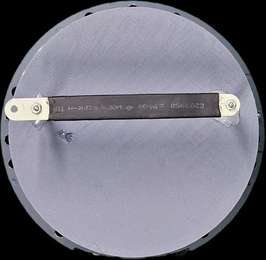

## Robot1 Bottom

*Robot 1 Bottom View*

## Robot1 Right

*Robot 1 Right View*

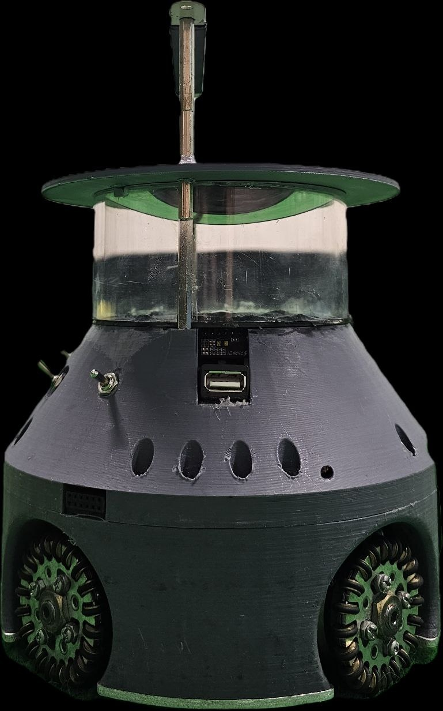

## Robot1 Left

*Robot 1 Left View*

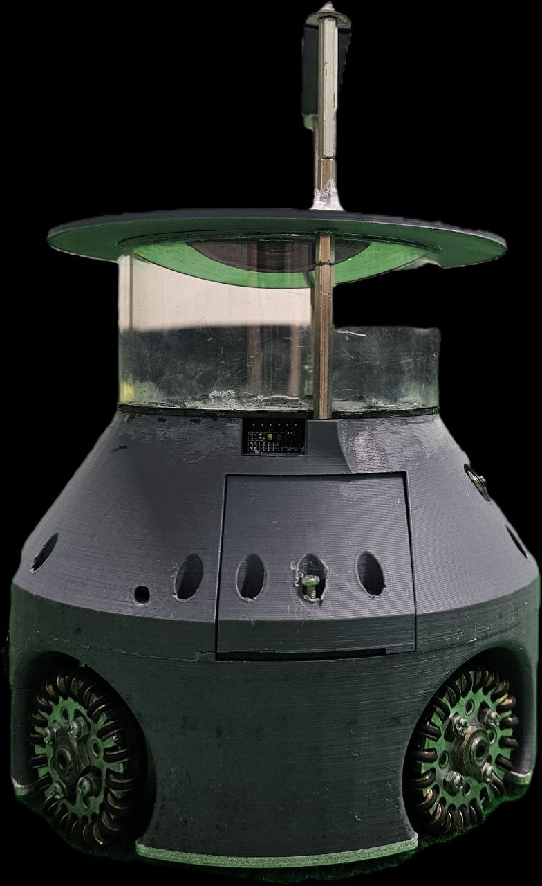

## Positioning & Movement

*How do you find your position inside the field and how do you use that position to move your robots around?*

We use a distance sensor(TD53L1) to determine the robot’s position, and based on that, the robots—whether attackers or defenders—can accurately identify their correct positions.

## Robot2 Overall

*Robot 2 Overall View*

## Robot2 Front

*Robot 2 Front view*

## Robot2 Back

*Robot 2 Back view*

## Robot2 Top

*Robot 2 Top View*

## Robot2 Bottom

*Robot 2 Bottom View*

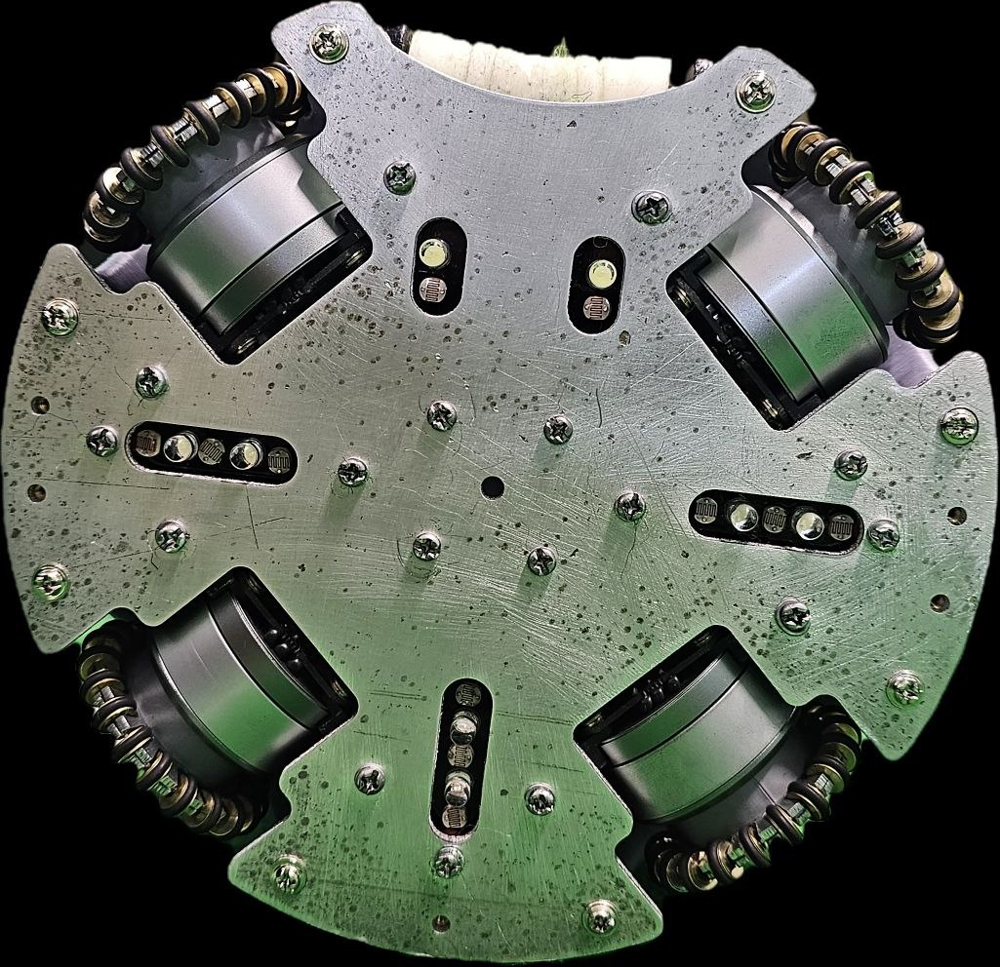

## Robot2 Right

*Robot 2 Right View*

## Robot2 Left

*Robot 2 Left View*

## Mechanical Design

*How did you design the mechanical parts of your robots?*

We designed the mechanical parts of the robot using SolidWorks.

First, we studied the designs of other teams and noticed that some had covered the lower part of their robots. We thought this was a good idea as it helped lower the robot's center of gravity.

In our initial design, we planned to cover only the lower section, but later realized that covering the upper part as well not only improved the appearance but also provided protection against impacts. The robot’s outer shell was originally planned to be made of aluminum. However, based on last year’s regulations, using aluminum would make the robot too heavy and non-compliant with the rules.

In our opinion, we haven’t yet fully utilized the robot’s potential. Our plan is to improve its performance through software enhancements so we can make full use of all its features and capabilities. That said, if there is one thing we might consider changing in the future, it would likely be the mirror above our camera.

## Build Method

*How did you build your design?*

We built our design using a combination of CNC machining, 3D printing, and external PCB manufacturing services. The CNC machine was mainly used for precise metal parts, while the 3D printer allowed us to create complex shapes for the robot’s body.

We analyzed and troubleshot last year’s PCB, which helped us make effective improvements on the new PCB design. Some key components such as the distance sensors and the gyroscope were replaced with better versions to enhance performance.

For parts like the mirror above the camera, we sourced specialized components from external suppliers, using a laboratory mirror for optimal results.

## Motors & Reason

*How many motors have you used and why?*

Our robot uses four GTD-35 motors.
We arranged these motors so that each one is positioned at a 90-degree angle relative to the next, and each motor is set at a 45-degree angle relative to the robot’s 0-degree reference direction. This configuration allows the robot to move smoothly in all directions with minimal limitations.

One key advantage of this setup is that during high-intensity interactions—especially when moving forward—all four motors contribute to the motion, resulting in higher overall torque and better pushing power.

We used commercially available omni wheels, which are both affordable and effective.

## Kicker Design

*If your robot has a kicker, explain how you designed and built the mechanics of the kicker*

We did not use any solenoids for the shooting system in this robot.
Instead, we designed and built a fully mechanical kicker system.

The system includes a Dynamixel XL-430 motor, a spring, a shooting lever, and several gear-like components. These parts work together to store and release mechanical energy. The motor rotates and compresses the spring by pulling back the lever. Once released, the spring quickly pushes the lever forward, kicking the ball with significant force.

The core design and implementation were done by our mechanical team, but we also received valuable guidance and feedback from our mentors throughout the process. Their experience helped us improve the precision and reliability of the final design.

All parts were custom-designed to meet the competition’s size and weight restrictions.

## Dribbler Design

*If your robot has a dribbler, explain how you designed and built the mechanics of the dribbler.*

Our dribbler consists of a silicone roller and a motor.
The body of the dribbler was 3D-printed, including the internal gears, which are made from the same material.

The motor is mounted at the top of the dribbler’s body, while the silicone roller is positioned at the bottom. The motor’s rotation is transferred to the roller through a set of gears: one gear is attached to the motor shaft, and the other is connected to the roller’s axle.

As the motor spins, the gears engage and rotate the roller inward, allowing the robot to keep the ball close and maintain controlled possession.

The initial design and implementation of the dribbler were done by our team. However, our mentors played an important role during the construction of the silicone roller. They provided helpful guidance on selecting the right type of silicone and choosing a reliable method for shaping and assembling the roller to achieve the desired grip and flexibility.

## CAD Files

*CAD design files*

[https://drive.google.com/file/d/10QaheKKrgUGHZ5LHROj55cLwXHRJSW8X/view?usp=sharing](https://drive.google.com/file/d/10QaheKKrgUGHZ5LHROj55cLwXHRJSW8X/view?usp=sharing)

## Mechanical Innovation

*Mechanical Innovation*

In our opinion, the most innovative part of this robot is its shooting system. Unlike many teams, we did not use any solenoids in its design. Instead, we developed a fully mechanical shooting mechanism that is both powerful and reliable.

The system consists of several components, including a Dynamixel XL-430 motor, a shooting lever with a spring, a snail-shaped cam, and other custom mechanical parts. All components were designed and built entirely by our mechanical and design teams.

Here’s how it works:
When the XL-430 motor starts rotating, it turns the cam-shaped (snail-shaped) part. At the beginning of this motion, the shooting lever is in its least stretched position. As the cam continues to rotate, the lever and spring are gradually pulled back, storing more energy.

Once maximum tension is reached, the system is ready to shoot. Upon receiving the shoot command, the lever slips off the cam’s highest point and snaps forward, launching the ball. The cam then continues rotating, resetting the system for the next shot.

This design is innovative not only because it eliminates solenoids, but also because it stores and releases mechanical energy efficiently with high precision and repeatability. We’re proud of this mechanism because it reflects our team’s creativity, engineering skills, and attention to functional detail.

## Mechanical Photos

*Photos of your mechanical designs highlights*

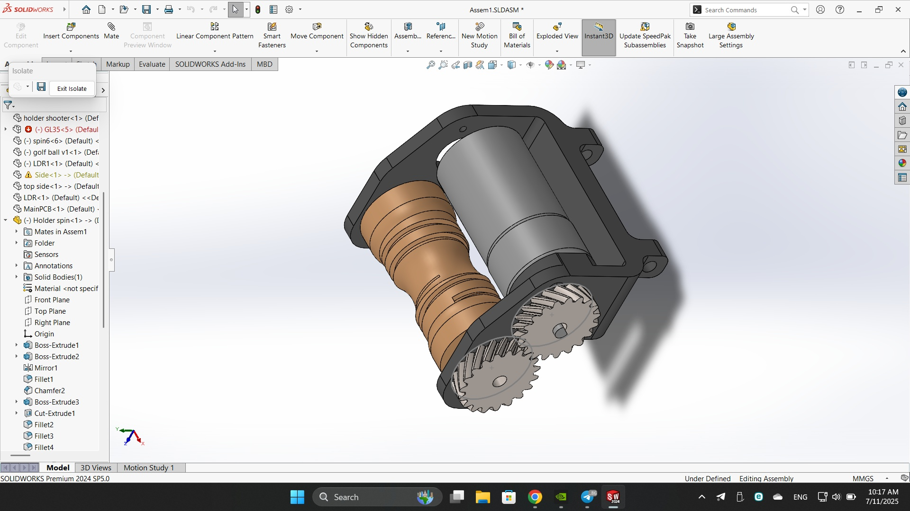
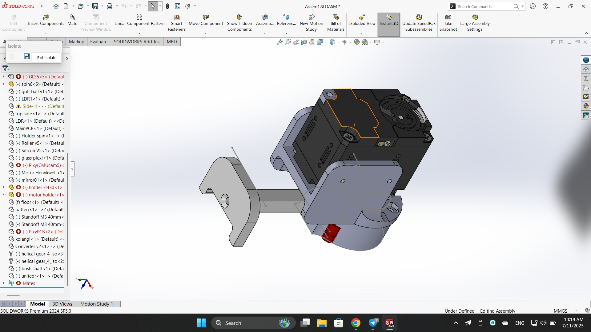
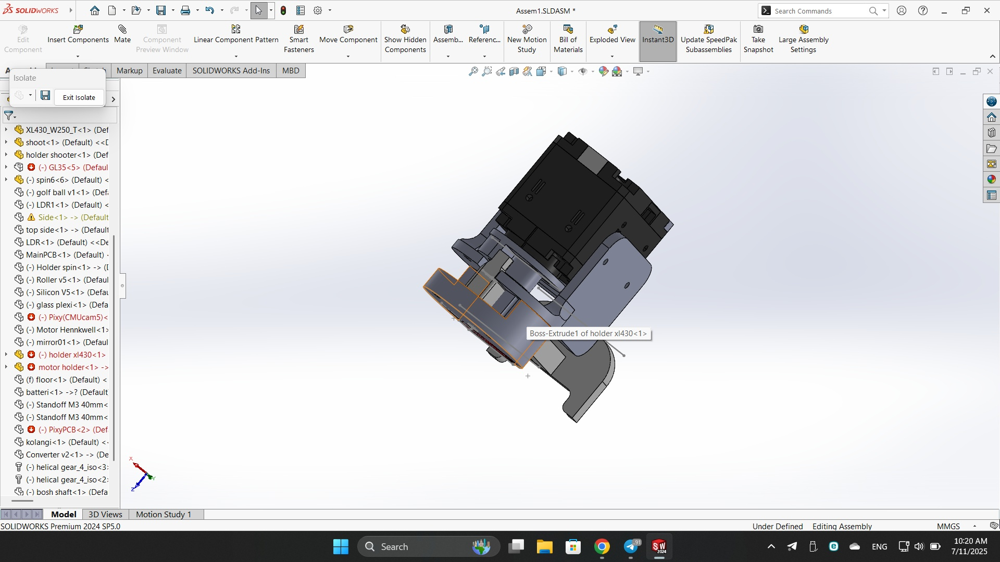

## Electronics Block Diagram

*Provide us with a block diagram of your robot's electronics*

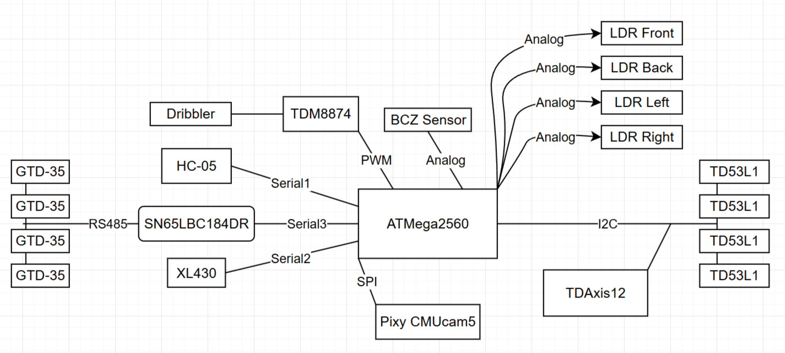

## Power Circuit

*How does your power circuits work?*

Our robot uses a 3-cell 12.6V battery (1550mAh) to power the motors directly. An LM2596 buck converter steps the voltage down to 5V for electronics.

To stabilize power delivery, we added two diodes:

SS34 prevents high motor current from draining the LM2596’s input capacitors, reducing 5V noise.

SMBJ30 protects the LM2596 from back-EMF voltage spikes that can exceed 30V.

This setup ensures reliable and noise-free operation even under heavy load.

## Motor Drive Circuit

*How do you drive your motors? Explain the circuits you use for that*

Our motors come with built-in drivers, so we did not need to use any external motor driver modules.

The motors are powered directly by 12V supply, and each motor has two data pins for communication.

However, the motors use an RS-485 serial communication protocol, which is not directly compatible with the standard UART interface of our processor.

To address this incompatibility, we used the SN65LBC184DR transceiver, which converts the UART signals from our processor into the RS-485 differential signals required by the motors. This allows reliable and noise-immune communication between the processor and the motors.

## Microcontroller & Reason

*What kind of micro controller or board do you use for your robot? Why did you decide to use this part for your robot? If you have more than 1 processor, explain each one separately.*

Our initial choice for the processor was the Arduino Mega 2560, as it met all of our functional requirements and offered ample I/O pins.

However, due to its relatively large physical size, we faced difficulties integrating it into the limited space inside the robot.

As a solution, we decided to use the ATmega2560 microcontroller chip directly. We mounted the ATmega2560 on a breakout board and integrated it into our custom-designed main PCB, which allowed us to save space and customize the board layout according to our needs.

## Ball Detection

*How does your ball detection sensors and/or camera[s] work?*

For ball detection, we used a Pixy CMUcam5 camera, which has a built-in processor for image processing. This means that the camera itself handles all the visual processing internally, eliminating the need for an additional external processor.

Because of this capability, we selected the Pixy camera as our solution for reliable and efficient visual

## Line Detection

*How does your line detection circuits work?*

To detect the out-of-bounds line, we used LDR (Light Dependent Resistor) sensors. Each LDR was paired with an LED that illuminated the ground surface.

The amount of reflected light changed the resistance of the LDR, allowing us to detect changes in the surface color or texture.

We configured the LDRs in a pull-up circuit and read their analog output using the ATmega2560 microcontroller to determine whether the robot was on or outside the allowed area.

## Navigation/Position Sensors

*What sensors do you use for navigation and how are these sensors connected to your processor? What sensors do you use to find your position in the field? What about the direction your robot faces?*

For navigation and positioning, we use the TDAxis12 sensor module. This module is a combination of the MPU6050 and BNO055 sensors and provides fused data output after sensor fusion.

We connect the TDAxis12 to our processor via the I2C communication protocol, allowing efficient and reliable data transfer.

This fused data helps us accurately determine the robot's position on the field as well as the direction it is facing.

## Kicker Circuit

*How do you drive your kicker system? How does the circuit make the kicker work?*

The motor in our kicker mechanism is a Dynamixel XL-430, which has three pins: VCC (12V), GND, and a Data pin.

The Data pin is connected directly to the TX pin of our ATmega2560 microcontroller.

The XL-430 motor uses a half-duplex serial communication protocol on its Data line. This means the same line is used for both transmitting and receiving data, but not at the same time. The microcontroller sends commands such as position, speed, and torque settings to the motor, and the motor can respond with status and feedback through the same line.

Because the communication is half-duplex, data transmission and reception happen alternately, requiring precise timing and coordination handled by the motor control library. This reduces wiring complexity while allowing reliable two-way communication.

However, in our design, we only send data commands to the motor and do not receive any data back from it.

## Dribbler Circuit

*How does your dribbler system work? What components and circuits did you use to drive it?*

Our dribbler motor is controlled by a DRV8874 motor driver.

The driver is connected to the microcontroller via PWM pins, allowing us to precisely control the motor’s speed and operation by sending PWM signals.

This setup provides efficient and smooth control of the dribbler’s rotation.

## Schematics

*Schematics of your robot*

[https://drive.google.com/open?id=1wKazMosPy9afz7zU-v_oQTWhaIv0VSbU](https://drive.google.com/open?id=1wKazMosPy9afz7zU-v_oQTWhaIv0VSbU)
[https://drive.google.com/open?id=1SmNcZXToGTO8BwZmUa3p-WtPnD0uowht](https://drive.google.com/open?id=1SmNcZXToGTO8BwZmUa3p-WtPnD0uowht)
[https://drive.google.com/open?id=1cA3N4UvwFzeHmsENqw_erQm_OzRtWXs5](https://drive.google.com/open?id=1cA3N4UvwFzeHmsENqw_erQm_OzRtWXs5)

## PCB

*PCB of your robot*

[https://drive.google.com/open?id=1P0SX5EOuLdzheJ1MZ1R643gdUdrtDkYU](https://drive.google.com/open?id=1P0SX5EOuLdzheJ1MZ1R643gdUdrtDkYU)
[https://drive.google.com/open?id=10HbqpJWJ3rGfDGFUwu4uKLXE6-I0k44r](https://drive.google.com/open?id=10HbqpJWJ3rGfDGFUwu4uKLXE6-I0k44r)
[https://drive.google.com/open?id=18PhZ0pNV-9Ne_vVvxYw-F7SqEI1M2b4O](https://drive.google.com/open?id=18PhZ0pNV-9Ne_vVvxYw-F7SqEI1M2b4O)
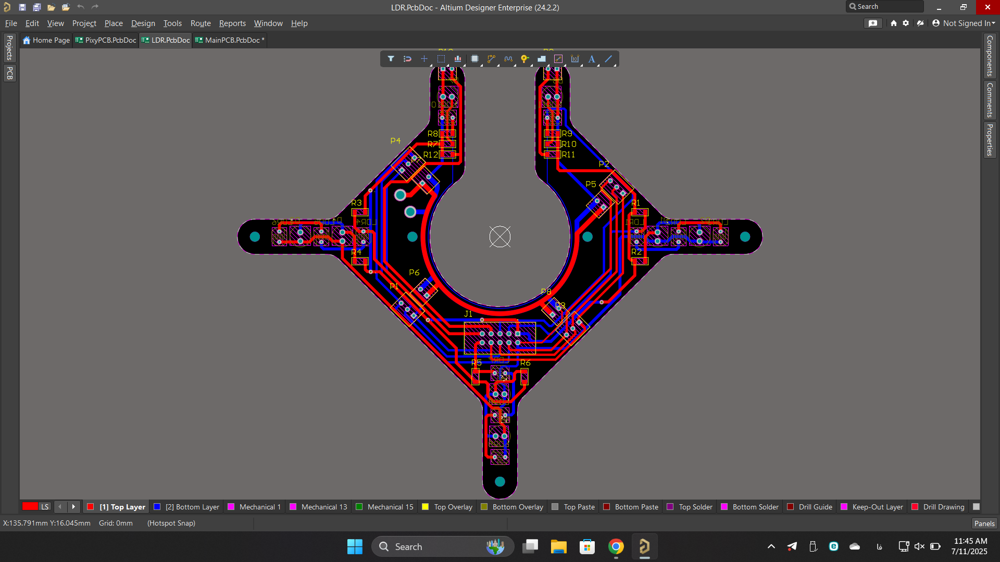
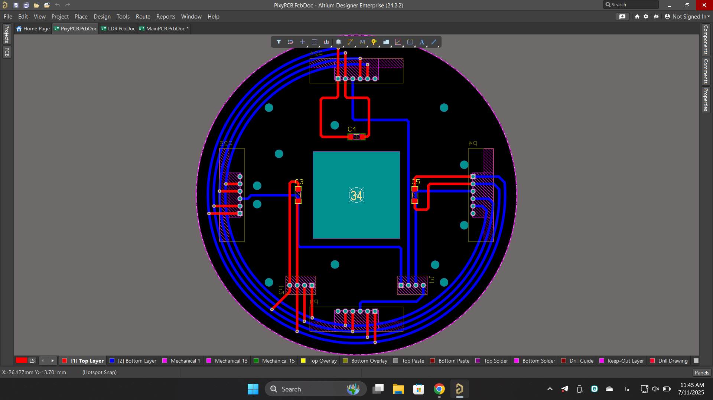

## Innovation

*Innovations*

We take great pride in successfully identifying and resolving critical issues in last year’s PCB design.

One major problem occurred when the motors suddenly reversed direction (e.g., switching from clockwise to counterclockwise or vice versa), which generated a back-voltage (back-EMF). This back-voltage interfered with the operation of our previous gyroscope sensor, the MPU-6050, preventing us from obtaining accurate sensor readings.

Furthermore, during one of our internal competitions, we noticed smoke coming from the robot. Upon investigation, we found that the LM2596 voltage regulator module—responsible for providing a stable 5V output—had been damaged due to back-voltage from the motors and had stopped functioning.

After identifying the root cause, we added a set of protective diodes to block any reverse current from reaching and damaging sensitive components. This modification significantly improved the reliability and stability of our electronics.

## Circuit Photos

*Photo of your circuit boards highlights*

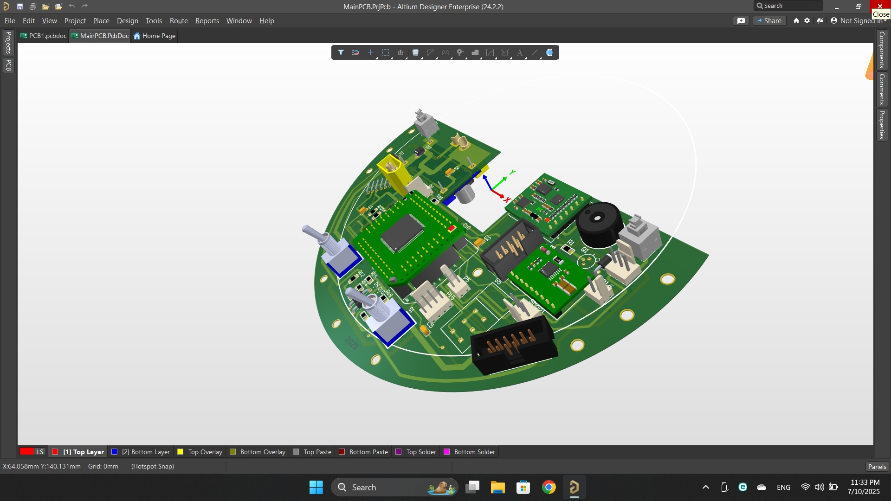
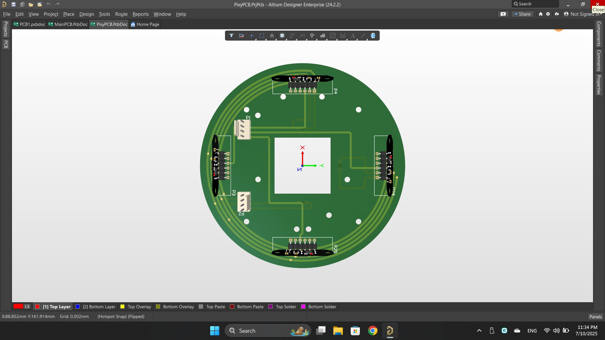
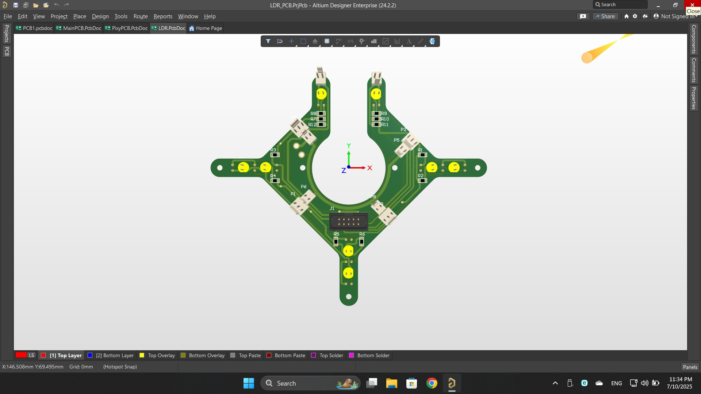

## Motor Control

*How do you use your processor to move your motors?*

We use an ATmega2560 microcontroller to control the movement motors of our robot.

The motors are GTD-35 models with built-in drivers and communicate via RS-485 protocol. Since the ATmega2560 only supports standard UART, we use a SN65LBC184DR chip to convert UART signals to RS-485.

Through this setup, we send serial commands from the ATmega2560 to each motor, allowing us to control their speed and direction precisely.

## Ball Detection Method

*How do you find where the ball is? How do you read the data from the ball detection sensors or camera?*

To detect the ball, we used a Pixy CMUcam5 camera, which is connected to our ATmega2560 microcontroller via the SPI protocol.

Using the Pixy configuration software(Pixymon), we defined the color signature of the ball so the camera could recognize and track it in real time. The camera continuously provides the X and Y coordinates of the ball’s position within its field of view.

The camera observes the environment through a 360-degree mirror mounted above it. Using circular trigonometry, we calculate the angle of the ball based on its (X, Y) coordinates. This allows us to determine the ball’s direction accurately relative to the robot’s orientation.

This setup gives us a real-time understanding of the ball’s location and direction, which is essential for planning movement and decisions during the game.

## Ball Catch Algorithm

*How does your algorithm work to catch the ball? Is there a difference between your robots in how they move towards the ball? Explain the differences.*

In our previous algorithm, the robot would initially move straight toward the ball until it reached a certain distance, then rotate based on the ball’s relative angle to align it with the robot’s ball capturing zone. However, this often caused the robot to collide with the ball or lose control, so we decided to redesign the algorithm.

In our new approach, the robot moves diagonally toward the ball instead of approaching it head-on.

If the ball is in front of the robot, it takes a smooth angled path to intercept it.

If the ball is behind the robot, it follows a curved trajectory to reposition itself behind the ball before guiding it into the intake mechanism.

Additionally, the robot’s movement speed is dynamically adjusted based on the distance to the ball:

When the ball is far, the robot moves faster.

As it gets closer, the robot slows down to ensure precise and controlled ball acquisition.

This updated strategy significantly improves accuracy and reduces the chance of overshooting or misaligning during ball control.

## Line Algorithm

*How does your robot find the lines to stay inside the field? What algorithms do you use to avoid going out of bounds?*

Our robot uses Light-Dependent Resistors (LDRs) mounted on its underside to detect the white boundary lines on the green field.

Each LDR is paired with an LED that shines light onto the ground. The amount of reflected light changes depending on the surface color. Since the field is green and the boundary lines are white, we can detect a sudden increase in reflected light when the robot moves over a white line.

Our algorithm continuously monitors the LDR values. When a significant change is detected, it determines which side of the robot is near the boundary. The robot then adjusts its position to move back toward the center of the field and avoid going out of bounds.

This reactive method is simple but effective for staying within the field during gameplay.

## Goal Algorithm

*What algorithms do you use to score goals? How do you use your kicker and dribbler to handle the ball?*

Goal-Scoring Algorithm

When the ball enters the robot’s mouth, the dribbler holds it in place.

If no obstacle is ahead, the robot moves directly toward the opponent’s goal and shoots using the kicker.

If an obstacle is detected, the robot performs a 180° turn to hide the ball, moves backward to push it in front of the goal, then turns again and shoots.

To approach the goal:

If the goal is visible to the camera, the robot uses vision data to move and aim toward open spaces.

If not visible, it uses the distance sensor and field knowledge to estimate goal direction before shooting.

This adaptive strategy ensures efficient path planning and maximizes scoring opportunities.

## Defense Algorithm

*What algorithms do you use to avoid the opponent team scoring? How do your robots defend your own goal?*

When neither robot sees the ball, the last attacker moves to the center, while the other takes the goalkeeper role.

If a robot detects the ball nearby, it becomes the attacker, and the other switches to defense.

For example, if the attacker can’t reach the ball in time, the goalkeeper moves toward it, and the attacker returns to defend.

Each robot’s position is determined by its role, and roles are switched dynamically to ensure constant coverage of both attack and defense.

This strategy enables efficient coordination and smooth transitions during gameplay.

## Robot Communication

*Do your robots communicate with each other? How do you use this communication to your advantage?*

Our robots use HC-05 Bluetooth modules to share the ball’s relative position and dynamically assign roles.

If no robot sees the ball, one stays in the center while the other guards the goal. When a robot detects the ball, it becomes the attacker, and the other switches to goalkeeper.

If the attacker is too far, the goalkeeper moves toward the ball, and the attacker returns to defend.

Before adding Bluetooth, both robots often went for the same ball. Communication now ensures better coordination and smoother gameplay.

## Innovation2

*Innovations*

Two key innovations improved our robot’s gameplay: dynamic role switching and the ball-hiding maneuver.
Role Switching
Robots exchange ball position data. The one closer becomes the attacker; the other defends. If neither sees the ball, the last attacker moves to center, and the other becomes goalkeeper. This ensures optimal coverage.

Ball-Hiding Maneuver
When an obstacle blocks the path, the robot performs a 180° turn, approaches the goal from behind, then turns and shoots — avoiding direct blocks and improving scoring.

These strategies greatly enhanced our coordination and match performance.

## GitHub Link

*GitHub link*

https://github.com/mamali-1382/Sadr-United-RCJ-2025.git

## BOM

*Bill of Materials (BOM)*

[https://drive.google.com/open?id=1vb9LSe1qW2__obeNJ4P9Nl11Awb_lGTy](https://drive.google.com/open?id=1vb9LSe1qW2__obeNJ4P9Nl11Awb_lGTy)

## Cost

*How much did it cost you to build your robots?*

Robots: 1100 USD each
Experiments: 400 USD
Environment: 100 USD

## Funding

*How did you gathered the funds to build the robots?*

10% school
90% parents

## Affordability

*How affordable was it to compete in RoboCupJunior Soccer?*

4

## Answer Check

*Have you checked all of your answers?*

Yes!

## Publication Consent

*We publish TDPs and posters during or after the competition as described in the beginning*

Yes, we acknowledge everything submitted in the above form can be published.

## Email Address

*Email Address*

m.khakpoor1393@gmail.com

## TDP File

*TDP File Upload (Not required)*

## Extra Column

*Column 67*

