## Timestamp

*Timestamp*

7/11/2025 2:11:21

## Team Name

*What is your team's name?*

TAM-EUROPE TSC-FootBot

## League

*What league do you participate in?*

Lightweight League

## Country

*Where are you from?*

Maribor, Slovenia

## Contact

*If other teams have questions about your robot, now or in the future, what email address(es) can we publish along with this document for people to reach you?

(You can put in multiple email addresses, like multiple team members, an email for the whole team or both. Feel free to share other ways of communication like Discord handles)*

nick.kolar2006@gmail.com, kostimotej006@gmail.com

## Social Media

*Team Social Media Links (if you have any)*

https://www.instagram.com/tscfootbot/

## Team Photo

*Upload a photo of your whole team with your mentor and robots

Note: This is not mandatory and will be published along with your TDP if you choose to upload something*

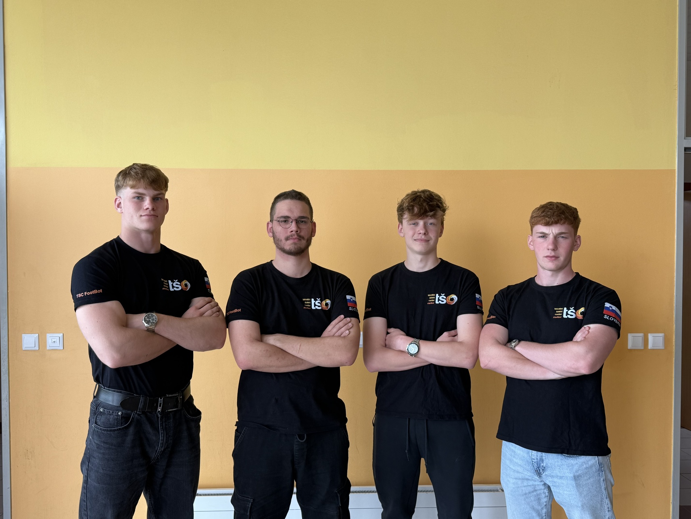

## Members & Roles

*What are the names of the team members and their role(s)?*

- Timotej Kos: captain, 3D modeller and mechanical engineer
 - Domen Fras: programmer and electrical engineer
 - Nik Črnčič: all-round team support
 - Nick Kolar: graphic Designer, technical assistant

## Meeting Frequency

*How often did your team meet?
(e.g. 90 minutes once per week or a day every weekend.)*

Throughout the year we met 2-3 times a week for a few hours. But the last two weeks we were together all day long.

## Meeting Place

*Where did you meet to work on your robot?
(e.g. a robotics room at school, at some other place, one of your homes, school library etc.)*

We have our own special laboratory in school, for robotics.

## Start Date

*When did your team start working on this year's robot?*

October 2024.

## Past Competitions

*Which RoboCupJunior competitions have you competed in and in which leagues?*

This year:
National competition 2025, Slovenia, Maribor: Lightweight League
Croatian open competition 2025, Croatia, Zagreb: Lightweight League
Regional competition 2025, Slovenia, Maribor: Lightweight League

Last year:
European Championship 2024, German: Lightweight League
World Championship 2024, Netherlands: Lightweight League
National competition 2024, Slovenia, Maribor: Lightweight League

## Mentor Contribution

*Which parts of your work received the most contribution from your mentor?*

We didn't get much help from the mentors becouse our primary goal is to make the robots completly by ourself so we can work on expanding our knowledge. We only get a little advice from mentors when we were designing the PCB but help only as advice.

They took care of supplying all of the components we need. We just sent them list of links and quantity.

## Workload Management

*How did you manage the workload?*

We communicated through snapchat and teams. But we mostly communicated in person in our laboratory.

## AI Tools

*Which AI tools did you use?*

Our programmer used ChatGPT as a learning tool to understand how to program the OpenMV camera, which operates using Python—a language we have not yet studied in school. The assistance was used strictly for educational purposes and to expand our knowledge beyond the classroom.

## Robot1 Overall

*Robot 1 Overall View*

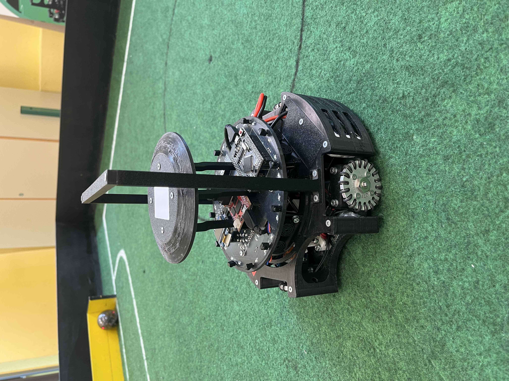

## Robot1 Front

*Robot 1 Front view*

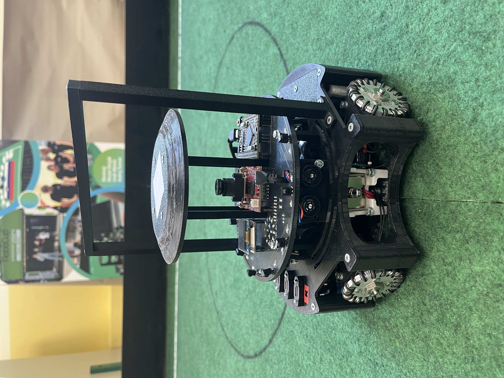

## Robot1 Back

*Robot 1 Back view*

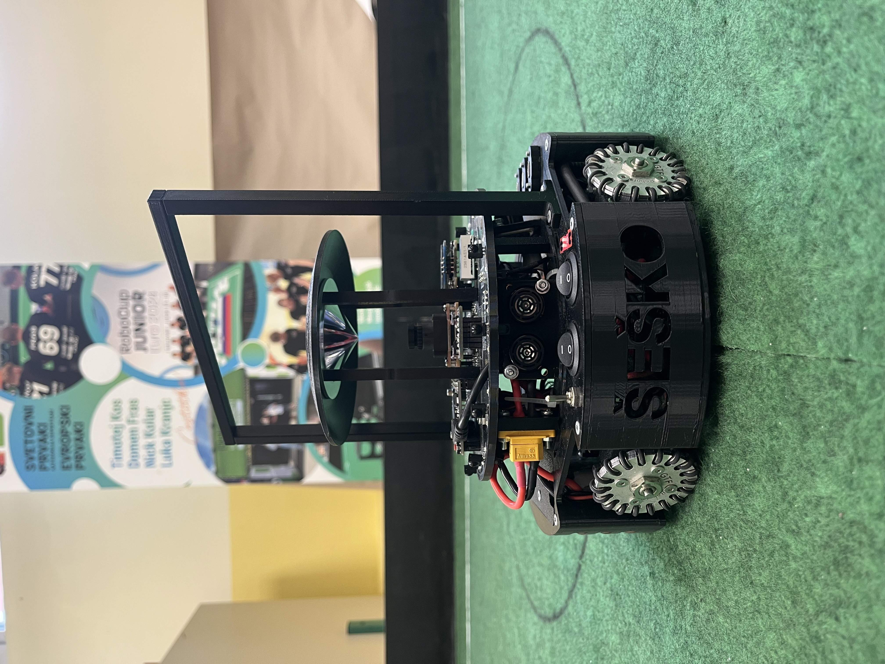

## Robot1 Top

*Robot 1 Top View*

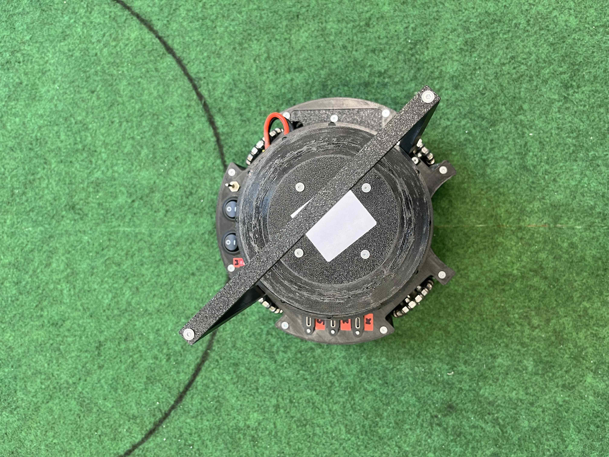

## Robot1 Bottom

*Robot 1 Bottom View*

## Robot1 Right

*Robot 1 Right View*

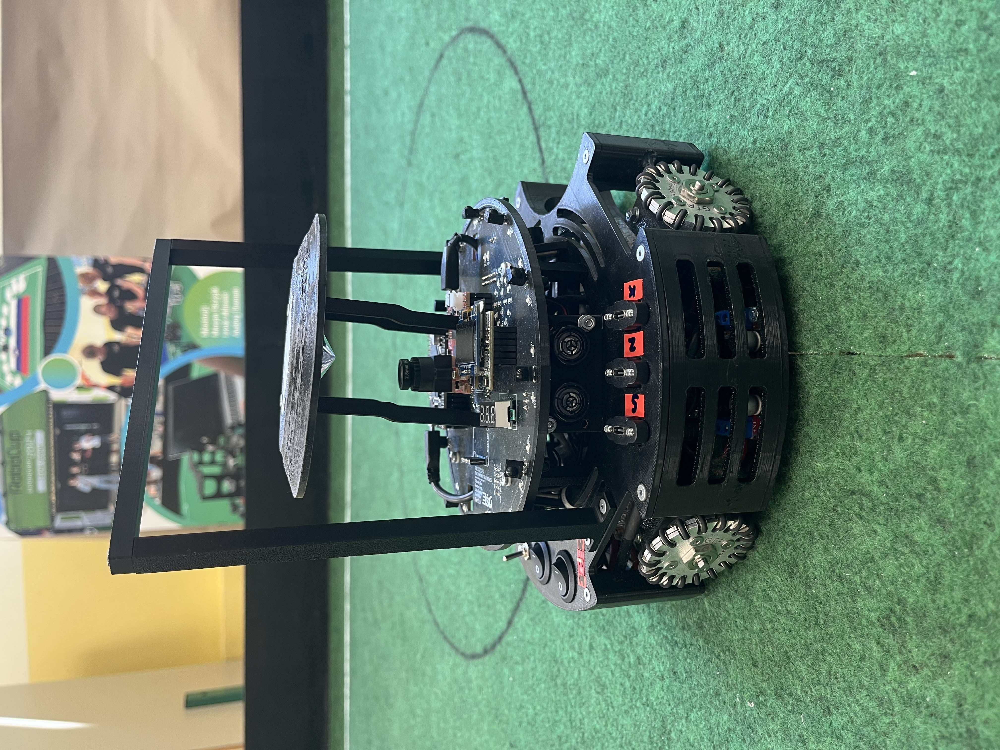

## Robot1 Left

*Robot 1 Left View*

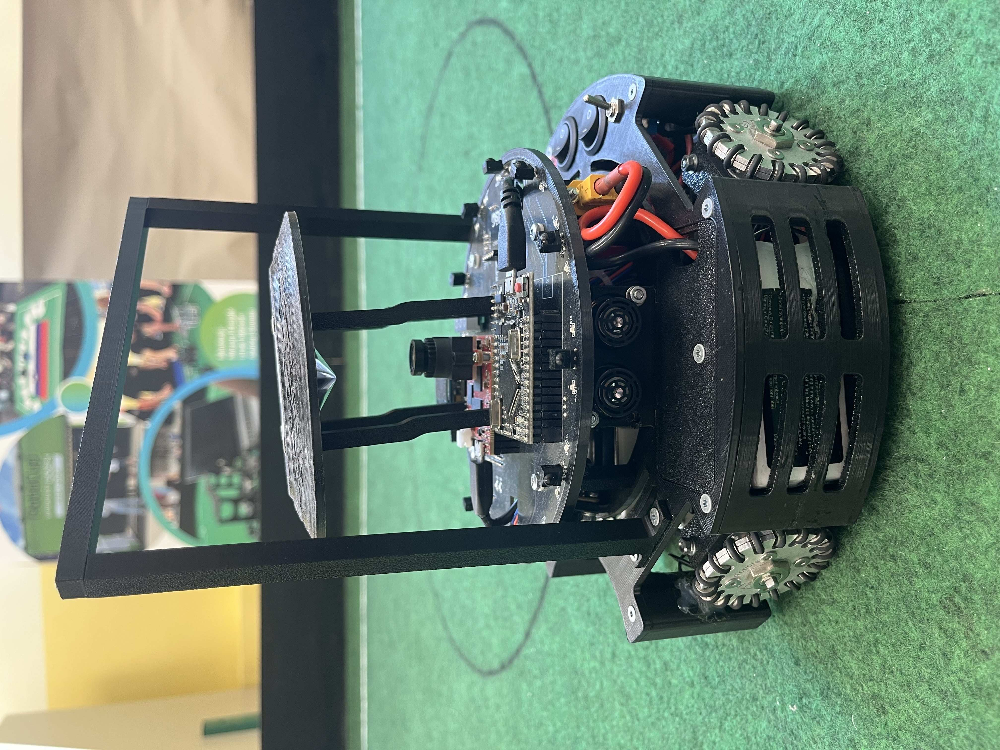

## Positioning & Movement

*How do you find your position inside the field and how do you use that position to move your robots around?*

The robot is programmed in such a way that, upon starting, it must not be placed on the line. It then positions itself behind the ball and moves toward the opponent's goal using the camera and gyroscope for orientation.

Although the robot does not know its exact position on the field, it always follows the ball and avoids crossing the white boundary line. This allows it to play a successful football match without violating the rules.

## Robot2 Overall

*Robot 2 Overall View*

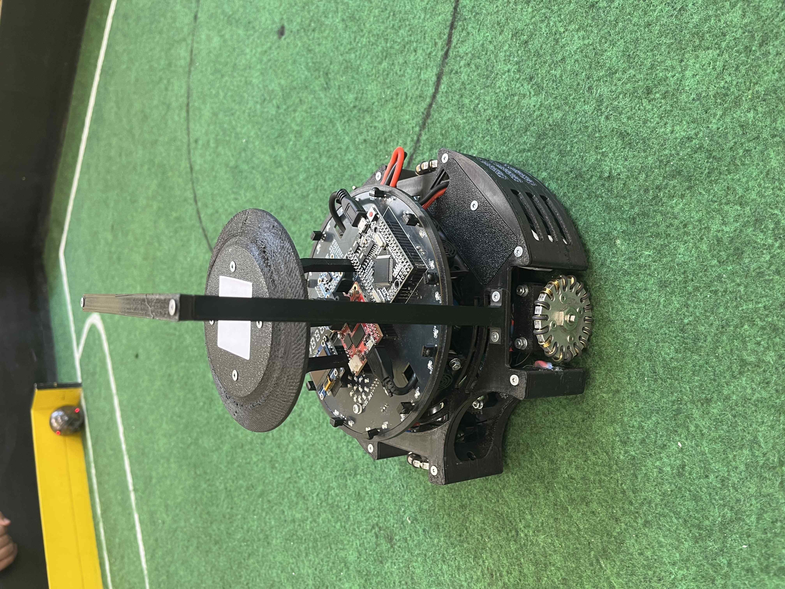

## Robot2 Front

*Robot 2 Front view*

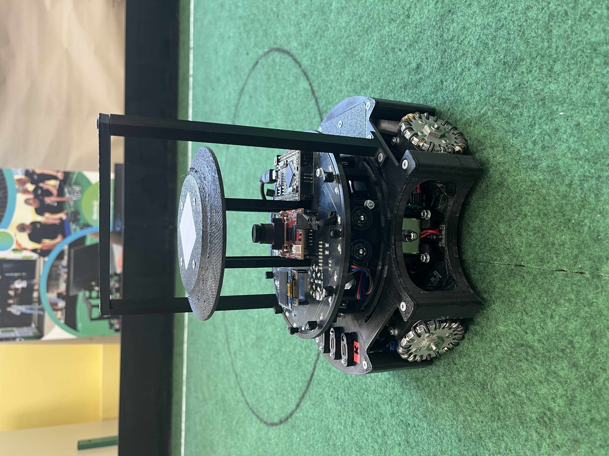

## Robot2 Back

*Robot 2 Back view*

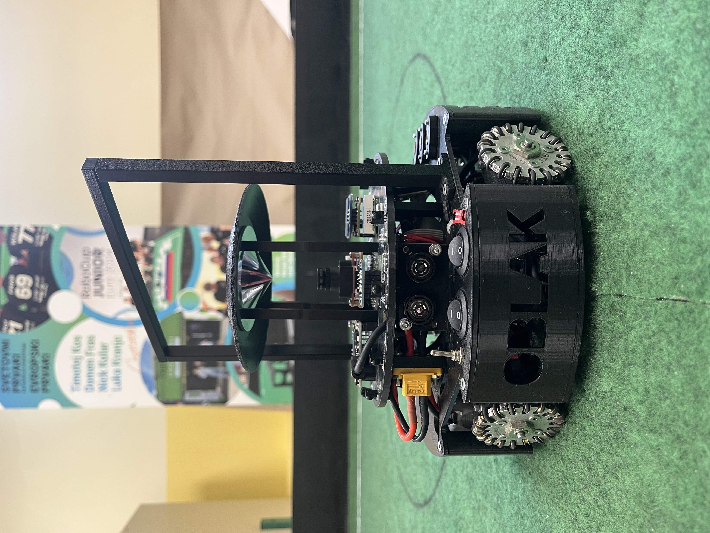

## Robot2 Top

*Robot 2 Top View*

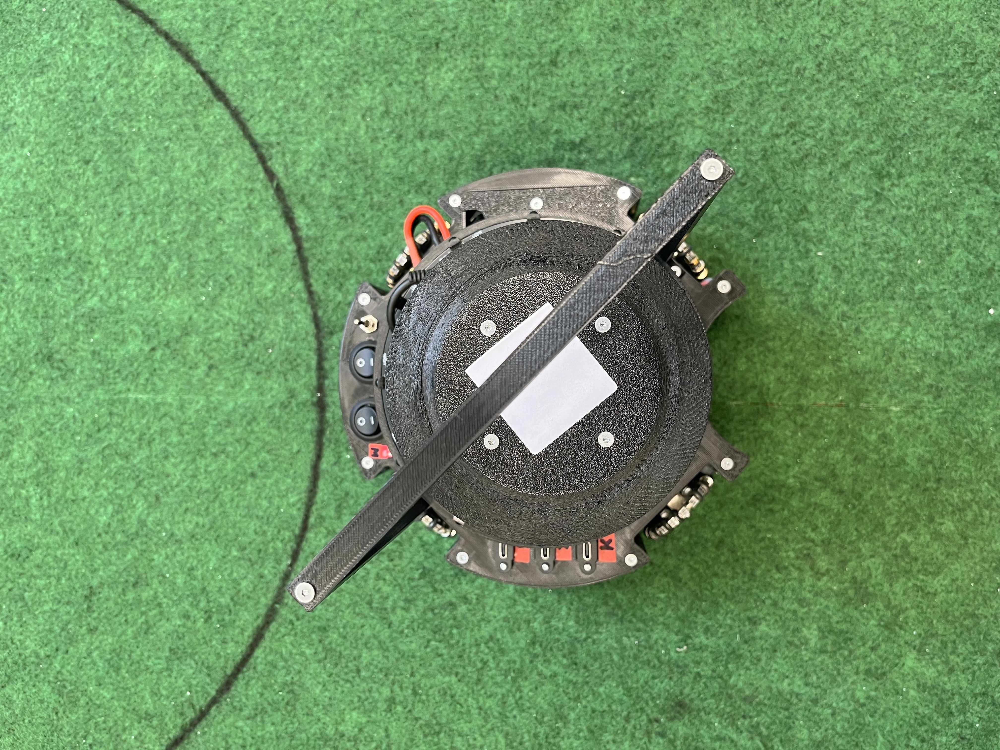

## Robot2 Bottom

*Robot 2 Bottom View*

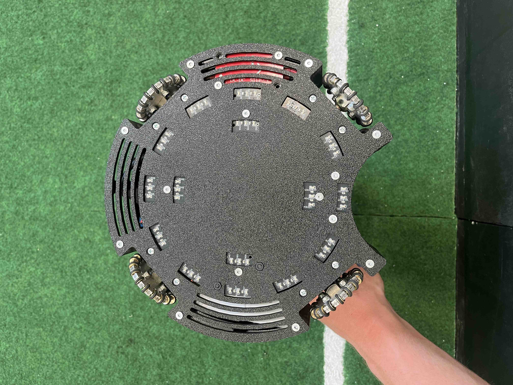

## Robot2 Right

*Robot 2 Right View*

## Robot2 Left

*Robot 2 Left View*

## Mechanical Design

*How did you design the mechanical parts of your robots?*

We designed our robot in SolidWorks. We upgraded the last year robot and took inspiration from the robot of team Edge from Japan. 
In designing our robot, we ensured that all components are integrated in accordance with the competition rules, while also maintaining a clean and aesthetically pleasing appearance.

## Build Method

*How did you build your design?*

For 3D printing we used BamboLab X1E 3D printer from our school.
For 360 degree mirror from aluminium we used CNC machine from our school. 
Our PCBs were designed in EasyEDA and produced by JCLPCB.

## Motors & Reason

*How many motors have you used and why?*

We have used four motors, each connected to an omni-wheel, mounted at 45-degree angles. This configuration provides full holonomic movement, allowing the robot to move in any direction and rotate on the spot without needing to change orientation first.

Positioning the wheels at 45° ensures optimal control, agility, and smooth motion in all directions, which is especially important for dynamic gameplay on the RoboCup Junior Soccer Lightweight league field. It allows the robot to quickly reposition itself relative to the ball and the opponent’s goal.

## Kicker Design

*If your robot has a kicker, explain how you designed and built the mechanics of the kicker*

Yes, our robot is equipped with a kicker. We use a commercially available solenoid as the core kicking mechanism, powered through a step-up converter that increases the voltage to 35V for a stronger and more effective kick.

The solenoid is triggered via a relay, which acts as a switch. The relay is activated by a ball detection sensor, which we built as a simple light barrier (optical sensor). When the ball breaks the light beam, the sensor sends a signal to the microcontroller, which then activates the relay, releasing the solenoid to kick the ball.

This design ensures precise and automated kicking, triggered only when the ball is in the optimal position in front of the robot.

## Dribbler Design

*If your robot has a dribbler, explain how you designed and built the mechanics of the dribbler.*

No, we do not use dribbler.

## CAD Files

*CAD design files*

https://github.com/robocupslovenia

## Mechanical Innovation

*Mechanical Innovation*

The mechanical design of our robot is the result of several development iterations and engineering improvements that we’re extremely proud of. As a team, we focused on creating a compact, modular, and robust mechanical system tailored for high-performance autonomous soccer.

One of the standout innovations is the custom-machined aluminum conical mirror, which we designed and manufactured in-house using a lathe at our school. This mirror enables the 360-degree camera to capture the full environment in real time, giving the robot full visual awareness of the field — a critical capability for effective autonomous play.

The robot frame is entirely 3D printed using ABS material, which provides a strong yet lightweight structure. This choice of material allowed us to rapidly prototype and refine our design while ensuring the robot can withstand high-speed collisions typical in RoboCup matches.

We also integrated a powerful kicker mechanism, which uses a spring-loaded system for quick and precise shots. This gives our offensive robot ("Šeško") the ability to actively score goals, rather than passively push the ball.

All components are mounted using standardized M3 screws, making the robot highly serviceable and modular. In case of damage or failure, parts can be quickly replaced or upgraded during competitions.

Finally, thanks to clean assembly, precise component integration, and thoughtful design, the robot in its final form is not only highly functional but also aesthetically pleasing.

## Mechanical Photos

*Photos of your mechanical designs highlights*

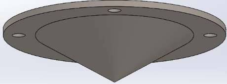
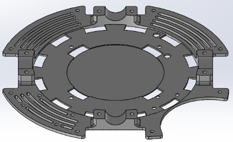
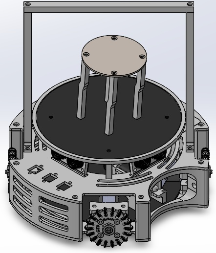

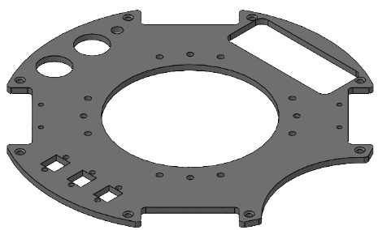

## Electronics Block Diagram

*Provide us with a block diagram of your robot's electronics*

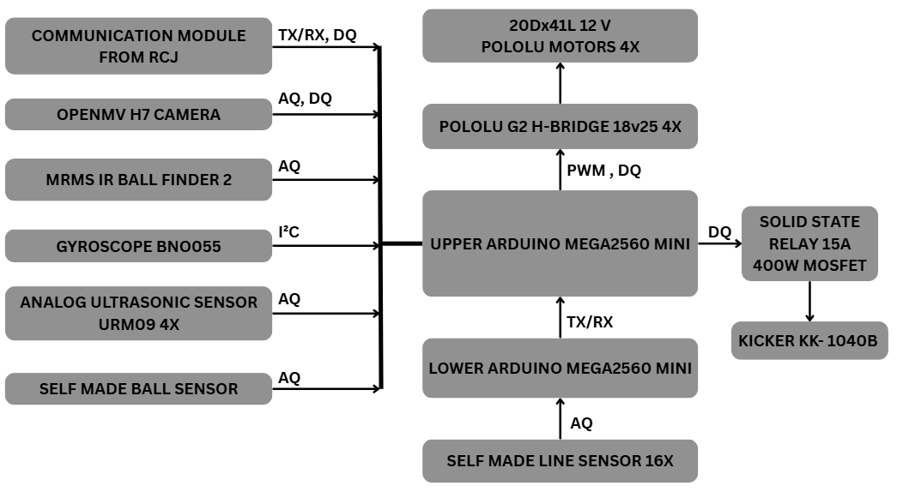

## Power Circuit

*How does your power circuits work?*

Our robot is powered by a 3-cell LiPo battery (11.1V, 14.43Wh), which serves as the primary energy source for all components.

- We use a combination of buck and boost converters to generate the necessary voltage levels:

- The motor drivers are powered directly from the 11.1V battery, as they are rated for this input.

- A buck converter steps down the voltage to 5V, which powers our main microcontroller and other logic-level electronics.

- A dedicated boost (step-up) converter increases the voltage to 35V, which is used to drive our solenoid kicker, providing powerful and consistent shots.

To help us monitor power levels during matches, we also integrated a voltage display module on the robot. This allows us to quickly check the remaining battery voltage without disconnecting or using external tools, ensuring we can maintain peak performance throughout the game.

## Motor Drive Circuit

*How do you drive your motors? Explain the circuits you use for that*

We drive our motors using Pololu G2 High-Power Motor Driver 18v25 H-bridges. These drivers are extremely compact compared to the ones we used in previous years, which is a major advantage in optimizing internal space within the robot’s chassis.

Despite their small size, they are highly efficient and reliable, capable of handling high currents while minimizing heat generation. This allows our robot to maintain consistent and powerful movement throughout matches without risking thermal shutdown or performance loss.

Each motor is connected to its own dedicated driver, and we control them using PWM signals from our main microcontroller. The precise control offered by the G2 18v25 drivers enables smooth and responsive omni-wheel movement, which is critical for accurate navigation on the field.

By upgrading to these drivers, we not only reduced the footprint of our electronics but also increased performance, responsiveness, and energy efficiency of the entire drive system.

## Microcontroller & Reason

*What kind of micro controller or board do you use for your robot? Why did you decide to use this part for your robot? If you have more than 1 processor, explain each one separately.*

Our robot uses two Arduino Mega 2560 Pro Mini microcontrollers, each dedicated to a specific and essential task to maximize performance and modularity.

The lower microcontroller is exclusively responsible for line detection using an array of infrared sensors. Its only task is to ensure that the robot stays within the field boundaries at all times, providing fast and reliable edge detection. This microcontroller also communicates with the upper one via TX/RX serial communication, sending real-time data about the robot’s position relative to the lines on the field.

The upper microcontroller acts as the robot’s main processor, managing high-level game behavior. It processes input from the 360° vision system, calculates the angle to the ball in real time, and determines the most efficient path for the robot to reach and capture the ball. It also controls the kicker mechanism, enabling the robot to actively shoot towards the opponent’s goal.

By using two independent microcontrollers with a dedicated communication link, we reduce processing load per unit and improve system reliability. This design choice ensures faster response times, better task separation, and a more maintainable codebase, all of which contribute to a more effective and competitive robot on the field.

## Ball Detection

*How does your ball detection sensors and/or camera[s] work?*

For ball detection, we use the MRMS IR Ball Finder 3, an infrared sensor capable of detecting both the angle and distance to the special orange ball used in RoboCup Junior. Originally, the sensor comes with multiple IR receivers arranged in a compact circular module. To enhance the accuracy and range of detection, we desoldered the individual IR receivers and repositioned them along the outer edge of the robot. This custom placement significantly improves the robot’s ability to detect the ball from any direction and respond more quickly.

As the attacker robot approaches the ball, it already begins to slightly align itself toward the opponent’s goal, optimizing its path for a faster and more accurate shot. Once the ball is in its possession, the robot accelerates straight toward the goal, using its orientation from the OpenMV H7 Plus camera, which provides a 360-degree field of view. This ensures that the robot is always properly aligned for shooting.

We also use the OpenMV H7 Plus camera on our goalkeeper robot, which uses it to maintain awareness of its position relative to the goal. This allows the goalkeeper to actively reposition itself to defend the goal more effectively, based on the location of the ball and the opposing robots.

This integration of custom-placed IR sensors for precise ball tracking and vision-based orientation for both offensive and defensive play gives our robot team a clear tactical advantage on the field.

## Line Detection

*How does your line detection circuits work?*

Our line detection system uses 48 infrared LEDs as light emitters and 32 phototransistors as receivers. The IR LEDs continuously illuminate the area beneath the robot. When the light reflects back from the ground, more infrared light is reflected from the white field line than from the darker field surface.

The 32 phototransistors detect the amount of reflected infrared light and send analog voltage values to the lower Arduino microcontroller. When the signal exceeds a defined threshold, the microcontroller identifies that the sensor is over the white boundary line.

Thanks to this configuration, our robot can precisely detect field boundaries and stay within the allowed playing area

## Navigation/Position Sensors

*What sensors do you use for navigation and how are these sensors connected to your processor? What sensors do you use to find your position in the field? What about the direction your robot faces?*

For navigation and orientation on the field, we use the Bosch BNO055 absolute orientation sensor. This is a 9-axis sensor that includes an accelerometer, gyroscope, and magnetometer, with built-in sensor fusion, providing reliable absolute heading (orientation) without the need for manual calibration or complex calculations on the microcontroller.

The BNO055 is connected to our upper Arduino Mega 2560 Pro Mini via I2C communication, which allows for fast and efficient data transfer. We use the orientation (heading) data from the BNO055 to keep track of the robot’s facing direction, which is crucial for aiming towards the goal and aligning with the ball, especially during fast-paced movement.

This sensor plays a key role in making sure the robot always knows where it's facing, even after rotations, collisions, or sudden stops. Combined with our ball detection system and strategic programming, it allows the robot to navigate the field with high accuracy and confidence.

## Kicker Circuit

*How do you drive your kicker system? How does the circuit make the kicker work?*

The kicker is triggered using a simple and effective infrared (IR) detection system — composed of an IR transmitter and receiver placed at the ball intake area. 
When the ball enters the robot’s possession zone, it breaks the IR beam, and this interruption immediately signals the microcontroller to activate the kicker. This mechanism allows for precise and automatic kicking without any delay.

## Dribbler Circuit

*How does your dribbler system work? What components and circuits did you use to drive it?*

We don't use it.

## Schematics

*Schematics of your robot*

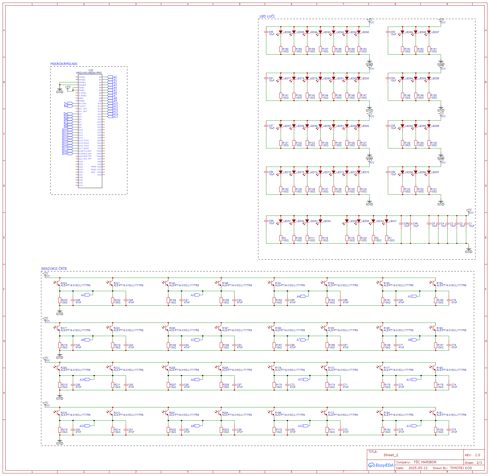
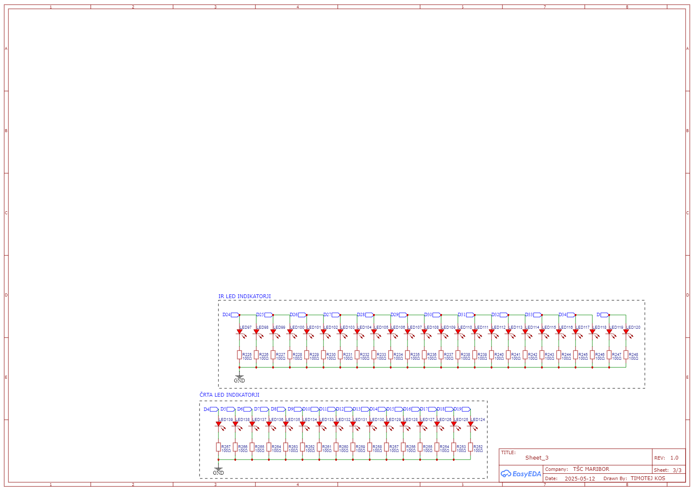

## PCB

*PCB of your robot*

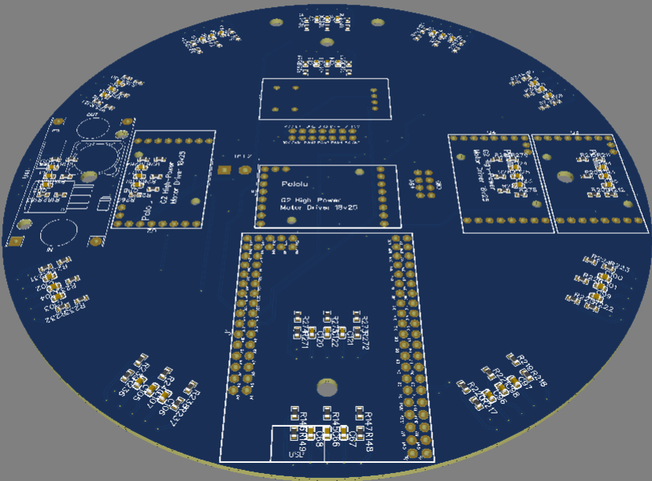
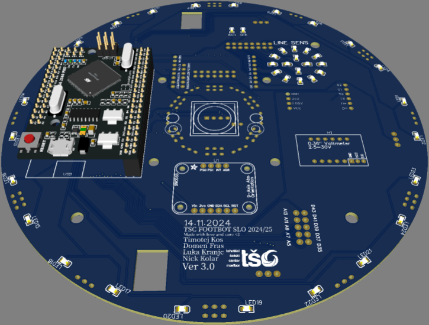

## Innovation

*Innovations*

We are most proud of our custom-designed PCBs, which play a crucial role in integrating all electronic components into a compact and efficient system. The robot features two main PCBs: the lower PCB handles line sensors and motors, while the upper PCB is responsible for communication, power distribution, and peripheral devices like the 360-degree camera. Designing our own PCBs allowed us to optimize the layout for our specific needs, reduce wiring complexity, and improve reliability. One key innovation was the separation of power and signal traces to minimize electrical noise, which is especially important for precise sensor readings and motor control. Additionally, we designed the PCBs to be modular—each board can be easily removed or replaced without affecting the rest of the system, making repairs and upgrades much easier.
This custom approach not only helped us save space and reduce weight, but also gave us a deeper understanding of how all components interact on an electrical level, ultimately leading to a more stable and high-performing robot.

## Circuit Photos

*Photo of your circuit boards highlights*

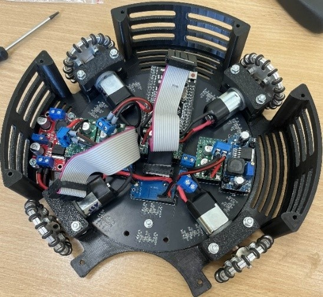
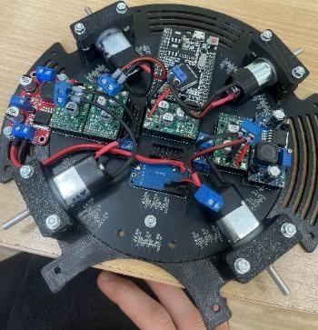
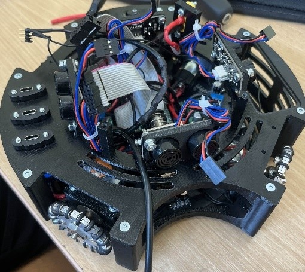
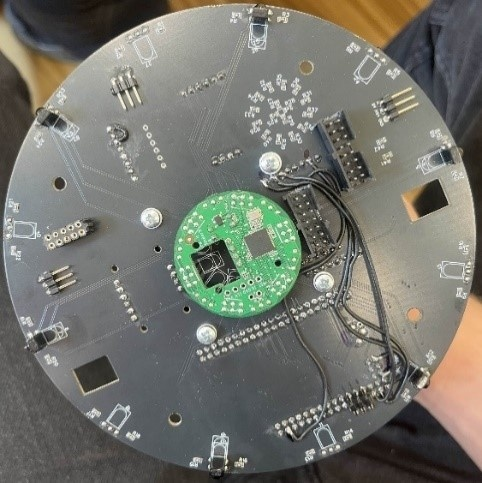
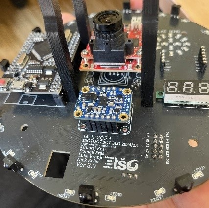

## Motor Control

*How do you use your processor to move your motors?*

We use our processor to control the motors by sending a single command that includes PWM (Pulse Width Modulation) values for each motor.

These PWM signals are calculated based on the desired movement vector and orientation, and are then transmitted to the motor drivers, which in turn control the speed and direction of the motors.

This centralized approach allows for efficient and synchronized control of all four motors using omni-wheels, enabling smooth holonomic movement across the field.

## Ball Detection Method

*How do you find where the ball is? How do you read the data from the ball detection sensors or camera?*

We use an infrared (IR) ball-finder sensor that detects the ball in a full 360-degree range around the robot.

The sensor provides an analog signal that corresponds to the angle at which the ball is located relative to the robot's orientation. Our processor reads this analog value and translates it into directional movement by adjusting the motor speeds accordingly.

This setup allows the robot to constantly track the ball’s position and react quickly, without relying on complex image processing or a camera system.

## Ball Catch Algorithm

*How does your algorithm work to catch the ball? Is there a difference between your robots in how they move towards the ball? Explain the differences.*

Our algorithm for catching the ball differs between the attacker and the goalkeeper robot, as each serves a unique role on the field.

The attacker robot uses a PID control algorithm to move precisely toward the ball. Based on the angle provided by the IR ball-finder sensor, the robot continuously adjusts its speed and direction to approach the ball smoothly and efficiently, minimizing overshooting and ensuring accurate tracking.

In contrast, the goalkeeper robot does not follow the ball directly. Instead, it moves horizontally (left and right) along the goal line, depending on the ball's position on the field. Its movement is simpler and focused on blocking the goal rather than possession, using only angle detection to stay aligned with the ball.

This division of behavior allows each robot to specialize in its role — one in attack and precise ball control, the other in goal protection through quick lateral responses

## Line Algorithm

*How does your robot find the lines to stay inside the field? What algorithms do you use to avoid going out of bounds?*

Our robot uses an array of line sensors mounted on the bottom side to detect the white boundary lines on the field.

These sensors are connected to a dedicated Arduino Mega, which continuously reads the sensor values and calculates the robot's relative position with respect to the field boundaries. Instead of sending raw data, this processor interprets the line positions and sends simplified movement instructions to the main Arduino processor, which controls the robot's motion.

By offloading line detection and positioning calculations to a separate processor, we reduce the computational load on the main controller. This allows the main system to focus on ball tracking and motor control, while the robot effectively avoids going out of bounds by reacting in real time to line sensor input.

## Goal Algorithm

*What algorithms do you use to score goals? How do you use your kicker and dribbler to handle the ball?*

To score goals, our robot uses a camera-based orientation system and a kicker mechanism.

When the robot detects it has possession of the ball, it continuously moves toward the opponent’s goal while using the camera to adjust its orientation. The robot actively aligns itself with the goal during movement.

As soon as it is facing the goal directly, it automatically activates the kicker to shoot the ball toward the goal.

Even without a dribbler, the robot is able to maintain ball possession by keeping its motion steady and directed, making the entire process efficient.

## Defense Algorithm

*What algorithms do you use to avoid the opponent team scoring? How do your robots defend your own goal?*

To prevent the opponent from scoring, we use a dedicated goalkeeper robot that defends the goal based on the ball's position.

The goalkeeper moves laterally along the goal line, constantly adjusting its position depending on where the ball is detected on the field. This allows the robot to effectively block incoming shots by always staying between the ball and the goal.

In the rare case that the goalkeeper is the only robot left on the field and the ball is stationary, it switches from defense to offense mode — attempting to move toward the ball and score, ensuring continuous gameplay and pressure on the opponent.

This simple but effective logic enables both active defense and situational offense, increasing the team’s adaptability during matches.

## Robot Communication

*Do your robots communicate with each other? How do you use this communication to your advantage?*

No.

## Innovation2

*Innovations*

We are most proud of two specific parts of our code: the multifunctional goalkeeper logic and the PID control for our attacking robot.

Our goalkeeper robot is not just limited to defense. We developed a special algorithm that allows it to intelligently switch between defending and attacking, depending on the situation. If the goalkeeper is alone on the field and the ball is stationary, it will automatically transition into attack mode and attempt to score. This dual-function behavior adds flexibility and improves our chances of winning, especially in unpredictable match situations.

We also implemented a PID (Proportional-Integral-Derivative) control algorithm for our attacking robot. It helps the robot move smoothly and accurately toward the ball, maintaining stability even when the ball or the robot is in motion. This results in faster and more reliable plays, reducing errors and increasing scoring efficiency.

Both of these features were developed through trial, testing, and continuous improvement, and they have made a big difference in how effectively our robots perform during matches.

## GitHub Link

*GitHub link*

https://github.com/robocupslovenia

## BOM

*Bill of Materials (BOM)*

[https://drive.google.com/open?id=1VAc7sW5OAxrVcsOTaHhNrPn4O78fk5Jy](https://drive.google.com/open?id=1VAc7sW5OAxrVcsOTaHhNrPn4O78fk5Jy)

## Cost

*How much did it cost you to build your robots?*

Approximately 1.500 EUR per robot including replaced parts and failed builds.

## Funding

*How did you gathered the funds to build the robots?*

90% school
10% sponsors

## Affordability

*How affordable was it to compete in RoboCupJunior Soccer?*

6

## Answer Check

*Have you checked all of your answers?*

Yes!

## Publication Consent

*We publish TDPs and posters during or after the competition as described in the beginning*

Yes, we acknowledge everything submitted in the above form can be published.

## Email Address

*Email Address*

nick.kolar2006@gmail.com

## TDP File

*TDP File Upload (Not required)*

## Extra Column

*Column 67*

