## Timestamp

*Timestamp*

7/12/2025 2:40:31

## Team Name

*What is your team's name?*

TPA-iPES

## League

*What league do you participate in?*

Open League

## Country

*Where are you from?*

Bangkok Thailand

## Contact

*If other teams have questions about your robot, now or in the future, what email address(es) can we publish along with this document for people to reach you?

(You can put in multiple email addresses, like multiple team members, an email for the whole team or both. Feel free to share other ways of communication like Discord handles)*

guythepnok@gmail.com
owojui@gmail.com
sudduensirapop@gmail.com

## Social Media

*Team Social Media Links (if you have any)*

N/A

## Team Photo

*Upload a photo of your whole team with your mentor and robots

Note: This is not mandatory and will be published along with your TDP if you choose to upload something*

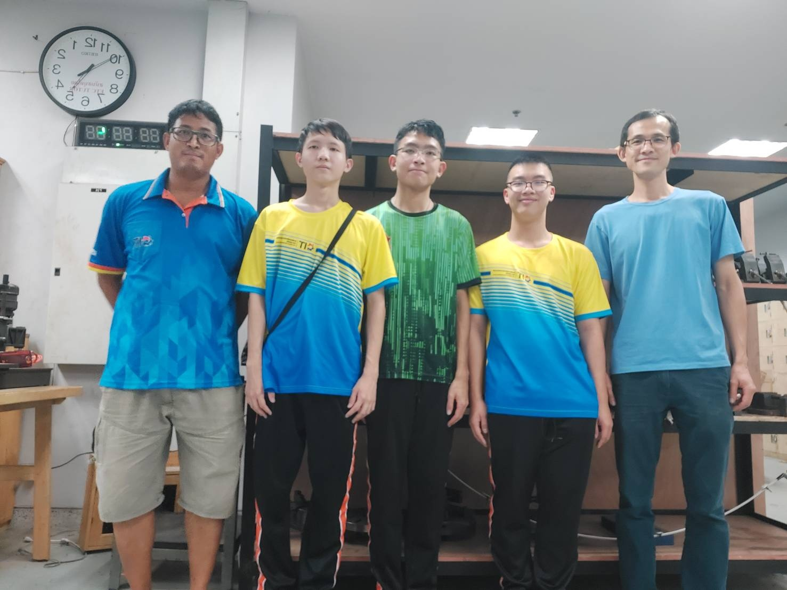

## Members & Roles

*What are the names of the team members and their role(s)?*

Nikanti (jui) : PCB outline design, Whole robot structure design, Robot assembly

Watcharapong (Guy) : hyperbolic Mirror Design, Vision System Software, Main Object Detection Software.

Sirapop (Guy) : PCB schematic design, movement system software, Ball chase concept design, Robot main controller software.

## Meeting Frequency

*How often did your team meet?
(e.g. 90 minutes once per week or a day every weekend.)*

6 to 15 hours a week

## Meeting Place

*Where did you meet to work on your robot?
(e.g. a robotics room at school, at some other place, one of your homes, school library etc.)*

At school workshop, team member home

## Start Date

*When did your team start working on this year's robot?*

1 january 2024

## Past Competitions

*Which RoboCupJunior competitions have you competed in and in which leagues?*

World robocup 2025: Soccer open league Brazil.

## Mentor Contribution

*Which parts of your work received the most contribution from your mentor?*

Our mentor helped us secure sponsorships, arrange flights, and manage posters and advisers for the structural design.

## Workload Management

*How did you manage the workload?*

We use Microsoft Teams to keep track of each member's work progress, with separate channels dedicated to specific systems such as the vision system, movement system, hardware design, and more. Each member regularly posts pictures, code, files, and brief explanations of their work. For day-to-day communication, we primarily use LINE.

## AI Tools

*Which AI tools did you use?*

ChatGPT helped us significantly, especially as the deadline approached. It assisted with repetitive coding tasks, such as setting up data buffers for sensor readings—particularly when data formats were hard to find and there is not much time left. It also supported us in writing English sentences.

## Robot1 Overall

*Robot 1 Overall View*

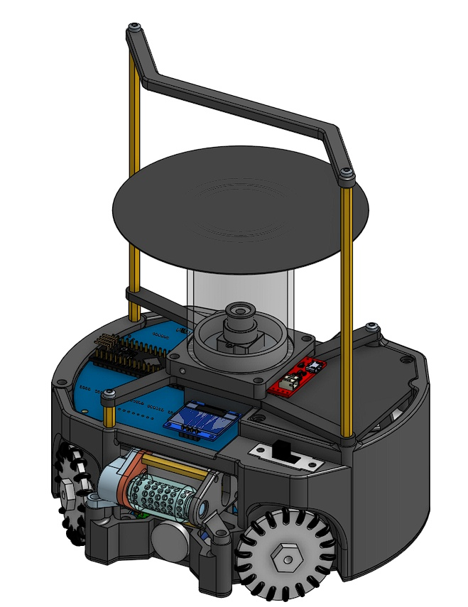

## Robot1 Front

*Robot 1 Front view*

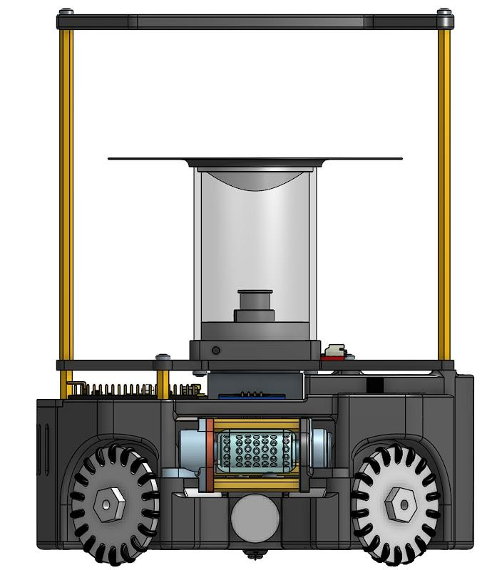

## Robot1 Back

*Robot 1 Back view*

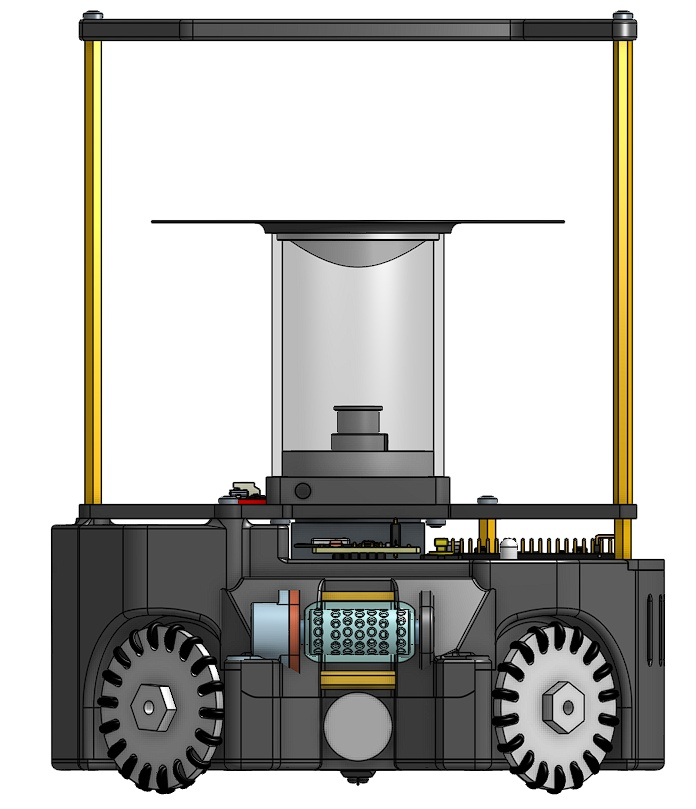

## Robot1 Top

*Robot 1 Top View*

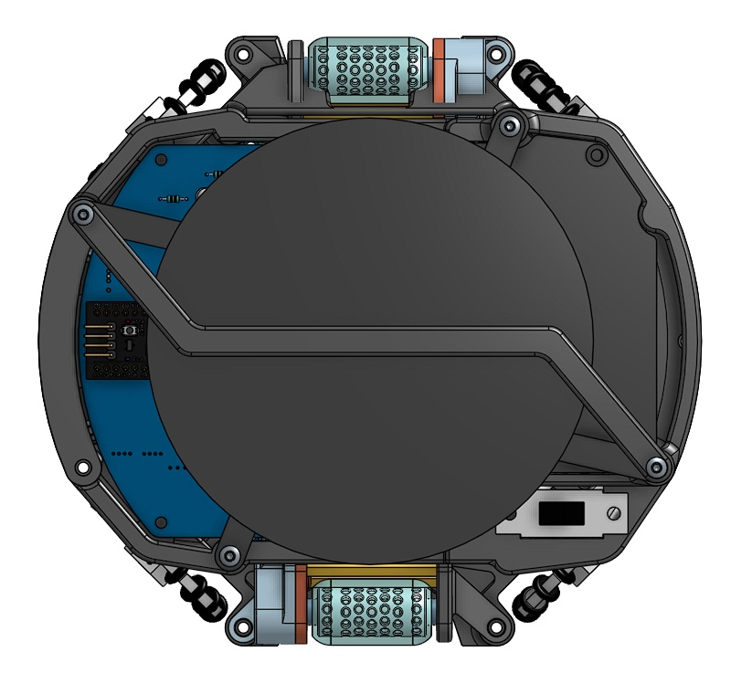

## Robot1 Bottom

*Robot 1 Bottom View*

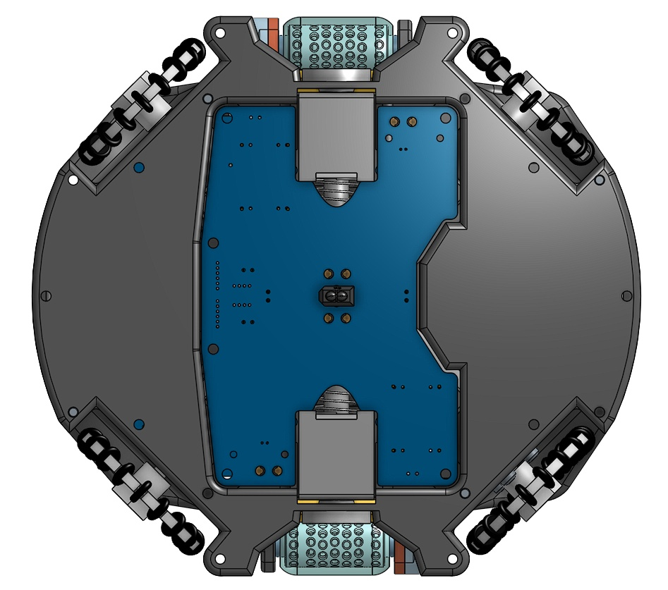

## Robot1 Right

*Robot 1 Right View*

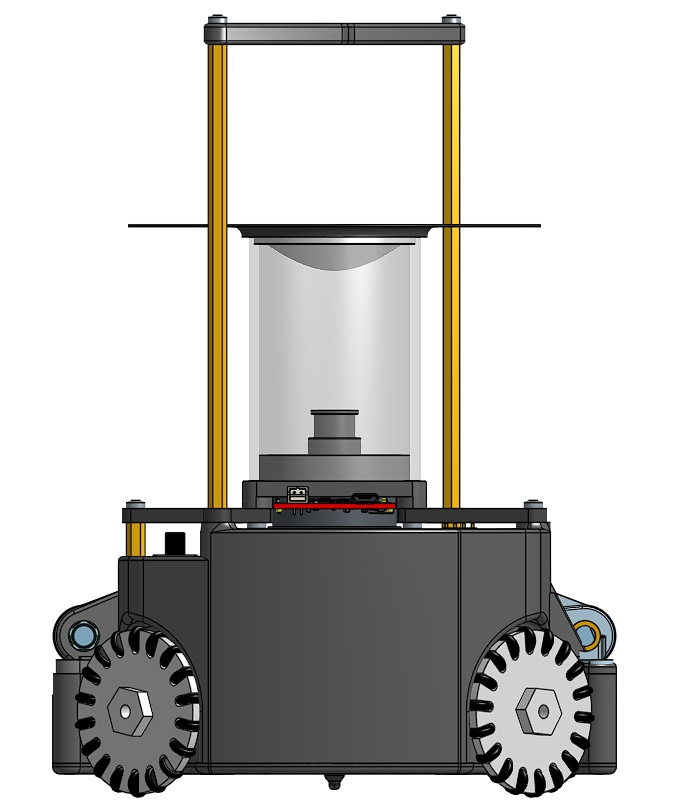

## Robot1 Left

*Robot 1 Left View*

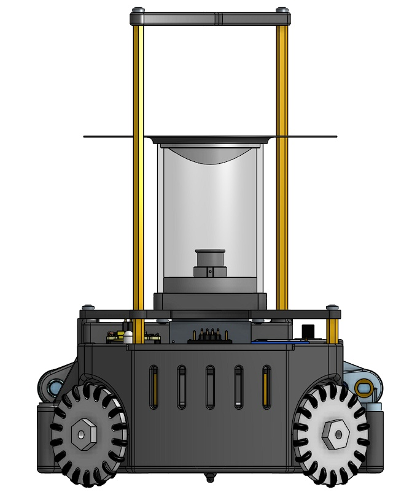

## Positioning & Movement

*How do you find your position inside the field and how do you use that position to move your robots around?*

N/A

## Robot2 Overall

*Robot 2 Overall View*

## Robot2 Front

*Robot 2 Front view*

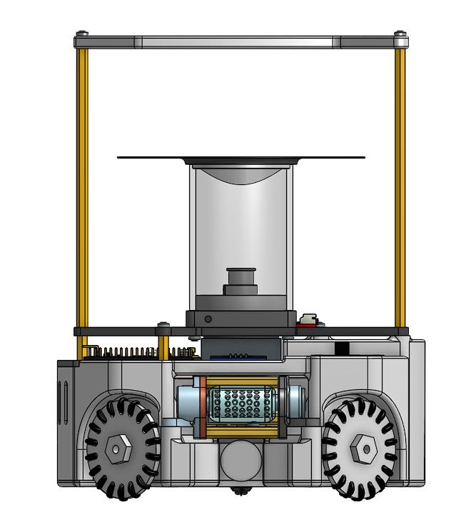

## Robot2 Back

*Robot 2 Back view*

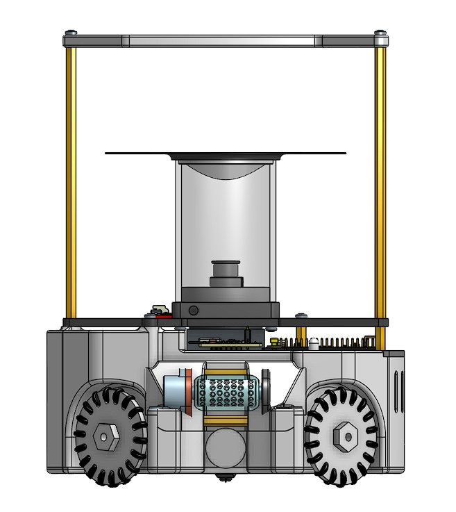

## Robot2 Top

*Robot 2 Top View*

## Robot2 Bottom

*Robot 2 Bottom View*

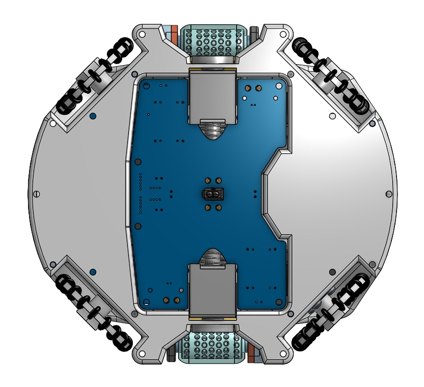

## Robot2 Right

*Robot 2 Right View*

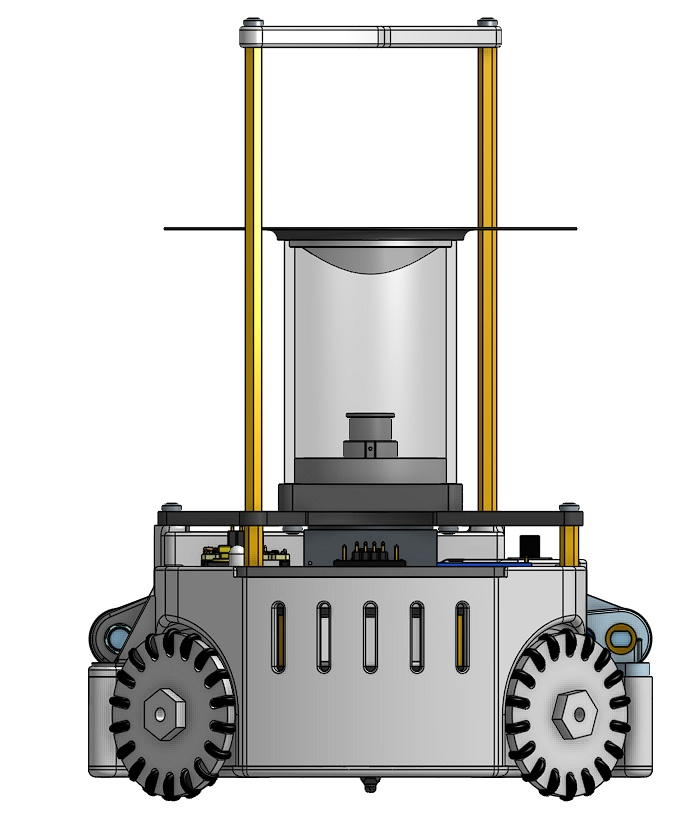

## Robot2 Left

*Robot 2 Left View*

## Mechanical Design

*How did you design the mechanical parts of your robots?*

We designed the robot’s parts using 3D design software, choosing Onshape as our main tool. Our core design concept focused on simplicity to support efficient development and manufacturing. We considered factors such as practical usability, strength, and component reliability. To improve the design, we plan to replace some 3D-printed parts with metal components for greater strength and durability. Additionally, we aim to remove the rear solenoid kicker and dribbler units, replacing them with a Y-axis odometry encoder.

## Build Method

*How did you build your design?*

We used a Bambulap A1 3D printer to build the robot’s structure. For shaping the hyperbola glass and acrylic tubes, we used a machining service from a workshop we know. For the camera mounting parts, we used a laser cutting service at a local shop near our residence. We also used JLCPCB services to manufacture the robot’s circuit boards. The design change we had to make was in the battery placement. Because the actual battery was larger and harder to fit than in the original design, we had to adjust the battery’s position accordingly

## Motors & Reason

*How many motors have you used and why?*

Our robot has six motors. Two of them are brushed motors used for the dribbler, while the remaining four also brushed motor are used for omniwheel holonomic movement in a cross-positioning pattern. We use four wheels to maximize traction and reduce slippage when the robot is being pushed.

## Kicker Design

*If your robot has a kicker, explain how you designed and built the mechanics of the kicker*

Our robot's kicker uses a solenoid, driven by a basic switching circuit. We use a MOSFET in series with the solenoid, along with another MOSFET to control the 5V signal with our controller signal logic to the gate of the main switching MOSFET. The solenoid we bought from the market

## Dribbler Design

*If your robot has a dribbler, explain how you designed and built the mechanics of the dribbler.*

We aligned the dribbler parallel to the motor to save space and simplify power transmission. The frame, gears, and spinning shaft were 3D-printed, with the shaft designed for better silicone adhesion and strength under load. Initially, we tried a brushless motor but switched to a brushed one due to better torque performance.

## CAD Files

*CAD design files*

https://github.com/GUYEMBED/RobocupjuniorSoccerOpen_Robot-Structure

## Mechanical Innovation

*Mechanical Innovation*

We're most proud of integrating the XY odometry encoder, designed for precise speed and position tracking, slip avoidance, and LiDAR fusion. However, due to time constraints and an unsuitable sensor, it remains non-functional, with only the hardware completed. Despite this, we see strong future potential.

We're also proud of the robot's one-piece main body, which supports the entire structure.

## Mechanical Photos

*Photos of your mechanical designs highlights*

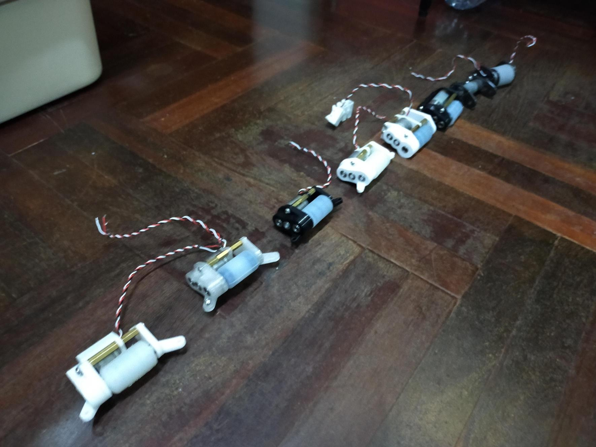

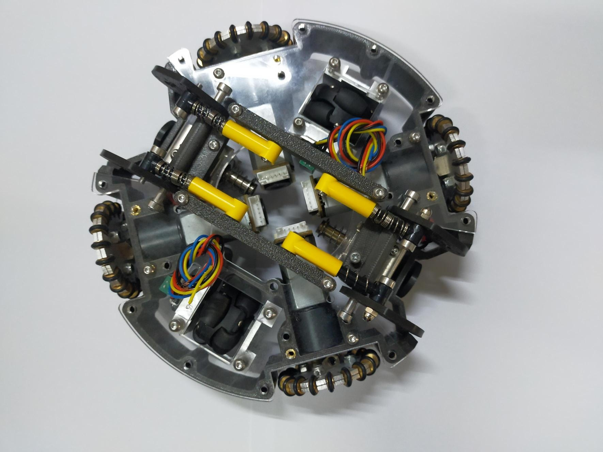

## Electronics Block Diagram

*Provide us with a block diagram of your robot's electronics*

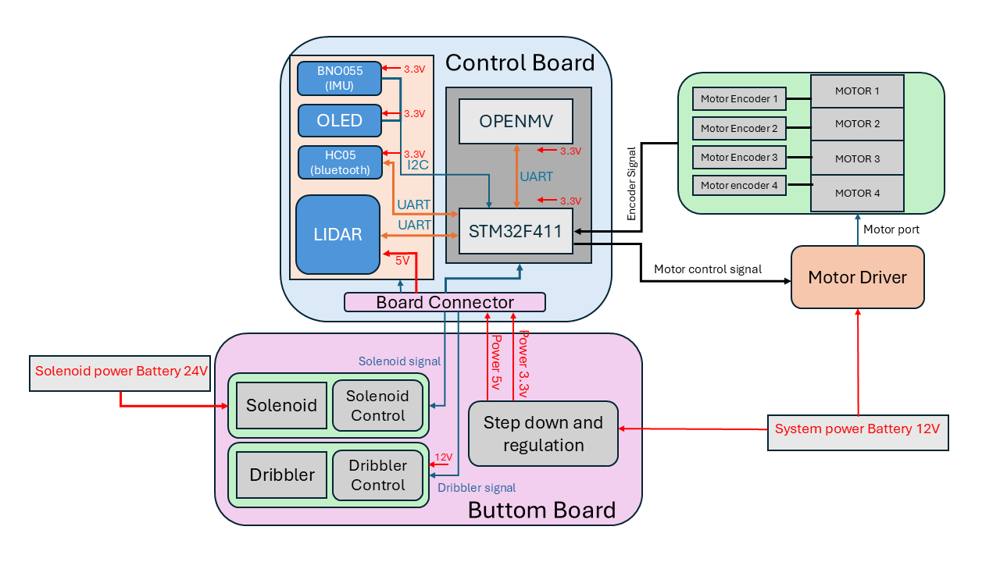

## Power Circuit

*How does your power circuits work?*

Our robot uses two separate battery systems: one for the main electronics and another dedicated to the solenoid.

For the main system, we use a 3-cell LiPo battery (approximately 11.1V), which powers everything except the solenoid. A switching buck converter step down from 11.1V to 5V for components like the LiDAR. Then, a linear regulator further reduces the 5V to 3.3V for the microcontroller and sensors.

For the solenoid system, we use two 3-cell LiPo batteries connected in series, providing around 22.2V to drive the solenoid.

## Motor Drive Circuit

*How do you drive your motors? Explain the circuits you use for that*

Our motor control circuit is based on an H-bridge design, allowing us to control both the direction and speed of the motors using PWM signals. Initially, we attempted to design our own H-bridge motor driver PCB using MOSFETs, but due to technical issues, it did not function as intended. As a result, we decided to use a breakout board with a VNH motor driver chip for reliability and ease of integration.

## Microcontroller & Reason

*What kind of micro controller or board do you use for your robot? Why did you decide to use this part for your robot? If you have more than 1 processor, explain each one separately.*

We use the STM32F411CEU6 microcontroller, commonly known as the 'STM32 Blackpill' board. We chose this chip as an alternative to our originally intended STM32F446RET6. Initially, we designed a custom PCB for the STM32F446RET6, but it not working as expected so we considered using a breakout board like the STM32F446 Nucleo at first but it was too large for our robot.

So we switched to the STM32F411CEU6 Blackpill because it is smaller, has decent specifications, and allows us to continue using STM32 microcontrollers. This supports our goal of transitioning from the Arduino IDE to studying and programming with STM32CubeIDE.

## Ball Detection

*How does your ball detection sensors and/or camera[s] work?*

We use the OpenMV module's blob detection to locate the ball, starting with strict LAB color thresholds and a relaxed pixel threshold to reduce false positives while capturing strong color matches. Detected blobs are then rechecked in smaller regions with relaxed LAB thresholds for better centroid accuracy. Each is evaluated for shape and pixel distribution, and scored based on size and roundness for distance estimation.

## Line Detection

*How does your line detection circuits work?*

N/A

## Navigation/Position Sensors

*What sensors do you use for navigation and how are these sensors connected to your processor? What sensors do you use to find your position in the field? What about the direction your robot faces?*

We use LiDAR to help locate our robot’s position on the field, but we can't make it reliable so we decided to not use it. For measuring angular data such as angular velocity and heading, our robot uses an IMU sensor the BNO055 in sensor fusion mode.

## Kicker Circuit

*How do you drive your kicker system? How does the circuit make the kicker work?*

Our robot's kicker uses a solenoid triggered by a simple switching circuit. A MOSFET controls the solenoid, with a second MOSFET used to boost the 5V control signal, as the main MOSFET requires a higher gate voltage than the microcontroller provides. The solenoid was sourced from the market.

## Dribbler Circuit

*How does your dribbler system work? What components and circuits did you use to drive it?*

Our dribbler uses a MOSFET connected in series with the brushed motor, similar to the solenoid circuit but with a different MOSFET. We control the motor in only one direction.

## Schematics

*Schematics of your robot*

[https://drive.google.com/open?id=1Gw2lBMA_vrgvRW6q58ZFEzXM7lr6gjQ0](https://drive.google.com/open?id=1Gw2lBMA_vrgvRW6q58ZFEzXM7lr6gjQ0)
[https://drive.google.com/open?id=1J1699mTRPhPiW8Ytg5zxpC3wSYCvhXA5](https://drive.google.com/open?id=1J1699mTRPhPiW8Ytg5zxpC3wSYCvhXA5)

## PCB

*PCB of your robot*

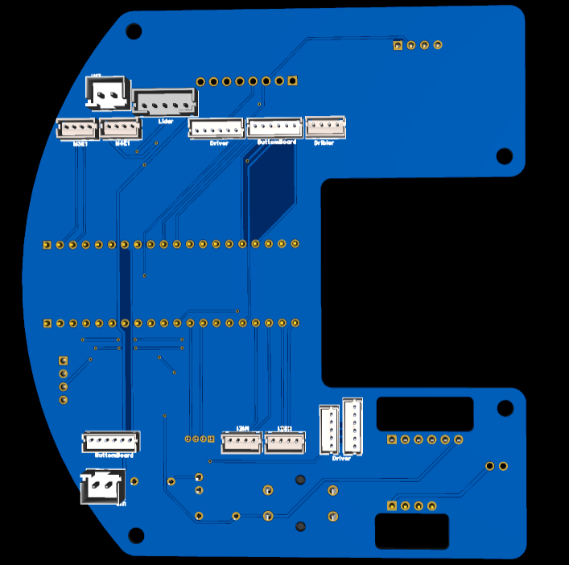
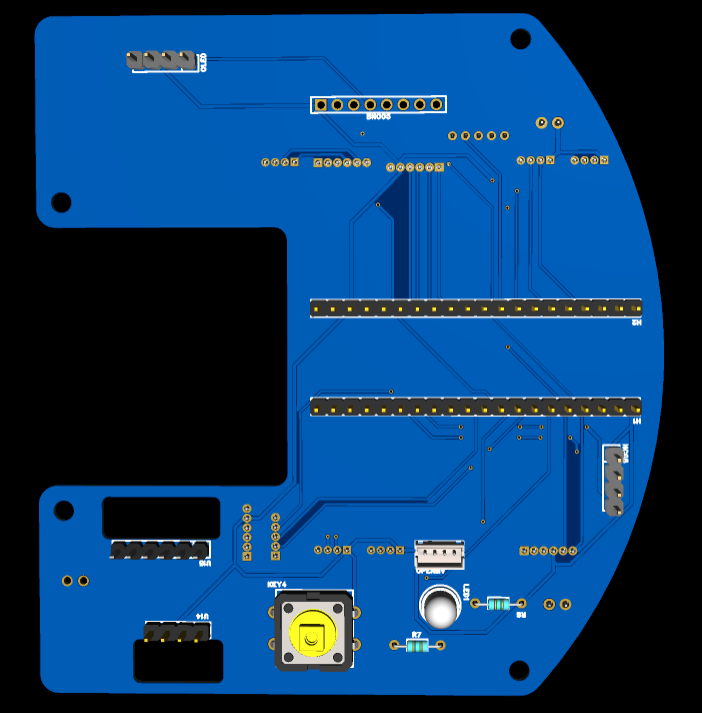

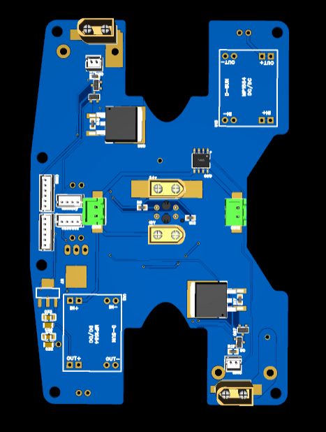

## Innovation

*Innovations*

The Bottom Board PCB, which controls the solenoid, dribbler, and power regulation, is our most successful and actively used component. It’s especially meaningful as we fully applied classroom knowledge, including MOSFETs and linear regulators.

We failed the design four times, solving issues like faulty connectors, thin traces unable to handle solenoid current, floating MOSFET gates, and regulator overheating. After two failed attempts with larger linear regulators, we switched to a buck converter.

We're also proud of our custom H-bridge motor driver PCB, even though it didn’t work and isn't used.

## Circuit Photos

*Photo of your circuit boards highlights*

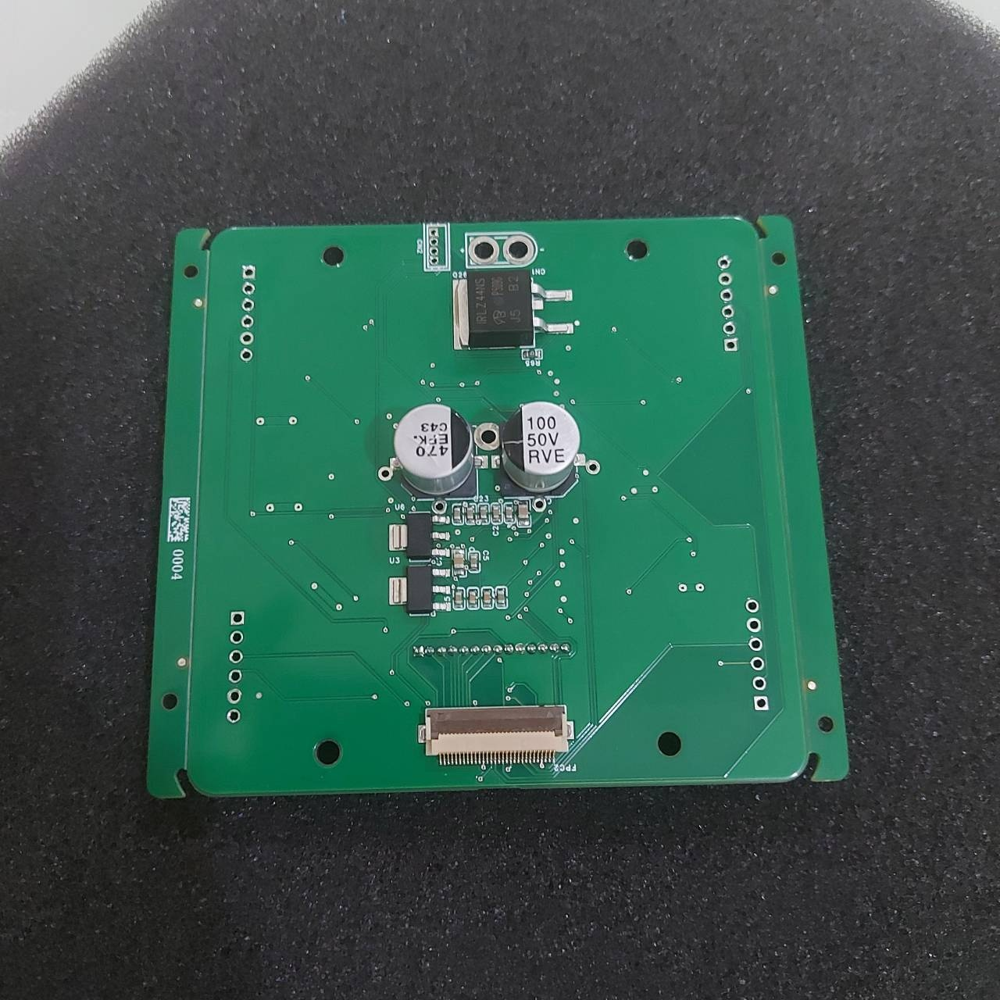

## Motor Control

*How do you use your processor to move your motors?*

Each of our motors is equipped with an incremental encoder for speed measurement. We use this data as feedback to control the motor's RPM using a PID controller. To process the encoder signals, we use interrupts to detect rising edges and measure the time between them, which allows calculate the motor speed.

## Ball Detection Method

*How do you find where the ball is? How do you read the data from the ball detection sensors or camera?*

We read the image data from the camera and apply the blob detection algorithm, which gives us the centroid of the ball-colored pixels in the image. To find the ball’s actual distance, we calculate the Euclidean distance between the mirror center in the image and the blob’s centroid. This pixel distance is then passed into a conversion function, which gives the real-world distance from the robot. The conversion function is based on polynomial regression using experimental data that maps pixel distances to real distances. This method works well because the angle of the ball in the image closely matches its real angle, so we can accurately estimate the ball’s (x, y) position relative to the robot.

## Ball Catch Algorithm

*How does your algorithm work to catch the ball? Is there a difference between your robots in how they move towards the ball? Explain the differences.*

Our ball-chasing strategy focuses on two key factors: effective speed and movement angle. We use separate PID controllers for the X and Y axes, combining their outputs into a speed vector.

To ensure optimal approach, we compare this vector to the ideal straight-line angle toward the ball control position. If it's outside a set threshold, we adjust the Y-axis speed to correct the direction. If it's within range, we keep the original output to maintain maximum speed.

## Line Algorithm

*How does your robot find the lines to stay inside the field? What algorithms do you use to avoid going out of bounds?*

We use OpenMV image processing to keep the robot within field boundaries. Lens correction is applied first to reduce distortion from the lens and mirror.

The system detects clusters of white pixels aligned with the field lines in four perpendicular directions, indicating areas to avoid. Using IMU data, we determine the robot’s orientation to predict where these lines should appear in the image.

Blob detection is then applied to small regions around those predicted areas. If enough blobs are found, a boundary line is detected in that direction.

## Goal Algorithm

*What algorithms do you use to score goals? How do you use your kicker and dribbler to handle the ball?*

Our strategy is to use the dribbler to gain control of the ball, allowing the robot to maintain possession even while rotating. Once the ball is secured, the robot moves translationally toward the goal while simultaneously rotating to face it. When the robot’s heading aligns with the goal within a specific threshold, the solenoid is activated to shoot.

## Defense Algorithm

*What algorithms do you use to avoid the opponent team scoring? How do your robots defend your own goal?*

Our robot's defender strategy is to move along the goal boundary while continuously facing the ball along the X-axis.

## Robot Communication

*Do your robots communicate with each other? How do you use this communication to your advantage?*

N/A

## Innovation2

*Innovations*

Our vision system, which we're most proud of, uses blob detection for both ball and line detection.

Ball detection is a two-stage process: first, we scan the image for strong orange regions, then refine the search around detected blobs using relaxed color thresholds to improve accuracy and distance estimation.

For line detection, we apply blob detection in targeted areas based on expected field line directions and the robot’s orientation. This method outperforms Hough Transform by reducing false positives through color filtering and being more efficient.

## GitHub Link

*GitHub link*

https://github.com/GUYEMBED/RobocupjuniorSoccerOpen_Vision-Software/tree/main
https://github.com/GUYEMBED/RobocupjuniorSoccerOpen_Control-Software

## BOM

*Bill of Materials (BOM)*

[https://drive.google.com/open?id=1fPMjahI69jXp7Ow4M2mZ6NGB6wdfY4Kz](https://drive.google.com/open?id=1fPMjahI69jXp7Ow4M2mZ6NGB6wdfY4Kz)

## Cost

*How much did it cost you to build your robots?*

Robots (cost of components that are in the robot per unit): 16,983.8 THB ≈ 519.63 USD

Experiments (failed builds, broken hardware, etc.): 14,677.3 THB ≈ 449.01 USD

Environment (field, balls, etc.): 3,000 THB ≈ 91.80 USD

Exchange rate: 1 THB = 0.03060 USD

## Funding

*How did you gathered the funds to build the robots?*

80% school
10% sponsors 
10% parents

## Affordability

*How affordable was it to compete in RoboCupJunior Soccer?*

1

## Answer Check

*Have you checked all of your answers?*

Yes!

## Publication Consent

*We publish TDPs and posters during or after the competition as described in the beginning*

Yes, we acknowledge everything submitted in the above form can be published.

## Email Address

*Email Address*

sudduensirapop@gmail.com

## TDP File

*TDP File Upload (Not required)*

## Extra Column

*Column 67*

