## Timestamp

*Timestamp*

7/10/2025 15:07:35

## Team Name

*What is your team's name?*

Team Faabs

## League

*What league do you participate in?*

Open League

## Country

*Where are you from?*

Germany (GER)

## Contact

*If other teams have questions about your robot, now or in the future, what email address(es) can we publish along with this document for people to reach you?

(You can put in multiple email addresses, like multiple team members, an email for the whole team or both. Feel free to share other ways of communication like Discord handles)*

teamfaabs@technulgy.com

## Social Media

*Team Social Media Links (if you have any)*

@TeamFaabs (Instagram)
Technulgy (Youtube)

## Team Photo

*Upload a photo of your whole team with your mentor and robots

Note: This is not mandatory and will be published along with your TDP if you choose to upload something*

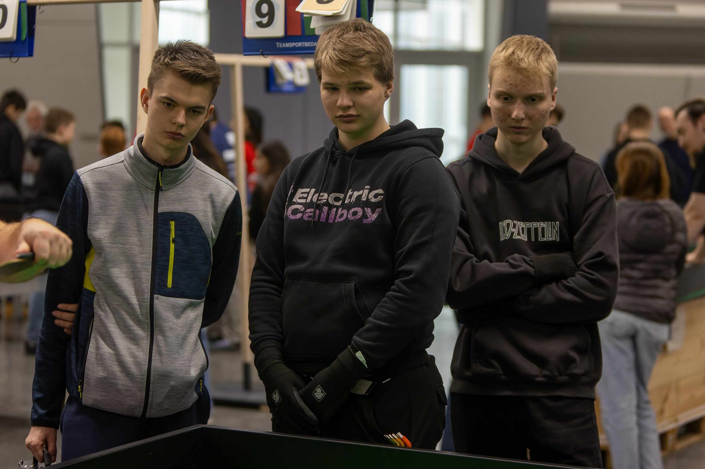

## Members & Roles

*What are the names of the team members and their role(s)?*

1. Fabian Brune → Hardware/CAD-Design
2. Jurij Lenz → Hardware/Other
3. Mark Krause → Electronics/Software

## Meeting Frequency

*How often did your team meet?
(e.g. 90 minutes once per week or a day every weekend.)*

every day

## Meeting Place

*Where did you meet to work on your robot?
(e.g. a robotics room at school, at some other place, one of your homes, school library etc.)*

Robotics basement in school

## Start Date

*When did your team start working on this year's robot?*

we started developpement in early 2024

## Past Competitions

*Which RoboCupJunior competitions have you competed in and in which leagues?*

German Open 2025 - 1st  Soccer Open
    German Open 2025 - 1st  Technical Challenge Soccer Open
    South German Championship 2025 - 1st  Soccer Open
-
    World Championship 2024 - 8th  Soccer Open
    German Open 2024 - 1st  Soccer Open
    South German Championship 2024 - 1st  Soccer Open
-
    World Championship 2023 - 1st  Soccer Open
    German Open 2023 - 2nd  Soccer Open
    German Open 2023 - 1st  SuperTeam Soccer Open
    South German Championship 2023 - 2nd  Soccer Open
-
    European Championship 2022 - 2nd  Soccer LightWeight
    German Open 2022 - 2nd  Soccer LightWeight

## Mentor Contribution

*Which parts of your work received the most contribution from your mentor?*

Managing registration , Organizing the Flights/Hotels

## Workload Management

*How did you manage the workload?*

We communicate irl, and over whatsapp. We have no scheduled meetings, its a steady progress

## AI Tools

*Which AI tools did you use?*

Simple but repetetive coding tasks, very complex precoding tasks

## Robot1 Overall

*Robot 1 Overall View*

## Robot1 Front

*Robot 1 Front view*

## Robot1 Back

*Robot 1 Back view*

## Robot1 Top

*Robot 1 Top View*

## Robot1 Bottom

*Robot 1 Bottom View*

## Robot1 Right

*Robot 1 Right View*

## Robot1 Left

*Robot 1 Left View*

## Positioning & Movement

*How do you find your position inside the field and how do you use that position to move your robots around?*

We have upgraded from a 4-LiDAR system to a far more
efficient 360° LiDAR, which has already delivered remarkable added value.

## Robot2 Overall

*Robot 2 Overall View*

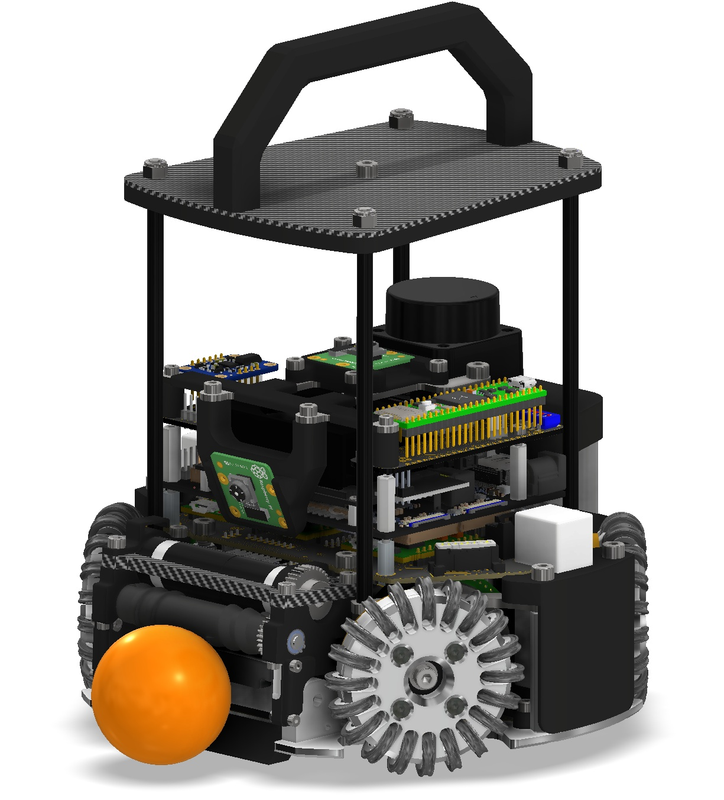

## Robot2 Front

*Robot 2 Front view*

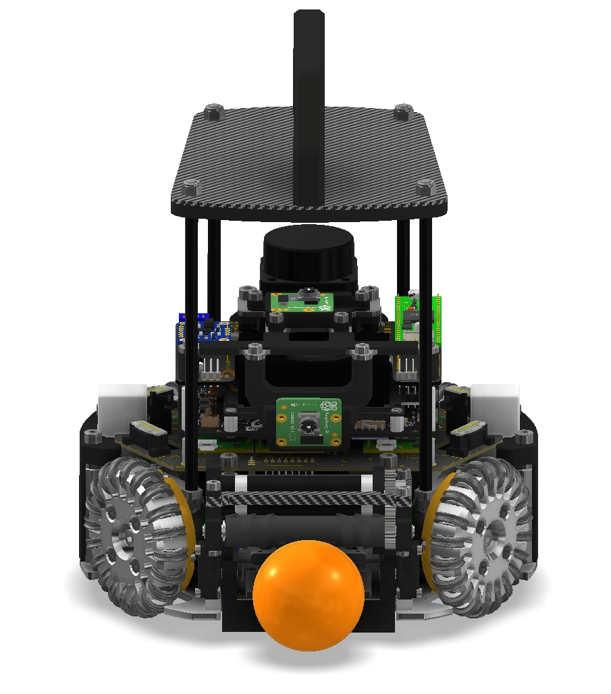

## Robot2 Back

*Robot 2 Back view*

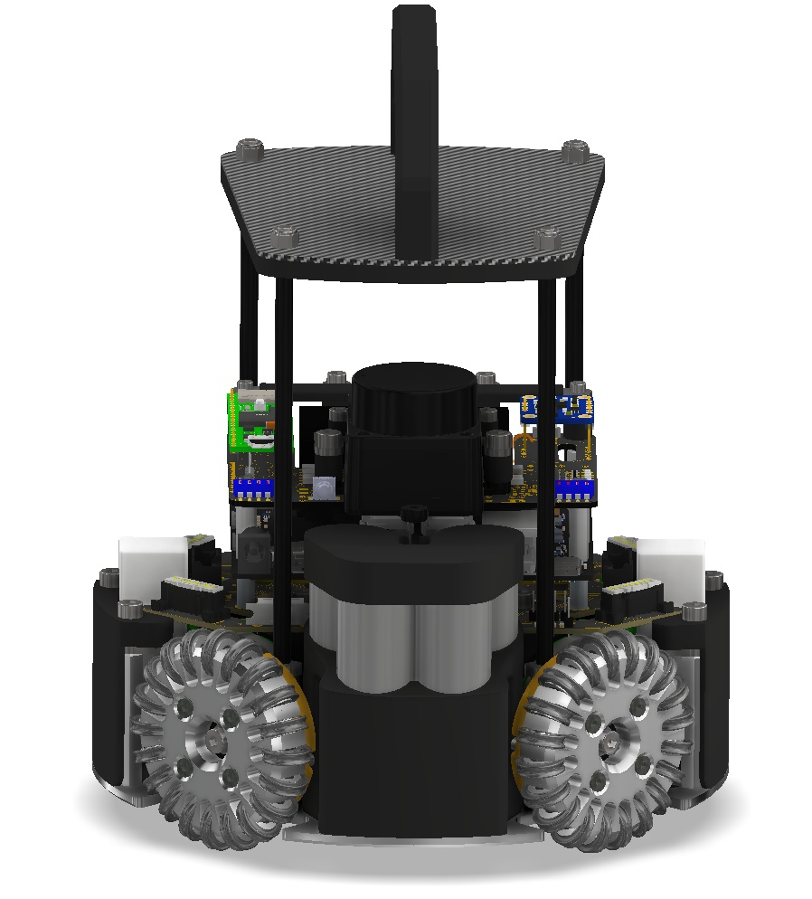

## Robot2 Top

*Robot 2 Top View*

## Robot2 Bottom

*Robot 2 Bottom View*

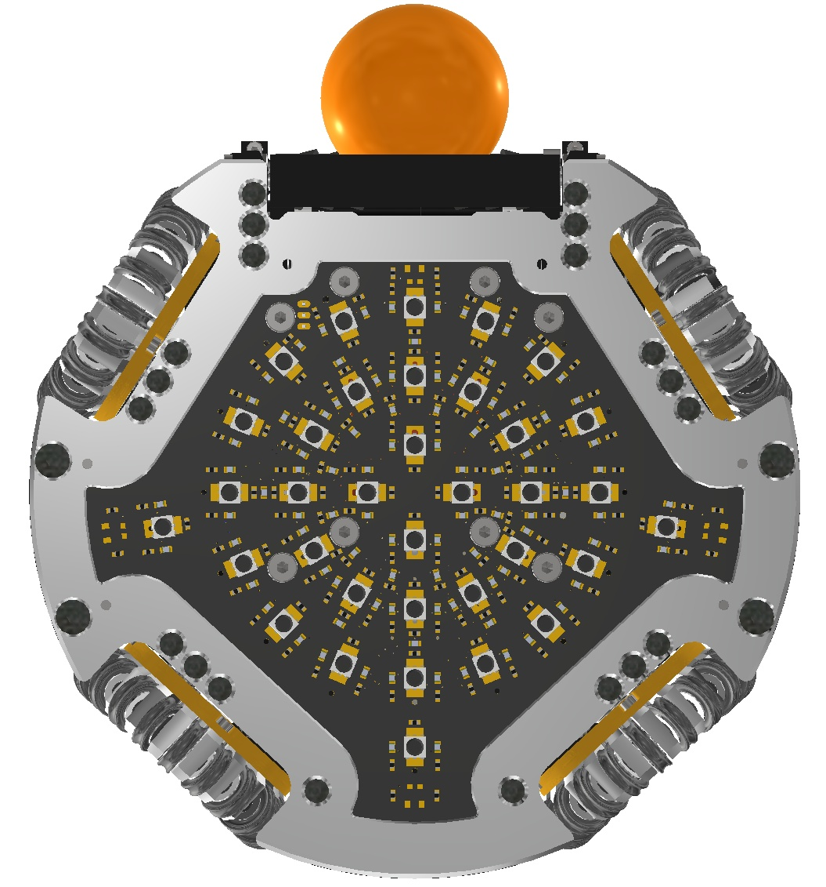

## Robot2 Right

*Robot 2 Right View*

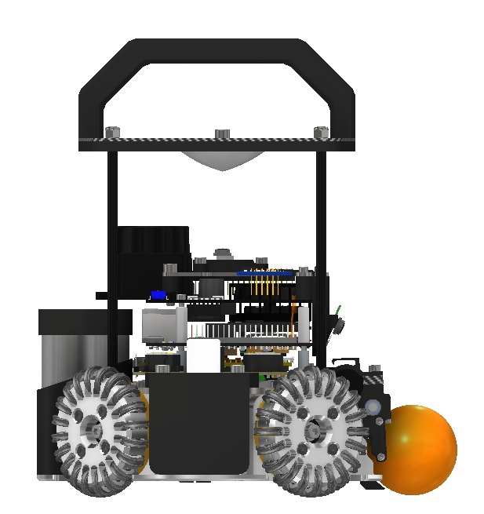

## Robot2 Left

*Robot 2 Left View*

## Mechanical Design

*How did you design the mechanical parts of your robots?*

The design of the robot has undergone a substantial transformation compared to
last year. Instead of the previous four DC motors, we now feature four 45W brush-
less motors, each integrated with a gear reduction mechanism that overlaps the
wheel. Additionally, the kicker and dribbler have been significantly improved. We
now utilize a vertical kicker and an optimized dribbler, also powered by brushless
motors. In addition, we have upgraded from a 4-LiDAR system to a far more
efficient 360° LiDAR, which has already delivered remarkable added value.
We are currently using Autodesk Inventor 2025

## Build Method

*How did you build your design?*

The manufacturing process of our robot is a complex and iterative journey that
begins with the design phase and culminates in the assembly of the final product.
Figure 20: Milling Process Cross Wheels Figure 21: Milling Process Bearing Block
The manufacturing of the robot involves several steps. First, the individual parts
are designed and drawn using Autodesk Inventor. Next, we decide how and where
we would like to manufacture our parts. For milled components, we have sponsors
such as the IHK Academy Schwaben, Multivac, and Blech und Technik, which have
the capacity to mill, edge, or laser high-complexity parts for us. Before we mill
the parts we start with a 3D print of the part. This allows us to check if the part
fits and works as intended. If everything is working as intended we start with the milling process.
The parts are then assembled and tested. If necessary, we make adjustments to
optimize performance. If the parts were not sponsored, we would have to buy the
parts. This would be very expensive and time-consuming. We are very grateful to
our sponsors because they realized our project and succes.

## Motors & Reason

*How many motors have you used and why?*

Our motor is a 45W model from the Maxon EC series, known for its exceptional
balance of size, speed, and torque—ideal for our application. The motor is con-
figured by us with an 3/1 reduction ratio, converting high speeds into sufficient
thrust, even under heavy resistance. To maintain consistent RPM performance,
our motors are equipped with Hall sensors, providing extensive programming op-
tions that enable the robot to execute precise and specialized maneuvers. 
Our wheels are precision-milled from aluminum, as are many other components
of the robot. This ensures an optimal blend of weight, precision, and durability.
Each wheel consists of five elements: the base, the gear unit, the cross
wheels with pins, the lid preventing cross wheels to fall out and the bearing inside the wheel. The body is constructed from aluminum plates, each featuring
a central hole with a fit and a recess for the cross wheels on the outside. This
year, we chose X-rings over O-rings for the cross wheels, as they minimize friction
significantly. The X-rings are mounted over a precisely turned aluminum part and
remain in place thanks to their elastic properties. We are using 4 motors for movement.

## Kicker Design

*If your robot has a kicker, explain how you designed and built the mechanics of the kicker*

Our kicker functions similarly to a traditional solenoid, converting electrical energy
into kinetic energy via a magnetic field generated by a coil. The kinetic energy
is transferred to a plunger core, which strikes with significant force. The kicker
system includes two plunger cores: the upper core is dedicated to horizontal shots,
while the lower core is designed for vertical shots.

The vertical kicker has an plunger that moves the chipper blade radially to a
fixed point on the robot. This movement digs the chipper blade under the ball, imparting
a vertical impulse. The angle of the shot can be adjusted through software by
manipulating factors such as shot strength (see Kickerboard). On the hardware
side, this feature can be fine-tuned by altering the shape and tilt angle of the
chipper. For example, a steeper angle produces a higher trajectory, while a flatter
chipper shape results in a more compact flight path. Both the chipper and the
plunger cores are equipped with spring return mechanisms to ensure high shooting
frequency efficiency.

## Dribbler Design

*If your robot has a dribbler, explain how you designed and built the mechanics of the dribbler.*

The dribbler is a crucial component of our soccer-playing robots, enabling precise
ball control and ensuring the ball remains in contact with the robot while in motion.
The system consists of a rotating roller that imparts backward spin to the ball,
thereby stabilizing it and allowing controlled dribbling and passing maneuvers.
Our dribbler system has undergone multiple iterations to enhance performance.
The latest design incorporates: Optimized Roller Material: High-friction rubber
ensures maximum grip on the ball. Independent Dribbling Motor: A high-torque
brushless motor provides precise control over the roller speed. Spring-loaded Mech-
anism: Allows adaptive pressure on the ball, reducing impact forces and enhancing
stability. A key focus has been on optimizing the interplay between hardware and
software to maximize efficiency on the field. The dribbler control algorithm dy-
namically adjusts the roller speed based on ball position and movement direction,
ensuring stable control during high-speed maneuvers. The advancements in our
dribbler system significantly contribute to the overall performance of our robots,
allowing for seamless ball control, precise passes, and accurate shots.

## CAD Files

*CAD design files*

https://technulgy.com/#/publications

## Mechanical Innovation

*Mechanical Innovation*

We are most proud of all the milled parts, especially the wheels on our robot.
For further information, please consult our original self-written TDP, or in the wheels section above.

## Mechanical Photos

*Photos of your mechanical designs highlights*

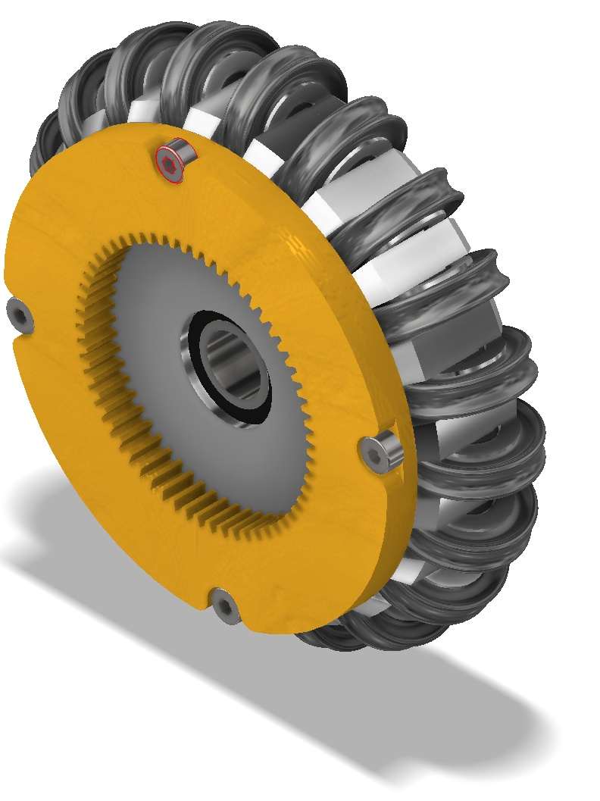
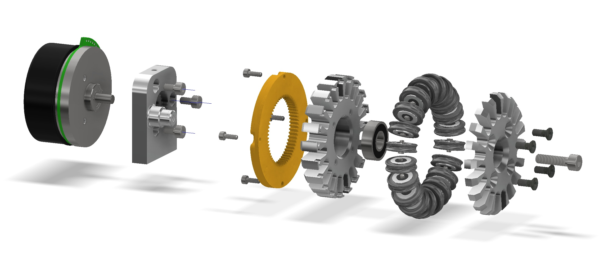
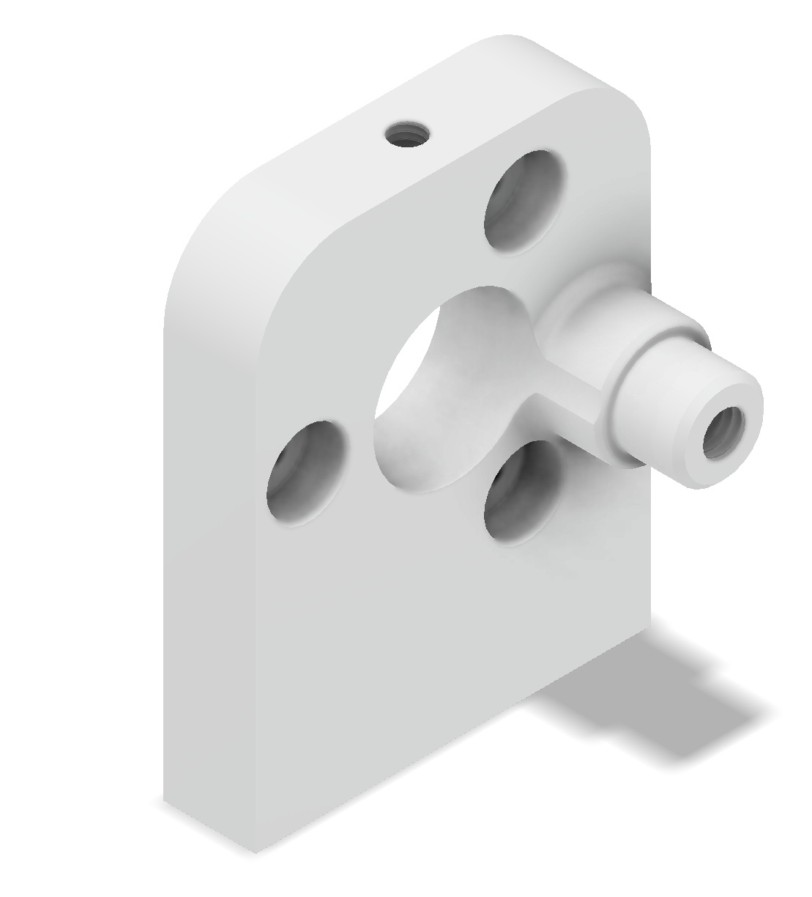

## Electronics Block Diagram

*Provide us with a block diagram of your robot's electronics*

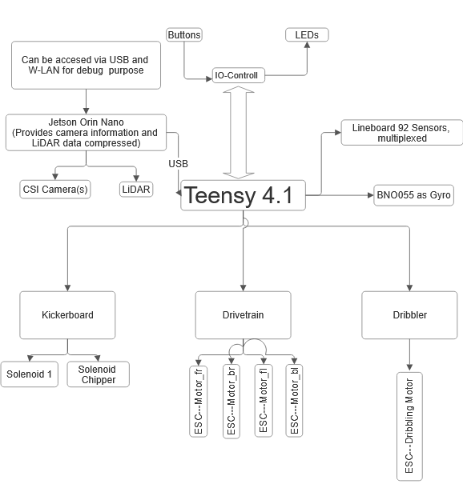

## Power Circuit

*How does your power circuits work?*

Our robot is powered by a custom Li-ion battery pack that supplies a nominal voltage between 14.4 V and 16.8 V. This input is regulated down using SMD buck converters to generate three stable voltage rails: 12 V, 5 V, and 3.3 V. These are distributed to all subsystems via the Powerboard, ensuring efficient and reliable power delivery across the robot.

## Motor Drive Circuit

*How do you drive your motors? Explain the circuits you use for that*

We use Maxon brushless motors (50 W EC series) with integrated Hall sensors for feedback. Each motor is driven by a dedicated Maxon ESC (Electronic Speed Controller), which is mounted on the Powerboard. These ESCs regulate motor speed and direction based on control signals from the Teensy microcontroller.

## Microcontroller & Reason

*What kind of micro controller or board do you use for your robot? Why did you decide to use this part for your robot? If you have more than 1 processor, explain each one separately.*

We use two processors:

    The Teensy 4.1, a 600 MHz ARM Cortex-M7 microcontroller, is responsible for low-level control such as motor actuation, sensor data processing, and real-time decision-making. Its high performance and compact form factor make it ideal for robotics applications.

    The NVIDIA Jetson Orin Nano serves as the high-level compute unit, handling object detection, camera input, and LiDAR data processing. We selected it due to its GPU acceleration, CUDA support, and ability to run parallelized computer vision pipelines.

## Ball Detection

*How does your ball detection sensors and/or camera[s] work?*

We use a camera connected to the Jetson Orin Nano for object detection. Frames are converted from BGR to HSV, and color thresholding is applied to isolate orange (ball), yellow (goal), and blue (goal). Morphological operations clean the image before cv2.findContours() locates objects. Detection runs in parallel threads for low latency and high reliability.

## Line Detection

*How does your line detection circuits work?*

Line detection is handled by the Lineboard, which uses multiple phototransistors to sense reflected light from the field. These signals are multiplexed and interpreted to determine the robot’s position relative to the white field lines.

## Navigation/Position Sensors

*What sensors do you use for navigation and how are these sensors connected to your processor? What sensors do you use to find your position in the field? What about the direction your robot faces?*

We use the following sensors for navigation and localization:

    360° LiDAR (connected to Jetson Orin Nano) for obstacle detection and field mapping.

    Phototransistors (on the Lineboard) to detect field boundaries.

    BNO055 gyroscope (connected to the Teensy) for orientation.

All sensor data is processed in real time and fused for consistent navigation.

## Kicker Circuit

*How do you drive your kicker system? How does the circuit make the kicker work?*

The Kickerboard connects directly to the Powerboard and controls two solenoids (horizontal and vertical kicker). Two 3S LiPo batteries and a step up converter boost the voltage to ~42 V, stored in large capacitors. A MOSFET + MOSFET driver circuit releases this energy to fire the solenoids. Kick strength is modulated by adjusting the on-time of the signal.

## Dribbler Circuit

*How does your dribbler system work? What components and circuits did you use to drive it?*

The dribbler uses a high-torque brushless motor driving a rubber-coated roller. A spring-loaded mechanism applies adaptive pressure on the ball. The motor is controlled via ESC and software logic running on the Teensy, which dynamically adjusts speed based on ball position and movement direction.

## Schematics

*Schematics of your robot*

[https://drive.google.com/open?id=1NsC7UIzKnBpAD63_xAj9Ly9J9hBeb8ik](https://drive.google.com/open?id=1NsC7UIzKnBpAD63_xAj9Ly9J9hBeb8ik)
[https://drive.google.com/open?id=1tYtQX5ZdapASyNt-mV8vYpXF2dBoPeNv](https://drive.google.com/open?id=1tYtQX5ZdapASyNt-mV8vYpXF2dBoPeNv)
[https://drive.google.com/open?id=12bR-ki7DZigWsaHGOyGUd6Nv6kNOtq6a](https://drive.google.com/open?id=12bR-ki7DZigWsaHGOyGUd6Nv6kNOtq6a)
[https://drive.google.com/open?id=1qz7MkHHkbofB3siKakOF4qpKPPwadgA2](https://drive.google.com/open?id=1qz7MkHHkbofB3siKakOF4qpKPPwadgA2)
[https://drive.google.com/open?id=1Jcy4VcLTN35FOTUg8oIaTYPEjIkq4Zkr](https://drive.google.com/open?id=1Jcy4VcLTN35FOTUg8oIaTYPEjIkq4Zkr)

## PCB

*PCB of your robot*

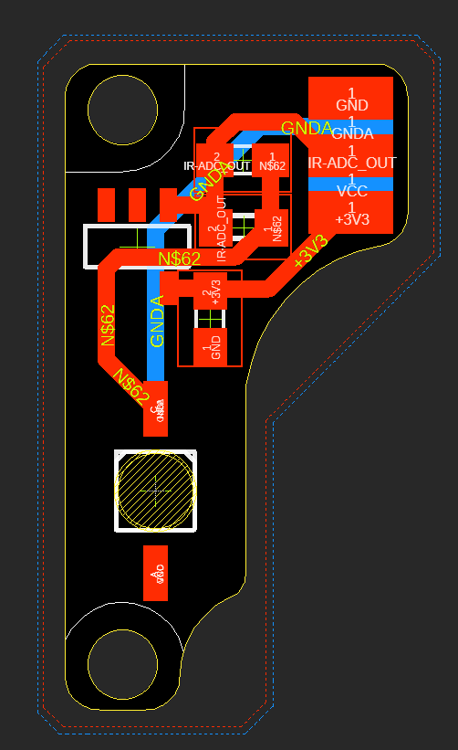
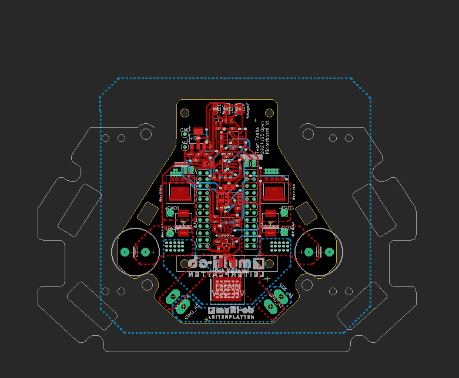

## Innovation

*Innovations*

We are particularly proud of the modular PCB system, which includes the Powerboard, Kickerboard, Lineboard, and Teensyboard. Each board is compact, reliable, and purpose-specific. All boards were custom-designed in Eagle, soldered by hand, and iteratively improved. This modularity allows quick diagnostics, maintenance, and upgrades.

## Circuit Photos

*Photo of your circuit boards highlights*

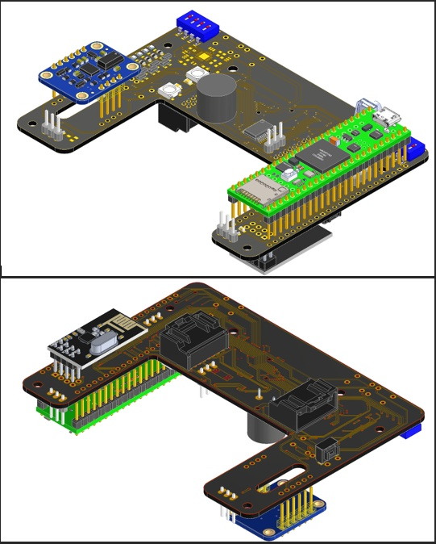
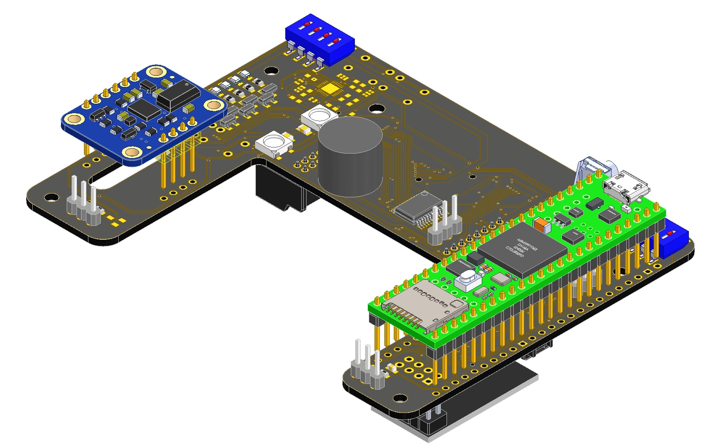
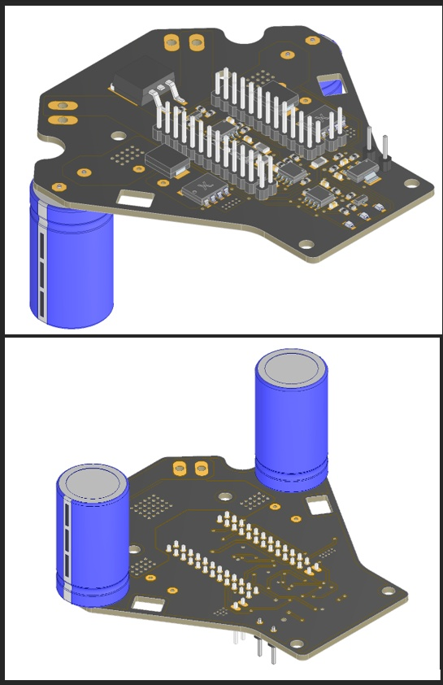
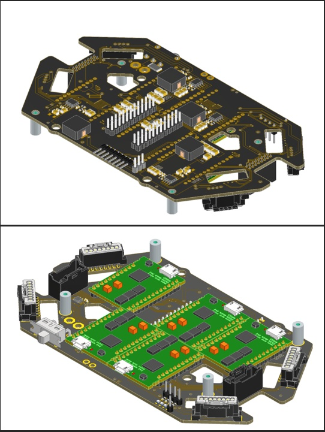

## Motor Control

*How do you use your processor to move your motors?*

The Teensy 4.1 sends PWM control signals to the ESCs, which in turn drive the brushless motors. Feedback from Hall sensors allows for precise closed-loop control, enabling accurate movement and trajectory execution.

## Ball Detection Method

*How do you find where the ball is? How do you read the data from the ball detection sensors or camera?*

The ball is detected using the camera on the Jetson Orin Nano. Frames are processed in HSV color space, and contours are extracted to determine position and size. The largest contour matching the orange color profile is selected as the ball. This data is transmitted to the Teensy for decision-making.

## Ball Catch Algorithm

*How does your algorithm work to catch the ball? Is there a difference between your robots in how they move towards the ball? Explain the differences.*

Our algorithm uses a simplified version of RRT-inspired tangent-based path planning. The robot calculates an intercept trajectory with controlled curvature, always approaching the ball from behind. This ensures reliable captures. All robots follow the same logic, though movement profiles may differ slightly due to individual calibration.

## Line Algorithm

*How does your robot find the lines to stay inside the field? What algorithms do you use to avoid going out of bounds?*

Line sensors detect white boundary lines. If a forbidden zone is approached, the robot blocks movement in that direction and accelerates away. The system considers robot pose, ball position, goal location, and line sensor data to make escape decisions.

## Goal Algorithm

*What algorithms do you use to score goals? How do you use your kicker and dribbler to handle the ball?*

Goal scoring uses camera input to identify goal positions. A PID controller aligns the robot by rotating eccentrically around the ball, keeping the goal in line. Once aligned, the kicker is triggered. The dribbler maintains ball control during positioning.

## Defense Algorithm

*What algorithms do you use to avoid the opponent team scoring? How do your robots defend your own goal?*

If one Robot does not see the ball, it locates itself with the LiDAR sensor, and drives back to a predefinitioned coordinate on the field, right in front of the goal.

## Robot Communication

*Do your robots communicate with each other? How do you use this communication to your advantage?*

Yes. Robots use NRF24L01+ transceivers for wireless communication, managed by the Teensy. This enables coordination between units, e.g., for multi-robot strategies

## Innovation2

*Innovations*

We are particularly proud of the object detection pipeline using OpenCV and CUDA on the Jetson Orin Nano. Each object is detected in parallel threads, significantly reducing latency and increasing reliability. This modular, multithreaded system enables real-time tracking and precise field awareness, which are key to competitive performance.

## GitHub Link

*GitHub link*

https://technulgy.com/#/publications

## BOM

*Bill of Materials (BOM)*

[https://drive.google.com/open?id=1SG2fJPFJaQMfl27uvOi0LPEECIVKfRsv](https://drive.google.com/open?id=1SG2fJPFJaQMfl27uvOi0LPEECIVKfRsv)

## Cost

*How much did it cost you to build your robots?*

Robots: 2785.90€ each
Experiments: 1500€
Environment: 400€

## Funding

*How did you gathered the funds to build the robots?*

10% sponsors
90% school

## Affordability

*How affordable was it to compete in RoboCupJunior Soccer?*

5

## Answer Check

*Have you checked all of your answers?*

Yes!

## Publication Consent

*We publish TDPs and posters during or after the competition as described in the beginning*

Yes, we acknowledge everything submitted in the above form can be published.

## Email Address

*Email Address*

einsschlingel@gmail.com

## TDP File

*TDP File Upload (Not required)*

## Extra Column

*Column 67*

