## Timestamp

*Timestamp*

7/5/2025 23:03:27

## Team Name

*What is your team's name?*

UGAMM-SOCCER

## League

*What league do you participate in?*

Lightweight League

## Country

*Where are you from?*

Macau, China

## Contact

*If other teams have questions about your robot, now or in the future, what email address(es) can we publish along with this document for people to reach you?

(You can put in multiple email addresses, like multiple team members, an email for the whole team or both. Feel free to share other ways of communication like Discord handles)*

pun0804@gmail.com
emmrcjlight@gmail.com

## Social Media

*Team Social Media Links (if you have any)*

www.youtube.com/@emmrcjlight

## Team Photo

*Upload a photo of your whole team with your mentor and robots

Note: This is not mandatory and will be published along with your TDP if you choose to upload something*

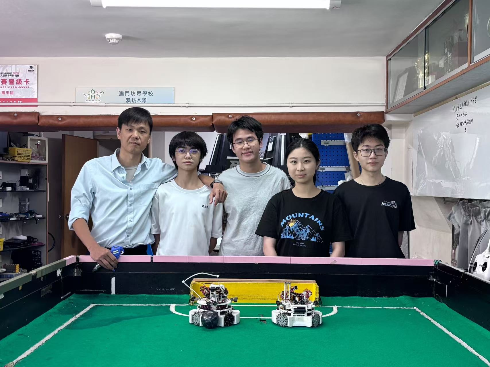

## Members & Roles

*What are the names of the team members and their role(s)?*

Wong Pak Hang: circuit and software
Cheong Iok Chi: hardware and 3d printer
Pun Chon Lam Ivan: harware and camera

## Meeting Frequency

*How often did your team meet?
(e.g. 90 minutes once per week or a day every weekend.)*

workdays: 6 hours per day ; Holidays: 8 hours per day

## Meeting Place

*Where did you meet to work on your robot?
(e.g. a robotics room at school, at some other place, one of your homes, school library etc.)*

a robotics room at school

## Start Date

*When did your team start working on this year's robot?*

I've been preparing for this year's tournament since the end of last year's Worlds.

## Past Competitions

*Which RoboCupJunior competitions have you competed in and in which leagues?*

RCJ2024--Netherlands: Lightweight League
RCJ2023--France: Lightweight League
china open 2025:  Lightweight League
china open 2024:  Lightweight League
china open 2023:  Lightweight League

## Mentor Contribution

*Which parts of your work received the most contribution from your mentor?*

We couldn't solve the problem with the camera's inspection gantry, and our mentor helped us fix the program code and develop a new camera (maixcam) together!

## Workload Management

*How did you manage the workload?*

We communicated through a instagram group and assigned the tasks using Wechat.
We also used GitHub for issues and code.And during our daily robotics training, our team meets every few days to discuss any difficulties encountered when dividing up the work so that problems can be solved successfully.

## AI Tools

*Which AI tools did you use?*

We used Deepseek and Chatgpt for camera data analysis, even Notebook and Poster suggestions! We can quickly pass the data from the camera to deepseek, which eliminates the need for GeoGebra calculations and saves a lot of time. For the hardware design, we also used artificial intelligence to analyze the strengths and weaknesses of the design. We then optimize the design according to the suggestions given.

## Robot1 Overall

*Robot 1 Overall View*

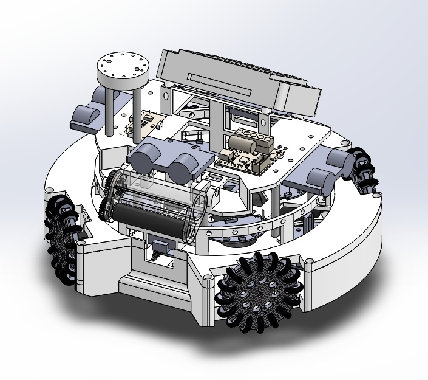

## Robot1 Front

*Robot 1 Front view*

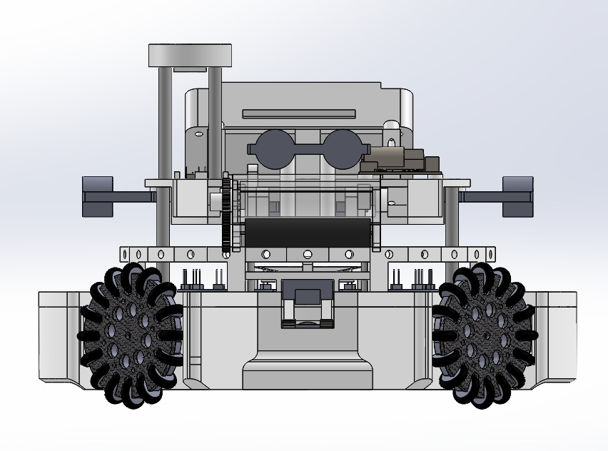

## Robot1 Back

*Robot 1 Back view*

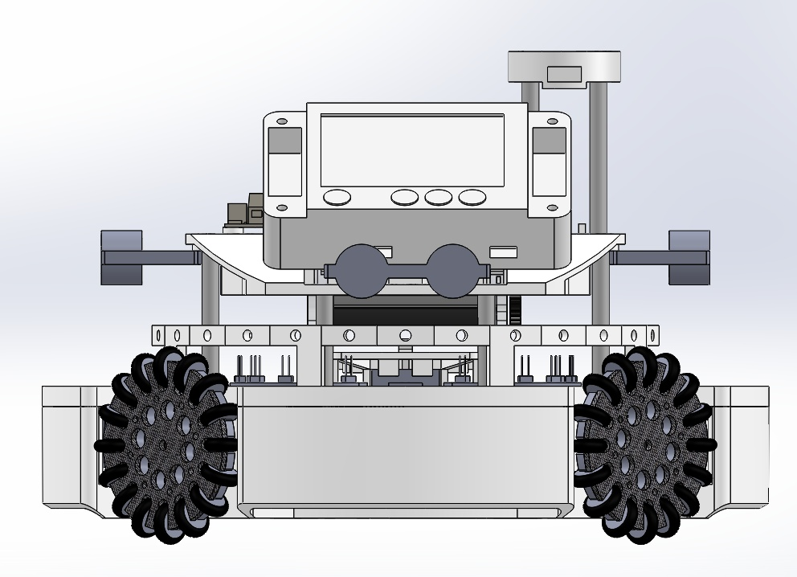

## Robot1 Top

*Robot 1 Top View*

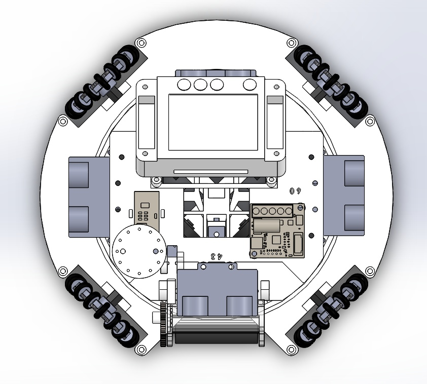

## Robot1 Bottom

*Robot 1 Bottom View*

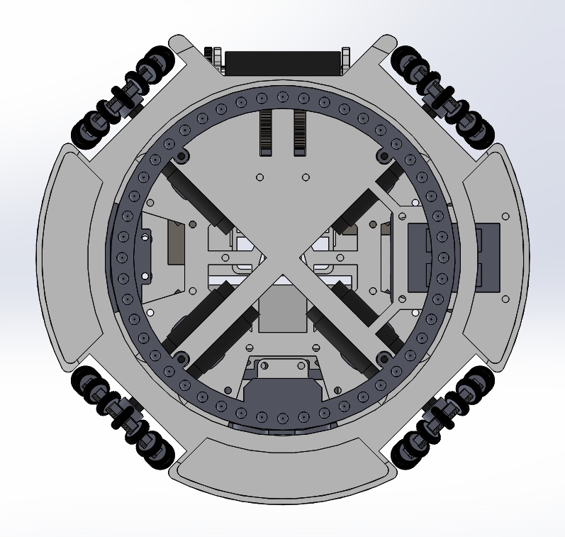

## Robot1 Right

*Robot 1 Right View*

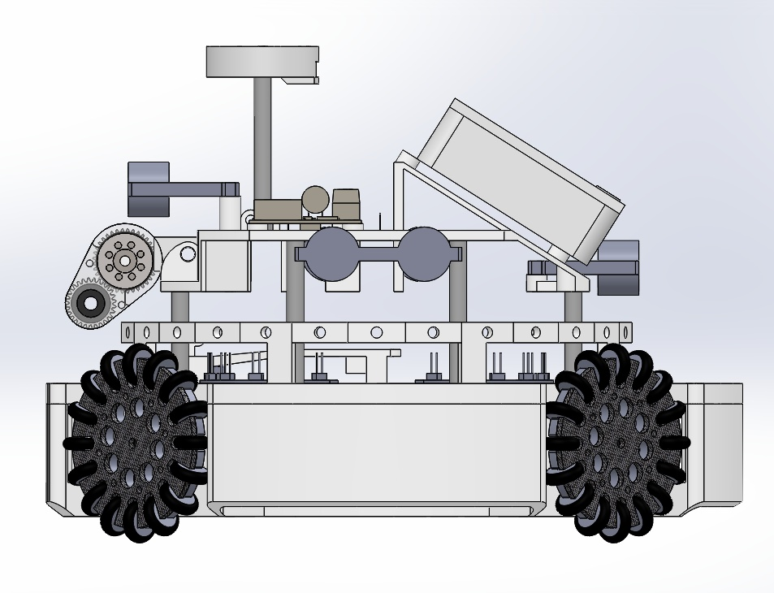

## Robot1 Left

*Robot 1 Left View*

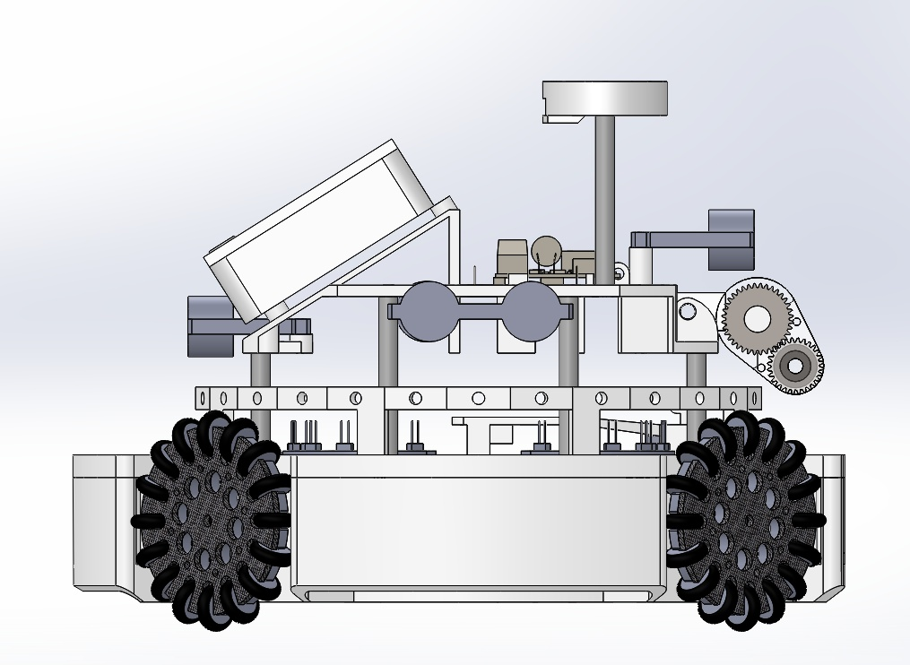

## Positioning & Movement

*How do you find your position inside the field and how do you use that position to move your robots around?*

We installed four ultrasonic detections on the robot, which was used to detect the walls around the field in order to determine the position of the robot itself on the field.We use ultrasound to move the robot, e.g., in the opposite direction when the robot detects that it is too close to a wall.

## Robot2 Overall

*Robot 2 Overall View*

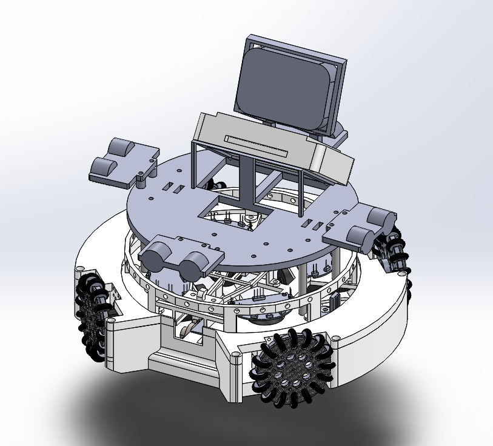

## Robot2 Front

*Robot 2 Front view*

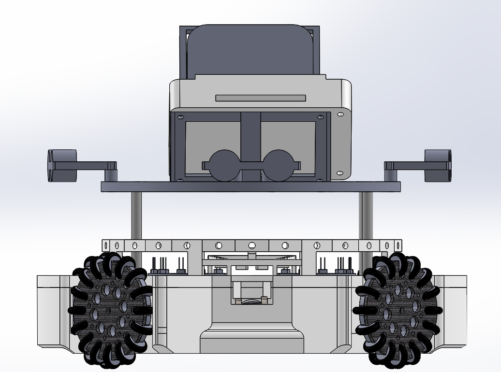

## Robot2 Back

*Robot 2 Back view*

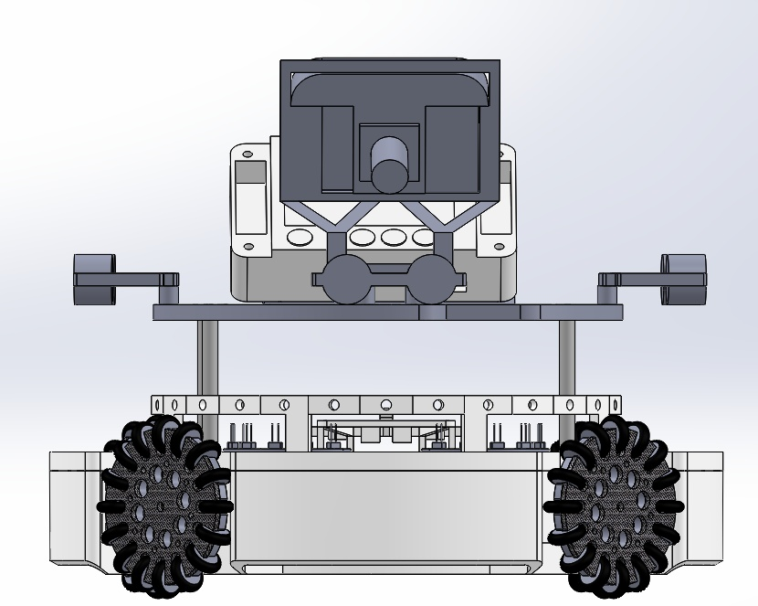

## Robot2 Top

*Robot 2 Top View*

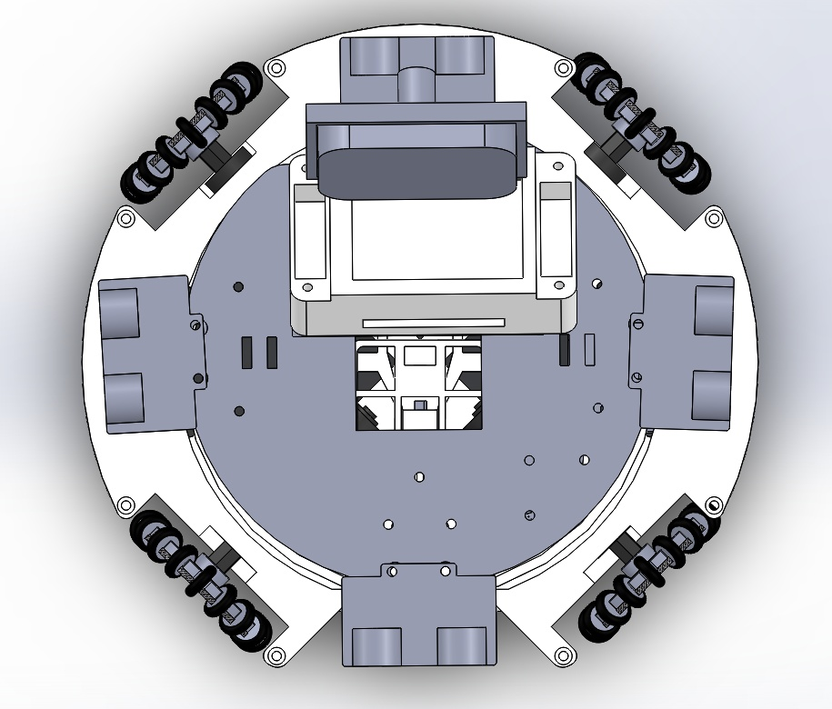

## Robot2 Bottom

*Robot 2 Bottom View*

## Robot2 Right

*Robot 2 Right View*

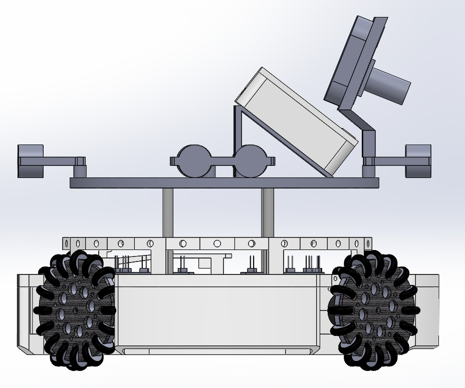

## Robot2 Left

*Robot 2 Left View*

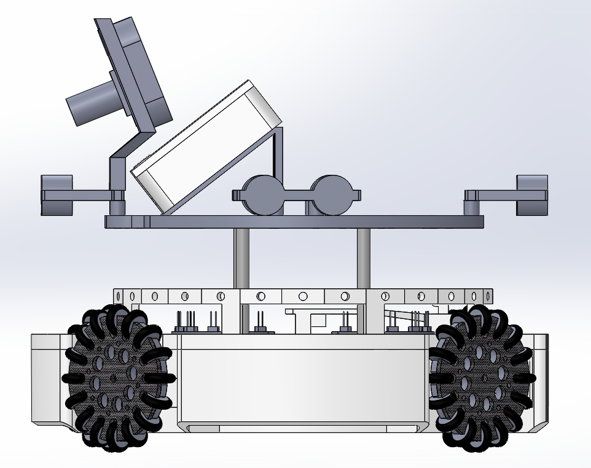

## Mechanical Design

*How did you design the mechanical parts of your robots?*

We will be designing our offensive and defensive robots with the goal of kicking a soccer ball into the opposing team's goal and stopping the opposing team from attacking outside of our own goal as a way to improve the performance of our robots. We have designed our robot considering the weight of the robot and the assembly of the disk ball and kicker. For better design, we use solidwork to draw and 3D printing( Bambu Lab X1 Printer)to improve efficiency. The bottom, middle and top of our robot are all 3D printed, which greatly improves the unity of our robot.

## Build Method

*How did you build your design?*

We will use the dimensions of the soccer ball, the field and the gantry as a reference for the design of the mechanical part of our robot. First, we use SOLDWORDS to draw the 3D design of the robot, then we print out (Bambu Lab X1 Printer) the parts one by one. Our four motors are made by Faulhaber (12v 750rpm), IR sensors and Ultrasound sensor  are made by Zhongming, camera is made by maixcam, motor governor is made by Sunbond, batteries are made by Shang yi (3s 11.1v 1500mAh), and the rest, such as the line sensor, are handmade.

## Motors & Reason

*How many motors have you used and why?*

We use four motors to drive the handmade universal wheel, so that the robot can carry out the front and back of the left and right movement, rotation, panning and other actions.
3D printer(Bambu Lab X1 Printer), motors are made by Faulhaber (12v 750rpm),  IR sensors and Ultrasound sensors  are made by Zhongming, camera is made by maixcam, motor governor is made by Sunbond, batteries are made by Shang yi (3s 11.1v 1500mAh), main controller (joinMax Digital  x4-RCU) made by JoinMax.

## Kicker Design

*If your robot has a kicker, explain how you designed and built the mechanics of the kicker*

Use the motor to drive the incomplete gear to drive the rack and pinion slide to move backward and empty the ball-eating position, when the incomplete gear disengages from the rack and pinion, use the tension of the rubber band to make the slide move forward to kick the ball out

## Dribbler Design

*If your robot has a dribbler, explain how you designed and built the mechanics of the dribbler.*

We first assembled two small cylinders with gears so that they can operate synchronously, and then drive them with brushless motors to make them rotate rapidly in opposite directions, so that the soccer ball can be fixed in the robot's disk within the scope of the ball, waiting for the right time to attack.

## CAD Files

*CAD design files*

https://github.com/ichi123007/ugamm-soccer.git

## Mechanical Innovation

*Mechanical Innovation*

What we're most proud of is the camera. This camera is made by maixcam company, we used MaixHub: Online AI model training platform, no need for AI knowledge and expensive training equipment, one-click model training, one-click deployment to MaixCAM.Combined with artificial intelligence, we can quickly and accurately lock the gantry, which solves the problem of our defenders getting into the penalty box, and allows the attackers to shoot more accurately into the gantry.

## Mechanical Photos

*Photos of your mechanical designs highlights*

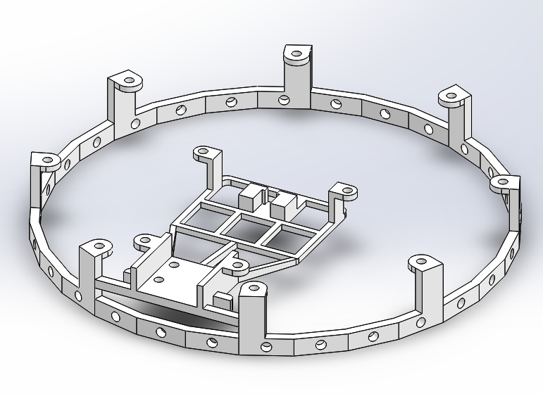
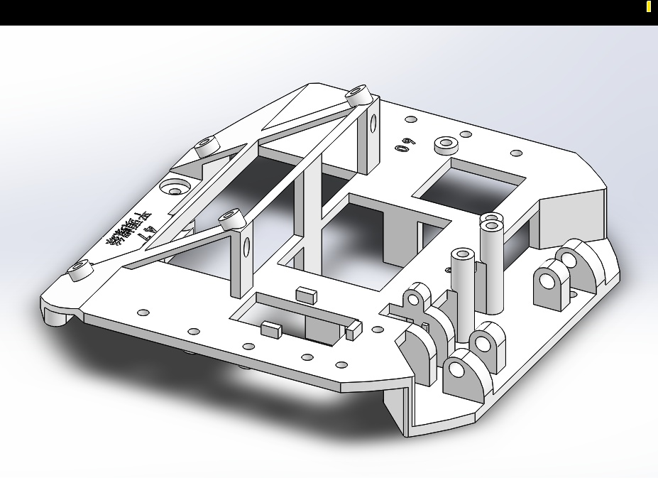
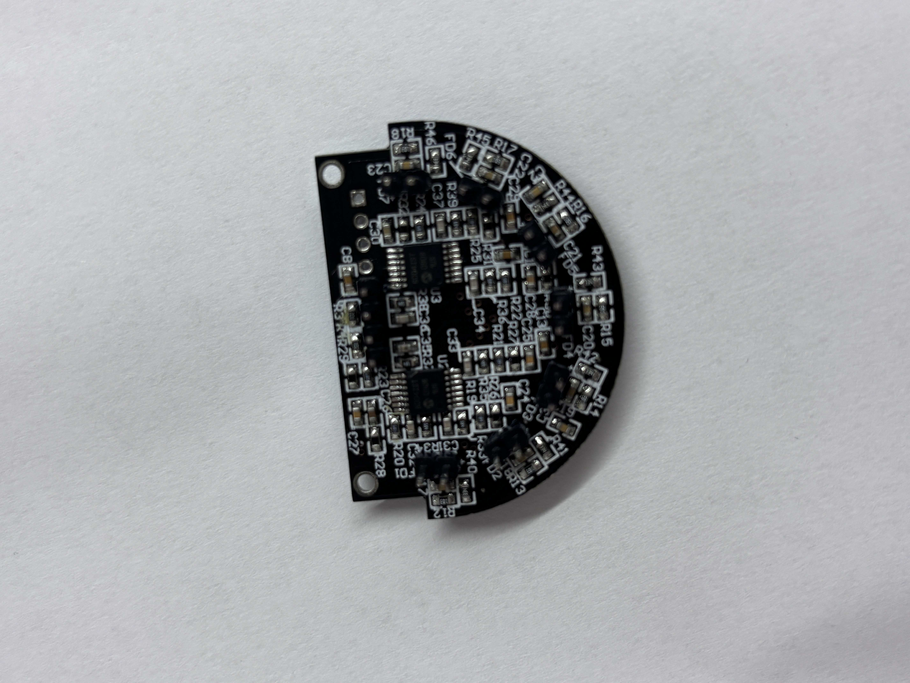
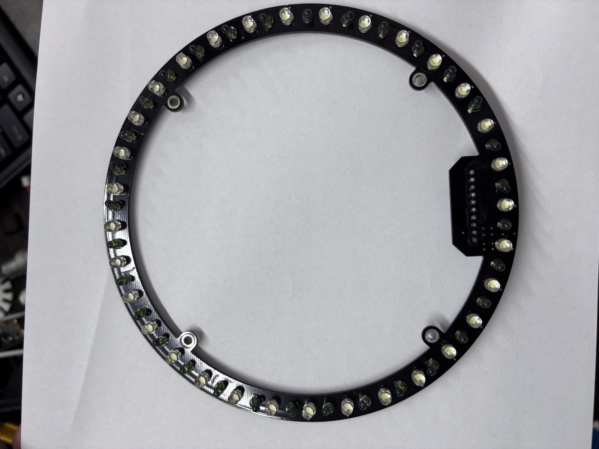

## Electronics Block Diagram

*Provide us with a block diagram of your robot's electronics*

[https://drive.google.com/open?id=10OhfRg5ifgz-cycYh2RF94-mI8yvJPfh](https://drive.google.com/open?id=10OhfRg5ifgz-cycYh2RF94-mI8yvJPfh)

## Power Circuit

*How does your power circuits work?*

Our robots are equipped with a 12V battery pack, direct connection to RCU, direct connection to motor drive board for motor use (robot movement), direct connection to motor drive board for motor use (Dribbler), direct connection to kick motor, direct connection to kick relay.

## Motor Drive Circuit

*How do you drive your motors? Explain the circuits you use for that*

Connect the motors to the RCU and download the program to the RCU to make it drive the motors.

## Microcontroller & Reason

*What kind of micro controller or board do you use for your robot? Why did you decide to use this part for your robot? If you have more than 1 processor, explain each one separately.*

We use JoinMax Digital JMP-BE-5144 (x4-RCU) as a controller for our robots, it support  bluetooth and CPU is Cortex-M4. It's programming language support C language and flow chart.

## Ball Detection

*How does your ball detection sensors and/or camera[s] work?*

When the ball detection sensors on the robot receive infrared light from the ball, the robot moves toward the ball to attack or defend.

## Line Detection

*How does your line detection circuits work?*

our robots used circular line. The Line Sensor board PCB features a ring-shaped design. The power supply is divided into 3.3V for LEDs and 5V for line sensors, effectively reducing heat generation. Additionally, aligning the pin headers with the main substrate facilitated a neat and organized wiring layout.

## Navigation/Position Sensors

*What sensors do you use for navigation and how are these sensors connected to your processor? What sensors do you use to find your position in the field? What about the direction your robot faces?*

We use sensors to detect how far away the robot is from the field divider, to confirm its position, and a compass to make sure the robot always faces the direction of the opponent's gantry. Sensors are connected to the robot controller. Line sensors can detect when robots go beyond the boundaries.

## Kicker Circuit

*How do you drive your kicker system? How does the circuit make the kicker work?*

Our kicker has two main components, the motor and the circuit board, which are connected to the controller on the robot.downloads the program to the controller so that the controller can drive the kicker.When the controller outputs high voltage, the kicker operates; when the controller outputs low voltage, the kicker stops operating.

## Dribbler Circuit

*How does your dribbler system work? What components and circuits did you use to drive it?*

Our dribbler has two main components, the motor and the circuit board, which are connected to the controller on the robot.downloads the program to the controller so that the controller can drive the dribbler.When the controller outputs high voltage, the dribbler operates; when the controller outputs low voltage, the dribbler stops operating.

## Schematics

*Schematics of your robot*

[https://drive.google.com/open?id=1thw2s12MZ9dze3rMGQUfPjXEFllB79qe](https://drive.google.com/open?id=1thw2s12MZ9dze3rMGQUfPjXEFllB79qe)

## PCB

*PCB of your robot*

## Innovation

*Innovations*

The part we are most proud of is our newly designed kicker this year, unlike previous years where the motor rotates and directly strikes the soccer ball to achieve the kicking effect, this year the rack is driven by an incomplete gear and the pulling force of the rubber band is used to achieve the kicker effect, and the slide is used to reduce the friction and to fix it with a smaller size to achieve the same direction of the kicker and the dribbler. Moreover, this year our compound eye adopts a new electronic structure, from fixed to connected, increasing the number of compound eyes the robot can carry, and with the new algorithm, the infrared detection of the soccer ball is more efficient and the positioning is more accurate.

## Circuit Photos

*Photo of your circuit boards highlights*

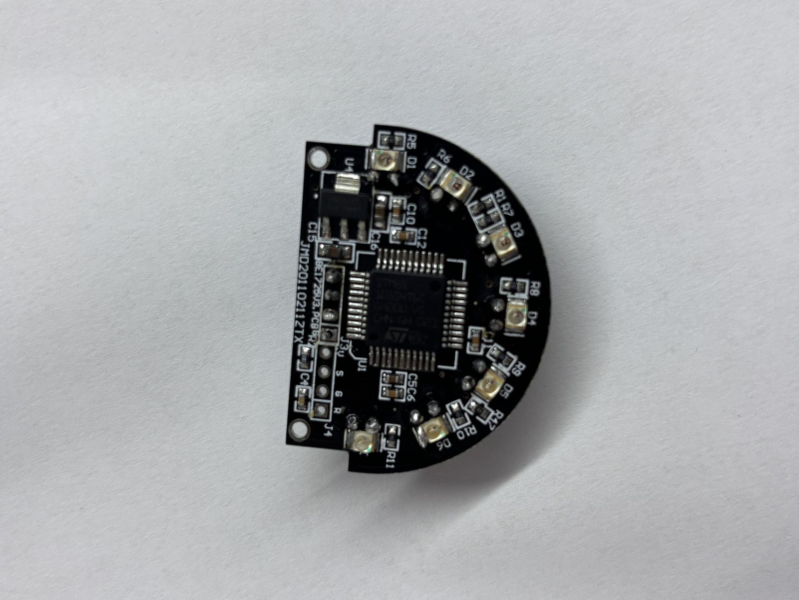

## Motor Control

*How do you use your processor to move your motors?*

The motor is connected to the processor on the robot and the program is downloaded to the processor so that it can drive the motor.

## Ball Detection Method

*How do you find where the ball is? How do you read the data from the ball detection sensors or camera?*

We use the IR sensors and the cameras in conjunction with each other to find the location of the soccer ball.

## Ball Catch Algorithm

*How does your algorithm work to catch the ball? Is there a difference between your robots in how they move towards the ball? Explain the differences.*

Attack
1. Use the ball chasing algorithm to chase the ball until the ball is in front of the robot.
2. When the ball is in front of the robot, move towards the ball and catch it. 
Defense
1. Calculate the two directions of movement of the penalty area line in grayscale.
2. Use the angle of the ball obtained from the compound eye to determine the direction of movement of the robot, and block the opponent's robot's path to the ball.

## Line Algorithm

*How does your robot find the lines to stay inside the field? What algorithms do you use to avoid going out of bounds?*

Coordinate positioning using ultrasound, compass, grayscale detect white lines using grayscale, calculate the direction of white lines and move in the opposite direction.

## Goal Algorithm

*What algorithms do you use to score goals? How do you use your kicker and dribbler to handle the ball?*

When the robot receives the ball, it uses the coordinates to calculate the direction of the push to move the ball towards the goal.

## Defense Algorithm

*What algorithms do you use to avoid the opponent team scoring? How do your robots defend your own goal?*

Defense
1. Calculate the two directions of movement of the penalty area line in grayscale.
2. Use the angle of the ball obtained from the compound eye to determine the direction of movement of the robot and block the opponent's robot's path to the ball.

## Robot Communication

*Do your robots communicate with each other? How do you use this communication to your advantage?*

Our robots can communicate with each other via Bluetooth, which prevents our attacking robots from colliding with our defending robots and causing chaos.

## Innovation2

*Innovations*

This year, our defensive robot uses a new algorithm to ensure that it will not break away from the penalty area line when it moves on the line. Firstly, we split the moving direction of the defensive robot into x,y two directional variables, and the grayscale of the eight directions detects the white line as 1, otherwise it is 0, and together with the trigonometric function, we find out the x,y two directional variables to ensure that the line of the penalty area is underneath the center of the robot, and then through the collinear theorem, we find the direction of movement for the defensive robot to move on the line, so that the robot will not break away from the line when moving on the penalty area. After that, we use the collinear theorem to find out the direction of movement of the defense robot, so that the robot will not move away from the restricted area line. This algorithm greatly prevents the defense robot from entering the penalty area.

## GitHub Link

*GitHub link*

https://github.com/ichi123007/ugamm-soccer.git

## BOM

*Bill of Materials (BOM)*

[https://drive.google.com/open?id=15AOfnag3DhvsBWLYc3fkvkSxlh4q3hz-](https://drive.google.com/open?id=15AOfnag3DhvsBWLYc3fkvkSxlh4q3hz-)

## Cost

*How much did it cost you to build your robots?*

Robots (cost of components that are in your robots right now): 15000 MOP each
Experiments (failed builds, broken hardware etc.): 4000 MOP each
Environment (fields, balls, etc.) : 4000 MOP each
1 MOP= 0.13 USD

## Funding

*How did you gathered the funds to build the robots?*

30% government
40% school
30% parents

## Affordability

*How affordable was it to compete in RoboCupJunior Soccer?*

5

## Answer Check

*Have you checked all of your answers?*

Yes!

## Publication Consent

*We publish TDPs and posters during or after the competition as described in the beginning*

Yes, we acknowledge everything submitted in the above form can be published.

## Email Address

*Email Address*

cheongiokchi@gmail.com

## TDP File

*TDP File Upload (Not required)*

## Extra Column

*Column 67*

