## Timestamp

*Timestamp*

7/12/2025 14:29:48

## Team Name

*What is your team's name?*

VVS Ballers

## League

*What league do you participate in?*

Lightweight League

## Country

*Where are you from?*

India

## Contact

*If other teams have questions about your robot, now or in the future, what email address(es) can we publish along with this document for people to reach you?

(You can put in multiple email addresses, like multiple team members, an email for the whole team or both. Feel free to share other ways of communication like Discord handles)*

kushals@vasantvalley.edu.in, shlokk@vasantvalley.edu.in, akshajg@vasantvalley.edu.in, akshaj.gupta28@gmail.com

## Social Media

*Team Social Media Links (if you have any)*

N/A

## Team Photo

*Upload a photo of your whole team with your mentor and robots

Note: This is not mandatory and will be published along with your TDP if you choose to upload something*

## Members & Roles

*What are the names of the team members and their role(s)?*

Kushal Sachdeva: Innovator and Mechanical Engineer
Shlok Karthik:  Robot Designer and Mechanical Engineer
Akshaj Gupta: Lead Programmer

## Meeting Frequency

*How often did your team meet?
(e.g. 90 minutes once per week or a day every weekend.)*

We met for 4 to 5 hours every day. On weekdays we worked in our school’s robotics room, and on weekends we met at our mentor’s academy for longer build and testing sessions.

## Meeting Place

*Where did you meet to work on your robot?
(e.g. a robotics room at school, at some other place, one of your homes, school library etc.)*

We primarily met at our school during weekdays and used our mentor’s robotics lab during weekends. Both spaces provided access to LEGO kits, practice fields, tools, and a quiet environment for collaboration.

## Start Date

*When did your team start working on this year's robot?*

We began working on this year’s robots in November 2024. We started with research and brainstorming, then moved into building and testing soon after.

## Past Competitions

*Which RoboCupJunior competitions have you competed in and in which leagues?*

Robocup Junior Regionals North India 2022: Soccer Lightweight League
Robocup Junior Regionals North India 2023: Soccer Lightweight League
Robocup Junior  Regionals North India 2024: Soccer Lightweight League
Roboup Junior Nationals India 2023: Soccer Lightweight League
Roboup Junior Nationals India 2024: Soccer Lightweight League

## Mentor Contribution

*Which parts of your work received the most contribution from your mentor?*

Our mentor played a crucial role in helping us integrate and debug our sensors, especially the IR Seeker and compass. He helped us purchase and configure a sensor multiplexer and ensured that our readings were accurate and stable. He also assisted in connecting our communication modules to meet the 2025 RoboCup requirements and supported us with physical robot adjustments and late-night coding sessions. Most importantly, he provided constant encouragement, shared his experience from past competitions, and helped guide our thinking during design discussions.

## Workload Management

*How did you manage the workload?*

We communicated through a dedicated WhatsApp group where we shared updates, photos, videos, and tasks. We also had a second group that included our parents and mentor for logistical planning such as travel and documentation. For project management, we used  GitHub to collaborate on code and keep track of versions. Even when we couldn't meet in person, we ensured progress by sharing our daily work digitally and supporting each other through messages and calls.

## AI Tools

*Which AI tools did you use?*

We used ChatGPT’s deep research model to better understand our sensors’ functions and troubleshoot sensor issues. It helped us understand how to interpret IR and compass readings, avoid interference, and write more accurate movement algorithms. This helped us accelerate our learning and apply more advanced logic than we initially planned.

## Robot1 Overall

*Robot 1 Overall View*

## Robot1 Front

*Robot 1 Front view*

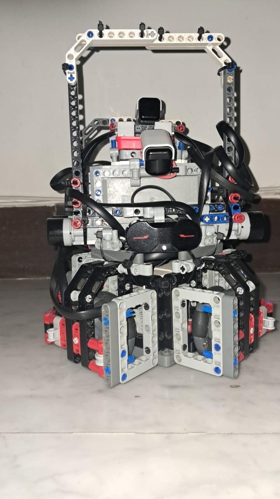

## Robot1 Back

*Robot 1 Back view*

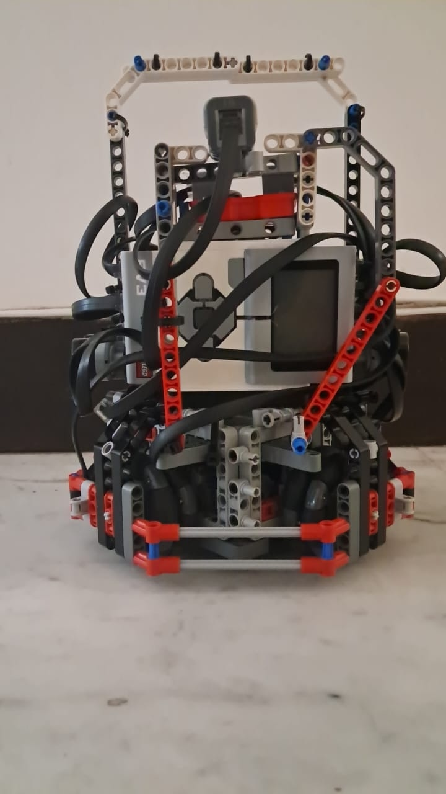

## Robot1 Top

*Robot 1 Top View*

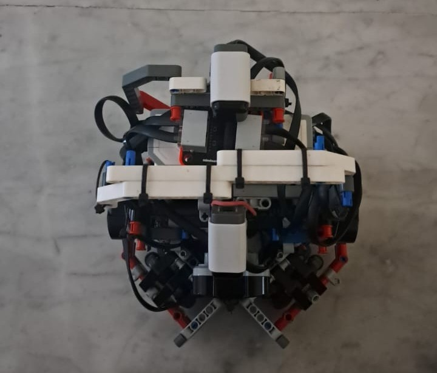

## Robot1 Bottom

*Robot 1 Bottom View*

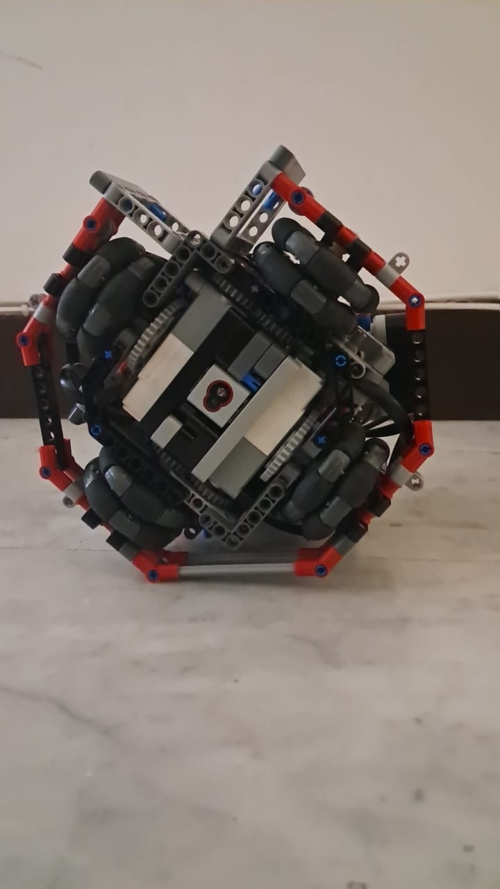

## Robot1 Right

*Robot 1 Right View*

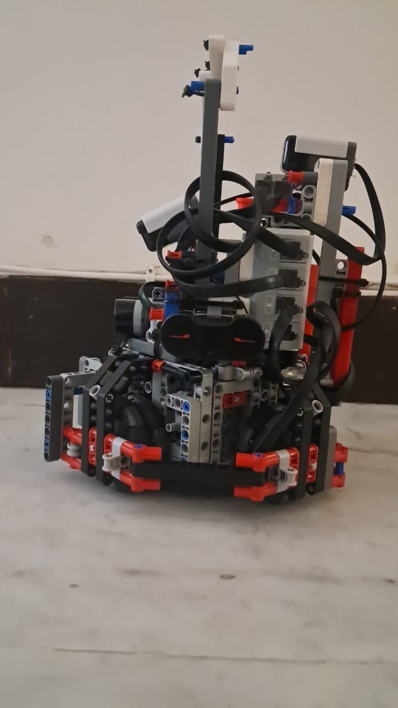

## Robot1 Left

*Robot 1 Left View*

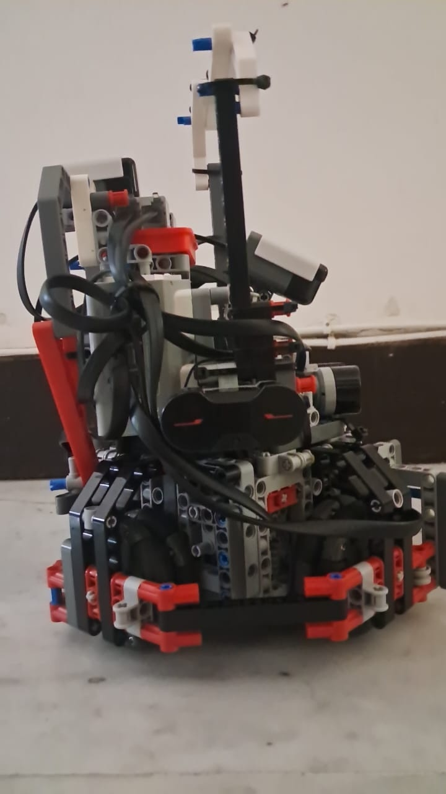

## Positioning & Movement

*How do you find your position inside the field and how do you use that position to move your robots around?*

We use a combination of an infrared (IR) seeker sensor and a compass sensor to determine our robot’s position and orientation on the field. The IR seeker divides the robot’s field of view into zones, numbered from 1 to 9 (with 5 being directly ahead and 0 being the blind zone). This allows us to detect the relative angle of the ball. In addition, we use a digital compass sensor that provides the robot’s heading relative to magnetic north. We calibrate the compass before each match so that the robot knows which direction corresponds to the opponent’s goal. The robot starts each match by facing forward in the calibrated direction. Using the heading from the compass and the zone from the IR seeker, the robot calculates a target direction to move. Our attacker uses this information to pivot and drive holonomically toward the ball, while constantly adjusting its orientation. The defender, which operates near our penalty area, uses the IR zone to move laterally (forward and backward) along the goal line, staying between the ball and our goal. Both robots use omnidirectional wheels that allow them to move in any direction without turning their body, enabling smooth and fast directional adjustments based on sensor feedback.

## Robot2 Overall

*Robot 2 Overall View*

## Robot2 Front

*Robot 2 Front view*

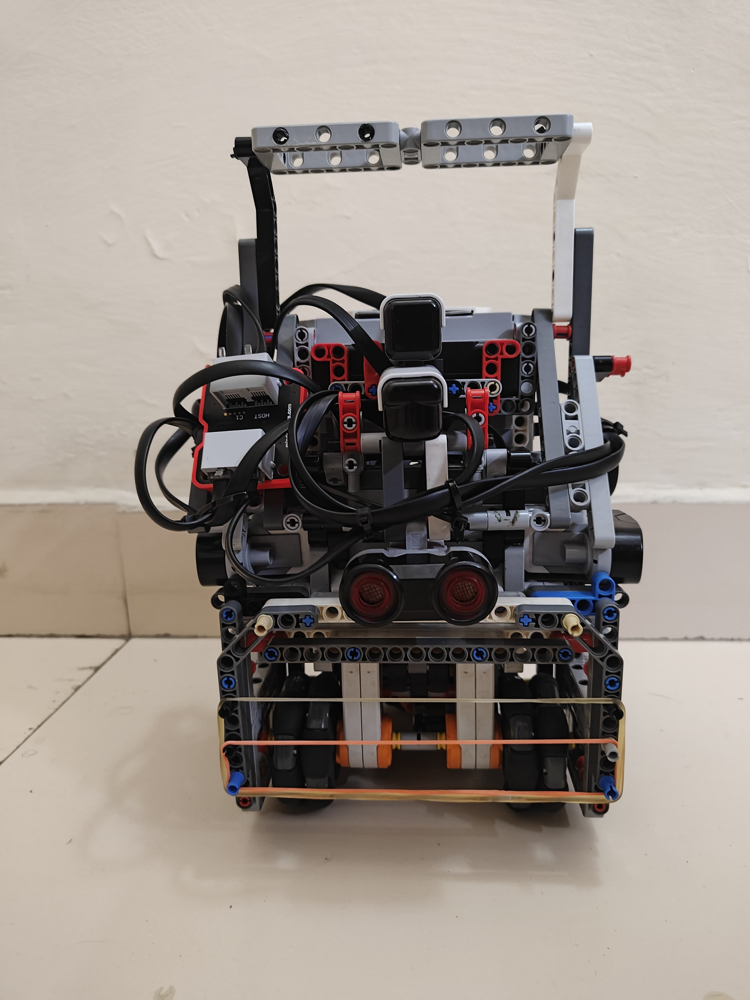

## Robot2 Back

*Robot 2 Back view*

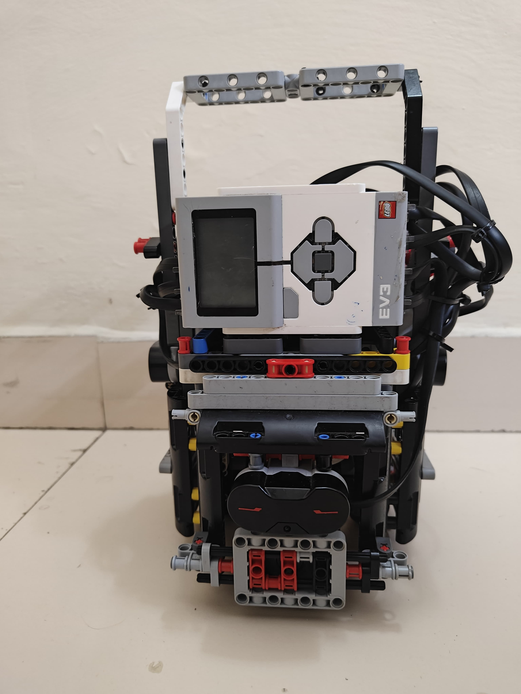

## Robot2 Top

*Robot 2 Top View*

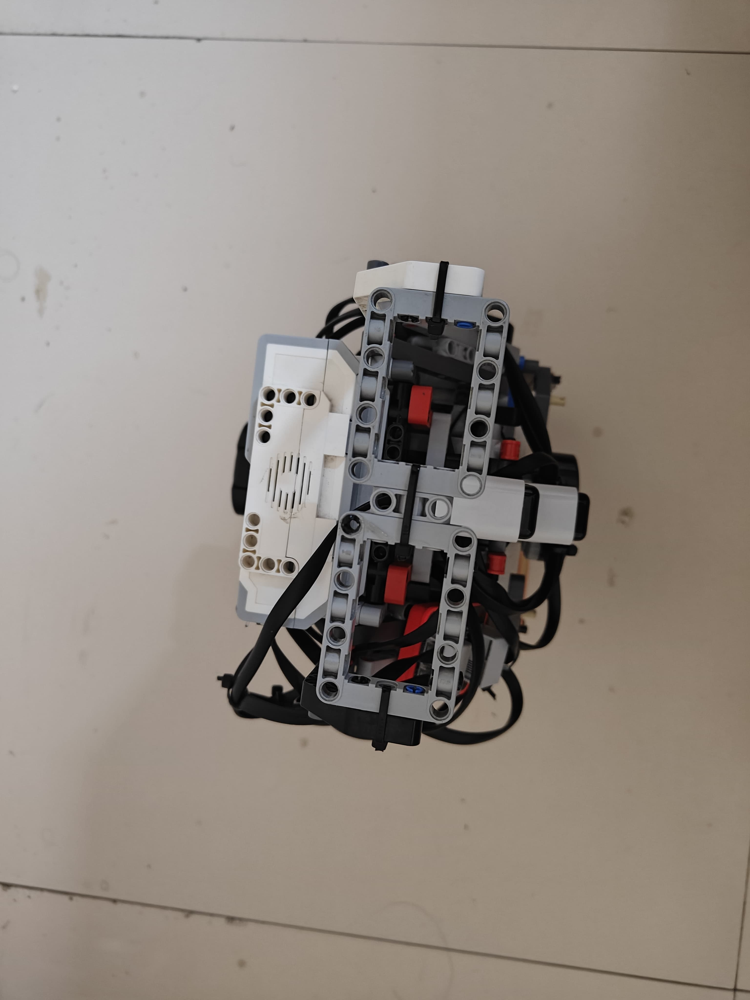

## Robot2 Bottom

*Robot 2 Bottom View*

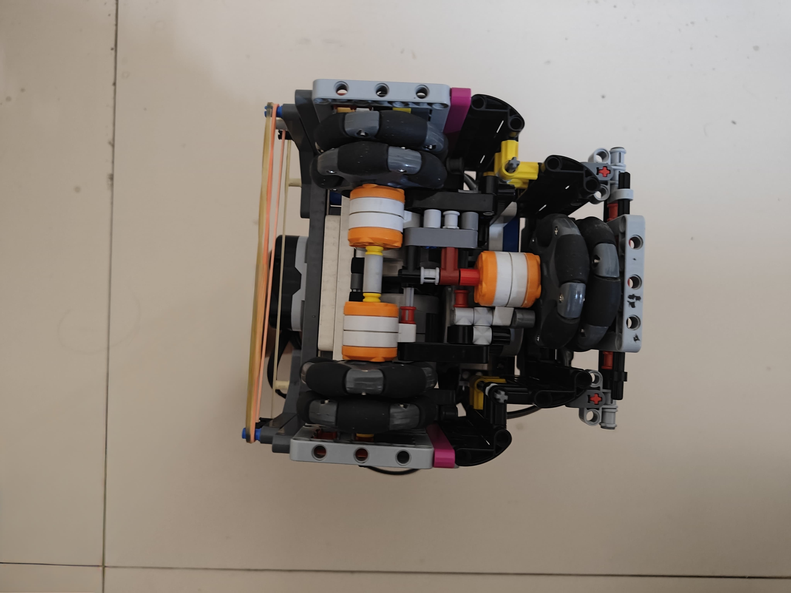

## Robot2 Right

*Robot 2 Right View*

## Robot2 Left

*Robot 2 Left View*

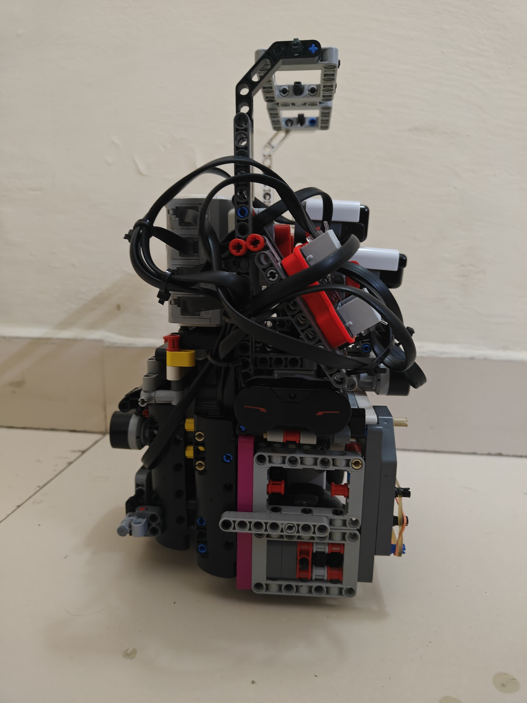

## Mechanical Design

*How did you design the mechanical parts of your robots?*

We designed our robots through a process of group discussion, hands-on testing, and iteration using LEGO Mindstorms EV3 components. Although we considered advanced platforms like Raspberry Pi and custom PCBs at the beginning of the season, we ultimately decided to stick with EV3 because it was more time-efficient, it was also familiar to our team. We did not use any CAD software to design 3D models, as our design process was primarily physical. We built multiple prototypes using LEGO Technic parts and adjusted them based on how well they performed in real tests. For each major decision, such as motor placement or sensor positioning, we debated the pros and cons as a team and often voted on which configuration to pursue. For example, when designing the attacker robot, we discussed how to fit all four motors into a compact frame that still allowed space for sensors and cabling. We created a compact motor box using layered LEGO parts and gears to align with the omni-wheels. On the defender, we prioritized torque and balance, using three motors for movement and one additional motor to control the kicker mechanism. We continually refined both designs through testing on the field, improving things like weight distribution and gear ratios until we achieved the speed and stability we wanted.

## Build Method

*How did you build your design?*

Our robots were constructed entirely using LEGO EV3 and LEGO Technic parts, which we assembled by hand. We used the LEGO Mindstorms kit for structural elements, omni-wheels, sensors, and motors. We also used HiTechnic third-party sensors, such as the IR seeker and compass, which were compatible with the EV3 system. The entire build process was physical and modular—after creating a basic version of the robot, we tested its movement and behavior on the field and made iterative improvements. One example is the position of the IR seeker sensor: initially, we mounted it too low, and it had limited visibility of the ball. After testing, we moved it higher and angled it slightly downward, which improved its detection consistency. Similarly, for the defender, we added structural reinforcements to the kicker housing after noticing it flexed under repeated impacts. All changes were made manually, based on field performance, without outsourcing any manufacturing or using advanced tools like 3D printers or laser cutters.

## Motors & Reason

*How many motors have you used and why?*

We used four EV3 large motors in the attacker robot and four in the defender robot. In the attacker, all four motors are used for movement: each motor drives one of the four omni-directional wheels. This configuration gives the attacker high maneuverability and speed, which are critical for chasing the ball across the field. In the defender, we used three motors for movement. The three drive motors give the defender good torque and lateral control as it moves along the penalty box. We found that this distribution of motors allowed us to balance speed, control, and functionality for both roles. All motors are standard LEGO EV3 large motors (part number 45502), which were chosen for their compatibility, reliability, and sufficient torque for our robots' weight and tasks.

## Kicker Design

*If your robot has a kicker, explain how you designed and built the mechanics of the kicker*

Our defender robot features a unique unorthodox design which uses elastic potential energy stored in a rubber band. This system is lightweight, effective, and simple to reset after each use. We chose this design because it does not require complex electronics or additional sensors and keeps the overall weight of the robot within the lightweight league limit. During testing, we experimented with different rubber bands to achieve the right balance between power and control, and we reinforced the surrounding structure using LEGO beams to ensure durability. The kicker helps our defender quickly clear the ball from the penalty area without needing a dribbler or additional force.

## Dribbler Design

*If your robot has a dribbler, explain how you designed and built the mechanics of the dribbler.*

Our robots do not have a dribbler system.

## CAD Files

*CAD design files*

N/A

## Mechanical Innovation

*Mechanical Innovation*

One of the most effective mechanical innovations on our robots is the motor box structure used in the attacker. This design allows us to stack and align four motors in a compact space, keeping the overall footprint low while enabling omni-directional movement. By optimizing the positioning of gears and wheel mounts, we were able to reduce chassis height and improve balance. Another innovation is the elastic rubber band-based kicker used in the defender. This solution allows us to deliver fast, forceful kicks using stored mechanical energy, rather than relying on heavy, slow mechanical arms or additional electronics. These systems were developed through continuous iteration and problem-solving based on performance during test matches.

## Mechanical Photos

*Photos of your mechanical designs highlights*

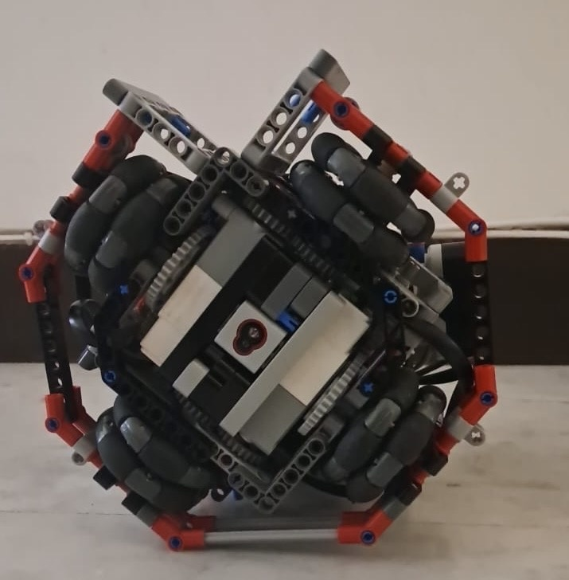
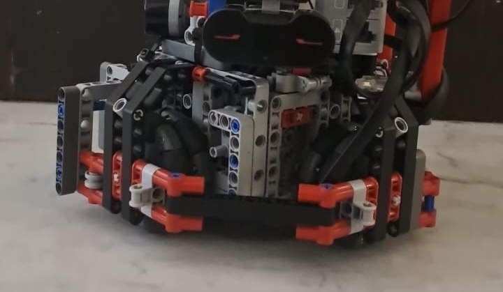

## Electronics Block Diagram

*Provide us with a block diagram of your robot's electronics*

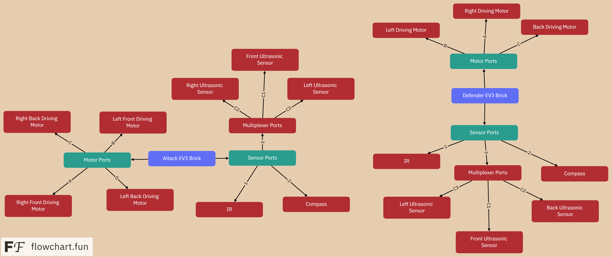

## Power Circuit

*How does your power circuits work?*

We use the official LEGO EV3 rechargeable battery pack, which supplies approximately 9V to the EV3 Brick. The brick then internally regulates voltage to provide appropriate power to sensors and motors. There are no external voltage regulators or converters, as the EV3 platform includes built-in power management. The battery is compact and fits neatly into the base of each robot, keeping the center of gravity low and consistent.

## Motor Drive Circuit

*How do you drive your motors? Explain the circuits you use for that*

All motors are connected directly to the EV3 Intelligent Brick’s motor ports. The EV3 Brick sends power and pulse-width modulation (PWM) signals to each motor through its internal motor driver circuits. No additional circuitry is required. We use the LEGO EV3 software to set motor speed, direction, and duration in code, which the brick interprets and executes.

## Microcontroller & Reason

*What kind of micro controller or board do you use for your robot? Why did you decide to use this part for your robot? If you have more than 1 processor, explain each one separately.*

We use the LEGO EV3 Intelligent Brick as our main and only microcontroller. It was chosen for its robust compatibility with LEGO motors and sensors, ease of programming, and past experience within our team. It allows us to focus more on optimizing performance and less on debugging hardware connections or programming syntax. Its built-in display, ports, and integrated motor control system make it an all-in-one solution suitable for rapid testing and iteration.

## Ball Detection

*How does your ball detection sensors and/or camera[s] work?*

We use the HiTechnic IR Seeker V2 sensor to detect the infrared signals emitted by the RoboCup soccer ball. This sensor is designed with five internal infrared detectors arranged in a circular pattern, each covering a different directional zone. The output of the sensor is a zone number ranging from 1 to 9, indicating the angle at which the ball is located relative to the robot. Zone 5 represents the forward direction, with zones 1 to 4 indicating positions to the left and zones 6 to 9 to the right. Zone 0 is used when the ball is not detected. The sensor also provides a signal strength reading, which we use to estimate how close the ball is. These readings are processed by the EV3 Brick, allowing the robot to turn toward and drive in the direction of the ball. The sensor is positioned on the front of the robot and angled slightly downward to maximize its field of view and reduce interference from ambient light. This system allows both the attacker and defender to identify the ball’s location and make real-time directional adjustments.

## Line Detection

*How does your line detection circuits work?*

Instead of relying on traditional white-line sensors, our robots use a combination of ultrasonic and infrared proximity sensors to detect the boundaries of the field. The ultrasonic sensors, mounted at the front and back of each robot, measure the distance to the nearest wall. As the robot approaches a wall, the sensor reading decreases. Our code responds to this by proportionally reducing the robot’s speed to prevent collisions or going out of bounds. We also tested infrared proximity sensors mounted on the sides of the robots to detect immediate obstacles or side boundaries, but found that the front and back ultrasonic sensors were sufficient for most scenarios. This approach reduces jerk near the field edges, allows smoother motion control, and avoids the complications of sensor drift on white surfaces. The system works reliably under different lighting conditions and has helped us avoid penalties during matches.

## Navigation/Position Sensors

*What sensors do you use for navigation and how are these sensors connected to your processor? What sensors do you use to find your position in the field? What about the direction your robot faces?*

We use three primary sensors for navigation: the HiTechnic compass sensor, the HiTechnic IR Seeker V2, and EV3 ultrasonic sensors. The compass sensor provides the robot’s heading in degrees (0–360) relative to magnetic north. The sensor autocalibrates  before each match to ensure that 0 degrees aligns with the direction of the opponent’s goal. The compass helps the robot stay oriented correctly on the field and ensures consistent behavior regardless of the robot’s starting position. The IR Seeker identifies the ball’s direction and is essential for positioning the robot relative to the game object. The ultrasonic sensors, mounted at the front and rear of the robot, help determine the robot’s proximity to field boundaries. All sensors are connected directly to the LEGO EV3 Brick using standard sensor ports. By combining data from all these sensors, the robot can navigate the field, track the ball, avoid leaving the play area, and stay correctly aligned at all times.

## Kicker Circuit

*How do you drive your kicker system? How does the circuit make the kicker work?*

Our kicker is entirely mechanical and does not rely on an electronic triggering circuit. It consists of a rubber band tensioned. the rubber band pushes the ball forward when it comes towards it. This elastic-powered system allows the robot to kick the ball with significant force. Because the system relies on mechanical energy rather than electrical actuation, it is both lightweight and consistent in performance.

## Dribbler Circuit

*How does your dribbler system work? What components and circuits did you use to drive it?*

We do not use a dribbler system in our robot.

## Schematics

*Schematics of your robot*

## PCB

*PCB of your robot*

## Innovation

*Innovations*

We are especially proud of our ultrasonic sensor-based proportional slowdown system for boundary detection. Instead of triggering abrupt stops or turns, the robot scales down its speed as it approaches the wall. This makes the movement smoother and allows more accurate sensing. It also reduces the risk of going out of bounds and makes the robot more stable under pressure. Implementing this control logic using the limited processing capabilities of the EV3 Brick was a major accomplishment for our team.

## Circuit Photos

*Photo of your circuit boards highlights*

## Motor Control

*How do you use your processor to move your motors?*

The LEGO EV3 Intelligent Brick controls all motors using built-in programming blocks. We use the graphical EV3 software to set motor speed, direction, duration, and rotation. For example, if the robot needs to rotate toward the ball, we set the left and right drive motors to opposite speeds until the IR zone reading centers at 5. When driving holonomically, each wheel receives a different speed value to enable lateral or diagonal movement. The processor continuously reads sensor values, calculates the required motor response, and sends control signals to the motors in real time. We use loops and conditional logic to handle continuous decision-making during gameplay, and the EV3 Brick interprets all commands without the need for external circuits.

## Ball Detection Method

*How do you find where the ball is? How do you read the data from the ball detection sensors or camera?*

We use the HiTechnic IR Seeker V2 to detect the ball’s location. The sensor outputs a directional zone (1–9) and a signal strength value, both of which are read by the EV3 Brick using I²C communication. Zone 5 indicates that the ball is directly in front of the robot, while zones 1–4 represent angles to the left and zones 6–9 represent angles to the right. Zone 0 indicates that the ball is not detected. These values are read in each loop cycle and used to determine whether the robot should rotate, drive forward, or make lateral adjustments. The attacker uses this information to turn toward the ball and drive in a straight or angled path. The defender uses the same data but interprets it differently to stay aligned along the goal area.

## Ball Catch Algorithm

*How does your algorithm work to catch the ball? Is there a difference between your robots in how they move towards the ball? Explain the differences.*

Yes, each robot uses a different algorithm tailored to its role. The attacker uses a triangulation-based pursuit algorithm. It reads the IR zone value to determine the ball’s angle and uses the compass to maintain orientation. If the ball is detected to the left or right, the robot rotates holonomically in that direction while still facing forward. As the ball approaches zone 5, the attacker accelerates forward, slows down slightly near the ball, and attempts to push it directly toward the goal. The defender, on the other hand, does not rotate as much. It starts aligned sideways and moves forward or backward along the penalty box. Its algorithm constantly checks the IR zone and signal strength. If the ball enters a defined zone of danger (strong signal in zone 4, 5, or 6), the defender advances slightly to intercept and activate the kicker if needed. These complementary algorithms allow both robots to work independently but in sync during gameplay.

## Line Algorithm

*How does your robot find the lines to stay inside the field? What algorithms do you use to avoid going out of bounds?*

Our robots use ultrasonic distance sensors instead of line sensors to avoid going out of bounds. Each robot has front and rear ultrasonic sensors that continuously measure the distance to nearby walls. When the robot approaches the wall, the sensor reading drops below a threshold (e.g., 30 cm), triggering a proportional response in our code. The robot reduces speed gradually as it nears the wall, then either stops or reverses direction. This gradual slowdown helps reduce abrupt movement, minimizes the chance of sensor misreading, and improves overall stability. We chose this approach because ultrasonic sensors are less sensitive to ambient lighting conditions and do not rely on contrast between the white boundary lines and the playing surface. It also allows smoother, more reliable boundary control in real match conditions.

## Goal Algorithm

*What algorithms do you use to score goals? How do you use your kicker and dribbler to handle the ball?*

Our attacker does not use a kicker or dribbler, so the algorithm relies on clean pursuit and momentum. The robot tracks the ball using the IR seeker, aligns toward the goal using the compass sensor, and drives with increasing speed. Once the ball is pushed past the halfway point and near the opponent’s penalty box, the robot accelerates sharply and allows the ball’s momentum to carry it into the goal. The idea is to maintain orientation, avoid interference, and use the robot’s own speed as a driving force. The defender can also contribute by kicking the ball from our half to the opponent’s side using the elastic-powered kicker, especially during counterattacks.

## Defense Algorithm

*What algorithms do you use to avoid the opponent team scoring? How do your robots defend your own goal?*

Our defender follows a simple but effective algorithm. It starts positioned sideways along our penalty box and moves laterally along the line. When the IR sensor detects the ball approaching from zone 4, 5, or 6 with strong signal strength, the robot moves slightly forward to intercept. If the ball enters the capture zone, the robot activates the rubber band kicker using a timed motor rotation to clear the ball. If no ball is detected, the robot remains centered. The use of a compass allows the robot to maintain consistent alignment, while the ultrasonic sensor ensures it does not move beyond the allowed area. This reactive but stable behavior enables the defender to effectively block and clear incoming threats.

## Robot Communication

*Do your robots communicate with each other? How do you use this communication to your advantage?*

No, our robots do not use any form of wireless or inter-robot communication. Each robot is programmed to fulfill a distinct role and operates autonomously based on its own sensor inputs. However, the behaviors are coordinated during design so that the attacker and defender do not interfere with each other. The attacker always focuses on ball pursuit and scoring, while the defender remains within the penalty area. This separation of roles has proven to be effective and avoids any risk of collisions or command conflicts.

## Innovation2

*Innovations*

Our most innovative algorithm is the one that combines compass and IR seeker data to create a dynamic triangulation system. By treating the compass as a fixed heading and the IR zone as a relative direction, we calculate precise movement vectors that allow the robot to approach the ball from optimal angles. We also implemented smoothing to reduce jitter when the ball hovers between two zones. These strategies make our robot faster and more stable in tracking the ball, even during complex plays.

## GitHub Link

*GitHub link*

https://github.com/Akshaj-Gupta/ev3-inernat2025-brazil.git

## BOM

*Bill of Materials (BOM)*

[https://drive.google.com/open?id=1Z6dYU2flA_F0CtbMPMIJH1wBlCQ4SZ1G](https://drive.google.com/open?id=1Z6dYU2flA_F0CtbMPMIJH1wBlCQ4SZ1G)

## Cost

*How much did it cost you to build your robots?*

Robots (final components currently inside both robots): approximately £1,000
Includes the EV3 Bricks, motors, omni-wheels, sensors, LEGO Technic structural parts, and wiring.

Experiments (failed prototypes, spare parts, replacements): approximately £500
Includes trial chassis, alternate kicker prototypes, damaged motors, and sensor.

Environment (practice field, IR ball, carpet, tools, etc.): approximately £200
Covers cost of building a full-size training field, purchasing an IR ball, and basic testing equipment.

## Funding

*How did you gathered the funds to build the robots?*

100% Parents

## Affordability

*How affordable was it to compete in RoboCupJunior Soccer?*

4

## Answer Check

*Have you checked all of your answers?*

Yes!

## Publication Consent

*We publish TDPs and posters during or after the competition as described in the beginning*

Yes, we acknowledge everything submitted in the above form can be published.

## Email Address

*Email Address*

kushals@vasantvalley.edu.in

## TDP File

*TDP File Upload (Not required)*

## Extra Column

*Column 67*

