## Timestamp

*Timestamp*

7/12/2025 11:26:01

## Team Name

*What is your team's name?*

ZG24Robotics

## League

*What league do you participate in?*

Open League

## Country

*Where are you from?*

Croatia

## Contact

*If other teams have questions about your robot, now or in the future, what email address(es) can we publish along with this document for people to reach you?

(You can put in multiple email addresses, like multiple team members, an email for the whole team or both. Feel free to share other ways of communication like Discord handles)*

ivan.perko007@gmail.com, borut.patcev@gmail.com, ivanmat319@gmail.com

## Social Media

*Team Social Media Links (if you have any)*

https://www.instagram.com/zg24robotics?igsh=MWp5cTNybmhsZGxrNA%3D%3D&utm_source=qr

## Team Photo

*Upload a photo of your whole team with your mentor and robots

Note: This is not mandatory and will be published along with your TDP if you choose to upload something*

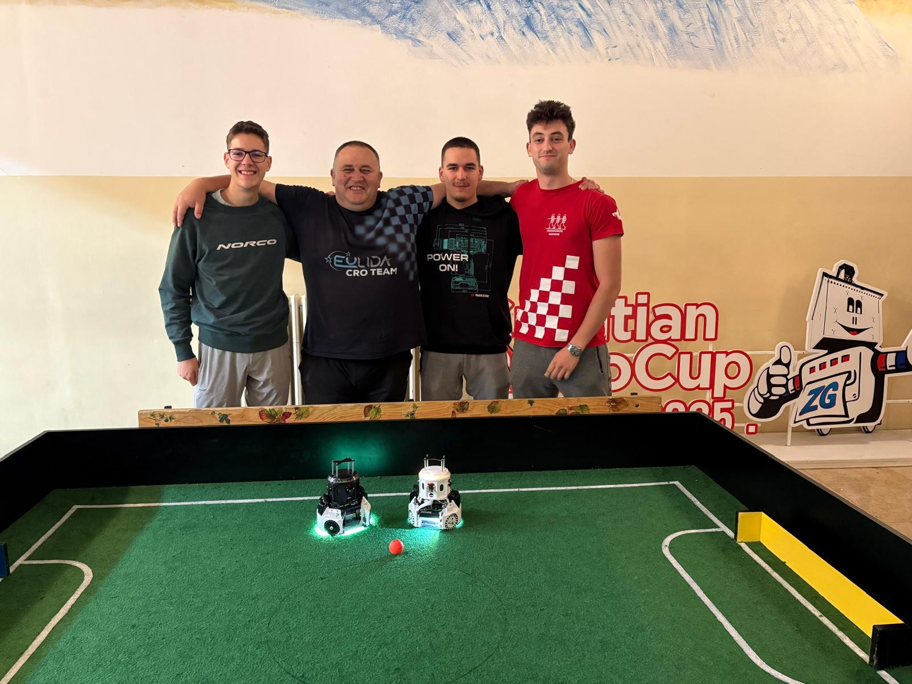

## Members & Roles

*What are the names of the team members and their role(s)?*

Borut Patčev(CTO) – Team Captain, Lead Programmer, Electrical Design
Ivan Matošević(CEO) – Mechanical Design, Materials and Manufacturing
Ivan Perko(CFO) – Electrical Design, Camera Vision Systems, Sponsorships
Dino Furjan(COO) - Hadware Assembly, Testing & System Integration

## Meeting Frequency

*How often did your team meet?
(e.g. 90 minutes once per week or a day every weekend.)*

Our team met nearly every weekend throughout the year.

## Meeting Place

*Where did you meet to work on your robot?
(e.g. a robotics room at school, at some other place, one of your homes, school library etc.)*

We worked on our robots at our homes, our mentors home and at robotics workshops held in our teachers schools.

## Start Date

*When did your team start working on this year's robot?*

Our team started planning the robot in August 2024, and development work officially began with the start of the school year in September.

## Past Competitions

*Which RoboCupJunior competitions have you competed in and in which leagues?*

European Championship in Bari 2025: Open League
World Championship in Eindhoven 2024: Rescue Line, Lightweight League, Open League
World Championship in Bordeaux 2023: Rescue Line, Lightweight League, Open League
World Championship in Bangkok 2022: Rescue Line
European Championship in Guimarães 2022: Rescue Line, Rescue Maze
World Championship in Sydney 2019: Rescue Line

## Mentor Contribution

*Which parts of your work received the most contribution from your mentor?*

He provided us with his garage so we could set up a soccer field and work there, and he also bought us a sensor.

## Workload Management

*How did you manage the workload?*

We communicated through a WhatsApp group. At the start of the year, we assigned each team member specific parts of the robot to be responsible for, and we divided the remaining tasks during our weekend meetings throughout the year.

## AI Tools

*Which AI tools did you use?*

ChatGPT

## Robot1 Overall

*Robot 1 Overall View*

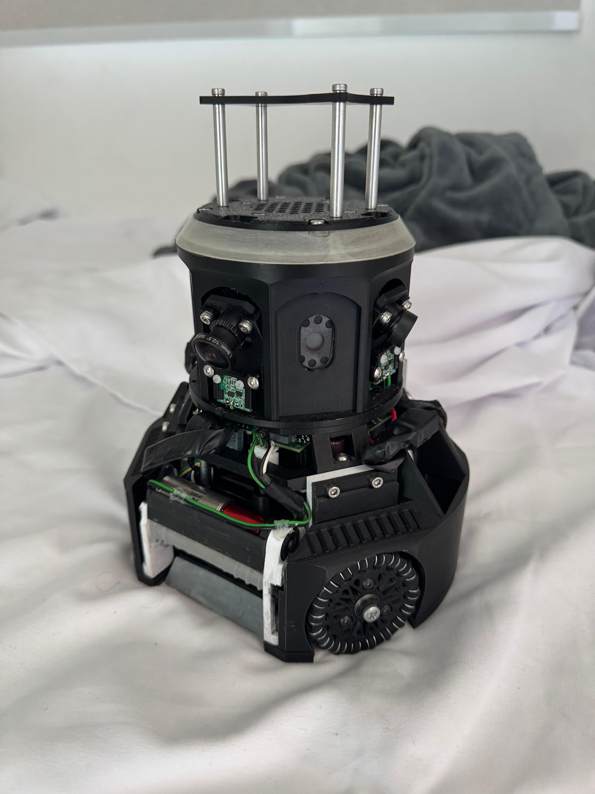

## Robot1 Front

*Robot 1 Front view*

## Robot1 Back

*Robot 1 Back view*

## Robot1 Top

*Robot 1 Top View*

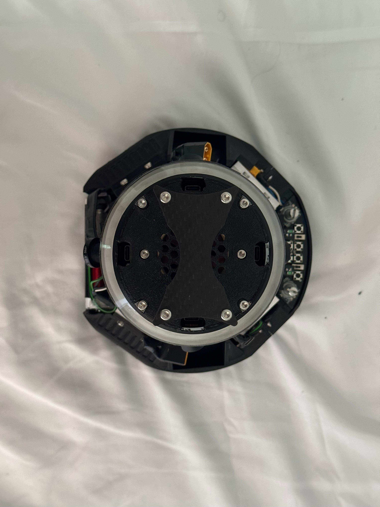

## Robot1 Bottom

*Robot 1 Bottom View*

## Robot1 Right

*Robot 1 Right View*

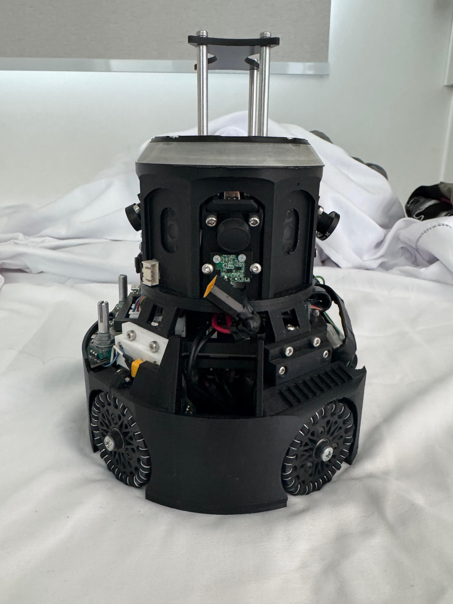

## Robot1 Left

*Robot 1 Left View*

## Positioning & Movement

*How do you find your position inside the field and how do you use that position to move your robots around?*

We use LIDAR sensors placed on all four sides of our robot to detect the center of the field and the position of the goalie in front of the goal. Based on that information, the robots position themselves either at the center or in front of the goal if the ball is not visible, and then wait until the ball is detected. In addition, we use SparkFun’s optical odometry sensor, which provides us with the robot's X and Y coordinates. Using these coordinates, we determine how the robot should move across the field with precision.

## Robot2 Overall

*Robot 2 Overall View*

## Robot2 Front

*Robot 2 Front view*

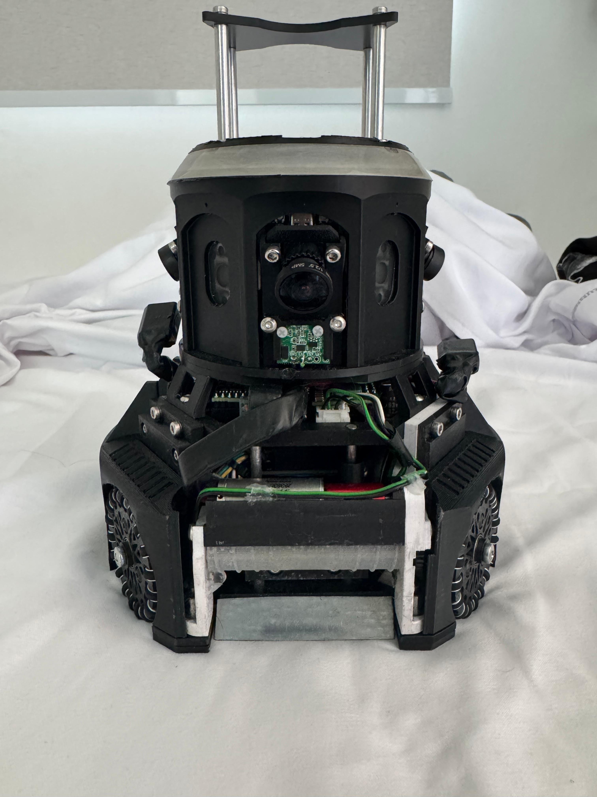

## Robot2 Back

*Robot 2 Back view*

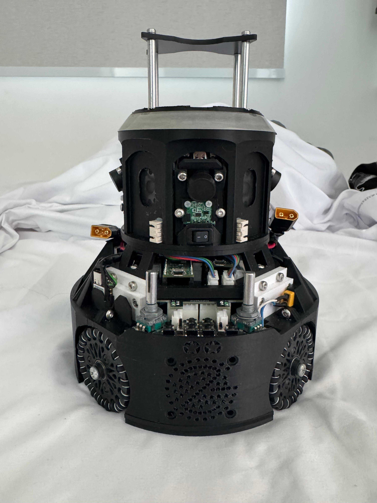

## Robot2 Top

*Robot 2 Top View*

## Robot2 Bottom

*Robot 2 Bottom View*

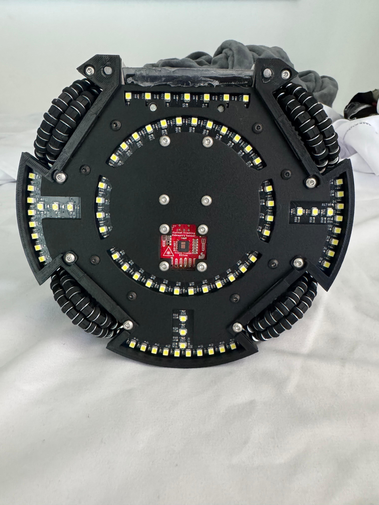

## Robot2 Right

*Robot 2 Right View*

## Robot2 Left

*Robot 2 Left View*

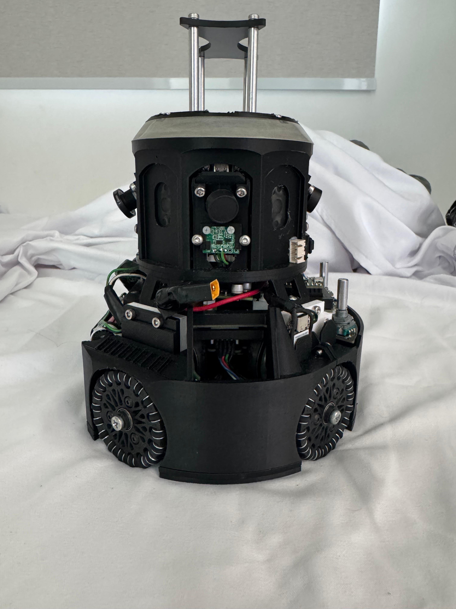

## Mechanical Design

*How did you design the mechanical parts of your robots?*

We designed all mechanical components in Fusion 360, and created PCBs using EasyEDA and KiCad, drawing inspiration from Small Size League (SSL) robots. Our main goals were robustness, reliability, and the integration of advanced features such as brushless motors, a gear-driven drive system, efficient dribbler, powerful kicker, 360° vision, and a stable electrical system.
We also upgraded our camera system. Originally using the OV2640 sensor, we experienced low image quality and poor FPS. After testing alternatives, we switched to the OV5640 sensor with a 140° lens, which provided much better clarity and performance.

## Build Method

*How did you build your design?*

For manufacturing support, we used JLCPCB for PCB production and assembly (e.g., line sensor PCB), JLCCNC for CNC machining and nylon prints, and PCBWay for cosmetic parts like a carbon fiber handle and LED housing.
Material selection was key, especially for the dribbler gears running at 12,000 RPM. After testing resin, PLA, and PETG—with issues like cracking or deformation—we found PAHT-CF to be the most durable. PLA was also replaced by PETG for all structural parts due to its greater impact resistance.
A major upgrade was made to the drive system, replacing 3D printed gears with steel-chromium alloy (motor) and POM (wheel) gears. We also improved shaft retention by switching from glue to knurled, press-fit steel shafts secured with epoxy.

## Motors & Reason

*How many motors have you used and why?*

We use a 4-wheel omni-directional drive system with a custom motor layout—rear motors are placed at 90°, and front motors at 120°, allowing more space for the dribbler and kicker without sacrificing maneuverability. This configuration offers a balance between speed, agility, and internal space, and is inspired by Small Size League (SSL) designs.
Each omni-wheel has two 3D printed layers with embedded rubber rollers (8×3×3 mm) and metal washers to reduce friction and ensure smooth, durable rotation even at high speeds.
Motor: Maxon EC 45 flat Ø42.9 mm, 30 W, PN: 668556
Driver: ESCON Module 24/2, 2/6 A, 10–24 VDC, PN: 466023

## Kicker Design

*If your robot has a kicker, explain how you designed and built the mechanics of the kicker*

Due to time constraints, we replaced our original custom kicker design with a pre-made 48V solenoid kicker from Aliexpress, featuring a 15 mm stroke and powered via a voltage booster. The kicker plate consists of two parts: a metal base made by JLCCNC, screwed onto the solenoid shaft, and a 3D printed front section with adjustable thickness. This modular design lets us easily tune the effective stroke length.

## Dribbler Design

*If your robot has a dribbler, explain how you designed and built the mechanics of the dribbler.*

The dribbler, developed over six months and inspired by SSL designs, is the most extensively refined part of our robot. Its body is made from PETG and features a 1:1 gear transmission with three custom PAHT-CF gears and a four-rod suspension system.
The roller, molded from a 1:1 mix of A45 silicone, has a spiral groove that centers the ball. The suspension uses four rods with linear bearings, allowing vertical movement to absorb impacts and maintain consistent contact with the ball.

## CAD Files

*CAD design files*

https://github.com/BorutPatcev/ZG24_Robotics

## Mechanical Innovation

*Mechanical Innovation*

.

## Mechanical Photos

*Photos of your mechanical designs highlights*

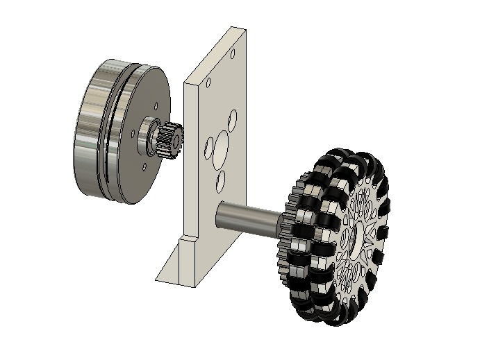

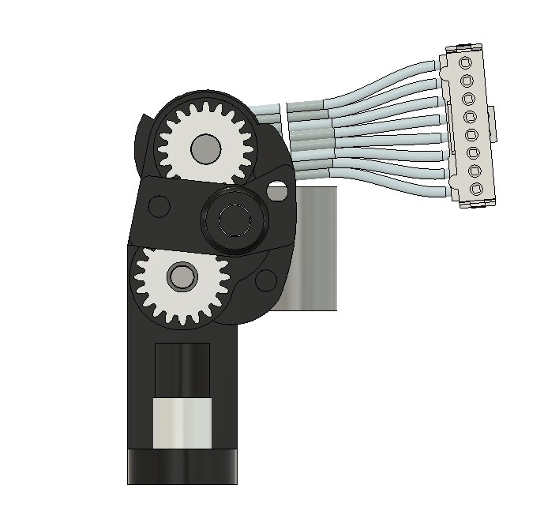
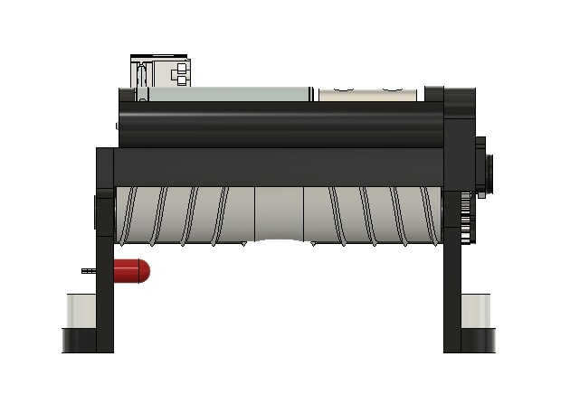

## Electronics Block Diagram

*Provide us with a block diagram of your robot's electronics*

[https://drive.google.com/open?id=1HQD9kZaA2GG0DaeyHs5YJmrh-CqxIXTf](https://drive.google.com/open?id=1HQD9kZaA2GG0DaeyHs5YJmrh-CqxIXTf)

## Power Circuit

*How does your power circuits work?*

Our robot uses four voltage levels: 24V, 48V, 5V, and 3.3V, powered by two 11.1V (3S) LiPo batteries in series, providing 24V to the main PCB.
From there, 24V powers the drive motors, motor drivers, and the dribbler motor. A voltage booster steps 24V up to 48V to drive the kicker solenoid.
The main PCB also uses Pololu regulators to generate 5V and 3.3V, which power sensors, microcontrollers, cameras, communication modules, compasses, and LEDs. These voltages are also sent to the line sensor PCB to supply its Teensy, odometry sensor, LEDs, and line sensors.

## Motor Drive Circuit

*How do you drive your motors? Explain the circuits you use for that*

We use four ESCON Module 24/2 servo controllers (2/6 A, 10–24 VDC), one per motor. Each motor connects to its ESCON via a JST-XH cable for reliable control.
The ESCONs are mounted on a custom Motor Driver PCB, which receives 24V from the main PCB and includes fuses and protection diodes for each channel. Control signals are sent from the main microcontroller via JST-XH connectors to manage motor speed and direction

## Microcontroller & Reason

*What kind of micro controller or board do you use for your robot? Why did you decide to use this part for your robot? If you have more than 1 processor, explain each one separately.*

Our robot uses three microcontrollers: two Teensy 4.0 and one Teensy 4.1, chosen for their compact size, reliability, and flexibility.
The first Teensy 4.0, on the line sensor PCB, reads and processes line sensor data. The second Teensy 4.0, on the main PCB, acts as a slave, handling input from sensors and cameras, calculating ball and robot position. The main Teensy 4.1 controls the motors, dribbler, handles communication, and runs the robot’s high-level strategy.

## Ball Detection

*How does your ball detection sensors and/or camera[s] work?*

Our ball detection system uses four Sipeed Maix Bit cameras (front, back, left, right) with OV5640 sensors and wide-angle lenses, providing 360° vision. The front camera uses a 170° FPV lens for a wider and clearer forward view.
Mounted at 45° downward angles, the cameras offer optimal field visibility while avoiding overhead interference. They run a custom color blob detection algorithm (in MaixPy, Python-based), which detects the ball and goals, filters out irrelevant objects, and maintains real-time tracking. This setup enables the robot to reliably see the ball from all directions throughout gameplay.

## Line Detection

*How does your line detection circuits work?*

Our custom Line Sensor PCB features 80 ALS19 sensors, 80 LEDs with resistors, and 10 multiplexers to reduce pin usage and increase sensor density. It connects to a slave Teensy 4.0, which reads and processes the analog data to determine line position.
The odometry sensor is also connected to this board for integrated positioning. The PCB is powered by 5V and 3.3V from the main PCB and communicates with the main Teensy 4.1 via UART, sending processed line and position data for use in navigation and strategy.

## Navigation/Position Sensors

*What sensors do you use for navigation and how are these sensors connected to your processor? What sensors do you use to find your position in the field? What about the direction your robot faces?*

Our robot uses a combination of 4 analog LIDARs, a BNO055-based digital compass, 4 cameras, and a line sensor array for accurate navigation.
The LIDARs are mounted on all sides and connected to a slave Teensy 4.0 via analog pins, providing full-range distance data. The compass, placed on the main PCB, sends Yaw data to the main Teensy 4.1. Cameras connect via UART and assist with ball and goal positioning, while the line sensors are read through 10 multiplexers by another slave Teensy 4.0, which sends line position data to the main controller.
For localization, we combine LIDAR and odometry data to determine field position, and use the compass for heading, enabling field-relative movement and strategic positionin

## Kicker Circuit

*How do you drive your kicker system? How does the circuit make the kicker work?*

The kicker is controlled by a custom PCB featuring an IRF3415 N-MOSFET, protection diode, two 2200 µF capacitors, and a 74HC125D level shifter.
24V from the main PCB is boosted to 48V and sent to the kicker PCB. When triggered, the main Teensy 4.1 sends a 3.3V PWM signal, which is shifted to 5V to activate the MOSFET. This allows 48V to flow through the solenoid, firing the kicker. The diode protects against voltage spikes, and the capacitors stabilize power during discharge.

## Dribbler Circuit

*How does your dribbler system work? What components and circuits did you use to drive it?*

The dribbler motor is a Maxon EC-max 16 (Ø16 mm, 8 W, brushless, with Hall sensors), controlled by an ESCON Module 24/2 driver, the same as for the drive motors. It connects via a 2 mm to 4 mm coupler, and uses custom PAHT-CF gears and steel shafts made in-house. The roller shaft includes cuts for improved silicone bonding.
The roller, molded from A45 silicone, has a spiral surface to center the ball. All 4 mm shafts and bearings are sourced from JLC Mechatronics.
The ESCON controller is mounted on the main PCB and powered by 24V. The motor connects to the main Teensy 4.1 via PWM, Direction, and Enable pins.
Below the roller, an LED and photodiode detect ball possession, supporting strategic decisions during gameplay.

## Schematics

*Schematics of your robot*

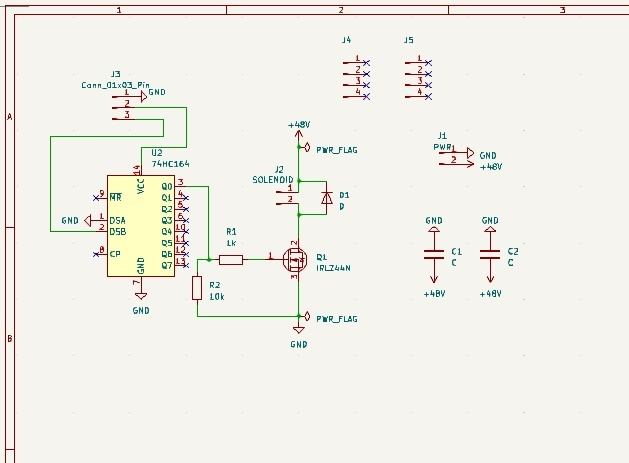
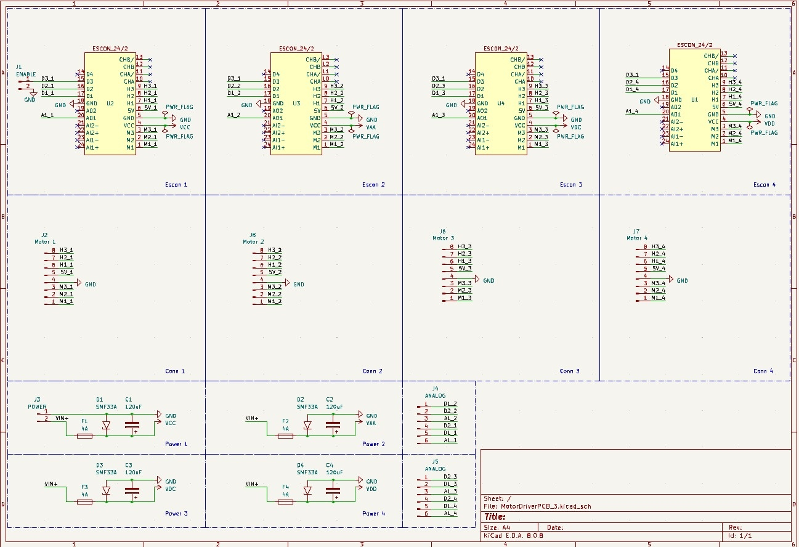
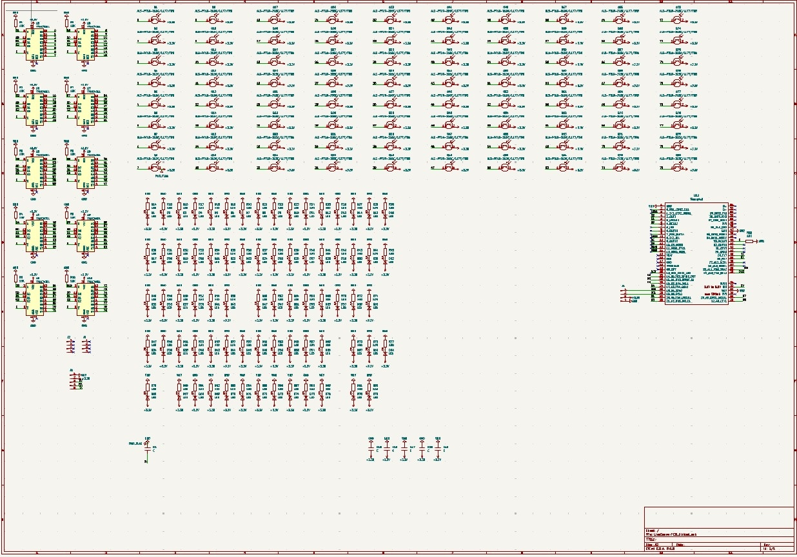

## PCB

*PCB of your robot*

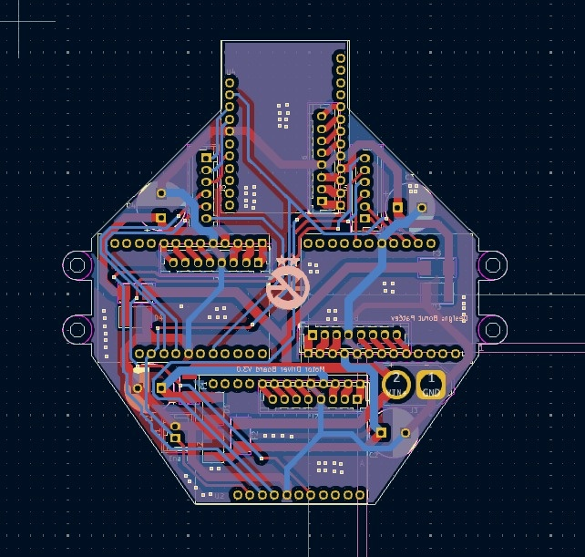
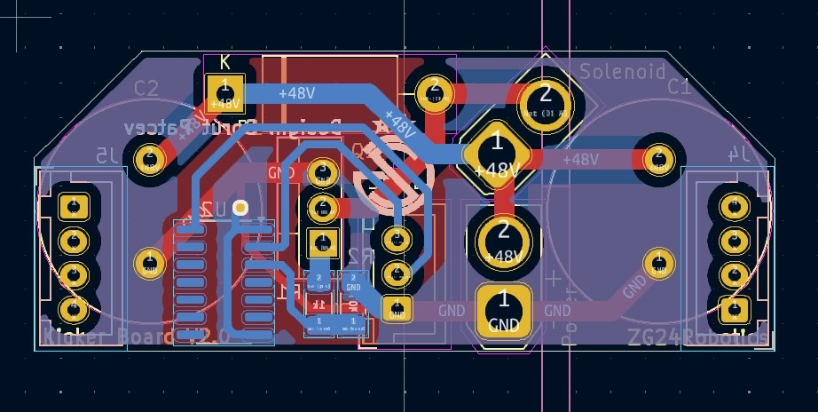
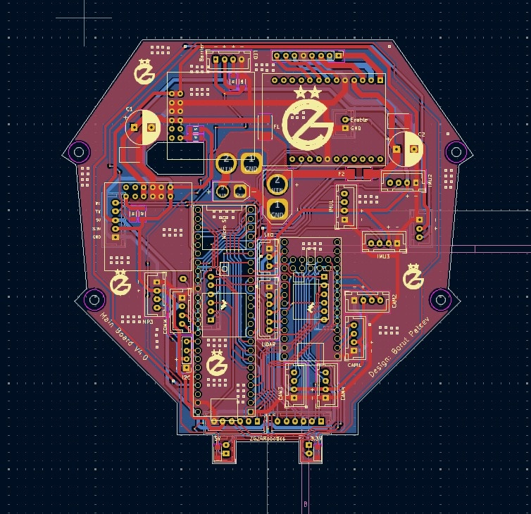
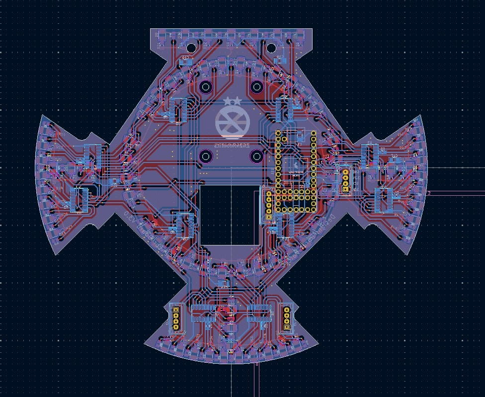

## Innovation

*Innovations*

.

## Circuit Photos

*Photo of your circuit boards highlights*

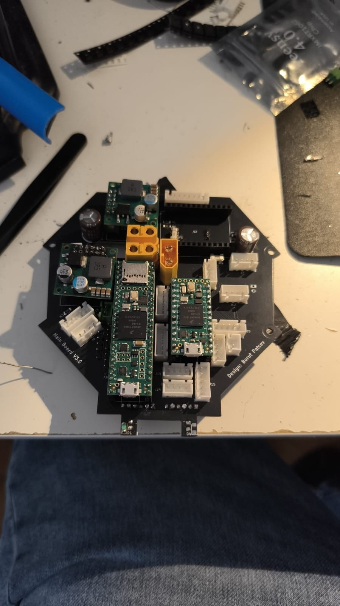

## Motor Control

*How do you use your processor to move your motors?*

Each ESCON 24/2 motor driver connects to the main Teensy 4.1 via three pins: PWM, Direction, and Enable. First, the Teensy enables the motors, then controls their speed and direction using PWM and Direction signals.

We limited ESCON output to 0–40% power for better precision and smoother control. Our firmware includes a custom ramp function for gradual acceleration and deceleration, improving stability and reducing drivetrain stress.

## Ball Detection Method

*How do you find where the ball is? How do you read the data from the ball detection sensors or camera?*

We use a 360-degree four-camera system to detect the ball. Each camera runs a custom blob detection algorithm to identify the ball and goals while filtering out objects above the field. When a ball is detected, the camera sends its X/Y coordinates via UART to the slave Teensy 4.0. The Teensy: Parses the data, Identifies which camera sent it, Applies angle correction, Uses an algorithm to estimate the ball’s position, even when seen by one or multiple cameras. This system ensures accurate real-time localization, essential for decision-making and movement.

## Ball Catch Algorithm

*How does your algorithm work to catch the ball? Is there a difference between your robots in how they move towards the ball? Explain the differences.*

The robot uses a switch-case structure. When it doesn't have the ball, it enters a searching state, scanning the field with its 360° vision. Once the ball is detected, it navigates toward it. As it approaches, the dribbler is activated to capture the ball efficiently. This ensures a quick transition from detection to possession for responsive gameplay.

## Line Algorithm

*How does your robot find the lines to stay inside the field? What algorithms do you use to avoid going out of bounds?*

Using odometry and LIDAR, the robot always knows its position relative to the field center. When line sensors detect a boundary, it immediately drives toward the center.
In some cases, LIDAR alone is used to measure wall distance—if too close, the robot assumes it's near a line and adjusts.
This simple dual-method approach ensures reliable field containment with minimal sensor dependency.

## Goal Algorithm

*What algorithms do you use to score goals? How do you use your kicker and dribbler to handle the ball?*

The robot adapts its goal-scoring based on where it captures the ball:
Center of the field → Straight kick with basic aiming.
Sidelines → Drags the ball toward the opponent’s goal or performs a spin kick if close.
Opponent’s side (goal/front/corners) → Activates dribbler, aligns, and shoots directly.
This flexible logic ensures effective scoring from any field position.

## Defense Algorithm

*What algorithms do you use to avoid the opponent team scoring? How do your robots defend your own goal?*

When the ball isn’t visible, the goalie centers itself just outside the penalty area and waits while scanning the field. If the ball is detected, it moves to the closest of five preset positions based on the ball’s angle. While waiting, it uses LIDAR to check for hidden-ball tactics. If an opponent is detected hiding the ball, the goalie quickly moves to block it.
This allows the goalie to defend both reactively and proactively.

## Robot Communication

*Do your robots communicate with each other? How do you use this communication to your advantage?*

Our robots use Seeed XIAO ESP32-C6 modules with ESP-NOW to exchange presence, state, and ball position via UART. Based on this, they dynamically switch roles between goalkeeper and attacker. Ball position data will soon enable one robot to guide the other when the ball is hidden, laying the groundwork for advanced teamwork.

## Innovation2

*Innovations*

The robots constantly share ball coordinates. Even without direct sight, a robot can use this data to locate the ball. For example, if the goalkeeper’s view is blocked, the attacker can relay the ball’s position so the goalkeeper can reposition and defend effectively.

## GitHub Link

*GitHub link*

https://github.com/BorutPatcev/ZG24Robotics

## BOM

*Bill of Materials (BOM)*

[https://drive.google.com/open?id=18KqiPRznsPEOvZ5lV-mKUWpJIURtc3Z_](https://drive.google.com/open?id=18KqiPRznsPEOvZ5lV-mKUWpJIURtc3Z_)

## Cost

*How much did it cost you to build your robots?*

Robots: 2000 Euro
Experiments: 1000 Euro
Environment: 500 Euro
1 Euro = 1.17 USD

## Funding

*How did you gathered the funds to build the robots?*

90% Sponsors, 10%Ourselves

## Affordability

*How affordable was it to compete in RoboCupJunior Soccer?*

1

## Answer Check

*Have you checked all of your answers?*

Yes!

## Publication Consent

*We publish TDPs and posters during or after the competition as described in the beginning*

Yes, we acknowledge everything submitted in the above form can be published.

## Email Address

*Email Address*

ivan.perko007@gmail.com

## TDP File

*TDP File Upload (Not required)*

## Extra Column

*Column 67*

